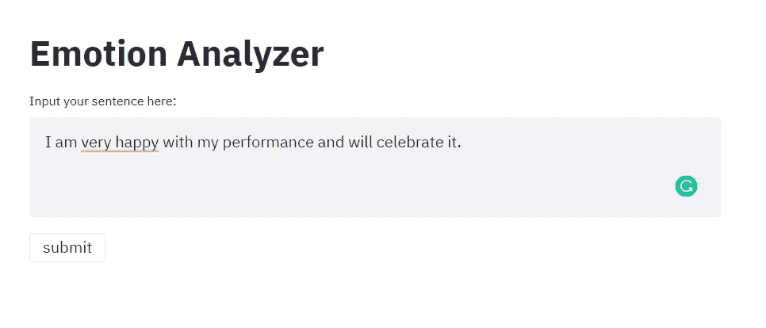
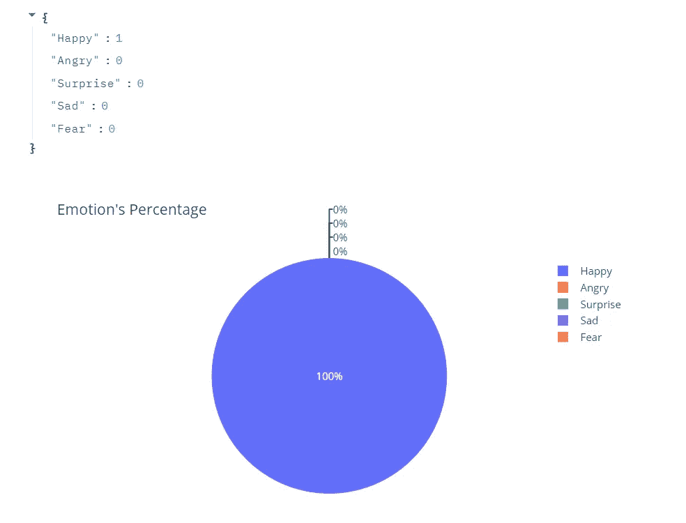

# Text2emotion:从文本数据中检测情绪的 Python 包

> 原文：<https://towardsdatascience.com/text2emotion-python-package-to-detect-emotions-from-textual-data-b2e7b7ce1153?source=collection_archive---------9----------------------->

## 这个软件包将帮助你发现文本信息中的情感


[腾雅特](https://unsplash.com/@tengyart?utm_source=unsplash&utm_medium=referral&utm_content=creditCopyText)在 [Unsplash](https://unsplash.com/s/photos/emotion?utm_source=unsplash&utm_medium=referral&utm_content=creditCopyText) 上拍摄的照片

# 介绍

运动是一种与感觉和想法相一致的精神状态，通常指向一个特定的目标。情绪是一种行为，它反映了我们与他人的互动或与某一事件相关的个人意义或观点。人类能够从文本数据中识别情感，并且能够理解文本的内容。但是如果你想想机器，它们能从文本中识别情感吗？

从本文中，您将了解如何使用这个 python 包并从文本数据中提取情感。

# 目录

1.  **什么是 text2emotion？**
2.  **怎么用？**
3.  **行业用例详情**
4.  **结论**
5.  **关键要点**


[Toshi](https://unsplash.com/@toshilepug?utm_source=unsplash&utm_medium=referral&utm_content=creditCopyText) 在 [Unsplash](https://unsplash.com/s/photos/dog-stressed?utm_source=unsplash&utm_medium=referral&utm_content=creditCopyText) 上拍摄的照片

不要担心，我会保证你不会厌倦阅读这篇文章，并且会尝试用最简单的方式来解释它。

我们开始吧，

# **1。什么是 text2emotion？**

***Text2emotion*** 是为了寻找文本数据中嵌入的合适情感而开发的具有明确内涵的 python 包。该研究称，当人类在思考过程中，他对自己的陈述非常确定时，他会以正确的方式表达自己的情绪，并且在表达这些情绪的词语的情况下，会进行适当的调整。

如果我想用简单的话告诉你，然后考虑如果客户不喜欢投入大量资金的产品，那么他肯定会给出类似 ***的反馈:“我对你的产品服务非常生气，我要就此问题提出投诉”。*** 当你读到这种反馈时，你会确信客户对产品服务非常不满，我们必须尽快改进。 ***Text2emotion*** 作品，以同样的方式，从文本中提取情感。

让我们总结一下， **Text2Emotion** 是 python 包，它将协助您从内容中提取情感。

*   处理任何文本数据，识别其中嵌入的情感，并以字典的形式提供输出。
*   很好地适应了 5 个基本情绪类别，如**快乐**、**愤怒**、**悲伤**、**惊喜、**和**恐惧**。

# 2.怎么用？

安装 text2emotion 包的最好方法是使用 pip。

```
#Install package using pip
**pip install text2emotion**
```

让我们导入构建模型所需的必要库。

```
#Import the modules
**import text2emotion as te**
```

获取一些内容来评估性能。

```
**text** = "I was asked to sign a third party contract a week out from stay. If it wasn't an 8 person group that took a lot of wrangling I would have cancelled the booking straight away. Bathrooms - there are no stand alone bathrooms. Please consider this - you have to clear out the main bedroom to use that bathroom. Other option is you walk through a different bedroom to get to its en-suite. Signs all over the apartment - there are signs everywhere - some helpful - some telling you rules. Perhaps some people like this but It negatively affected our enjoyment of the accommodation. Stairs - lots of them - some had slightly bending wood which caused a minor injury."
```

现在我们必须使用上面定义的**文本**参数调用 get_emotion()函数。

```
#Call to the function
**te.get_emotion(text)**#The output we received,
**{'Angry': 0.12, 'Fear': 0.42, 'Happy': 0.04, 'Sad': 0.33, 'Surprise': 0.08}**
```

这里，我们得到了字典方面的输出，其中有情感类别以及相应的分数。

现在，如果我们考虑一下相对情绪类别的分数，那么**恐惧**分数是**0.42**T44**悲伤**分数是 **0.33** 。所以从整体上分析，我们可以说我们作为输入的陈述带有恐惧&悲伤的语气。

这个包的好处是，它能够从描述人类行为的表情符号中识别情感。让我们举个例子，

```
**text = "Day was pretty amazing😃😃"
te.get_emotion(text)**#Output
**{'Angry': 0.0, 'Fear': 0.0, 'Happy': 0.8, 'Sad': 0.0, 'Surprise': 0.2}**
```

从输出可以得出，文字输入属于**开心**和**惊喜**的情感范畴。

我们为你设计了一个网络应用程序，你可以在那里试验所有这些东西。我提供了下面的链接，请随意查看。

1.  **在输入框中输入文本。**



Web 应用程序演示

2.点击提交按钮并获得输出。



Web 应用程序输出

查看 web app [**这里**](https://text2emotion.herokuapp.com/) **。**

# 3.行业用例细节

作为一个组织，我们总是关注客户的意见、反馈或改进。顾客对我们的产品有什么看法？他可能高兴或悲伤或生气，也可能是因为你永远不知道的组织所提供的服务。这就是 text2emotion 可以成为你的救世主的条件。在这里，我将讨论两个真实的行业用例。

## 电子商务行业:客户参与终点

分析通过各种来源从客户处收到的输入，例如来自**聊天机器人的文本数据、来自联络中心的日志、电子邮件、**等。跟踪这些音调信号可以帮助客户服务经理改善他们的团队与客户的互动方式。

## 社交媒体监控

在当今的数字世界中，品牌监控和声誉管理已经成为每个业务部门最重要的方面之一。这就是情感分析发挥作用的地方。这将有助于公司:跟踪消费者对公司的看法，通过提供具体细节指出消费者的态度，发现不同的模式和趋势，密切关注影响者的演示。

# 4.结论


照片由 [Howie R](https://unsplash.com/@howier?utm_source=unsplash&utm_medium=referral&utm_content=creditCopyText) 在 [Unsplash](https://unsplash.com/s/photos/happy-dog?utm_source=unsplash&utm_medium=referral&utm_content=creditCopyText) 上拍摄

我希望您已经了解了这个库提供的基本功能，以及它如何对不同的行业用例有用。如果你喜欢这个包，并想设计一些有趣的实现和创新的行业用例，那么我们将很高兴展示它。

# 5.关键要点

*   [text 2 情感文档](https://pypi.org/project/text2emotion/)
*   [谷歌 Colab 演示](https://colab.research.google.com/drive/1sCAcIGk2q9dL8dpFYddnsUin2MlhjaRw?usp=sharing#scrollTo=ivUkOaBPEQYr)
*   [网站详情](https://shivamsharma26.github.io/text2emotion/)

感谢您阅读文章。

> 你好👋我希望你能从我的文章中获得知识。如果你愿意支持我，请随意给我买些咖啡🙏☕
> 
> [**https://www.buymeacoffee.com/amey23**](https://www.buymeacoffee.com/amey23)
> 
> 或者联系我，ameypband23@gmail.com
> 
> 很乐意帮助你。