# Textfeatures:用于从文本数据中提取基本特征的库

> 原文：<https://towardsdatascience.com/textfeatures-library-for-extracting-basic-features-from-text-data-f98ba90e3932?source=collection_archive---------33----------------------->


弗兰基·查马基在 [Unsplash](https://unsplash.com/s/photos/machine-learning?utm_source=unsplash&utm_medium=referral&utm_content=creditCopyText) 上拍摄的照片

# 简介:文本特征

当我们处理文本数据时，我们总是关心数据特征、数据的预处理以及更可能的预测。为了改进我们的模型，理解数据并在数据中找到更有趣的特征是很重要的，比如标签、链接等等。

## 什么是文本特征？

这是一个 python 包，可以帮助你从文本数据中提取基本特征，如标签、停用词、数字，这将帮助你理解数据，更有效地改进你的模型。

> **函数调用结构:**
> 
> **function_name(dataframe，“text_column”，“new _ column”)**
> 
> 在哪里，
> 
> **数据帧:-** 数据帧的名称
> 
> **text_column:-** 要从中提取特征的列的名称。
> 
> **new_column:-** 通过从 text_column 提取特征而导出的新列。

# textfeatures 将为您提供什么服务？

**1。word_count():-** 给出文本数据中的总字数。

**2。char_count():-** 给出字符数。

**3。avg_word_length():-** 给出平均单词长度。

**4。** :-给出停用词的计数。

**5。停用字词()** :-从文本数据中提取停用字词。

**6。hashtags_count():-** 给出 hashtags 的计数。

**7。hashtags():-** 从文本数据中提取 hashtags。

8。links_count():- 给出文本数据中嵌入的链接数。

**9。links():-** 从文本数据中提取链接。

**10。numeric_count():-** 给出数字的位数。

**11。user_mentions_count():-** 从文本数据中给出用户提及次数。

**12。user_mentions():-** 从文本数据中提取用户提及。

**13。clean():-** 给出去除文本数据中不必要材料后的预处理数据。

**让我们了解一下 textfeatures 包提供的语法和功能。**

我们使用的是 Kaggle 上的[新冠肺炎推特数据集](https://www.kaggle.com/ameyband/covid19-tweets)。

安装 textfeatures 包的最佳方式是使用 pip。

```
pip install textfeatures
```

让我们导入构建模型所需的必要库。

```
import textfeatures as tf
import pandas as pd
```

使用 pandas 读取数据 CSV 文件，并用数据框定义它。预览数据集。

```
#enconding is applicable for this dataset.
df = pd.read_csv("COVID-19_Tweets.csv",encoding="latin")
df.head()
```

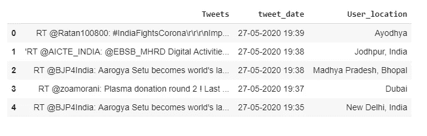

图 1:数据集预览

## 1.字数()

*   这是特征提取的首要任务。
*   我们计算数据集中每一行的字数。

```
tf.word_count(df,"Tweets","word_cnt")
df[["Tweets","word_cnt"]].head()
```

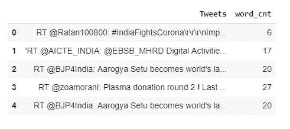

图 2:字数

## 2.char_count()

*   我们计算数据集中每一行的字符数。
*   这可以通过计算推文的长度来实现。

```
tf.char_count(df,"Tweets","char_len")
df[["Tweets","char_len"]].head()
```

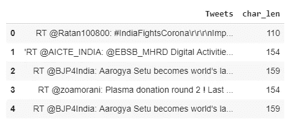

图 3:字符长度

## 3.平均单词长度()

*   为了更好地理解这些数据，我们将找出平均单词长度。
*   我们简单地计算出所有单词的长度之和，然后除以推文的总长度。

```
tf.avg_word_length(df,"Tweets","avg_wrd_length")
df[["Tweets","avg_wrd_length"]].head()
```

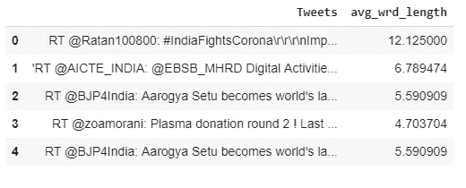

图 4:平均单词长度

## 4.停用字词计数()

*   为了处理任何自然语言处理问题，我们总是试图清理我们的数据。所以找到停用词是首要任务。
*   我们将找到文本数据中出现的停用词的计数。

```
tf.stopwords_count(df,"Tweets","stopwords_cnt")
df[["Tweets","stopwords_cnt"]].head()
```

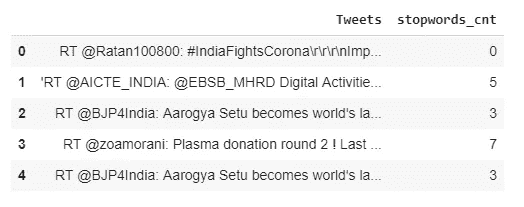

图 5:停用词计数

## 5.停用词()

*   我们在文本数据中找到停用词，并将其存储在一个列表中，以便您可以找到数据中的干扰，并使其更具交互性。

```
tf.stopwords(df,"Tweets","stopwords")
df[["Tweets","stopwords"]].head()
```

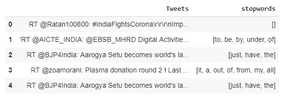

图 6:停用词

## 6.hashtags_count()

*   找出数据中的标签是最有趣的任务，因为标签帮助我们获得最大的观众，这样你的帖子或推文也会得到最大的响应。
*   我们将首先计算标签的数量。

```
tf.hashtags_count(df,"Tweets","hashtags_count")
df[["Tweets","hashtags_count"]].head()
```

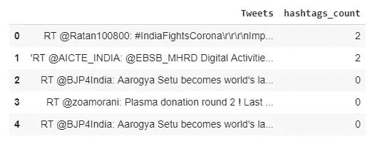

图 7:标签数

## 7.标签()

*   现在，我们将提取标签并将其存储到列表中，以便对数据进行更多的预处理和可视化。

```
tf.hashtags(df,"Tweets","hashtags")
df[["Tweets","hashtags"]].head()
```

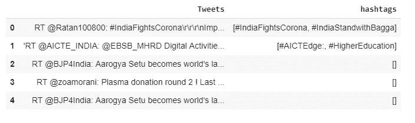

图 8:标签

## 8.links_count()

*   为了从数据中找到更多的见解，我们还找到了嵌入的链接。
*   我们将找到链接的计数。

```
tf.links_count(df,"Tweets","links_count")
df[["Tweets","links_count"]].head()
```

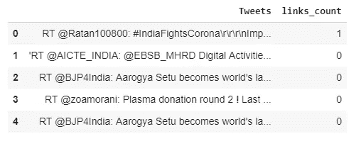

图 9:链接计数

## 9.链接()

*   让我们找出嵌入在文本数据中的链接，将其存储在列表中并用于进一步的分析。

```
tf.links(df,"Tweets","Links")
df[["Tweets","Links"]].head()
```

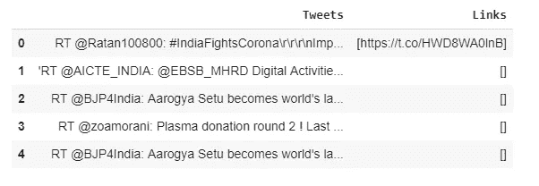

图 10:链接

## 10.数字计数()

*   就像我们搜索单词、标签、链接和许多其他东西一样，我们也会发现数字的数量。
*   对我们处理文本数据肯定会有帮助。

```
tf.numerics_count(df,"Tweets","num_len")
df[["Tweets","num_len"]].head()
```

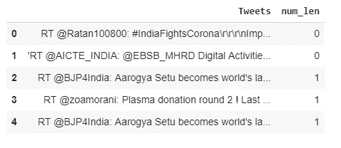

图 11:数字计数

## 11.用户提及次数计数()

*   在处理 twitter 数据时，我们总是会接触到用户提及(@)。我们对这种类型的数据特征很好奇，它帮助我们更有效地分析数据并理解它的重要性。
*   我们在这里找到了用户提及的次数。

```
tf.user_mentions_count(df,"Tweets","user_mentions_cnt")
df[["Tweets","user_mentions_cnt"]].head()
```

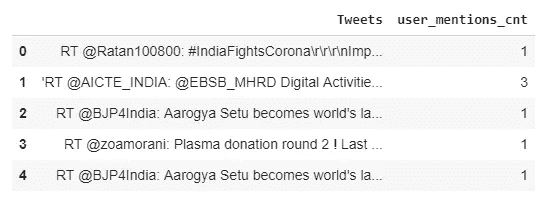

图 12:用户提及计数

## 12.用户提及次数()

*   让我们找出用户提及，将其存储在列表中并用于信息可视化。

```
tf.user_mentions(df,"Tweets","user_mentions")
df[["Tweets","user_mentions"]].head()
```

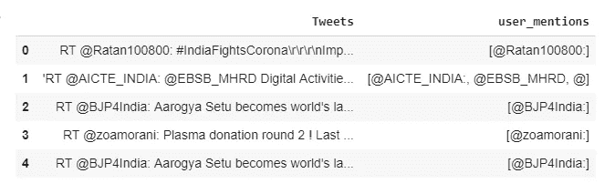

图 13:用户提及

## 13.清洁()

*   在提取了所有有意义的特征之后，我们需要清理数据以进行进一步的情感分析。
*   因此，我们有一个 clean()函数，它将在删除不需要的数据(如数字、停用词、标点符号和链接)后，为您提供预处理的数据。

```
tf.clean(df,"Tweets","Clean_tweets")
df[["Tweets","Clean_tweets"]].head()
```

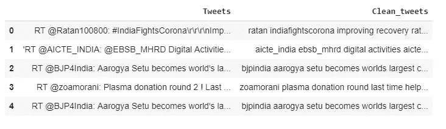

图 14:清洁()

# 结论

我希望你理解这个库提供的基本功能。现在是时候让你设计一些有趣的实现了。如果你想做贡献，那么请把资源库放到 GitHub 上，继续做好工作。

# 关键要点

*   [包](https://pypi.org/project/textfeatures/)
*   [谷歌 Colab 演示](https://colab.research.google.com/drive/1qzzVKptV9C6ebwDgta6rPW0u1s3GzDw5?usp=sharing)
*   [Github 资源库](https://github.com/Amey23/textfeatures)

享受学习！

> 你好👋我希望你能从我的文章中获得知识。如果你愿意支持我，请随意给我买些咖啡🙏☕
> 
> [**https://www.buymeacoffee.com/amey23**](https://www.buymeacoffee.com/amey23)
> 
> **或通过 ameypband23@gmail.com 联系我**
> 
> **乐意为您效劳。**