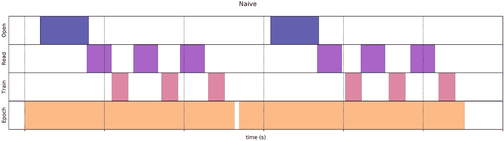
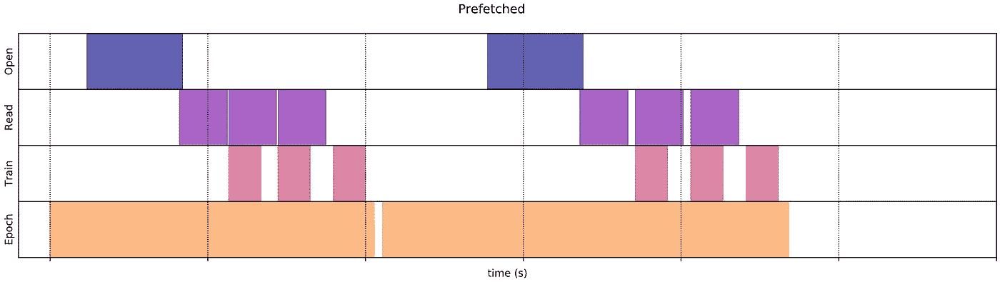

# tf.data:创建数据输入管道

> 原文：<https://towardsdatascience.com/tf-data-creating-data-input-pipelines-2913461078e2?source=collection_archive---------29----------------------->

你不能把你的数字数据载入内存吗？您的模型是否必须在每个时期后等待数据加载？
你的 Keras DataGenerator 慢吗？

tensor flow[***TF . data***](https://www.tensorflow.org/api_docs/python/tf/data)API 允许构建复杂的输入管道。它可以轻松处理大量数据，可以读取不同格式的数据，同时允许复杂的数据转换。

# 我们为什么需要 tf.data？

一个训练步骤包括以下步骤:
1。文件读取
2。获取或解析数据
3。数据转换
4。使用数据来训练模型。



来源:[张量流](https://www.tensorflow.org/guide/data_performance) (CC0)

如果你有大量的数据，而你无法将它加载到内存中，你可能想要使用[生成器](https://www.tensorflow.org/guide/data#consuming_python_generators)。但是生成器的可移植性和可伸缩性有限。
在每个时期之后，您将等待模型将数据转换成可消费的格式，在此期间，您的模型处于闲置状态，不进行任何训练。这导致 CPU 和 GPU 利用率低。
处理这个问题的一个解决方案是 [**预先预取**](https://www.tensorflow.org/guide/data_performance#prefetching) 您的数据，这样您就不必等待数据被加载。



来源:[张量流](https://www.tensorflow.org/guide/data_performance) (CC0)

tf.data 是一个数据输入管道构建 API，您可以使用它来轻松构建您的数据管道。无论您是想从本地文件中读取数据，还是远程存储数据。

# 加载分类数据

为了训练图像分类模型，我们创建了一个 CNN 模型，并将我们的数据提供给该模型。我想训练一个猫和狗的分类器，我的数据存储在下面的文件夹结构中。

```
*data
└── train
    ├── cat -> contains images of cats
    └── dog -> contains images of dogs*
```

*我们首先找到所有图像的路径——*

```
from glob import glob
import tensorflow as tfimage_path_list = glob('data/train/*/*.jpg')
data = tf.data.Dataset.list_files(image_path_list)
```

**TF . data . Dataset . list _ files**将 glob 方法返回的列表转换为 Dataset 对象。现在，我们将加载图像和它们的类。

```
def load_images(path):

    image = tf.io.read_file(path)
    image = tf.io.decode_image(image)
    label = tf.strings.split(path, os.path.sep)[-2] return image, labeldata = data.map(load_images)
```

于是， ***数据*** 对象现在有了图像和标签。但这不是它，我们将不得不调整图像的大小，预处理和应用转换。

```
def preprocess(image, label):
    image = tf.image.resize(image, (IMG_HEIGHT, IMG_WIDTH))
    image = tf.image.random_flip_left_right(image)
    image = tf.image.random_flip_up_down(image) image /= 255.
    image -= 0.5 return image, labeldata = data.map(preprocess)
```

我基于 *tf.data* 创建了一个名为[***Chitra***](https://github.com/aniketmaurya/chitra)*的小库，可以用来跳过所有这些步骤。*

```
*from chitra import dataloader as dl
path = './data/train'train_dl = dl.Clf()
data = train_dl.from_folder(path, target_shape=(224, 244), shuffle = True)# to visualize the data
train_dl.show_batch(6, figsize=(6,6))*
```

***您只需指定数据的路径，它就会以目标大小加载。***

**

> **你可以在*[*https://github.com/aniketmaurya/chitra*](https://github.com/aniketmaurya/chitra)找到我的代码*