# PySpark 中使用 Map-Reduce 算法计算 TF-IDF

> 原文：<https://towardsdatascience.com/tf-idf-calculation-using-map-reduce-algorithm-in-pyspark-e89b5758e64c?source=collection_archive---------3----------------------->

## 在本文中，我们将使用 Pyspark 中的 Map-Reduce 算法来计算每个文档中各个单词的词频-逆文档频率(TF-IDF)分数。

[ev](https://unsplash.com/@ev?utm_source=medium&utm_medium=referral) 在 [Unsplash](https://unsplash.com?utm_source=medium&utm_medium=referral) 上的照片

# **简介**

不过，Spark MLlib 有一个计算 TD-IDF 分数的内置函数，它利用 map/reduce 算法以分布式方式运行代码。在本文中，我们将使用弹性分布式数据集(rdd)来实现 map/reduce 算法，以便更好地理解底层概念。下图解释了单词计数示例的 map/ reduce 算法的基本思想。最初，我们将文本数据的每一行中出现的单词进行拆分，并在 map 步骤中生成一个新的键/值对列表。此外，在 reduce 步骤中，我们为每个不同的关键字(单词)获取一个值列表，并为每个不同的关键字生成新的聚合值。

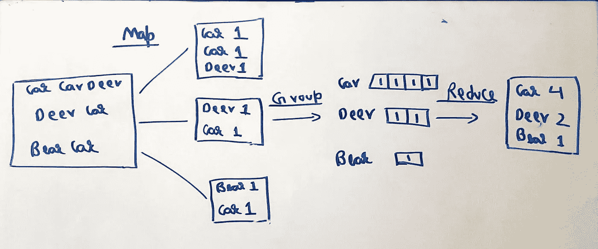

字数的 Map-Reduce 示例

在本文中，我们不会深入探讨 map/reduce 算法的理论。对于这方面的新手，我建议他们首先阅读下面给出的文章，以便掌握 Spark 和 Hadoop 中 map/reduce 的概念。

 [## 了解 Hadoop MapReduce

### MapReduce 是一个集群数据处理框架。由 Map 和 Reduce 函数组成，它分发数据…

medium.com](https://medium.com/@elmaslouhy.mouaad/understanding-hadoop-mapreduce-f3e206cc3598)  [## MapReduce 解释道

### 介绍和简要说明

medium.com](https://medium.com/@francescomandru/mapreduce-explained-45a858c5ac1d) 

# **TF-IDF 配方**

TF-IDF 是一种为任何文本数据提取特征的方法。它使用术语频率和逆文档频率进行计算。

其中 N 表示单词在文档中的出现频率。IDF 分数告诉我们一个特定的单词在整个语料库中有多重要。例如，如果一个单词出现在每个文档中，那么 IDF 分数将为零。

# **计算词频(TF)**

词频是特定单词在文档中出现的次数。首先，让我们创建一个玩具数据集如下-

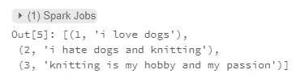

我们的数据集由三行/文档组成，分别与文档 id 相关联。我们可以把它想象成一个键/值对，其中键是文档 id，值是与各自的文档 id 相关联的文本。

**步骤 1:将键/值对映射到新的键/值对。**

在这一步中，我们将现有的键/值对映射到一个新的键-值对，这个新的键-值对由作为键的 document-id 和 token 以及作为值的 1(表示计数)组成。我们将在这里使用 flatMap 转换将所有的标记合并到一个列表中。

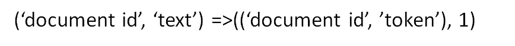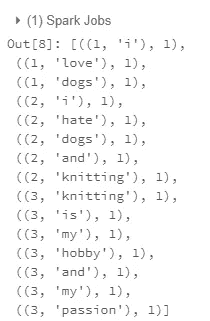

**步骤 2:减少键/值对**

在这一步中，我们将使用公共键对键/值对进行分组，并进一步聚合同一个键的值，以获得与其文档 id 相对应的特定单词的词频。

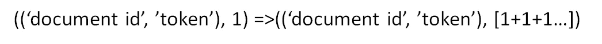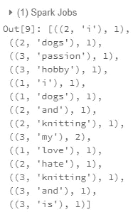

我们可以看到单词“my”在第三个文档中出现了两次，因此它被分组，并且值被求和为 2 (1+1)。

**第三步:再次映射**

在这一步中，我们将把键/值对更改为一组新的键/值/对，用令牌作为键，用它的文档 id 和各自的术语频率作为值。

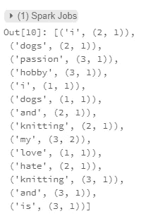

# 计算反向文档频率(IDF)

IDF 分数告诉我们一个特定的单词在整个语料库中有多重要。例如，如果一个单词出现在每个文档中，那么 IDF 分数将为零。

我们知道我们案例的文档总数是 3，因为我们在完整的语料库中有 3 行。因此，我们的下一步将是计算有多少文档包含特定的标记 w。此外，我们可以使用此信息来计算语料库中所有标记的 IDF 分数。

在本节中，我们将链接前面的 map/reduce 计算来计算 IDF。在上一节的简化步骤之后，我们获得了各个令牌的键/值对及其词频。

**第一步:映射**

在这一步中，我们将把以前的键/值对映射到一个新的键/值对。这里，关键字将是令牌，其值将是该令牌的文档 id TF 以及计数器 1。这里的这个表示文档 id 中存在一个与之相关联的单词。

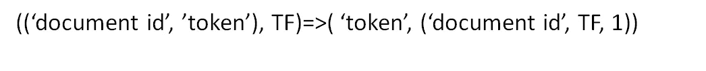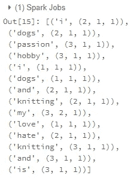

**第二步:映射**

在这一步中，我们将提取令牌和表示它在某些文档中出现的计数器 1 的数量。

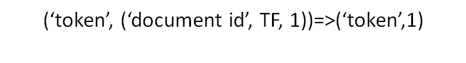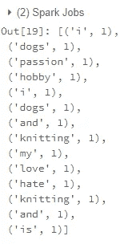

**步骤 3:通过按键减少**

在这一步中，我们将按键进行缩减，以获得包含特定标记 w 的文档数。例如，两个文档中发生了编织，因此在分组和聚合后，其总和将为 2 (1+1)。

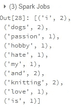

现在，由于我们有了包含每个标记 w 的文档数，我们将使用对数变换来映射这个最终输出，以计算 IDF 分数。

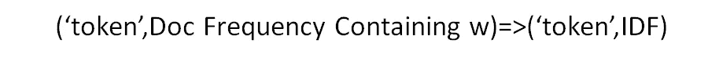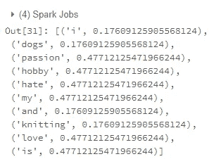

输出

# **计算 TD-IDF:**

现在我们有两个 rdd，一个有文档 id，另一个有每个令牌的文档术语频率。另一个 RDD，每个令牌都有 IDF 分数。

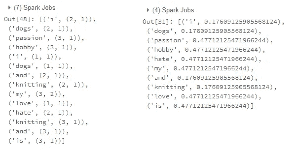

我们将执行一个内部连接，为每个令牌分配一个文档 id、TF 和 IDF 分数。

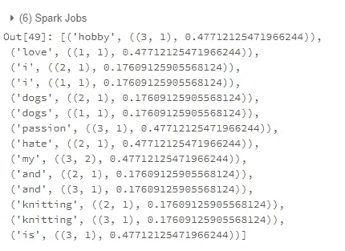

现在，我们将映射这个函数，将与各个文档 id 相关联的每个令牌的 TF 和 IDF 值相乘。

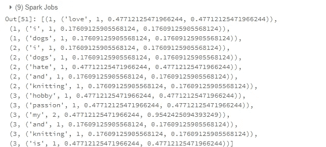

让我们将最终输出转换为 Pyspark 数据框，以便更清楚地显示分数，并将其与实际理论计算的 TF-IDF 分数进行比较。

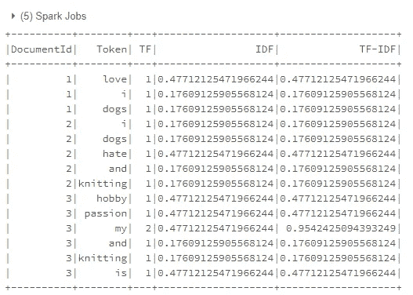

预测

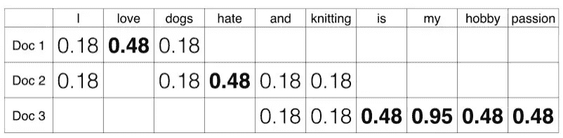

实际分数[1]

从上面的数据框架和表格中我们可以清楚地看到，所有的 TF-IDF 分数都与理论分数完全一致。

# **完整代码**

上述实现的完整代码如下所示。这可能看起来很可怕，但没有什么特别的。它仅由链接在一起以获得最终输出的多个 map/ reduce 步骤组成。

# **参考文献**

[1]访问:[data camp . com/community/tutorials/text-analytics-初学者-nltk](http://datacamp.com/community/tutorials/text-analytics-beginners-nltk)

# 感谢您的阅读！！！！

如果你喜欢我的工作并想支持我:

支持我的最好方式就是跟随我上 [**中级**](https://medium.com/@saketthavananilindan) **。**

2-在[**LinkedIn**](https://www.linkedin.com/in/saket-thavanani-b1a149a0/)**上关注我。**