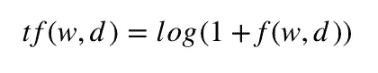
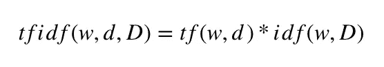

# TF-IDF 讲解和 Python Sklearn 实现

> 原文：<https://towardsdatascience.com/tf-idf-explained-and-python-sklearn-implementation-b020c5e83275?source=collection_archive---------1----------------------->

*什么是 TF-IDF，如何用 Python 和 Scikit 实现它-Learn。*

**TF-IDF** 是一个信息检索和信息抽取子任务，旨在表达一个词对一个文档的重要性，该文档是我们通常称为语料库的文档集合的一部分。它通常被一些搜索引擎用来帮助他们获得与特定查询更相关的更好的结果。在本文中，我们将讨论什么是 TF-IDF，解释它背后的数学原理，然后我们将看到如何使用 Scikit-Learn 库在 Python 中实现它。


照片由[罗恩·迪亚](https://unsplash.com/@prolabprints?utm_source=medium&utm_medium=referral)在 [Unsplash](https://unsplash.com?utm_source=medium&utm_medium=referral) 上拍摄

*本文原载于* [*程序员背包博客*](https://programmerbackpack.com/tf-idf-explained-and-python-implementation/) *。如果你想阅读更多这类的故事，一定要访问这个博客。*

非常感谢您阅读本文！对更多这样的故事感兴趣？在 Twitter 上关注我，地址是[*@ b _ dmarius*](https://twitter.com/b_dmarius)*，我会在那里发布每一篇新文章。*

# 文章概述

*   什么是 TF-IDF
*   TF-IDF 公式解释
*   TF-IDF sklearn python 实现
*   TfIdfVectorizer 与 TfIdfTransformer —有何不同
*   TF-IDF 应用
*   结论

# 什么是 TF-IDF

**TF-IDF** 代表词频——逆文档频率，是一种统计数据，旨在更好地定义一个单词对一个文档的重要性，同时也考虑到与同一语料库中其他文档的关系。

这是通过查看一个单词在一个文档中出现了多少次，同时也注意相同的单词在语料库中的其他文档中出现了多少次来执行的。

这背后的基本原理如下:

*   在文档中频繁出现的单词与该文档的相关性更高，这意味着该文档与该特定单词相关的概率更高
*   在更多文档中频繁出现的单词可能会阻止我们在集合中找到正确的文档；这个词要么适用于所有文档，要么不适用。无论哪种方式，它都不能帮助我们从整个集合中过滤出单个文档或文档的一个子集。

那么 **TF-IDF 是一个分数**，它应用于我们数据集中每个文档中的每个单词。并且对于每个单词，TF-IDF 值随着该单词在文档中的每次出现而增加，但是随着在其他文档中的每次出现而逐渐减少。数学会在下一节讲到。

# TF-IDF 公式解释

现在让我们看看 TF-IDF 统计指标背后的简单公式。首先让我们定义一些符号:

*   *N* 是我们数据集中的文档数量
*   *d* 是我们数据集中的一个给定文档
*   *D* 是所有文件的集合
*   w 是文档中的一个给定单词

第一步是计算词频，我们的第一个衡量指标是得分。



词频公式

这里 *f(w，d)* 是 *w* 在 *d.* 文档中的出现频率

第二步是计算逆项频率。


逆文档频率公式

对于数据集中的 *N* 个文档和整个数据集中的 *f(w，D)* 单词 *w* 的出现频率，这个数字会随着单词在整个数据集中的出现次数的增加而降低。

最后一步是通过以下公式计算 TF-IDF 得分:



词频—逆文档频率—公式

# TF-IDF Sklearn Python 实现

有了像 [scikit-learn](https://scikit-learn.org/stable/) 这样令人敬畏的库，实施 TD-IDF 就轻而易举了。首先，我们需要为我们的项目安装 2 个依赖项，所以现在就开始吧。

```
pip3 install scikit-learn
pip3 install pandas
```

为了看到 TF-IDF 的全部威力，我们实际上需要一个适当的、更大的数据集。但是出于本文的目的，我们只想关注实现，所以让我们将依赖项导入到我们的项目中，并构建我们的迷你数据集。

```
import pandas as pd
from sklearn.feature_extraction.text import TfidfTransformerdataset = [
    "I enjoy reading about Machine Learning and Machine Learning is my PhD subject",
    "I would enjoy a walk in the park",
    "I was reading in the library"
]
```

现在让我们计算 TF-IDF 分数并打印出结果。

```
tfIdfVectorizer=TfidfVectorizer(use_idf=True)
tfIdf = tfIdfVectorizer.fit_transform(dataset)
df = pd.DataFrame(tfIdf[0].T.todense(), index=tfIdfVectorizer.get_feature_names(), columns=["TF-IDF"])
df = df.sort_values('TF-IDF', ascending=False)
print (df.head(25))
```

现在让我们看看我们的结果。

```
TF-IDF
machine   0.513720
learning  0.513720
about     0.256860
subject   0.256860
phd       0.256860
and       0.256860
my        0.256860
is        0.256860
reading   0.195349
enjoy     0.195349
library   0.000000
park      0.000000
in        0.000000
the       0.000000
walk      0.000000
was       0.000000
would     0.000000
```

# TfidfVectorizer 与 TfidfTransformer —有何不同

如果您曾经看过 TF-IDF 的其他实现，您可能已经看到使用 Scikit-Learn 实现 TF-IDF 有两种不同的方式。一种是使用 TfidfVectorizer 类(就像我们刚才做的那样)，另一种是使用 TfidfTransformer 类。你可能想知道它们之间有什么不同，所以让我们来讨论一下。

从理论上讲，这两种实现实际上没有区别。实际上，如果我们想使用 TfidfTransformer，我们需要编写更多的代码。这两种实现的主要区别在于，TfidfVectorizer 为您执行词频和逆文档频率，而使用 TfidfTransformer 需要您使用 Scikit-Learn 中的 CountVectorizer 类来执行词频。

因此，让我们来看一个替代的 TF-IDF 实现，并验证结果是否相同。我们首先需要导入 2 个额外的依赖项到我们的项目中。

```
from sklearn.feature_extraction.text import TfidfTransformer
from sklearn.feature_extraction.text import CountVectorizer
```

我们将使用与其他实现相同的小型数据集。让我们编写替代实现并打印出结果。

```
tfIdfTransformer = TfidfTransformer(use_idf=True)
countVectorizer = CountVectorizer()
wordCount = countVectorizer.fit_transform(dataset)
newTfIdf = tfIdfTransformer.fit_transform(wordCount)
df = pd.DataFrame(newTfIdf[0].T.todense(), index=countVectorizer.get_feature_names(), columns=["TF-IDF"])
df = df.sort_values('TF-IDF', ascending=False)
print (df.head(25))
```

你可以看看结果，看到和上面的一样。

```
TF-IDF
machine   0.513720
learning  0.513720
about     0.256860
subject   0.256860
phd       0.256860
and       0.256860
my        0.256860
is        0.256860
reading   0.195349
enjoy     0.195349
library   0.000000
park      0.000000
in        0.000000
the       0.000000
walk      0.000000
was       0.000000
would     0.000000
```

# TF-IDF 应用

我们已经看到，使用正确的工具实现 TF-IDF 非常容易，但该算法的应用程序非常强大。TF-IDF 最常见的两种使用情形是:

*   **信息检索:**通过计算用户查询相对于整个文档集的 TF-IDF 得分，我们可以计算出一个文档与给定查询的相关程度。有传言说，大多数搜索引擎都使用某种 TF-IDF 实现，但我自己无法证实这一信息，所以对此要持保留态度。
*   [**关键词提取**](https://programmerbackpack.com/machine-learning-project-series-part-2-python-keywords-extraction/) :根据 TF-IDF 得分，文档中排名最高的词可以很好地代表该文档的关键词(因为它们使该文档从其他文档中脱颖而出)。因此，我们可以很容易地使用某种 TF-IDF 分数计算来从文本中提取关键字。

# 结论

因此，在本文中，我们看到了对什么是 TF-IDF 以及我们如何从数学上解释它的解释。然后，我们看到了使用 Scikit-Learn Python 库的两个替代实现。然后我们讨论了这个算法的一些可能的应用。我希望你喜欢这个！

非常感谢您阅读这篇文章！有兴趣了解更多吗？在 Twitter 上关注我，地址是[*@ b _ dmarius*](https://twitter.com/b_dmarius)*，我会在那里发布每一篇新文章。*