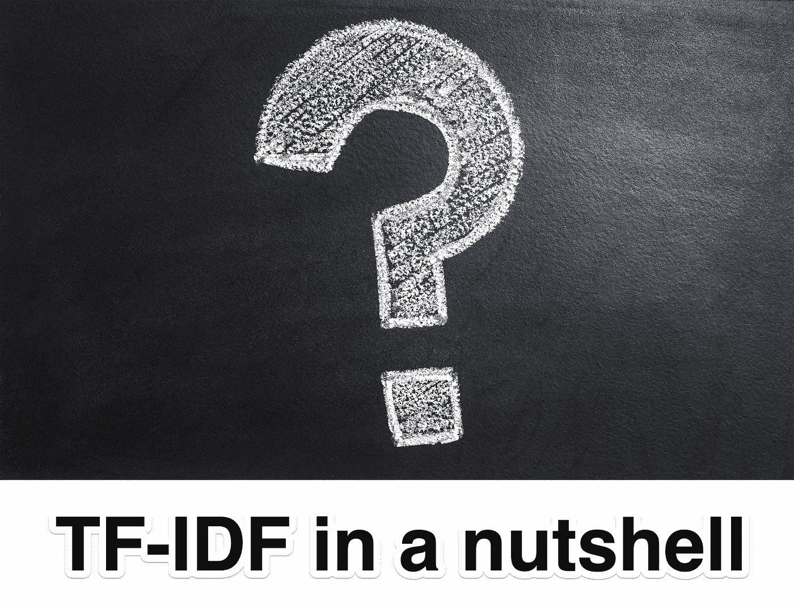
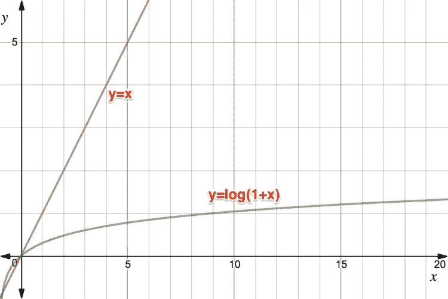

# TF-IDF 概述

> 原文：<https://towardsdatascience.com/tf-idf-in-a-nutshell-b0ff082fbbc?source=collection_archive---------40----------------------->



来自 pixabay.com 的照片

## 通过 5 个简单的例子了解 TF-IDF 的发展


彼得·鲁恩，照片来自 alchetron.com

早在 1958 年，汉斯·彼得·鲁恩在他的论文《文献摘要的自动生成》中假设“一篇文章中单词出现的频率提供了一个有用的单词重要性的度量”，这可能是迄今为止信息检索科学中最重要的事情之一，并被用于所有知名的大大小小的搜索引擎，从谷歌和雅虎到定制搜索解决方案，如弹性搜索和蝎狮搜索。

Luhn 假设的重要性不能被高估，并且在信息检索领域的许多进一步的科学研究都是基于 Luhn 的假设，尽管并非所有的研究都提到，随着时间的推移，它可能成为公理。

在这篇文章中，我将尝试用非常清晰的例子来展示 TF 代表“词频”和它的对应词 IDF 代表“逆文档频率”是如何帮助找到你要找的东西的。

让我们看 5 份文件:

```
1\. My dog doesn't like all my pets, but me and my wife do love them all. A dog cannot be a cat lover
2\. Cats and dogs do not like each other, but my cat does like dogs
3\. Walking a dog is a good start of the day
4\. Not all cats like walking, but some cats do
5\. All dogs like walking, but mine doesn't like. It's like so weird
```

并尝试为不同的查询对它们进行排序(即找到最相关和最不相关的以及顺序)。

# 如果单词出现，权重= 1，否则为 0

**查询:‘喜欢’**。

注意，我们不知道查询中的“like”是什么意思:比如“A 就像 B”或“我喜欢 smth”。那么我们能做些什么来排列文档呢？

首先想到的是，如果一个文档根本不包含单词“like ”,那么它可能不太相关。因此，顺序可以是:

```
1\. My dog doesn't **like** all my pets, but me and my wife do love them all. A dog cannot be a cat lover
2\. Cats and dogs do not **like** each other, but my cat does **like** dogs
4\. Not all cats **like** walking, but some cats do
5\. All dogs **like** walking, but mine doesn't **like**. It's **like** so weird
3\. Walking a dog is a good start of the day
```

我们把文档#3 放在最后，因为它不包含“like”。至于其余的，我们没有改变他们的顺序，因为他们都包含“喜欢”。这样的排名质量够好吗？我不这么认为，因为在前 4 个文档中，有 2 个(#5 和#2)似乎比其他文档更相关，因为它们提供了更多与查询术语“like”相关的事实(请记住，我们不知道“like”在查询中的确切含义)，但它们不是前 2 个。那么我们能做些什么呢？

# 权重=术语频率

**查询:‘喜欢’。**

如前所述，根据 Luhn 的假设，包含查询术语的更多出现的文档可能更相关。让我们根据文档的词频对其进行排序(注意，在这里以及在信息检索领域，一般来说“频率”只是指计数，而不是像在物理学中那样用计数除以某个值):

```
5\. All dogs **like** walking, but mine doesn't **like**. It's **like** so weird | tf = 3
2\. Cats and dogs do not **like** each other, but my cat does **like** dogs | tf = 2
1\. My dog doesn't **like** all my pets, but me and my wife do love them all. A dog cannot be a cat lover | tf = 1
4\. Not all cats **like** walking, but some cats do | tf = 1
3\. Walking a dog is a good start of the day | tf = 0
```

这解决了问题，现在文档#5 和#2 在最上面。

但是现在让我们尝试另一个**查询——“我的一天”**:

```
1\. **My** dog doesn't like all **my** pets, but me and **my** wife do love them all. A dog cannot be a cat lover | tf = 3
2\. Cats and dogs do not like each other, but **my** cat does like dogs | tf = 1
3\. Walking a dog is a good start of the **day** | tf = 1
4\. Not all cats like walking, but some cats do | tf = 0
5\. All dogs like walking, but mine doesn't like. It's like so weird | tf = 0
```

文档#1 和#2 得到最高的位置，但是它是正确的吗？他们没有提到“天”，只提到了“我的”:我的宠物、我的妻子、我的猫，考虑到这个问题，这些可能也很重要，但很可能不是。文档#3 的位置较低，但它似乎是最相关的。怎么才能放高点？

让我们想想“我的”和“日”以及其他词有什么不同。“day”似乎更具体，而“my”几乎可以适用于任何事物，在**文档中,“my”出现的频率远远高于“day”和其他更具体的术语**。接下来是“**文档频率**”——公式的另一个重要部分，也是术语权重的第二个基石。

1972 年，英国计算机科学家 Karen sprck Jones 在她的一篇学术论文中说:


凯伦·斯帕克·琼斯，照片来自 en.wikipedia.org

> 文档描述的详尽性是它包含的术语的数量，术语的具体性是它所属的文档的数量

我们已经讨论了前一部分，现在让我们看看如果我们考虑后一部分，文档顺序是如何变化的。

# 权重=术语频率*(文档数量/文档频率)

**查询:‘我的一天’。**

“My”出现在两个文档中，“day”只出现在一个文档中，因此“my”的 IDF(逆文档频率)为 5(文档总数)/ 2 = 2，5，“day”-5/1 = 5。

```
1\. **My** dog doesn't like all **my** pets, but me and **my** wife do love them all. A dog cannot be a cat lover
Weight = 3(tf of 'my') * 2,5(idf of 'my') + 0(tf of 'day') * 5 (its idf) = 7,5
3\. Walking a dog is a good start of the **day**
Weight = 0 * 2,5 + 1 * 5 = 5
2\. Cats and dogs do not like each other, but **my** cat does like dogs
Weight = 2,5
4\. Not all cats like walking, but some cats do
Weight = 0
5\. All dogs like walking, but mine doesn't like. It's like so weird
Weight = 0
```

在 IDF 的帮助下，我们可以将相关文档“遛狗是一天的良好开端”放在更高的位置，但它仍然不在最上面。原因是什么？这是因为“我的”出现得太频繁了，超过了“当天的 IDF”的重要性。我们如何解决这个问题？我们需要降低 TF 贡献的东西。多年来，从对数(TF)到所谓的“术语频率饱和曲线”，已经提出并研究了许多 TF 归一化的变体。为了简单起见，我们只取对数变量。

# 重量= log(1+TF) * (N/df)



与线性函数相比，对数平滑的整体思想是自变量越高，它增加得越慢，即，对于较小的 x，它增长得越快，而对于较大的 x，它增长得越慢。要求函数中的“1+x”在项频率= 0 的自变量中不具有 0，因为 log(0)是未定义的，而 log(0+1)是 0，这正是我们对于 tf=0 所需要的。

让我们看看它是否能解决问题:

**查询:‘我的一天’。**

```
3\. Walking a dog is a good start of the **day**
Weight = log(1+0) * 2,5 + log(1+1) * 5 = 0 + 3,47 = 3,47
1\. **My** dog doesn't like all **my** pets, but me and **my** wife do love them all. A dog cannot be a cat lover
Weight = log(1+3) * 2,5 + log(1+0) * 5 = 3,47 + 0 = 3,47
2\. Cats and dogs do not like each other, but **my** cat does like dogs
Weight = 1,73
4\. Not all cats like walking, but some cats do
Weight = 0
5\. All dogs like walking, but mine doesn't like. It's like so weird
Weight = 0
```

我们可以看到，最相关的文档最终位于第一个位置，但它与另一个权重为 3.47 的文档共享该位置。是对还是错？这是一个很难回答的问题，因为我们永远不知道什么与请求者相关。有可能通过询问“我的一天”,他或她会认为第二个文档也是相关的，因为它给出了“我的”的许多事实，而第一个文档只说了“一天”的一个事实。因此，它们得到相同的重量可能是相当公平的。

因为这种不确定性，这可能是为什么搜索引擎通常返回的不是一个结果，而是一些数字:10 或 20 或其他，所以我们只是让用户自己做最后的决定。

# 结论

在这篇文章中，我简单地展示了对 TF-IDF 加权公式的思考的演变，证明了它是可行的，并且它的每个组成部分都是重要的。

还有 TF-IDF 的延续，称为 BM25，它基于前面提到的“词频饱和曲线”,特别是更多的概率方法来定义加权公式(再次记住，我们永远不知道什么是真正相关的，因此是概率方法)。总的来说，它仍然是 TF-IDF (+按文档长度规范化)，但是它的根完全不同。这将在另一篇文章中讨论。