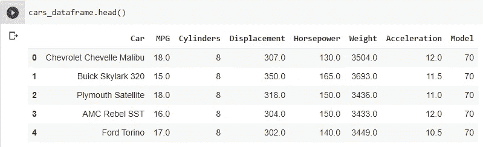

# TFRecords 解释

> 原文：<https://towardsdatascience.com/tfrecords-explained-24b8f2133282?source=collection_archive---------12----------------------->

迪莉娅·詹德妮在 [Unsplash](https://unsplash.com?utm_source=medium&utm_medium=referral) 上的照片

## 使用 TFRecords 并介绍 Protobufs

在这篇文章中，我将讨论 **Tensorflow 记录**。Tensorflow 建议以 tfRecords 格式存储和读取数据。它在内部使用**协议缓冲区**来序列化/反序列化数据，并以字节存储它们，因为它占用更少的空间来保存和传输大量的数据。

与 JSON 和 XML 不同，Protobufs 使用预定义的模式。tfRecords 在 Protofiles 中已经提供了这样的模式，并且还提供了许多受支持语言的编译代码。在这篇文章中，我将把这些编译好的代码导入 Python，并在我的数据中使用它们。

这篇文章需要对 Protobufs 有一个基本的了解，因为它们是 TFRecords 的组成部分。我之前也写过一篇关于使用[***Protobufs***](https://medium.com/@gshbehera/serialization-deserialization-with-protobufs-223d401f621d)的帖子。在这篇文章中，我首先回顾了 tfRecords 的预定义原型，在 Python 中使用它们，并给出了一些注意事项。然后我有两个演示，我将从现有的数据集制作 tfRecords。

## 预定义的原型

这是取自 Tensorflow 的 feature.proto 的代码片段。完整的文件可以在[这里](https://github.com/tensorflow/tensorflow/blob/master/tensorflow/core/example/feature.proto)找到。它包含 3 种原始消息类型，**字节列表**、**浮动列表**和**int 64 列表**。这些可以单独用来创建一个整数、浮点数或字节的列表，可以序列化为二进制。我将在下一节中对此进行更多的讨论。

下一个代码片段列出了来自上述同一文件的另外 3 个原型。它有一个**特性**消息类型，其中使用了 BytesList、FloatList 和 Int64List，因为它是字段之一。**当您想一次只设置所有字段中的一个字段时，使用 Oneof** 字段。一个中的字段共享一个公共内存。如果在一个 of 中设置了多个字段，则它会自动清除其他字段。更多关于这个的信息可以在[这里](https://developers.google.com/protocol-buffers/docs/proto3#oneof)找到。然后创建了一个 **Features** 消息类型，这是上面创建的一个字符串和一个 Feature 类型的映射。然后最后一个是**例子**用 Features 作为它的字段。

这些原型编译后的代码会分别给出 **tf.train.Int64List，tf.train.FloatList** ， **tf.train.BytesList** ， **tf.train.Feature** ， **tf.train.Features** 和 **tf.train.Example** 。现在，让我们来看一些 Python 代码，其中我使用了这些原型的编译版本。

## 在 Python 中使用编译后的原型

这段代码展示了上面定义的基本原型的用法。我使用它们通过传递重复的值来创建 tf.train.Int64List、tf.train.FloatList 和 tf.train.BytesList 的实例。type 命令显示是从 tensor flow . core . example . feature _ Pb2 文件导入的，该文件是**协议**编译后生成的文件。

在这里，我通过传递上面创建的所有列表来创建 tf.train.Feature 的一个实例。但是当我们打印它的时候，它只显示了 float 列表，没有 int 列表或者 bytes 列表被打印出来。原因是 tf.train.Feature 将它们作为字段之一。所以只有放在最后的列表会在那里，其他的会被清除。

这意味着 Tensorflow 说我们不应该在实例化一个 tf.train.Feature 时填充多个字段，在 protofile 中使用 oneof 正好符合要求。但即使知道了这一切，我还是逼着自己去做。那我该如何防止自己再犯同样的错误呢？

嗯，我会这么做。我将为它们创建一个包装器，并在其中调用 tf.train.Feature，这只会填充其中一个字段。我需要调用这些包装方法来创建 tf.train.Feature 实例。这明确地阻止了我创建一个 tf.train.Feature 并一次填充所有这些文件。

但是我在这里面临的另一个问题是，我如何创建一个带有元素列表的 tf.train.Feature(代码中的第 18 行)。将元素列表传递给包装器会产生 tf.train.Feature 形式的 TypeError，它只接受整数、浮点或字节列表，而不接受列表列表。如果我将一个列表传递给包装器方法本身，那么它将尝试创建一个 tf.train.Feature 元素，该元素的列表包含一个整数、浮点数或字节的列表。错误也是。如果我有另外一个方法，用一个列表代替一个元素，这就可以避免。

这也是一个包装器，但是它接受一个列表并创建 tf。具有元素列表的特征。这可以用前面所有的包装器方法重复。

然后我把上面创建的 tf.train.Feature 实例放到一个 tf.train.Features 映射中，并从映射中创建一个 tf.train.Example 实例。这个 tf.train.Example 实例是我将序列化为二进制的实例。

## tf.train.Example 中的 tfRecord

好了，所有的基本工作都完成了。现在我们知道如何从一组整数、浮点或字节元素中创建一个 tf.train.Example。是时候做一个 **TFRecord** 了。TFRecord 是指将这类记录的序列序列化为二进制。与任何其他数据格式相比，二进制格式占用更少的存储空间。

这就是我现在要做的。我将把一个数据集的所有记录转换成 TFRecords，TF records 可以序列化成二进制，也可以写入一个文件。Tensorflow 说，

*   对于记录中的每个值，创建一个 tf.train.Feature 实例。
*   将记录的每个 tf.train.Feature 实例作为值添加到映射中，以属性名(列名)作为键。它将为数据集的记录创建一个 tf.train.Features 地图
*   使用上面创建的 tf.train.Features 映射创建 tf.train.Example 的一个实例。通过此过程，创建的 tf.train.Example 实例数将与数据集中的记录数相同。

我有两个演示来展示这种方法。其中一个是 csv 文件，另一个是图像数据集。但在深入研究之前，还有一些事情需要澄清。

1.  我需要一个方法来根据记录中值的类型创建适当的 tf.train.Feature。所以我在这里写了一个可以用于两个例子的方法。

*   这里的方法从数据集中获取行，并将其列类型和列名作为列表。
*   然后，它迭代该行的值，检查类型，然后创建相应的 tf.train.Feature 元素。
*   然后如上所述，将 tf.train.Feature 实例作为值添加到 tf.train.Features 映射中，将列名作为键。然后，该映射用于创建 tf.train.Example 的实例。

2.在读取序列化格式时，我需要另一种方法来解析 tfrecords。每个列都有自己的基于类型的解析机制。

*   这显示了从 tfrecord 中读取时每个属性的解析机制。
*   它将列名和列类型的映射作为键值对。
*   然后，它使用 **tf.io.FixedLenFeature** 配置来解析固定长度的输入特征，以及相应类型的值。这将使用作为键的列名和作为值创建的解析器填充另一个映射。

这些方法现在都没多大意义了。当我们在下面的例子中使用它们时，我们可以回到这些。

**示例 1: CSV 数据集到 tfrecords**

所获取的数据集是一个汽车的 csv 文件[这里](https://perso.telecom-paristech.fr/eagan/class/igr204/data/cars.csv)。它包含 8 列，第 1 列包含字符串，第 3 列和第 8 列包含整数，其他列包含浮点数。

使用列名及其类型分别作为键和值来创建映射。然后，所有的键和值都被转换为 list，以将它们发送给上面定义的第一个和第二个方法。

然后我遍历数据集的行，通过调用上面写的第一个方法获得每个行的 tf.train.Example 实例。然后我将它们序列化，并写入 tfrecords 文件。让我们看看下面的输出。序列化之前的输出只是键和值对的映射。序列化后，所有数据都是转换成字节的二进制格式，正如我所看到的，序列化后的输出很紧凑，与其他格式相比节省了很多空间。

当我需要取回数据时，我需要使用上面定义的第二种方法再次读取 tfrecords 文件。

在这里，我读取 tfrecords 文件，将其映射到 parse_example 方法，在该方法中，它实际上使用第二个方法中定义的特性描述来解析 tfrecords 文件中的每条记录。

**示例 2:用于对象检测的图像到 TFRecords】**

对于对象检测，我有一堆图像，它们各自的边界框存储在磁盘上的 xml 文件中。

左上和左下图像是健康的叶子。右上和右下的图像是患病的叶子。图像连同它们的边界框一起显示。labelImg 用于手动创建这些边界框，并将其放入每个图像的 XML 文件中。

这就是我解析 xml 文件的方法。Python 有一个 xml 库，它的 ElementTree 可以在这里用来提取边界框的文件名、xmin、xmax、ymin 和 ymax 以及标签(健康或不健康)。

和前面的例子一样，这里我再次创建了列名及其类型的映射，并为每个列创建了列表，将它发送给第一个方法。

我正在打开一个图像，使用 tf.image API 对它进行解码，并从 xml 中获取它的边界框细节。然后，我将创建一行对象检测所需的所有输入，并通过将它们发送给第一个方法来创建一个 tf.train.Example。然后，该示例实例被序列化并写入 tfrecords 文件。

与前面的例子相似，为了读回图像和 xml 细节的记录，这里我调用前面定义的第二个方法。得到解析的记录后，我打印它们的文件名。

这都是关于 TFRecords，以及如何将它们用于不同类型的数据集。暂时就这样了。请随时留下评论或任何改进建议。

1.  欲了解更多 TFRecords 信息，请访问 [TFRecords](https://www.tensorflow.org/tutorials/load_data/tfrecord) 。
2.  要了解更多关于协议缓冲区的信息，请访问 [Protobufs](https://developers.google.com/protocol-buffers/docs/overview) 。