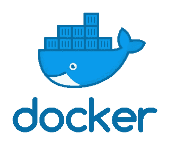

# 码头工人的 1–2–3

> 原文：<https://towardsdatascience.com/the-1-2-3s-of-docker-ea123d7c5f91?source=collection_archive---------41----------------------->

## *我几乎每天都会用到的 6 个 Docker 命令。*



在很长一段时间里，我都被 Docker 吓坏了(尽管它有可爱的鲸鱼标志)。关于 Docker，我所能记得的是我本科时的一次长篇大论，这让我开始质疑自己当初为什么会选择电脑。

当我终于有时间使用它时，我意识到它有点酷。也没有我记忆中的那么可怕。

# Docker 是什么？

> Docker 是一组平台即服务产品，使用操作系统级虚拟化来交付称为容器的软件包中的软件。容器是相互隔离的，捆绑了它们自己的软件、库和配置文件；他们可以通过明确定义的渠道相互交流。—维基百科

简而言之，Docker 是一种独立于本地设置的打包单个应用程序的方式。每个应用程序都在自己的 Docker 容器中。

到 6 个命令上。

# 码头工人建造

在任何带有`Dockerfile`的目录中，我们都可以构建一个 Docker 映像。Docker 图像是容器的配方。我喜欢给图片加上标签(-t)，这样更容易参考。

```
docker build . -t my_cool_app
```

# 码头运行

有了 Docker 映像，我们可以运行 Docker 容器。如果标签存在，我们可以用它来引用图像。

```
docker run my_cool_app
```

如果我们的 Docker 包含一个 web 应用程序，我们可以将它绑定到本地网络的外部端口。我们也可以给我们的容器命名。

```
docker run --name my_cool_container_name -p external_port:internal_port my_cool_app
```

# Docker ps

忘了容器叫什么了？忘记我们有哪些集装箱了吗？运行`docker ps`获得快速状态。


使用`docker ps -a`显示以前启动的容器(不包括删除的容器)。

# 码头日志

日志对于调试我们的应用程序非常有用。我们需要容器名或容器 id 来查看日志。

对于运行日志，请使用:

```
docker logs -f [container_id or name]
```

忘记了容器名称或容器 id？使用`docker ps`

# 码头工人杀人

有时我们不得不与我们的容器说再见。有时，它们会占用太多内存。

```
docker kill [container_id or name]
```

# 码头经理

我们用它来运行运行容器中的命令。我通常用它来打开容器中的 bash 会话。

```
docker exec -it [container_id or name] /bin/bash
```

# 感谢您的阅读！

[](https://ko-fi.com/mandygu#checkoutModal)

如果你喜欢这篇文章，可以考虑给我买杯咖啡——每一点小小的贡献都帮助我找到更多的时间在这个博客上工作。请通过 Medium 关注我的最新消息。😃

作为一个业余爱好项目，我还在[www.dscrashcourse.com](http://www.dscrashcourse.com/)建立了一套全面的**免费**数据科学课程和练习题。

再次感谢您的阅读！📕