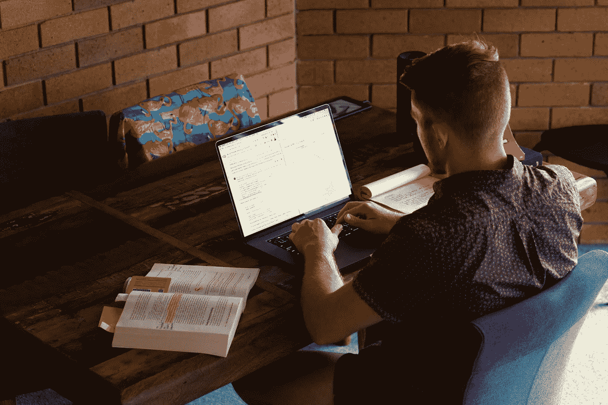

# 自学成才的机器学习工程师的 10 条戒律

> 原文：<https://towardsdatascience.com/the-10-commandments-of-self-taught-machine-learning-engineers-9e810971ed34?source=collection_archive---------8----------------------->

## 使用数学、代码和数据引诱大自然揭示她的秘密的原则。

编码可能会有点灰色。用色彩包围你自己。山姆·伯克的照片。

戒律和自学这两个术语不可轻视。一个人必须对自己的教育和启蒙负责。忽略这一点，别人会为你选择。

# 1.数学、代码和数据是你神圣的三位一体

任何有效的机器学习管道都利用数学、代码和数据的交叉。每一个都和另一个一样有效。

如果您的数据质量很差，那么无论您的数学多么优雅或者您的代码多么高效都没有用。

如果你的数据是最高质量的，但你的数学是错误的，那么你的结果会令人失望，甚至更糟。

如果你的数据和数学是世界一流的，但你的代码是低效的，你将无法获得规模的好处。

数据为您提供了一个包含自然宝石的采矿网站。数学是你的镐。代码允许你创建一个手持鹤嘴锄的机器舰队。

三位一体是你系统的输入(你拥有的)和输出(你想要的)之间的桥梁。

*注:三位一体的数学分支还包含统计和概率。如果你不喜欢这样，就把三位一体想象成一只海星。*

# 2.三位一体的唯一例外

除了未能平衡三位一体之外，只有一个更大的罪:忘记三位一体是为谁服务的。即使是执行得最好的代码，由最优雅的数学支持，从最丰富的数据中获得洞察力，如果不能为客户服务，也毫无意义。

工程师经常会发现自己迷失在一个过程中；忘记结果。尽管带着他们最好的意图前进，他们忘记了意图没有行动重要。

一个为客户提供利益的三位一体的低性能表现要比一个什么都不提供的高性能解决方案好。

明确地说，如果你的最新模型运行 1%的准确率需要 47 倍的时间，它能提供最好的体验吗？

# 3.不要被三位一体所迷惑

无论你多么崇拜三位一体，你都不应该被你的爱所蒙蔽。

自学成才的机器学习工程师是他们自己最大的怀疑者。

他们知道数据不能证明，只能反证(十亿分之一的数据点就可以证明一个以前被认为是重要错误的概念)，一点点糟糕的数学会产生极端的后果(自然不是线性的)，代码的效率取决于它的最弱点。

无论三位一体多么神圣，一种本能的感觉都不应该被忽视。如果一个结果好得令人难以置信，除非你很幸运，否则它很可能是真的。

# 4.保持你与那些你寻求服务的人的关系神圣

让机器做它们擅长的事情(一遍又一遍地重复过程)。与此同时，你做你擅长的事情(关心、同情、提问、倾听、领导、教学)。

你的顾客不会像你一样关心三位一体。他们关心自己的需求是否得到满足。

透过白银法则的镜头来看待复杂的问题，比如围绕数据伦理的问题:己所不欲，勿施于人。

# 5.向那些为你奠定基础的人致敬

当你想到计算、机器学习、人工智能、数学这些领域时，你会想到谁的名字？

阿达·洛芙莱斯、杰弗里·辛顿、扬·勒昆、约舒阿·本吉奥、艾伦·图灵、费·李非、格蕾丝·赫柏、吴恩达、乔恩·冯·诺依曼、艾伦·凯、斯图尔特·拉塞尔、彼得·诺维格？

当然，对于你听到或记住的所有名字，有 1000 个名字做出了贡献，但却从历史书上溜走了。

后起之秀应该认识到他们之前的人所做出的巨大努力，但也应该认识到他们中的每一个人都会告诉新诞生的机器学习工程师同样的事情:该领域的未来取决于你的工作。

# 6.不要低估完全重写的力量

你的目标应该是第一次可靠地构建东西。但是随着你技能的提高，你可能会重新审视旧的创作，把它们拆掉，用新的视角重新创作。

自学成才的机器学习工程师明白，就像大自然一样，软件和机器学习项目永远不会完成，它们总是在运动中。数据发生变化，代码在新硬件上执行，一个天才发现了一个计算效率高、对内存依赖性低、适合大型数据集的优化器，并将其称为 [Adam](https://arxiv.org/abs/1412.6980) 。

你不仅应该接受这些变化，还应该欢迎它们。一旦它们出现，用你最好的判断来判断它们是否值得在你的系统中实现——仅仅因为某些东西是新的，并不意味着它是必需的。

# 7.避免成为工具妓女

编程界的一个常见趣闻是粉刷自行车棚。它讲述了一个程序员或程序员团队，担心自行车棚应该是什么颜色，而不是问一些重要的问题，比如这个棚是否真的可以存放自行车。

当然，自行车棚可以用一个有某种用途的计算机程序来替代。

在机器学习领域，你会听到 R 或 Python、TensorFlow 或 PyTorch、书籍或课程、数学或代码优先(两者都是，记住三位一体)、Spark 或 Hadoop、亚马逊 Web 服务或谷歌云平台、VSCode 或 Jupyter、Nvidia 或……实际上这里没有真正的替代方案。

所有有效的比较，但没有一个值得与另一方争论。

你应该回答的真正问题是:什么能让我以最快、最可靠的方式建立我的想法？

一旦你问自己这个问题，你会发现其他人也在问自己同样的问题。

工程师的诅咒是从工具开始寻找问题，而不是从问题开始寻找工具。只有到那时，如果合适的工具不存在，就应该构建它。

教育资源也是如此。数学、代码和数据的神圣三位一体是不变的，不管你从哪里学到它，重要的是你如何使用它。

别忘了:很多问题不用机器学习也能解决。

# 8.你的想法是商品

不要混淆某人根据一个好主意行动和某人窃取你的想法。你的想法在别人手里比在你脑子里更有价值。

作为一名工程师，你的职责不仅仅是构建你的想法，还要与他人交流并向他人展示他们如何从中受益。如果你缺乏这种沟通能力，你应该和有这种能力的人合作，或者寻求发展这种能力。

在一个没有人知道该相信什么的世界里，你可以通过真实让自己与众不同。诚实地面对你的创作所能提供的和你所不知道的。承认自己不知道的事情的能力是一种优势，而不是弱点。

技术好的永远赢，说谎的永远赢不了。构建技术。不要撒谎。

# 9.你的邻居、同事、同学和同志也在想办法

你看到别人的进步会嫉妒吗？或者你认为这是对你潜在能力的启发？

你对别人成功的感受就是你对自己的感受。

# 10.你不应该贪图

你应该在应用三位一体和回答你寻求服务的人的问题上寻求建立你的技能，但是你不应该带着欲望这样做。欲望诅咒你永远把未来看得太重，而不是享受你现在所拥有的。

解决渴望提高技能的方法是培养对学习的热爱。

自学成才的机器学习工程师能够快速学习驾驭数学、代码和数据能力所需的概念，但从不匆忙。他们明白学习任何有价值的手艺都需要时间，如果是这样的话，他们还不如乐在其中。

回想一下，从一开始，你就是那个对自己的启蒙和教育负责的人。知道了这一点，你就应该选择那些无论你运气如何都会领先的项目。这个项目满足你的好奇心了吗？它挑战你的技能了吗？它允许你遵守戒律吗？如果是这样，就足够了。

最后，这位自学成才的机器学习工程师在沿着自己的道路跳舞的同时，一直让他们记忆犹新:

*   没有知识就没有认证。
*   不要想太多而不做。
*   没有享受就没有学习。
*   没有风格就没有创作。
*   没有实践就没有技能。
*   没有没有目的的工具。
*   没有航运就没有炫耀。
*   没有怀疑就没有假设。
*   没有贡献就没有消费。
*   没有对现在的爱，就没有对未来的渴望。

最重要的是，三位一体没有机器学习。

*本文最初是作为* [*一期的《吃、动、学、做*](https://danielbourke.substack.com/p/the-10-commandments-of-self-taught)*——一份为饥饿、活跃、好奇的创作者准备的时事通讯。如果前一句话描述的是你，那你就* [***报名***](https://www.mrdbourke.com/newsletter) *。*