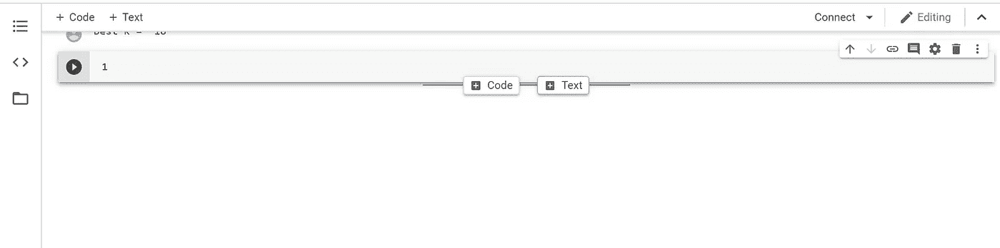

# 在 Google Colab 上传图片的两步指南！

> 原文：<https://towardsdatascience.com/the-2-step-guide-to-upload-images-in-google-colab-b51348e882e4?source=collection_archive---------0----------------------->

## 在这个简短的教程中，我们将学习如何从您的磁盘上传到 Google 协同实验室。

很多时候，除了我们的代码和文本之外，我们还想在 Google Colab 中上传一张图片，以包含数学推导或方程。在做我的作业时，我发现网上没有一个有效的来源可以找到答案。因此，我决定与你们分享做同样事情的最简单的方法。

**第一步:**将图片上传到 google drive &复制可分享的链接。

首先，打开 google drive &将图片上传到硬盘上。

选择上传的图片，点击右键，获得一个可共享的链接&复制它。

**第二步:**上传到 Google Colab

打开谷歌 Colab 笔记本&在你想包含图片的地方添加文本块。

下面给出了包含图像的通用代码。将之前复制的图片的共享链接粘贴到圆括号中。

粘贴链接后，替换***‘打开？’*** 同***‘UC？’***

按“Shift+Enter”

你有它！我们只需两步就能在 Google Colab 中包含一张图片。

如果你觉得这篇文章有用，请为它鼓掌，它会有很大的帮助！！

关注我 [**中**](https://medium.com/@agastidukare) 获取更多此类教程&文章。

如果你愿意，请在 [**LinkedIn**](https://www.linkedin.com/in/agastidukare/) 上联系我。

如果你知道其他方法，请告诉我。谢谢大家！