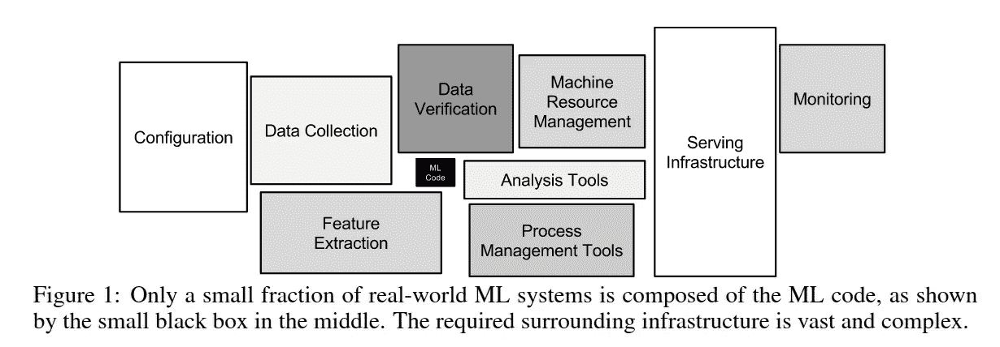
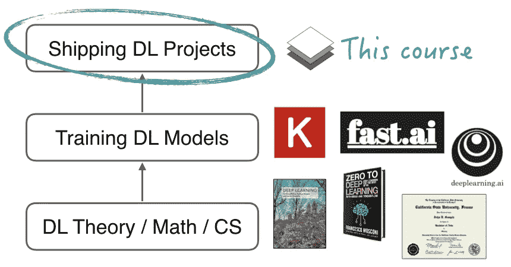
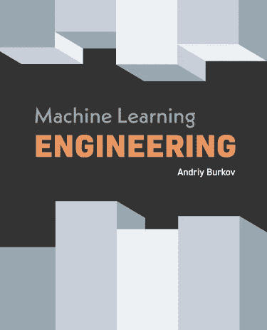

# 学习 MLOps 的 3 个最佳免费在线资源

> 原文：<https://towardsdatascience.com/the-3-best-free-online-resources-to-learn-mlops-54816904f485?source=collection_archive---------12----------------------->

由 [Unsplash](https://unsplash.com?utm_source=medium&utm_medium=referral) 上的 [chuttersnap](https://unsplash.com/@chuttersnap?utm_source=medium&utm_medium=referral) 拍摄

## 如何开始学习需求最高的数据科学技能之一

如果你参加一个普通的机器学习或数据科学课程，你可能只会听到算法。有些更实用，教你如何使用某些框架和训练模型，但大多数不会超出这个范围。

然而，这只是整个机器学习管道中的一小部分。作为一名工程师或数据科学家，你的任务很少以方法开发开始和结束。更确切地说，大多数时间花在服务于基础设施管理的*数据工程*和*模型上。*

机器学习系统的结构。来源:[机器学习系统中隐藏的技术债务](https://papers.nips.cc/paper/5656-hidden-technical-debt-in-machine-learning-systems.pdf)，D. Sculley 等人。

随着专业人士社区很快意识到这一点，越来越多的努力被用于在整个生命周期中管理机器学习操作。因此，用 DevOps 来类比，MLOps 的领域已经慢慢出现了。

在一个技术领域的发展过程中，其可达性经历了三个主要阶段。首先，在开始时，如果你不在努力的最前线，知识是不容易获得的。第二，编写第一批教科书和开设第一批课程的地方，但最佳做法仍然不明确，信息分散在几个地方。最后，当一个领域成为标准课程的一部分时，它就达到了一定的成熟度。深度学习和机器学习已经有了。

然而，MLOps 仍处于第二阶段。有几个很好的学习资源，但是要找到和过滤它们需要相当长的时间。这篇文章旨在为你做这项工作:我们将看看学习 MLOps 基础知识的三个最好的地方。

我们开始吧！

# 1.全栈深度学习课程

最初在伯克利的新兵训练营教授的[全栈深度学习课程](https://course.fullstackdeeplearning.com/)已经成为对机器学习更实用方面最全面的介绍之一。

最近，他们将整个系列讲座和专题一起放在了网上

来源:[全栈深度学习课程](https://course.fullstackdeeplearning.com/)

他们的课程不是理论和模型培训，而是包含以下讲座:

1.  **建立机器学习项目**
2.  **基础设施和工具**
3.  **数据管理**
4.  **机器学习团队**
5.  **培训和调试**
6.  **测试和部署**

总的来说，这是我认为对该领域最好的介绍。所教授的内容是广度而非深度，但最终，你会意识到这是一个多么广阔的领域，你有多少是不知道的。

# 2.安德烈·布尔科夫的机器学习工程

[安德烈·布尔科夫的机器学习工程](https://www.mlebook.com/)

[机器学习工程书籍](https://www.mlebook.com/)由[安德烈·布尔科夫](https://github.com/aburkov)撰写，完美补充了全栈深度学习课程。这本书本身是根据“先阅读，后购买”的原则发行的，这意味着如果它为你提供了价值，你可以通过购买来支持作者。

这本书没有进入 MLOps 的工具包，而是提供了更多的*“实践理论”*方法，为您提供了机器学习问题的问题、疑问和最佳实践的概述。

如果你感兴趣，你应该看看《T21》这本 100 页的机器学习书籍，这是同一作者写的一本更注重理论的书。

# 3.令人敬畏的 MLOps 和生产机器学习 GitHub 列表

也许你以前遇到过这个概念，但是如果这是第一次，那么 [Awesome list](https://github.com/sindresorhus/awesome) 是一个主题管理的资源目录，以只包含一个 README 文件的 GitHub 存储库的形式托管。

在我们的例子中，两个非常有用的列表是 [Awesome MLOps](https://github.com/visenger/awesome-mlops) 和[Awesome Production Machine Learning](https://github.com/EthicalML/awesome-production-machine-learning)。前者侧重于学习资源，后者则通过强调工具来补充。

当您已经对 MLOps 字段有了一个全面的了解，并且希望专攻给定的子域(如模型服务和监控)时，这些列表非常有用。

正如你已经看到的，在整个生命周期中管理机器学习项目是非常复杂的。然而，有了这些知识，你就能准备好应对许多挑战。所以，去学牛逼的东西吧:)

如果这些资源对你来说还不够，还有很多其他的。查看 neptune.ai 的这篇文章，在这里你可以找到大量有用的建议！

[***如果你喜欢把机器学习概念拆开，理解是什么让它们运转，我们有很多共同点。看看我的博客，我经常在那里发表这样的技术文章！***](https://www.tivadardanka.com/blog)