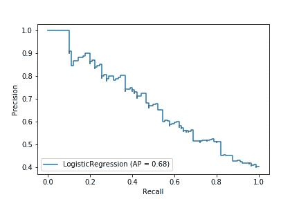

# 3 个最重要的基本分类指标

> 原文：<https://towardsdatascience.com/the-3-most-important-basic-classification-metrics-3368dd425f74?source=collection_archive---------20----------------------->

## 超出准确度

这是帮助您理解、使用和记住七个最常见的分类标准的系列文章中的第二篇。

在数据科学和相关领域，人们认为从业者理解准确性和混淆矩阵。如果你没有，一定要看看我之前的文章[这里](/classification-metrics-everyone-should-know-b67fd0044c0c)。它应该有助于驱散迷雾。☁️

在本文中，我们将深入探讨每个数据科学家和统计学家都应该知道的三个最重要的基本分类指标。🚀


三瓶津宁。资料来源:pixabay.com

我将我们将要探索的三个指标称为*基本* *指标*，因为每一个指标都由混淆矩阵的一个象限除以该象限再加上另一个象限组成。

当有两种可能的结果时，我们关注二元分类的情况。

我们开始吧！🚀

# 召回率(又名灵敏度，真阳性率，检测概率，命中率，等等！)

最常见的基本指标通常被称为*回忆*或*灵敏度。*它更具描述性的名字是 t *rue 阳性率(TPR)。*我称之为*召回*。

当你真的想正确预测真实类中的案例时，回忆是很重要的。例如，如果你有一种危险形式的癌症的测试，你真的希望这种测试能很好地检测出所有人实际患有癌症的情况。所以你真的很在乎回忆。

召回率的计算方法是将真阳性除以真阳性加上假阴性:

*召回= TP / (TP + FN)*

换句话说，在所有真实案例中，你的模型预测正确的比例是多少？

以下是我们的模型预测网站访问者是否会在 Jeff 的 Awesome Hawaiian Shirt 商店购买衬衫的结果。🌺👕

```
 Predicted Positive    Predicted Negative
Actual Positive          80  (TP)            20 (FN)
Actual Negative          50  (FP)            50 (TN)
```

使用我们的混淆矩阵示例，什么是回忆？

80/(80 + 20) = 80%

该模型正确预测了五分之四的销售额。听起来不错！😀我们可以将我们的模型的召回率与另一个模型的召回率进行比较，以帮助我们选择要用于预测的模型。

最佳召回率是 1，最差召回率是 0。scikit-learn 函数名为**[*recall _ score*](https://scikit-learn.org/stable/modules/generated/sklearn.metrics.recall_score.html)*。***

**对于回忆真的很重要的情况，我们可以做些别的事情来正确预测更多的真实情况:我们可以改变我们的*决策阈值*。**

****

**三津宁视角的转变:来源:pixabay.com**

## **决策阈值**

**默认情况下，scikit-learn 分类模型的决策阈值设置为. 5。这意味着，如果模型认为某个观察值有 50%或更大的概率成为正类的成员，则该观察值被预测为正类的成员。**

**如果我们非常关心召回，我们可以降低我们的决策阈值，以试图捕捉更多的实际阳性病例。例如，您可能希望模型以 30%或更高的概率预测每个观察值为真。**

**目前在 scikit-learn 中还没有快速的方法来做到这一点。[这个堆栈溢出答案](https://stackoverflow.com/a/31417912/4590385)解释了你如何用一个定制的*预测*方法来获得结果。(修改 2020-05-06 0 帽子尖给[凯文·马卡姆](https://medium.com/u/a9e4103439ec?source=post_page-----3368dd425f74--------------------------------))**

**这一变化可能会将一些假阴性转化为真阳性。耶！🎉然而，这个模型也会把一些真阴性变成假阳性。嘘！😢**

**毕竟，通过预测每个观察都是积极的，你可以得到完美的 100%回忆。但这通常不是一个好计划。**

**当误报的代价很高时，你要注意它们。您需要一个度量标准来捕捉您的模型区分真阳性和假阳性的能力。你需要注意*精度*。**

****

**没错。资料来源:pixabay.com**

# **精确**

**精度是相对于所有肯定预测，有多少肯定预测是正确的比率。它回答了这个问题**

****正面预测的正确率是多少？****

***精度= TP / (TP + FP)***

**我通过关注字母 *p.* 的头韵来精确记忆**

*****P*** *精度*是所有的*真值* ***P*** *正数*除以所有的 ***P*** *预测值* ***P*** *正数。***

**这又是夏威夷衬衫销售混淆矩阵:**

```
 Predicted Positive    Predicted Negative
Actual Positive            80 (TP)             20 (FN)
Actual Negative            50 (FP)             50 (TN)
```

**精度分数是多少？**

**80/(80+50) = 61.5%**

**scikit-learn 的度量是**[*precision _ score*](https://scikit-learn.org/stable/modules/generated/sklearn.metrics.precision_score.html)*。*语法类似于 recall 的。****

```
**precision_score(y_test, predictions)**
```

****同样，最佳值是 1 (100%)，最差值是 0。****

****人们经常根据精确度与回忆的关系来讨论精确度。事实上，scikit-learn 中有一个*plot _ precision _ recall _ curve*函数，我们可以使用它来可视化精度和召回之间的权衡。****

****以下是使用一些大型数据集在逻辑回归模型上绘制精确召回曲线的结果:****

********

*****AP* 代表*平均精度，*这是精度-召回曲线下的区域。越高越好，最大可能值为 1。****

****绘制该图的代码是:****

```
**plot_precision_recall_curve(lr, X_test, y_test);**
```

****该图显示了不同决策阈值下的精确度和召回率。请注意，查全率随着精度的下降而上升。📉****

****如果我们将决策阈值设置得更低，我们将沿着曲线向右移动。更多的观察将被归类为阳性类，我们将有希望捕捉到更多真正的阳性病例。召回会上去。😀****

****然而，我们也会有更多的误报。这将使精度的分母变大。结果会降低精度。☹️****

****我们愿意容忍多少假阳性取决于假阳性的成本相对于真阳性的成本有多大。这是平衡之举！****

****有时我们关心我们的模型对实际负面因素的预测程度。让我们来看看这种情况的衡量标准。****

********

****如果你需要直升机救援，这是否定的。资料来源:pixabay.com****

# ****特异性(真阴性率)****

****特异性也被称为*真阴性率* (TNR)。它回答了这个问题:****

******我的模型捕捉负面案例的能力如何？******

****这是特异性的公式:****

*****特异性= TN / (TN + FP)*****

****请注意，特异性只与实际的阴性情况有关。****

****这是夏威夷衬衫销售混乱矩阵。****

```
 **Predicted Positive    Predicted Negative
Actual Positive            80 (TP)             20 (FN)
Actual Negative            50 (FP)             50 (TN)**
```

****我们模型的特殊性是什么？****

****50 / (50 + 50) = 50%****

****特异性可以从 0 到 1，所以 50%不是很大。🙁该模型没有很好地正确预测何时有人不会购买。****

****当正确预测实际的负面影响很重要时，特异性是一个很好的指标。例如，如果对一种疾病的治疗是危险的，你需要高度的特异性。👍****

****特异性通常与敏感性一起讨论。请记住，灵敏度的名称是*，回想一下*和*真阳性率*。****

****Scikit-learn 没有名为*特异性*的内置函数。您可以从混淆矩阵中创建四个结果变量，并按如下方式计算特异性:****

```
**import numpy as np
from sklearn.metrics import confusion_matrixtn, fp, fn, tp = confusion_matrix(y_test, predictions).ravel()
tn / (tn + fp)**
```

****或者，如果你的负类为零，你可以使用 *recall_score* 和 pass *pos_label=0* 。😉****

****特异性是你的工具带中需要的最后一个基本分类标准。🔧****

# ****概述****

****你已经学会了回忆、精确和具体。请记住，回忆也被称为敏感度或真实阳性率。特异性也称为真阴性率。****

****有了准确性、回忆性、精确性和特异性，您就有了需要了解的基本分类术语！****

****我希望这篇关于基本分类标准的介绍对您有所帮助。如果你有，请在你最喜欢的社交媒体上分享，这样其他人也可以找到它。😀****

****在本系列的最后一篇文章中，我们将探讨三个最重要的复合指标。它们稍微复杂一点，但是它们在一个数字中传达了很多信息。🚀****

****我撰写关于 [Python](https://memorablepython.com) 、 [SQL](https://memorablesql.com) 、 [Docker](https://memorabledocker.com) 以及其他技术主题的文章。如果您对此感兴趣，请注册我的[数据科学资源邮件列表](https://dataawesome.com)，并在此阅读更多[。👍](https://medium.com/@jeffhale)****

****[](https://dataawesome.com)************

****很多山峰。资料来源:pixabay.com****

****快乐平衡！⚖️****