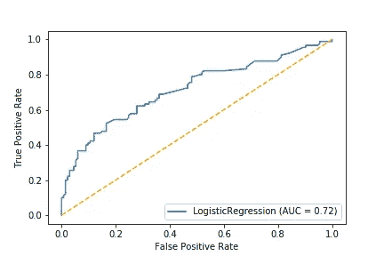

# 3 个最重要的综合分类指标

> 原文：<https://towardsdatascience.com/the-3-most-important-composite-classification-metrics-b1f2d886dc7b?source=collection_archive---------14----------------------->

复合分类度量帮助您和其他决策者快速评估模型的质量。它们通常比简单的指标(如召回率、精确度或特异性)提供更有价值的信息。

数据科学家和统计学家应该了解最常见的复合分类指标。本指南将帮助你保持直线。🎉


花是一种合成物。资料来源:pixabay.com

这是帮助您理解、使用和记住七个最流行的分类标准的系列文章中的第三篇，也是最后一篇。在本系列的第一篇文章中，我解释了混淆矩阵和最常见的评估术语:*准确性*。在[的第二篇文章](/the-3-most-important-basic-classification-metrics-3368dd425f74)中，我强调了三个最常见的基本指标:*召回* ( *灵敏度*)、*精度*和*特异性*。如果你还没有完全理解这些术语，我建议你在继续之前多花些时间了解它们。👍

本文中的每个复合指标都是从基本指标构建的。让我们来看看一些漂亮的复合指标！

# 平衡精度

正如您在本系列的第一篇文章[中看到的，当结果类别不平衡时，*准确性*可能会产生误导。](/classification-metrics-everyone-should-know-b67fd0044c0c)

*平衡精度*是用于不平衡数据的更好指标。它考虑了积极和消极的结果类别，并且不会因不平衡的数据而产生误导。

公式如下:

***平衡精度****=(((TP/(TP+FN)+(TN/(TN+FP)))/2*

回想一下[上一篇文章](/the-3-most-important-basic-classification-metrics-3368dd425f74)，哪个度量是 *TP/(TP+FN)* 的公式？没错，*召回*——也叫*灵敏度*和*真阳性率*！

并且哪个度量是 *TN/(TN+FP)* 的公式？没错，*特异性，*又称*真阴性率*！

因此，这里有一种更简单的方法来编写平衡精度公式:

***平衡准确度*** *=(灵敏度+特异性)/ 2*

平衡的准确性只是敏感性和特异性的平均值。当它们同等重要时使用是很棒的。☝️

让我们继续本系列前几篇文章中的一个例子。以下是我们的模型预测网站访问者是否会在 Jeff 的 Awesome Hawaiian Shirt 商店购买衬衫的结果。🌺👕

```
 Predicted Positive    Predicted Negative
Actual Positive          80  (TP)            20 (FN)
Actual Negative          50  (FP)            50 (TN)
```

我们的灵敏度是 0.8，特异性是 0.5。平均这些分数以获得我们平衡的准确度:

(.8 + .5) / 2 = .65

在这种情况下，我们的准确率也是 65%:(80+50)/200。

当结果类的大小相同时，精确度和平衡精确度是相同的！😀


岩石平衡:来源:pixabay.com

现在让我们看看不平衡的数据会发生什么。让我们看看我们以前的疾病检测的例子，阴性病例多于阳性病例。

```
 Predicted Positive    Predicted Negative
Actual Positive           1                      8
Actual Negative           2                    989
```

我们的准确率是 99%:(990/1000)。

但是我们的平衡准确率是 55.5%！

(((1/(1 + 8)) + ( 989/(2 + 989))) / 2 = 55.5%

😲

您认为 55.5%的平衡准确度比 99.0%的准确度更能体现模型的性能吗？

## 平衡精度底线

当您有不平衡的数据，并且在正确预测负类和正类之间没有区别时，平衡精度是一个很好的衡量标准。😀

scikit-learn 函数名为**[*balanced _ accuracy _ score*](https://scikit-learn.org/stable/modules/generated/sklearn.metrics.balanced_accuracy_score.html)*。***

**另一个更常见的综合指标是 F1 分数。**

****

**公式 1:资料来源:pixabay.com**

# **F1 分数**

***F1* *得分*是精度和*召回的调和平均值。*如果您关心精确度和回忆大致相同的数量，F1 分数是一个很好的指标。请注意，尽管您看到的所有指标后面都可以跟有单词 *score* F1，但它始终是。☝️**

**请记住，回忆也被称为*敏感度*或*真阳性率。***

**以下是 F1 得分的公式，分别使用 *P* 和 *R* 表示精确度和召回率:**

*****F1****= 2 *(P * R)/(P+R)***

**让我们看看我们所看的两个例子在 F1 分数方面是如何比较的。在我们的夏威夷衬衫的例子中，我们的模型的召回率是 80%，精确度是 61.5%**

**该车型的 F1 分数为:**

**2 * (.615 * .80) / (.615 + .80) = .695**

**听起来没那么糟糕。🙂**

**让我们计算疾病检测示例的 F1。该模型的召回率为 11.1%，准确率为 33.3%。**

**该型号的 F1 为:**

**2 * (.111 * .333) / (.111 + .333) = .167**

**那不是很热。☹**

****

**比我们模特的 F1 分数高多了。资料来源:pixabay.com**

**F1 评分很受欢迎，因为它将两个通常非常重要的指标(召回率和精确度)结合成一个指标。如果其中任何一个低，F1 分数也会相当低。**

**scikit-learn 函数名为[*f1 _ score*](https://scikit-learn.org/stable/modules/generated/sklearn.metrics.f1_score.html)*。*让我们看看最后一个流行的复合指标，ROC AUC。**

# **ROC AUC**

***ROC AUC* 代表*受试者操作者特征——曲线下面积*。它是*真阳性率*对*假阳性率*曲线下的面积。请记住，真正的正比率也有名称*回忆*和*灵敏度。***

**误报率不是我们在本系列中讨论的一个指标。**

## **假阳性率**

***误报率(FPR)* 是一个额外指标。👍它是通过将*假阳性*除以*所有实际阴性来计算的。***

***FPR = (FP / N)***

**假阳性率是我们看到的唯一一个分数越低越好的指标。⬇️=😀**

**FPR 很少单独使用。这很重要，因为它是进入 ROC AUC 的两个指标之一。**

**为了可视化 ROC 曲线，可以使用 sklearn 的[*plot _ ROC _ curve*](https://scikit-learn.org/stable/modules/generated/sklearn.metrics.plot_roc_curve.html)来绘制。函数签名与您在本系列第二篇文章中看到的*plot _ precision _ recall _ curve*函数相匹配。**

**`plot_roc_curve(estimator, X_test, y_test)`**

**这里有一个 ROC 曲线的例子:**

****

**蓝色是模特的表现。橙色是基线**

**ROC 曲线是一个流行的图，可以帮助您决定在哪里设置决策阈值，以便您可以优化其他指标。**

**AUC(曲线下面积)的范围可以从 0 . 5 到 1。分数越高越好。得分为 0.5 可不好，在上图中用橙色线表示。☹️**

**您希望模型的曲线尽可能靠近左上角。你想要高 TPR 和低 FPR。🙂**

**我们的模型做得不错，但还有改进的余地。😐**

**ROC AUC 不是您想要手动计算的指标。✍幸运的是，scikit-learn 函数[*roc _ AUC _ score*](https://scikit-learn.org/stable/modules/generated/sklearn.metrics.roc_auc_score.html)*可以为您完成这项工作*。*注意，你需要将**预测概率**作为第二个参数传递，而不是预测。☝️***

```
*roc_auc_score(y_test, y_predicted_probabilities)*
```

***当类别相对平衡时，ROC AUC 是一个很好的汇总统计。然而，不平衡的数据可能会误导。关于一个好的讨论，请看这个[机器学习掌握](https://machinelearningmastery.com/roc-curves-and-precision-recall-curves-for-classification-in-python/)帖子。***

******

***平衡行为。资料来源:pixabay.com***

# ***摘要***

***在本文中，您了解了平衡准确性、F1 评分和 ROC AUC。***

## ***概述***

***以下是您在本系列中看到的所有评估指标的公式:***

*   *****精度** = *(TP + TN) /全部****
*   *****回忆(灵敏度，TPR)** = *TP / (TP + FN)****
*   *****精度** = *TP / (TP + FP)****
*   *****特异性(TNR)** = *TN / (TN + FP)****
*   *****平衡准确度** = *(灵敏度+特异性)/ 2****
*   *****F1** **得分** = *2 *(精度*召回)/(精度+召回)****
*   *****ROC AUC** = *下面积**TPR vs FPR****

***ROC AUC 代表*曲线下的受试者工作特征面积。*不代表*接收机工作曲线*。👍***

## ***结果摘要***

***以下是夏威夷衬衫示例的结果:***

*   ***准确度= 65%***
*   ***召回率(敏感度，TPR) = 80%***
*   ***精度= 61.5%***
*   ***特异性(TNR) = 50%***
*   ***平衡精度= 65%***
*   ***F1 得分= .695***

***以下是疾病检测示例的结果:***

*   ***准确率= 99%***
*   ***召回率(敏感度，TPR) = 11.1%***
*   ***精度= 33.3%***
*   ***特异性(TNR) = 99.8%***
*   ***平衡精度= 55.5%***
*   ***F1 得分= .167***

***正如我们两个例子的结果所示，对于不平衡的数据，不同的度量描绘了一幅非常不同的画面。***

******

***油漆。资料来源:pixabay.com***

## ***包装***

***还有很多很多其他的分类标准，但是掌握这七个应该会让你成为专家！😀***

***您看到的七个指标是帮助您选择分类模型和这些模型的决策阈值的工具。您的工作是在选择最终模型和设置决策阈值时明智地使用这些指标。***

***我应该提到另一种评估分类模型的常用方法。您可以为每个假阴性和假阳性的成本附加一个美元值或效用分数。您可以使用这些预期成本来确定使用哪个模型以及在哪里设置决策阈值。***

***我希望这篇分类标准的介绍对您有所帮助。如果你有，请在你最喜欢的社交媒体上分享，这样其他人也可以找到它。😀***

***我写关于 [Python](https://memorablepython.com) 、 [SQL](https://memorablesql.com) 、 [Docker](https://memorabledocker.com) 和其他技术主题的文章。如果你对此感兴趣，请注册我的数据科学资源邮件列表，点击这里阅读更多信息，帮助你提高技能[。👍](https://medium.com/@jeffhale)***

***[](https://dataawesome.com)***

***选择愉快！😀***