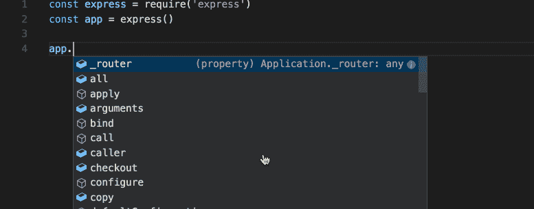
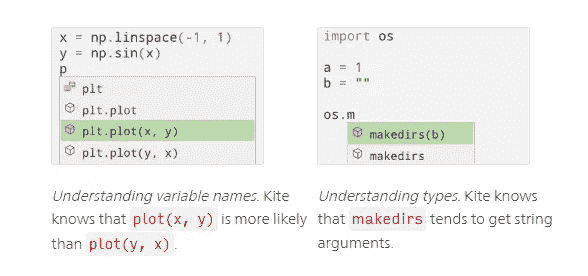
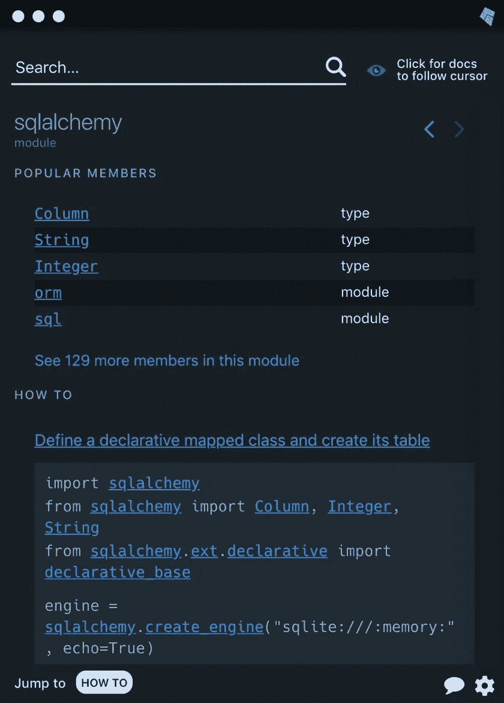
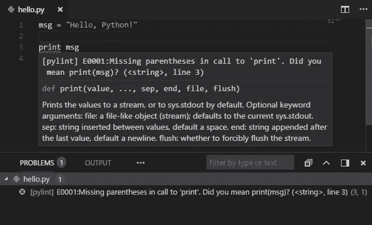

# Python 的 3 个疯狂的秘密武器

> 原文：<https://towardsdatascience.com/the-3-secret-weapons-that-changed-my-python-editor-forever-c99f7b2e0084?source=collection_archive---------0----------------------->

## 我不知道没有他们我是如何生活的

我写 Python 已经 5 年多了，我的工具集一直在变小，而不是变大。许多工具都是不必要或无用的，其中一些你会简单地放弃。

这三个是我坚持了很长时间的，和其他的不一样，我只是越来越多地使用它们。


[吉米·张](https://unsplash.com/@photohunter?utm_source=medium&utm_medium=referral)在 [Unsplash](https://unsplash.com?utm_source=medium&utm_medium=referral) 上的照片

# 秘密武器#1:用 Kite 写得更快，谷歌更少

大多数代码编辑器都有类似如下的自动完成功能:



…它使用语言(有时是库)文档来提供函数名和参数等信息。

当然这没问题，但是如果你的编辑器可以浏览 GitHub 多年的数据并自动完成不仅仅是函数名，而是整行代码呢？

这只是你应该使用 Kite 的三个理由中的第一个。

## 原因 1:代码行完成

Kite 会查看您的代码库和变量、在线常用的参数名称、文档，然后给出如下超级上下文建议:



从风筝文件

上面的例子显示了 Kite 如何预测你将使用哪些变量，即使它们被命名为一般名称(如`b` ) 或使用普通名称(如`x`或`y`)。

> …我们花了大约 50 个工程师年的时间对 Github 上的所有代码进行语义索引，构建统计类型推理和丰富的统计模型，以非常深入的方式使用这些语义信息。— [亚当·史密斯](https://news.ycombinator.com/item?id=19019135)，凯特的创始人兼首席执行官

这里有一个[实时演示视频](https://www.youtube.com/watch?v=WQUjOgxeSA0)，或者如果你愿意，[去沙盒里玩](https://kite.com/blog/product/launching-line-of-code-completions-going-cloudless-and-17-million-in-funding/#sandbox)。

## 原因 2:文件的副驾驶



如果你从未被告知要做 RTFM，那么你可能没有犯过我犯过的错误。

无论如何，你都应该在烦扰一个高级开发人员或者查看堆栈溢出答案之前阅读文档。

风筝副驾驶使文件愚蠢-容易。它与你的编辑器一起运行，并实时显示你用光标高亮显示的任何对象/功能等的文档。

亲爱的第一份工作的高级开发人员:对不起。现在我真的没有借口不首先在文件中寻找答案。😉

## 原因 3:在本地私人经营

最重要的是，它的[构建为在本地运行](https://kite.com/blog/product/launching-line-of-code-completions-going-cloudless-and-17-million-in-funding/)，因此你可以非常快速地获得推荐，它离线工作，你的代码永远不会被发送到云端。

这对于互联网连接不好的人和在封闭源代码库中工作的人来说非常重要。

## 结果

我已经使用 Kite 很多年了，它越来越好了。拥有超过 1700 万美元的投资，这家公司哪儿也不去，而这个工具，出于某种愚蠢的原因，*i̶s̶̶c̶o̶m̶p̶l̶e̶t̶e̶l̶y̶̶f̶r̶e̶e̶.编辑:我提到的第一个功能现在是 Kite Pro 的一部分，其他的仍然是免费的。有一个很棒的 [*ROI 计算器*](https://kite.com/pro/#roicalculator) *用于* [*说服你的老板*](https://kite.com/pro/convince-your-boss/) *给你买。**

*你所要做的就是为你的编辑器下载 Kite 插件，或者下载 copilot，它可以为你安装插件。去得到它！*

# *秘密武器#2:用 MyPy 和静态类型稳定你的代码*

*Python 是*动态类型的*，一个过于简单的解释是，你可以在任何时候让任何变量成为任何数据类型(字符串、整数等)。*

```
*# These two variable types are declared the exact same way
# Python figures out the data type on it's own, dynamically# string
var_name = "string here"# integer
var_name = 1234*
```

*相反的是静态类型的语言，其中变量必须有一个特定的数据类型，并且总是遵守它。*

```
*# Many languages require the data type to be declared too# string
str var_name = "string here"# integer
int var_name = 1234*
```

## *动态类型的利与弊*

*动态类型的优点是你可以在写作时偷懒，这样可以减少代码混乱。*

*尽管缺点很多，也很大:*

*   *在开发周期的后期，你通常会遇到错误*
*   *代码性能更差，因为 Python 不断地计算类型*
*   *函数不太稳定，因为它们的输入和输出可以在没有警告的情况下改变数据类型*
*   *交付代码更加不稳定，因为其他人可能不知道您的变量是什么数据类型或者可能成为什么数据类型*

## *Python 中的静态类型*

*从 Python 3.5 开始，您可以本机使用静态类型了！此外，mypy 是一个模块，可以让您快速轻松地扫描您的代码库，查找静态类型违规。*

*这只是一个如何使用它的例子:*

```
*# Declaring a function using normal dynamic typing, without mypy
def iter_primes():
    # code here that returns an iterator of ints# Declaring the same function with static typing
from typing import Iteratordef iter_primes() -> Iterator[int]:
    # code here that returns an iterator of ints*
```

*现在你可以用`pip install mypy`安装 mypy 进行扫描，用`mypy [path to python file]`命令扫描你的代码。这将通知您任何数据类型与您指定的静态类型不匹配的地方。*

*对于静态示例，我们指定函数返回整数的迭代器。这一简单的更改通过强制执行一致的输出，使函数更加经得起未来的考验。*

*其他开发人员只需查看声明就可以知道输出的数据类型，而且不像只使用文档，如果不遵守声明，您的代码就会出错。*

*这是一个取自[的超级简单的例子，这里的例子](http://www.mypy-lang.org/examples.html)，如果仍然没有意义，去检查一下。*

## *结果*

*很难列出静态类型可以让你避免未来痛苦的所有方式，但是 mypy docs】有一个很棒的 FAQ ，里面有更多的优点和缺点。*

*如果你在一个稳定为王的生产代码库中工作，绝对[试试 mypy](https://mypy.readthedocs.io/en/stable/getting_started.html) 和[类型模块](https://docs.python.org/3/library/typing.html?ref=pbadeer)。*

# *秘密武器#3:用 Sonarlint 更快地发现错误并编写更简单的函数*

*现在每个编辑器都有某种内置的错误检查或“过磅”功能。它查看代码，通常不运行代码，并试图猜测可能出错的地方。这叫做*静态*代码分析。*

**

*VS 代码中的默认 Python Linter*

**动态*代码分析实际上试图运行/编译你的部分代码，看看它是否正常工作，但它是在后台自动完成的。代替猜测，它实际上知道它是否能工作，以及确切的错误是什么。*

*SonarLint 是最好的动态代码分析，还有更多优点。这些特点是我喜欢它的原因:*

## *注释或未调用的代码*

*我犯了留下打印语句、注释掉的代码和未使用的函数遍布我的代码库的错误。这样会警告我，让我很难忘记，告诉我在哪里，很容易找到。*

## *安全风险*

*一个包含不断更新的安全风险的[大型数据库](https://rules.sonarsource.com/python/type/Vulnerability)会实时出现在你的代码库中，警告你可能暴露的任何已知漏洞。*

*安全风险非常小众，不可能背下来，所以大家要用*的东西*来追踪这些。SonarLint 是一个很好的起点。*

## *从未执行的代码*

*与未调用的代码略有不同，如果我创建了任何结果不可能达到的评估，这将警告我。这些很难发现，可能会导致几个小时的调试，所以这是我最喜欢的警告之一。*

*这里有一个例子:*

```
*a = Noneif a == None or not a or a:
    this_will_always_get_called()
else:
    # sonarlint will warn you about this line never being executed
    this_will_never_get_called()*
```

## *认知复杂性*

*这是一个有趣的话题，我可以写一整篇文章，事实上，有一个关于它的[整篇白皮书](https://www.sonarsource.com/resources/white-papers/cognitive-complexity.html)。*

*简单的解释是，他们创造了一个数学公式，可以评估代码阅读/理解的难度。*

*它不仅非常有用，而且很容易理解。每次 SonarLint 要求我“降低认知复杂性”时，它都会附带一个对我打破的规则的简单解释，比如“太多嵌套的 if 语句”。*

## *结果*

*我发现这比基本的阻塞和林挺实践更有用，并且我确信它让我写出了对人类更友好的代码。[顺便问一下](https://www.python.org/dev/peps/pep-0020/)哪是蟒！*

*[SonarLint 是免费的，](https://www.sonarlint.org/)所以现在没有理由不去获取它并把它附在你的编辑器上。*

# *结论*

**如果您跳过了这里，只是一个快速的警告，除非您对这些功能有基本的了解，否则您可能无法正确使用它们。**

*以下是三种秘密武器的概述:*

1.  *用 [Kite Copilot 和编辑器插件](https://kite.com/)写得更快，谷歌更少*
2.  *用 [Mypy](http://www.mypy-lang.org/) 和[静态类型](https://docs.python.org/3/library/typing.html)稳定你的代码*
3.  *使用 [SonarLint 编辑器插件](https://www.sonarlint.org/)更快地发现错误并编写更简单的函数*

*我希望这些工具能很好地为您服务，我自己也非常喜欢它们。我确信我已经错过了一些其他难以置信的资源，所以一定要在评论中分享你不能没有的东西。*

**如果你从事数据科学工作，你可能会从我目前的热门文章中发现价值:**

*[](/please-stop-doing-these-5-things-in-pandas-9fbabea897aa) [## 请停止在熊猫身上做这 5 件事

### 这些错误非常普遍，而且非常容易纠正。

towardsdatascience.com](/please-stop-doing-these-5-things-in-pandas-9fbabea897aa)*