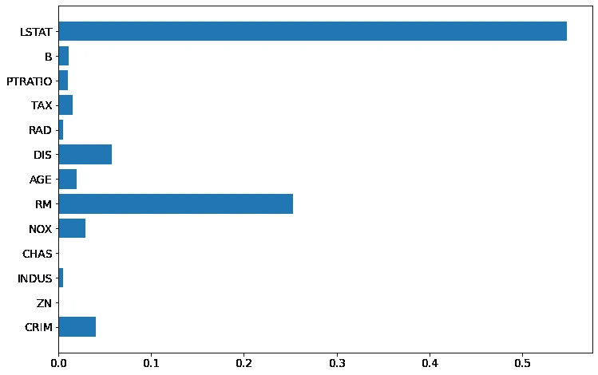
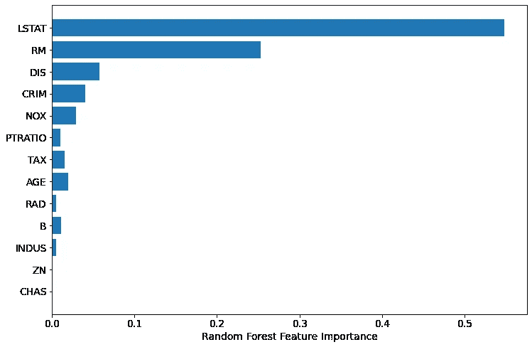
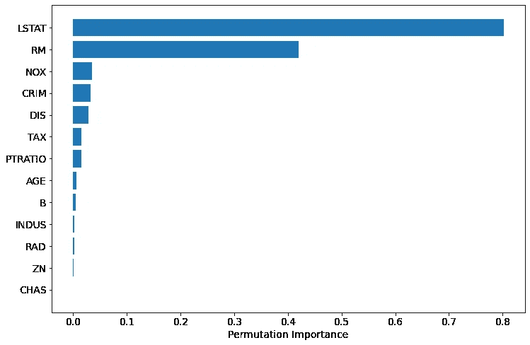
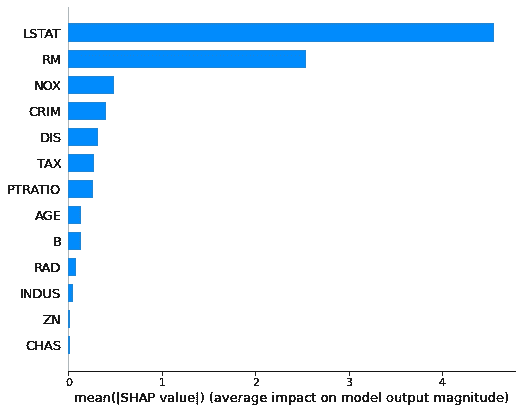
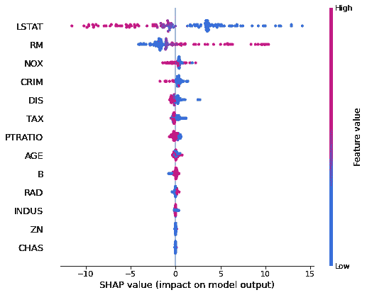
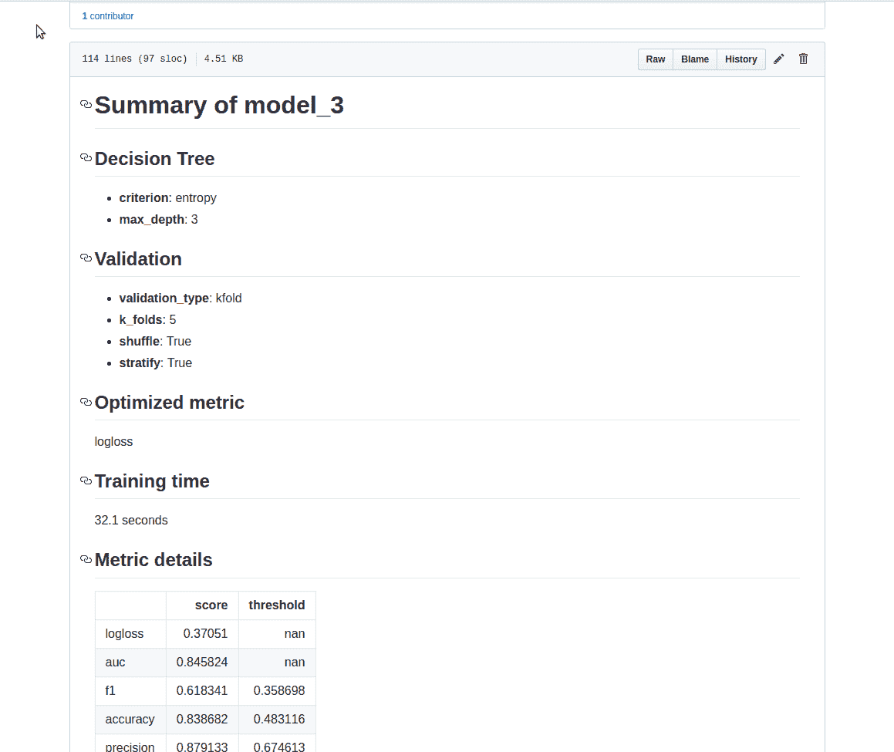

# 计算随机森林中特征重要性的三种方法

> 原文：<https://towardsdatascience.com/the-3-ways-to-compute-feature-importance-in-the-random-forest-96c86b49e6d4?source=collection_archive---------20----------------------->

特征重要性描述了哪些特征是相关的。它可以帮助更好地理解所解决的问题，有时还可以通过利用特征选择来改进模型。在这篇文章中，我将展示 3 种方法(带代码)来计算来自`scikit-learn`包(Python 中)的随机森林算法的特征重要性。

# 内置随机森林重要性

随机森林算法具有内置的要素重要性，可以通过两种方式计算:

*   **基尼系数**(或平均减少杂质)，由随机森林结构计算得出。让我们看看随机森林是如何构建的。这是一组决策树。每个决策树都是一组内部节点和叶子。在内部节点中，所选择的特征用于决定如何将数据集分成两个独立的集合，其中具有相似的响应。内部节点的特征是根据某种标准选择的，对于分类任务，该标准可以是基尼不纯或信息增益，对于回归，该标准是方差减少。我们可以测量每个特征如何减少分裂的杂质(具有最高减少的特征被选择用于内部节点)。对于每个特征，我们可以收集它平均如何减少杂质。森林中所有树的平均值是要素重要性的度量。该方法可在`[scikit-learn](https://scikit-learn.org/stable/modules/generated/sklearn.ensemble.RandomForestClassifier.html#sklearn.ensemble.RandomForestClassifier.feature_importances_)` [中实现](https://scikit-learn.org/stable/modules/generated/sklearn.ensemble.RandomForestClassifier.html#sklearn.ensemble.RandomForestClassifier.feature_importances_)的随机森林(对于分类器和回归器都适用)。值得一提的是，在这种方法中，我们应该查看计算出的重要性的相对值。这种方法最大的优点是计算速度快——所有需要的值都是在随机森林训练中计算出来的。该方法的缺点是倾向于选择(选择为重要的)高基数的数字特征和分类特征。此外，在相关特征的情况下，它可以选择其中一个特征，而忽略第二个特征的重要性(这可能导致错误的结论)。
*   **平均降低准确度** —是一种基于准确度平均降低来计算置换出袋(OOB)样本特征重要性的方法。这个方法没有在`scikit-learn`包中实现。与这种方法非常相似的是本文下面描述的基于排列的重要性。

我将展示如何使用`scikit-learn`包和波士顿数据集计算随机森林的特征重要性(房价回归任务)。

```
*# Let's load the packages*
**import** **numpy** **as** np
**import** **pandas** **as** pd
**from** **sklearn.datasets** **import** load_boston
**from** **sklearn.model_selection** **import** train_test_split
**from** **sklearn.ensemble** **import** RandomForestRegressor
**from** **sklearn.inspection** **import** permutation_importance
**import** **shap**
**from** **matplotlib** **import** pyplot **as** plt

plt.rcParams.update({'figure.figsize': (12.0, 8.0)})
plt.rcParams.update({'font.size': 14})
```

加载数据集并拆分用于训练和测试。

```
boston = load_boston()
X = pd.DataFrame(boston.data, columns=boston.feature_names)
y = boston.target
X_train, X_test, y_train, y_test = train_test_split(X, y, test_size=0.25, random_state=12)
```

用 100 棵决策树装配[随机森林回归器](https://scikit-learn.org/stable/modules/generated/sklearn.ensemble.RandomForestRegressor.html#sklearn.ensemble.RandomForestRegressor);

```
rf = RandomForestRegressor(n_estimators=100)
rf.fit(X_train, y_train)
```

要从随机森林模型中获得特征重要性，请使用`feature_importances_`参数:

```
rf.feature_importances_array([0.04054781, 0.00149293, 0.00576977, 0.00071805, 0.02944643,
       0.25261155, 0.01969354, 0.05781783, 0.0050257 , 0.01615872,
       0.01066154, 0.01185997, 0.54819617])
```

让我们画出重要性(图表比数值更容易理解)。

```
plt.barh(boston.feature_names, rf.feature_importances_)
```



为了有一个更好的图表，让我们对特征进行排序，并再次绘图:

```
sorted_idx = rf.feature_importances_.argsort()
plt.barh(boston.feature_names[sorted_idx], rf.feature_importances_[sorted_idx])
plt.xlabel("Random Forest Feature Importance")
```



# 基于排列的重要性

基于排列的重要性可用于克服用平均杂质减少计算的默认特征重要性的缺点。它在`scikit-learn`中作为`[permutation_importance](https://scikit-learn.org/stable/modules/generated/sklearn.inspection.permutation_importance.html#sklearn.inspection.permutation_importance)`方法实现。作为参数，它需要经过训练的模型(可以是与`scikit-learn` API 兼容的任何模型)和验证(测试数据)。这种方法将随机改变每个特征，并计算模型性能的变化。对性能影响最大的特性是最重要的特性。

置换重要性可以很容易地计算出来:

```
perm_importance = permutation_importance(rf, X_test, y_test)
```

绘制重要性图:

```
sorted_idx = perm_importance.importances_mean.argsort()
plt.barh(boston.feature_names[sorted_idx], perm_importance.importances_mean[sorted_idx])
plt.xlabel("Permutation Importance")
```



基于置换的重要性在计算上是昂贵的。基于排列的方法对于高度相关的特征可能有问题，它可以将它们报告为不重要。

# 根据 SHAP 值计算重要性

可以使用 [SHAP](https://github.com/slundberg/shap) 解释(它是模型不可知的)来计算随机森林的特征重要性。它使用博弈论中的 Shapley 值来估计每个特征对预测的贡献。它可以很容易地安装(`pip install shap`)和使用`scikit-learn`随机森林:

```
explainer = shap.TreeExplainer(rf)
shap_values = explainer.shap_values(X_test)
```

要将特征重要性绘制成水平条形图，我们需要使用`summary_plot`方法:

```
shap.summary_plot(shap_values, X_test, plot_type="bar")
```



特征重要性可以用更多细节来绘制，显示特征值:

```
shap.summary_plot(shap_values, X_test)
```



使用 SHAP 计算特征重要性的计算开销可能很大。然而，它可以提供更多的信息，如决策图或依赖图。

# 摘要

给出了计算`scikit-learn`随机森林的特征重要性的 3 种方法:

*   内置功能重要性
*   基于排列的重要性
*   用 SHAP 值计算

在我看来，检查所有方法并比较结果总是好的。我在 MLJAR 的 AutoML 开源包`[mljar-supervised](https://github.com/mljar/mljar-supervised)`中使用了基于排列和 SHAP 的方法。我使用它们是因为它们是模型不可知的，并且可以很好地与非来自`scikit-learn`的算法一起工作:Xgboost，神经网络(keras+tensorflow)，LigthGBM，CatBoost。

# 重要注意事项

*   模型越精确，计算出的重要性就越可信。
*   计算的重要性描述了特征对于机器学习模型有多重要。这是数据中要素重要性的近似值

由 mljar 监管的是一个开源的自动机器学习(AutoML) Python 包，可以处理表格数据。它旨在为数据科学家节省时间。它抽象了预处理数据、构建机器学习模型和执行超参数调整以找到最佳模型的通用方法。这不是一个黑匣子，因为你可以确切地看到 ML 管道是如何构建的(每个 ML 模型都有一个详细的降价报告)。



使用 mljar 监督的 AutoML 包生成的示例报告。

*原载于 2020 年 6 月 29 日*[](https://mljar.com/blog/feature-importance-in-random-forest/)**。**