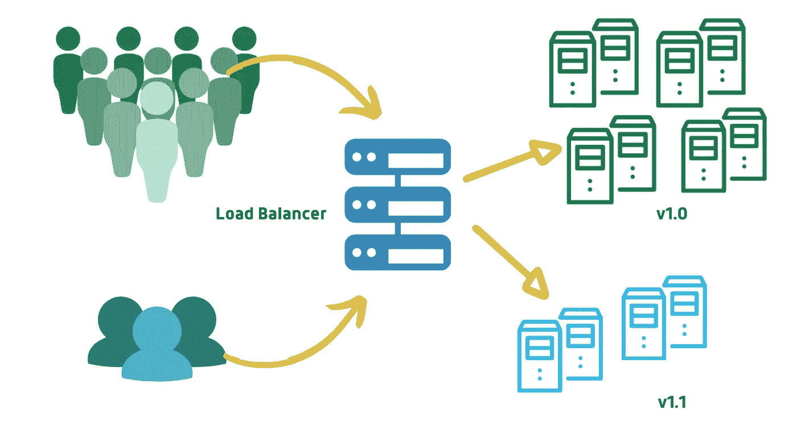

# 3D 宇宙:数据科学、开发和发展

> 原文：<https://towardsdatascience.com/the-3d-universe-data-science-devops-and-development-b6f81c02a0b2?source=collection_archive---------47----------------------->

## 数据科学，DevOps

## DevOps 成为数据科学领域独角兽的重要性。


使用 Canva 制作

数据科学不仅仅是数据收集、分析和建模。让模型可部署并便于与 DevOps 工程师沟通也是数据科学家的一项关键技能。作为 DevOps 实践者的数据科学家使他/她成为独角兽。

数据科学更多的是分析数据，而不是程序开发。为了开发模型或程序，我们使用统计学和机器学习从我们的数据中获得洞察力。另一方面，DevOps 基于软件工程和系统工程。它融合了许多敏捷软件方法论的思想。当我们将这些技术应用于数据科学时，它有助于我们记住数据科学与应用程序开发的相似之处和不同之处。


使用 Canva 设计

在数据科学领域，DevOps 的关键领域包括我们将如何创建模型，如何进行传递，如何以受保护的方式维护我们的模型，以及如何根据感兴趣的量来放大/缩小模型。本文将讨论如何从一个想法到生产，再到管理，开始开发一个机器学习模型。我们开始吧！

## 数据科学过程

数据科学的第一阶段从收集数据和处理数据开始，即分析数据、探索和执行深入分析，以及交流结果。


数据分析(使用 Canva)

*   可以通过构建脚本、使用 API 调用 Web 抓取以及通过许多数据源来收集数据——UCI 机器学习资源库、Kaggle 网站。此外，数据可以来自以日志文件形式存储的任何应用程序。我们使用电子表格、通常用于 web 和分析应用程序的 NoSQL 数据库、关系数据库和其他外部来源来组织数据。
*   收集数据后，我们需要处理数据——过滤缺失值、不必要的内容异常、提取并重新格式化以满足模型需求。此外，我们可能从几个站点/资源收集数据，在这种情况下，我们需要合并具有共同属性的数据(在确定相关属性之后)。最后用 R、Python、Spark、Pandas 构建一个数据框架&开始用数据做实验。
*   确定相关的变量并进行特征工程(从原始属性中获得附加特征)以提高模型性能。最后，需要根据数据类型以及需要完成的培训、测试和验证来选择算法。

## 数据科学模型的版本控制

现在假设一位数据科学家遵循了上述所有要求，并将其代码部署到生产中。它能完美地工作而没有任何问题吗？需求的数量可能会增加，您将无法管理已部署的服务。如果您的最终用户希望应用程序提供更多功能，该怎么办？您会再次开始训练模型、构建模型并进行部署吗？这是一个连续的循环，为什么我们不能将这个过程自动化呢？是的，我们可以通过持续集成来实现这一点。


GitHub 知识库(作者提供图片)

有时我们与涉及一个大团队的应用程序一起工作来开发一个产品，它也需要在一个连续的时期内以位和字节来开发。对于这样的应用程序，版本控制帮助我们跟踪模型的每一个版本，跟踪其他团队成员已经更新的变更，并且与合作者共享代码。GitHub 是一个代码库托管服务，使用 Git 版本控制系统。在这里，我们创建一个存储库，并像在本地机器上一样组织我们的项目目录。每当有一个 bug 修复或增强或添加一个功能时，我们的经理或负责人就会提出一个问题，并指派一些人来处理这个问题。现在，这些人开始解决这个问题，也就是说，在我们的例子中提高模型的性能，或者添加一些应用程序特性。

## 使用自动化工具测试和部署模型

测试对于确保应用程序不会导致任何失败是非常重要的，因为这可能会在未来或开发的后期花费我们一大笔钱。在数据科学的世界里，人们需要进行单元测试来检查代码的功能，然后评估模型的性能。


詹金斯管道(作者照片)

让我们举一个当前情况的实时例子，即 *COVID19，*假设您正在开发一个应用程序来跟踪您所在位置附近的冠状动脉患者。您已经做了所有的事情，训练并测试了模型，还验证了算法以确保它们和预期的一样准确。但是，这是否足以毫无困难地运行应用程序呢？不，因为这里的数据是动态变化的——(数据漂移)，因为我们每天在给定的地区可能没有相同数量的阳性病例。对此，什么是理想的解决方案？让生成的数据集遵循相同的预处理步骤，开发和部署模型。

这个繁琐的过程可以通过在 Jenkins(一个 CI 工具)上创建一个带有定义好的管道的作业来避免，如上图所示，所以您将在 Jenkins 上为模型创建一个管道，并要求它在您的数据集使用 API 调用更新时**构建、测试、验证和部署**。Jenkins 作业也可以定期触发，手动触发，或者当有人将更改推送到 GitHub 存储库时触发。

## 一些部署实践

人们可以遵循某些部署实践来以环境的形式管理整个过程。当我们在 DevOps 中谈论环境时，它意味着需要运行应用程序或服务的每个部分的基础设施的集合。

*   **部署到试运行** —试运行环境是我们的代码准备好被部署的地方，但是我们用它来执行质量保证和集成测试。这是我们的模型首次测试各种功能的地方，就像一个在线电子商务平台，它根据用户以前的订单和搜索结果推荐他们的用户。一旦代码被部署到一个阶段环境中，我们就可以随时发布新的应用程序版本。在此之前，我们可以将工件存储在 Artifactory 上，或者如果我们使用 docker，docker 文件可以存储在 DockerHub 上。
*   **金丝雀部署—** 当新版本发布时，我们的客户可能会在一段时间内无法使用该服务，因为我们正在更新他们。停机可能会严重影响业务运营。更新时的小错误会对服务造成不良影响。为了避免这种情况，我们使用金丝雀部署。例如，如果我们有 4 台服务器在运行，我们将只使用新功能更新服务器 1，并且只将 10%的流量路由到该服务器，所有其余的服务器将获得 30%的流量。这样，即使服务器 1 出现故障，客户也可以使用其余 3 台服务器。在成功运行新更新的服务器 1 之后，我们移动下一个服务器，并重复该过程。在这里，我们只对某些用户进行更改，即只对这些服务器部署模型或更新更改。



蓝绿色部署(使用 Canva 设计)

> **蓝绿部署**涉及 2 个系统，一个在线，一个离线。我们升级离线系统，对其进行测试&一旦测试成功，就将流量路由到离线系统。如果有任何问题，我们将返回。

*   **混沌猴子—** 这将在实时过程中破坏或杀死你的服务器，迫使你的工程师找到使服务器健壮的方法&容忍即时故障。网飞使用混沌猴子。

## 保护和监控生产中的模型


保护模型(使用画布制作)

数据科学模型需要像任何其他生产应用程序一样得到**保护**和保护。但是对于数据科学来说，安全性通常不被认为是一个重要因素。部署模型文件时，需要一定级别的加密。应用程序将以可执行的格式存储。保护模型的另一种方法是使用访问控制，这涉及两种机制——身份验证，我们确认使用我们服务的人的身份。授权，一组经过身份验证的用户可以执行的操作，例如，我们团队中的所有用户都不允许写入数据库。并且只有一些用户有权限执行该模型。

运营安全通过分配角色、变更管理、日志监控和审核来处理职责分离。需要备份数据，设计高可用性，为测试故障留出时间，为灾难恢复制定业务连续性计划。


GCP 度量探索者(作者提供照片)

一旦模型投入生产，我们可能会遇到某些问题，事件可能会发生，如果不立即解决，会导致巨大的损失。DevOps 是关于开发系统并保持它们运行的。绩效监控是实现这一目标的重要实践。它包括跟踪资源利用率(CPU、磁盘)，确保服务对我们的用户可用，测量吞吐量和运行效率等。

有几个 GUI 工具用于监控，上图显示了在 Google 云平台上创建的一个实例的 CPU 利用率。像 Nagios、Google StackDriver、AWS CloudWatch、New Relic、聚合器的 PagerDuty 等工具。在将模型部署到产品中之后，我们需要确保测量模型的质量。进行一些样本预测，评估准确性，如果准确性由于模型漂移而失败，则使用新数据重新训练模型。

## 集装箱化

容器是运行图像的实例，它们有自己的环境。容器包括代码、变更、流程、网络、依赖关系和操作系统。它们就像通过共享同一个内核来完成特定任务的独立实例。

> Docker 是一个在容器中运行应用程序的平台。


使用 Canva 制作

但是我们为什么需要容器呢？对于数据科学家来说，一个主要问题是我们使用的各种工具或软件包的兼容性问题。

```
**ERROR: Could not find a version that satisfies the requirement install.**
```

您可能已经多次看到此错误，这是因为您在以前的项目中使用的工具可能会更新，或者更新一个包/工具会反映其他几个工具。使用 docker，我们可以在一个容器中运行一个组件，它的依赖项和库都在同一个虚拟机和操作系统上。例如，在一个容器上运行您的模型的 flask 服务器可以与在另一个容器上运行的数据库服务器通信。

## Dockerfile 文件

这是一个带有配置映像的文本文件，包括基本映像、软件包、网络端口和启动命令。通过使用这个文件，我们构建 docker 图像(创建容器的模板)。任何拥有 docker 映像的人都可以运行该容器。下面是一个运行 flask 服务器的简单 docker 文件。现在，通过将该文件包含在我们的 GitHub 存储库中，人们可以通过使用各种云提供商轻松地将该模型投入生产。但是记住我们不想犯任何错误。

```
FROM python:3.7-slimWORKDIR /appADD . /appRUN pip install --trusted-host pypi.python.org -r requirements.txtEXPOSE 5000ENV NAME OpentoAllCMD ["python","app.py"]
```

假设您开发了一个 web 应用程序来预订新年晚会的门票。与 12 月 20 日相比，服务器请求从 12 月 30 日开始快速增加。你听说过网飞的服务器瘫痪了吗？是的，最近由于一部著名的西班牙电视剧。那么我们是如何遇到这样的问题的呢？在理想情况下，我们需要根据容量需求增加新的服务器，但在这种情况下，我们可能会因人为错误而导致巨大的失败。顾客会给出负面反馈，他们可能会选择其他平台观看其他节目，或者他们可能会选择其他网站订票。

这可以通过类似 Kubernetes、Amazon ECS、Docker Swarm、Google Kubernetes Engine、Titus(网飞使用的)等容器管理工具来避免。这些流程编排工具支持创建和执行可预测、可重复、可自动化的流程。此外，它们还提供自动扩展功能，根据网络流量，新服务器将加速运行，如果流量减少，它们将缩小服务器的规模，这样每个人都可以在不停机的情况下访问服务。

## 结论

数据科学是一种构建模型的实践，模型是一种代码或软件，DevOps 可以减轻他们的负担，正如本文所述。DevOps 工程师不太了解数据科学家，数据科学家以及他们与 DevOps 的关系也是如此。我写这篇文章的目的是传达他们各自的需求和期望，这样他们就可以一起工作来构建无错误的应用程序。

如果你发现有改进的地方，请随时提出修改建议。我很快会再赶上你的。在那之前，呆在家里，注意安全！
如果您想联系，**在** [**LinkedIn**](https://www.linkedin.com/in/ritheesh-baradwaj-yellenki-8a6988173/) **上联系我。**