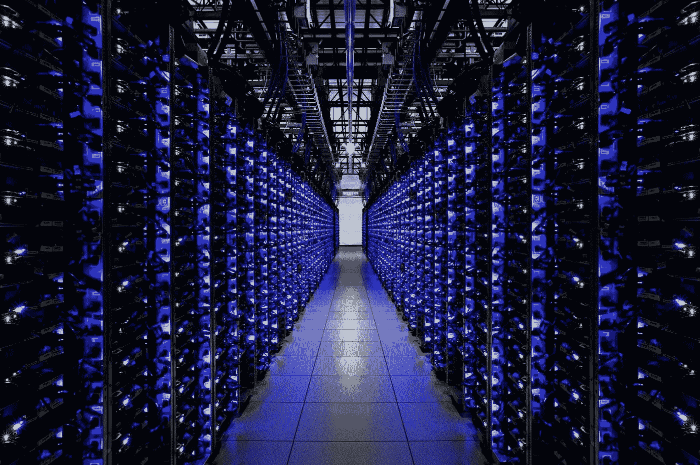

# 2020 年数据科学的 4 个最热门趋势

> 原文：<https://towardsdatascience.com/the-4-hottest-trends-in-data-science-for-2020-3956cd9fc182?source=collection_archive---------8----------------------->

## 2019 年对于所有的[数据科学](https://en.wikipedia.org/wiki/Data_science)来说是重要的一年。

> 想获得灵感？快来加入我的 [**超级行情快讯**](https://www.superquotes.co/?utm_source=mediumtech&utm_medium=web&utm_campaign=sharing) 。😎

全球各行各业的公司都在经历人们所说的 [*数字化转型*](https://www.salesforce.com/products/platform/what-is-digital-transformation/) 。也就是说，企业正在采取传统的业务流程，如招聘、营销、定价和战略，并使用数字技术使它们好 10 倍。

数据科学已经成为这些变革不可或缺的一部分。有了数据科学，组织不再需要根据直觉、最佳猜测或小型调查来做出重要决策。相反，他们正在分析大量的真实数据，以便根据真实的数据驱动的事实做出决策。这才是数据科学真正的意义所在——通过数据创造价值。

这种将数据整合到核心业务流程中的趋势已经显著增长，根据[谷歌搜索趋势](https://trends.google.com/trends/explore?date=today%205-y&q=Data%20Science)的数据，在过去 5 年中，人们的兴趣增加了 4 倍多。数据给公司带来了超越竞争对手的巨大优势。随着更多的数据和更好的数据科学家使用这些数据，公司可以获得有关市场的信息，而这些信息可能连他们的竞争对手都不知道。这已经成为一个数据或灭亡的游戏。

谷歌搜索过去 5 年“数据科学”的受欢迎程度。由[谷歌趋势](https://trends.google.com/trends/explore?date=today%205-y&q=Data%20Science)生成。

在当今不断发展的数字世界中，保持竞争优势需要不断创新。专利已经过时，而敏捷方法和快速捕捉新趋势非常流行。

组织不能再依赖他们过去坚如磐石的方法。如果像数据科学、[人工智能](https://www.britannica.com/technology/artificial-intelligence)或[区块链](https://en.wikipedia.org/wiki/Blockchain)这样的新趋势出现，需要提前预期并快速适应。

以下是 2020 年最热门的 4 大数据科学趋势。这些趋势今年引起了越来越多的关注，并将在 2020 年继续增长。

# (1)自动化数据科学

即使在今天的数字时代，数据科学仍然需要大量的手工工作。存储数据，清洗数据，可视化和探索数据，最后对数据建模，得到一些实际的结果。手工工作只是乞求自动化，因此出现了自动化数据科学和机器学习。

数据科学管道的几乎每一步都已经或正在实现自动化。

在过去的几年里，自动数据清理已经在[进行了大量的研究。](https://cudbg.github.io/lab/cleaning)[清理大数据](https://rapidminer.com/blog/data-prep-time-consuming-tedious/)经常占用数据科学家的大部分宝贵时间。无论是初创公司还是像 IBM 这样的大公司都提供数据清理的自动化和工具。

数据科学的另一大部分被称为[特征工程](https://en.wikipedia.org/wiki/Feature_engineering)已经经历了重大的破坏。[特征工具](https://www.featuretools.com/)为自动特征工程提供解决方案。最重要的是，现代的[深度学习](https://en.wikipedia.org/wiki/Deep_learning)技术，如[卷积和递归神经网络](/understanding-neural-networks-from-neuron-to-rnn-cnn-and-deep-learning-cd88e90e0a90)学习它们自己的特征，而不需要手动的特征设计。

也许最重要的自动化发生在机器学习领域。数据机器人和 [H2O](https://www.h2o.ai/solutions/) 都通过提供端到端的机器学习平台在行业中确立了自己的地位，让数据科学家可以非常轻松地处理数据管理和模型构建。 [AutoML](https://en.wikipedia.org/wiki/Automated_machine_learning) ，一种自动模型设计和训练的方法，也在 2019 年蓬勃发展，因为这些自动模型超过了最先进的水平。特别是谷歌，正在大力投资[云 AutoML](https://cloud.google.com/automl/) 。

总的来说，公司正在大量投资于构建和购买自动化数据科学的工具和服务。只要能让这个过程更便宜、更简单。同时，这种自动化也迎合了规模较小、技术含量较低的组织，他们可以利用这些工具和服务来访问数据科学，而无需组建自己的团队。

# (2)数据隐私和安全

隐私和安全一直是技术领域的敏感话题。所有公司都希望快速行动和创新，但在隐私或安全问题上失去客户的信任可能是致命的。因此，他们被迫把它作为一个优先事项，至少不泄露私人数据的最低限度。

在过去的一年里，数据隐私和安全已经成为一个令人难以置信的热门话题，因为这些问题被大量的公共黑客所放大。就在最近的 2019 年 11 月 22 日，[在 Google Cloud](https://siliconangle.com/2019/11/22/1-2b-account-records-stolen-latest-serious-data-hack/) 上发现了一个暴露的没有安全性的服务器。该服务器包含了 12 亿人的个人信息，包括姓名、电子邮件地址、电话号码、LinkedIn 和脸书的个人资料。甚至联邦调查局也介入调查。这是有史以来最大的数据暴露之一。

数据是怎么来的？它属于谁？谁负责这些数据的安全？它在谷歌云服务器上，实际上任何人都可以创建它。

现在我们可以放心了，全世界都不会在看完新闻后关闭他们的 LinkedIn 和脸书账户，但这确实令人惊讶。消费者变得越来越小心他们给谁他们的电子邮件地址和电话号码。

一家能够保证客户数据隐私和安全的公司会发现，他们更容易说服客户提供更多数据(通过继续使用他们的产品和服务)。它还确保，如果他们的政府颁布任何法律*要求*客户数据的安全协议，他们已经做好了充分的准备。许多公司选择 [SOC 2 合规性](https://www.imperva.com/learn/data-security/soc-2-compliance/)来证明他们的安全强度。

整个数据科学过程都是由数据推动的，但大多数数据都不是匿名的。如果落入坏人之手，这些数据可能会被用来加剧全球灾难，扰乱人们的日常隐私和生计。数据不仅仅是原始数字，它代表并描述了真实的人和真实的事物。

随着数据科学的发展，我们也将看到围绕数据的隐私和安全协议的转变。这包括建立和维护数据的安全性、可靠性和完整性的流程、法律和不同方法。如果网络安全成为今年的新流行语，那就不足为奇了。

# (3)云中的超大规模数据科学

多年来，数据科学已经从一个小众领域发展成为一个完整的领域，可供分析的数据也在规模上爆炸式增长。组织正在收集和存储比以往更多的数据。

一家典型的财富 500 强公司可能需要分析的数据量已经远远超出了个人电脑的处理能力。一台像样的电脑可能有 64GB 的内存，8 核 CPU 和 4TB 的存储空间。这对于个人项目来说很好，但当你为一家全球性公司工作时就不那么好了，比如拥有覆盖数百万客户数据的银行或零售商。

这就是云计算进入该领域的原因。[云计算](https://www.pcmag.com/article/256563/what-is-cloud-computing)为任何地方的任何人提供了几乎无限的处理能力。亚马逊网络服务(AWS)等云供应商提供多达 96 个虚拟 CPU 核心和高达 768 GB 内存的服务器。这些服务器可以设置在一个自动扩展组中，其中数百台服务器可以在没有太多延迟的情况下启动或停止，即按需提供计算能力。

谷歌云数据中心

除了计算，云计算公司还提供成熟的数据分析平台。谷歌云提供了一个名为 [BigQuery](https://cloud.google.com/bigquery/) 的平台，这是一个无服务器和可扩展的数据仓库，让数据科学家能够在单个平台上存储和分析数 Pb 的数据。BigQuery 还可以连接到数据科学的其他 GCP 服务。使用[云数据流](https://cloud.google.com/bigquery/)创建数据流管道，[云数据处理器](https://cloud.google.com/dataproc/)在数据上运行 Hadoop 或 Apache Spark，或者使用 BigQuery ML 在庞大的数据集上建立机器学习模型。

从数据到处理能力的一切都在增长。随着数据科学的成熟，由于数据量巨大，我们最终可能会完全在云上进行数据科学。

# (4)自然语言处理

[自然语言处理](https://en.wikipedia.org/wiki/Natural_language_processing) (NLP)在深度学习研究取得巨大突破后，已经坚定地进入数据科学。

数据科学最初是从分析纯粹的原始数据开始的，因为这是处理数据和在电子表格中收集数据的最简单方法。如果您需要处理任何类型的文本，通常需要对其进行分类或以某种方式转换成数字。

然而，将一段文字压缩成一个数字是很有挑战性的。自然语言和文本包含如此丰富的数据和信息——我们过去常常会错过这些信息，因为我们缺乏用数字表示这些信息的能力。

通过深度学习在 NLP 方面取得的巨大进步正在推动 NLP 全面集成到我们的常规数据分析中。神经网络现在可以以令人难以置信的速度从大量文本中提取信息。他们能够将文本分为不同的类别，确定对文本的情感，并对文本数据的相似性进行分析。最终，所有这些信息都可以存储在一个单一的数字特征向量中。

因此，NLP 成为数据科学中的一个强有力的工具。庞大的文本数据库，不仅仅是一个单词的答案，而是完整的段落，可以转换成数字数据进行标准分析。我们现在能够探索更加复杂的数据集。

例如，假设一个新闻网站想要查看哪些主题获得了更多的浏览量。如果没有先进的自然语言处理技术，人们所能做的就是输入关键词，或者仅仅是凭直觉判断为什么一个特定的标题比另一个好。有了今天的自然语言处理，我们就能够量化网站上的文本，比较整段文本甚至网页，从而获得更全面的见解。

对于过去几年中 NLP 最重要的进步的技术概述，你可以查看由 [Victor Sanh](https://medium.com/u/ac59742e5349?source=post_page-----3956cd9fc182--------------------------------) 撰写的[指南](https://medium.com/huggingface/the-best-and-most-current-of-modern-natural-language-processing-5055f409a1d1)。

数据科学作为一个整体正在发展。随着其能力的增长，它正在嵌入每个行业，包括技术性和非技术性行业，以及每个企业，包括小型和大型企业。

随着该领域的长期发展，看到它大规模地大众化，成为我们软件工具箱中的一个工具供更多的人使用，就不足为奇了。