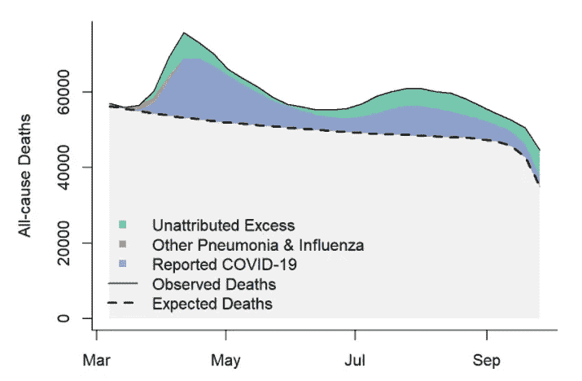
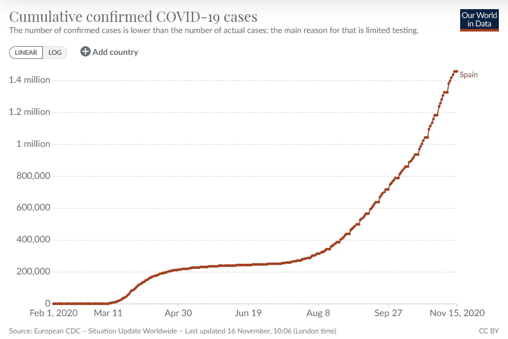
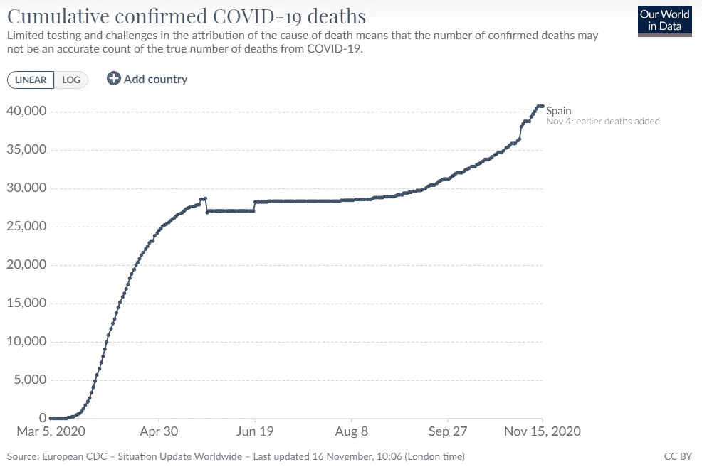
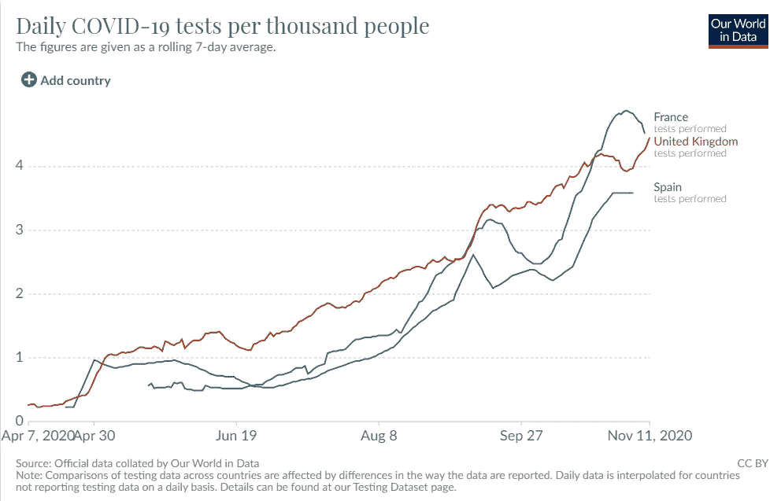
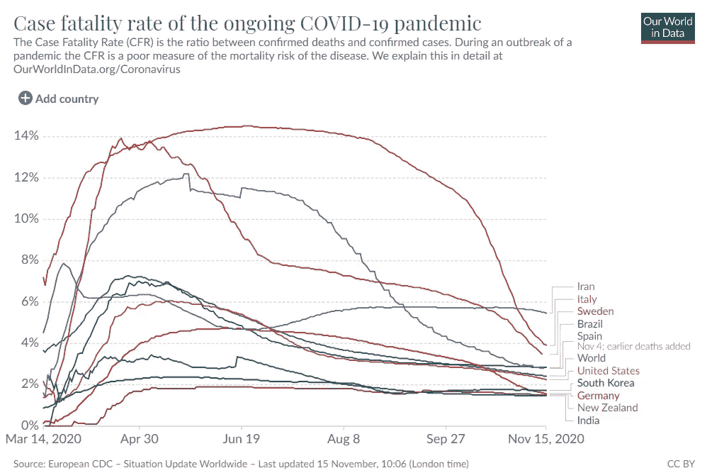

# 新冠肺炎危机教给世界的关于数据的 4 个教训

> 原文：<https://towardsdatascience.com/the-4-lessons-the-covid-19-crisis-taught-the-world-about-data-425cf28635c8?source=collection_archive---------51----------------------->

## 意见

## 新冠肺炎危机至少有一个积极的结果:它让许多人了解了数据解读的困难。

新冠肺炎全球危机对地球上大多数人的日常生活产生了强烈影响。它还创造了一个前所未有的时间，数亿人开始每天分析图表、数据点和流行病学指标。

无论情况有多糟糕，总会有好的结果。除了团结的伟大表现，新冠肺炎危机教会了许多人如何看待和解释数据。通常，他们意识到事情并不像看起来那么简单。

# 数据收集并不简单

从局外人的角度来看，收集数据似乎是一项简单的任务。既然数据库已经被使用了几十年，那么*必须*有一个像发送电子邮件来更新中央数据库一样简单的系统。我们都希望。

实际上，这并不容易。有许多数据库系统，许多存储数据的方法，许多对信息进行编码的方法，也有许多对价值进行分类的方法。当你想创建一个中央数据库来收集所有数据时，比如说，新冠肺炎病例和死亡数据，你必须确保所有与你合作的实体使用相同的工具、软件版本、定义、类别名称、文件格式、编码等等

由于疫情极其罕见的性质，大多数国家或州没有类似的系统，必须在几周内临时准备一些东西，通常依靠员工尽力而为，但他们绝不是数据仓库架构师。

通常，最快捷、最自然的解决方案似乎是 Excel。它被广泛使用，并被视为一种标准格式。然后，不同的地区、州、医院或疗养院将他们的日常数据以 Excel 文件的形式(当你知道其他人发送了 pdf 文件时，这仍然是可以的)发送到一个中央实体，该实体的不幸任务是将所有这些数据汇编在一起。

你收到消息了。[ [通过这个发电机](http://www.ranzey.com/generators/bart/index.html)

Excel 对于许多任务来说是一个很好的工具，但是它不是一个数据库。它故意弄乱数据类型(这是一个如此普遍的问题，以至于[一些人类基因不得不因为 Excel](https://www.theverge.com/2020/8/6/21355674/human-genes-rename-microsoft-excel-misreading-dates) 而被重命名)或者它能够处理的条目数量有限。最近[提出](https://www.bbc.com/news/technology-54423988)使用过时版本的 Excel 无法处理超过 65，536 行，这是英国超过 16，000 例新冠肺炎病例没有被通知和考虑的原因。使用不适当的软件和数据收集实践确实对公共卫生产生了重大影响。

# 定义很重要

现在让我们假设我们收集的数据是正确的，这只是这条路的开始。获得正确的定义是另一项任务，起初看起来很琐碎，但实际上并不是这样。例如，让我们从这个简单的问题开始:

> **什么算新冠肺炎死亡？**

看起来很简单，对吗？类似于“被病毒感染后死亡的人”听起来是一个合适的答案。实际上，事情并不顺利。如果我们看下面的图表，我们可以看到 2020 年美国的超额死亡人数，大概是由新冠肺炎造成的。实际上，大约三分之一的超额死亡不是新冠肺炎造成的。

美国归因和非归因的超额死亡。图摘自温伯格等人的文章[ [链接](https://weinbergerlab.github.io/excess_pi_covid/) ]

这些死亡中的大多数很可能与新冠肺炎有关(尽管可能是间接的)，否则，我们将面临另一个未确定的过度死亡原因的重大问题。

这种差异的原因是多种多样的，取决于国家或州。在某些情况下，疗养院或医院外的死亡数没有统计或仅在几天后才公布。非肺炎症状导致的死亡可能没有被报道。此外，社会隔离有时会因为缺少亲近的证人而难以确定死因。这还不包括那些可能倾向于少报死亡人数的政客。

这个例子告诉我们，得到正确的简单定义并不容易，需要比预期更多的计划和验证。此外，从不同的角度看数据(例如，不仅看报告的 Covd-19 死亡，也看全球死亡)，有助于更清楚地了解现实。

# 选择正确的指标并不简单

获得正确的定义仍然不是最终目标。你还必须确保你正在寻找正确的衡量标准来评估情况并做出正确的决定。

在第一波疫情期间，人们开始密切跟踪多个指标，以更好地把握形势的严重性。一些研究着眼于活跃或累积病例的数量，死亡人数，或者在更罕见的情况下，重症监护病房(ICU)的入住率。

所有这些指标显示了疫情的不同方面，但它们都依赖于不同的假设和方法偏差，例如:

*   我们如何统计死亡人数？(见上文)
*   什么是阳性病例？(仅症状？需要测试结果吗？如果有，是哪个测试？)

**为了更好地理解如何解释指标，我们必须了解它是如何产生的**。以下示例显示了西班牙新冠肺炎病例(红色)和死亡病例(黑色)的演变。如果你不看红色曲线的背景，你会认为现在的情况比 3 月和 4 月时更糟糕，当时西班牙已经是受影响最严重的国家之一。

西班牙累计确诊新冠肺炎病例数。[ [来源](https://ourworldindata.org/covid-cases)

但细看更多细节，现实就不一样了。

首先，我们可以看到，大多数死亡是在早期积累的，在第二波传染病期间，死亡人数要少得多(但仍有一些人死亡)。

西班牙累计新冠肺炎死亡人数。形状与累计病例数大相径庭(见上)。[ [来源](https://ourworldindata.org/covid-deaths)

第二，曲线没有解释检测方法是如何演变的。在疫情开始时，用于检测病例的资源很少，流程也没有正确定义。现在，PCR 测试(最敏感的测试)每天都在大量进行。即使是无症状的人也要接受检测(在第二波中，西班牙约有 40%的阳性病例),而 3 月和 4 月的情况并非如此。

这可能是这次疫情的主要收获之一。许多人现在不会盲目地看一个指标，而是会质疑它是如何产生的，并且会反射性地看不同的指标来了解当前的情况。

# 取样也很重要

新冠肺炎疫情产生了大量任何人都可以访问、解读或辩论的数据。然后，试图比较所有这些数据点，让我们自己了解情况，谁知道呢，会比专家更聪明。

但是，在实践中，这些比较往往是棘手的，往往是由于抽样方法的差异。抽样是统计学课堂上教授的第一个概念之一，因为它在我们如何解释数据方面起着核心作用，新冠肺炎的数据向我们展示了许多由于数据生成方式而难以进行比较或分析的例子。

## 例 1:我们无法比较不同时期的测试数据

随着疫情的进步，各国大规模测试人口的能力也在提高。早在 4 月份，很少有人接受检测，他们大多数人的症状与新冠肺炎病毒相符。最近几周，测试次数比最初增加了 5 到 10 倍。

法国、英国和西班牙每千人每天测试的次数— [ [来源](https://ourworldindata.org/coronavirus-testing)

这意味着测试一个人的标准现在不同了，因为我们可以测试更多的人。虽然我们最初主要测试高度易感的人，但现在常见的是测试那些仅仅因为他们与受感染的患者接触过的人，或者纯粹为了大规模筛查活动而随机测试的人。

这意味着我们不能直接比较数据，如阳性检测的百分比或无症状病例的数量，因为采样程序随着时间的推移已经发生了巨大的变化。随着时间的推移[有不同的值](https://ourworldindata.org/coronavirus-testing#tests-per-confirmed-case)是正常的，因为 1)病毒的流行不断演变，2)我们根据不同的标准对不同的人群进行采样。毕竟，我们的目标不是设计一个简洁的实验过程，而是提供对疫情最好的反应。

## 例 2:我们不能(直接)比较国家之间的死亡率风险

随着疫情成为全球性的，来自不同国家的数据进行了比较，以更好地了解哪些策略是有效的或无效的。很快就变得很明显，一些指标，如死亡率风险，在不同国家之间有很大差异，像西班牙，意大利或瑞典等国家显示出更高的比率。

不同国家死亡率风险的演变— [ [来源](https://ourworldindata.org/mortality-risk-covid)

然而，很明显，我们无法从这些数据中得出明确的结论，因为许多参数因国而异，例如:

*   人口年龄结构(例如，意大利是世界上平均人口年龄最高的国家之一，而新冠肺炎老年人的死亡率更高)
*   社会互动水平
*   国内的基因多样性(一些基因变异使人们或多或少容易患病，包括新冠肺炎)
*   医疗基础设施(如 ICU 床位数量)
*   对疫情的反应(例如，意大利和瑞典都有很高的死亡率，但他们采取了非常不同的方法来抗击疫情)
*   数据质量(如前所述，并非所有国家都以相同的方式收集或定义数据)

虽然您可以使用适当的统计模型来校正其中的一些因素(如人口年龄结构)，但当涉及不同的数据收集方法或人口行为时，情况会变得更加复杂。

总的来说，人们越来越意识到，在很多情况下“我们就是无法比较”，这可能是一件好事，因为这是处理任何数据时的一项关键技能。

# 让我们不要忘记

令人欣慰的是，随着情况的好转，我们很快将不再需要担心每天新增的新冠肺炎病例或其他类似的数据。但是，为了更好地理解我们的世界和面对其他挑战，例如气候变化，总会有数据需要解释。然后，让我们不要忘记我们从这场危机中学到了什么，让我们在解读数据时总是问自己:

*   数据是如何获得(样本)和收集的？
*   定义是什么意思？
*   看哪个指标更有意义？

希望这能帮助我们做出更好的决定。