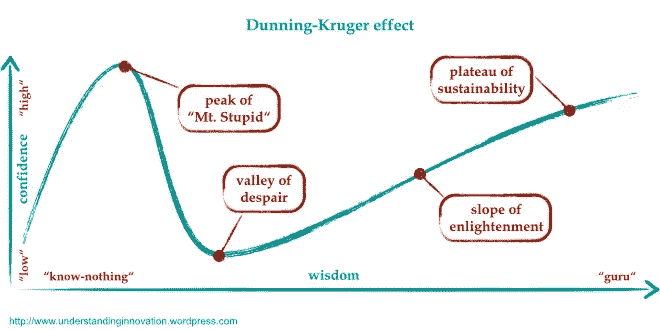
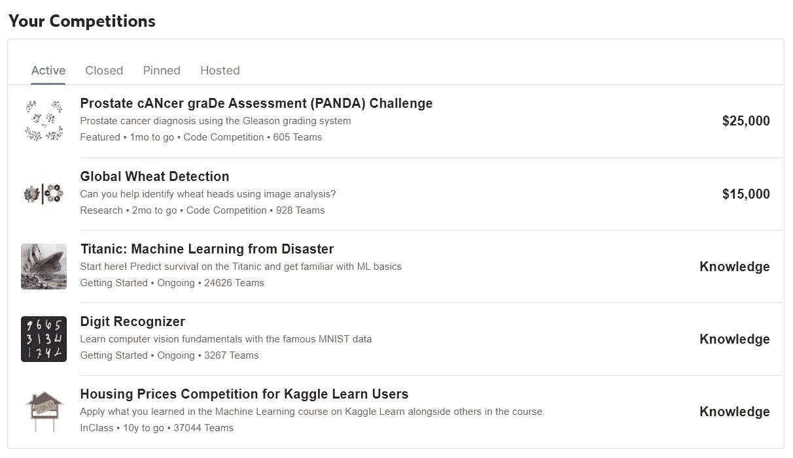
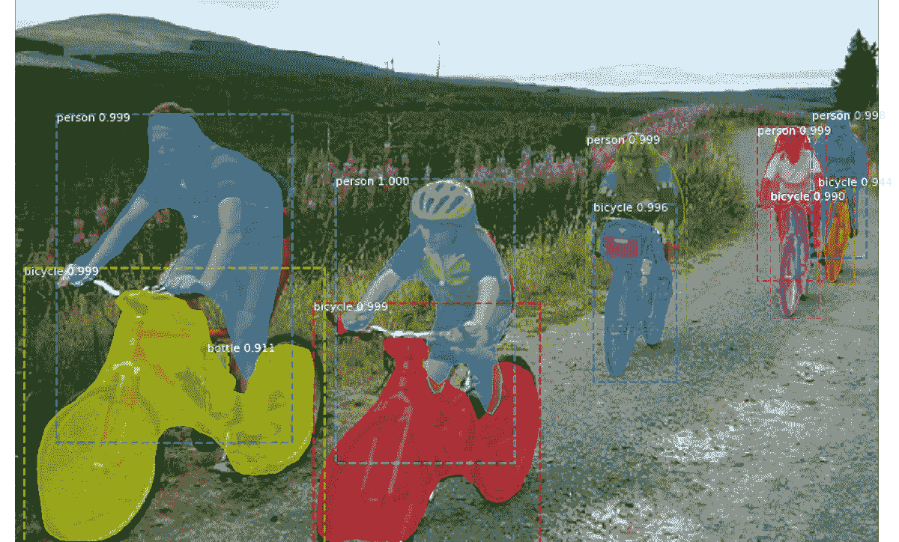
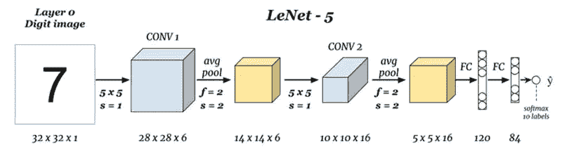

# 2020 年成为计算机视觉专家的 4 步指南

> 原文：<https://towardsdatascience.com/the-4-step-guide-to-becoming-a-computer-vision-expert-in-2020-8e821514e2a7?source=collection_archive---------34----------------------->

## 我在过去 2-3 年的旅程中学到了什么

[TT 先生](https://unsplash.com/@mrtt?utm_source=medium&utm_medium=referral)在 [Unsplash](https://unsplash.com?utm_source=medium&utm_medium=referral) 上的照片

计算机视觉正在崛起！见鬼，它正以极快的速度扩张！这个领域中不断出现的大量创新使得新手或初学者很难轻易在其中立足。在这篇文章中，我将谈论一些不可或缺的东西，同时对初学者非常有益，最终将帮助他们随着时间的推移在这个领域获得高于平均水平的专业知识。考虑到这些想法和教训来自我自己的经历，从一个初学者爬上同样的台阶，你可以期待他们是务实的。

描述掌握任何技能的邓宁-克鲁格曲线

首先要做的事情！这是如何成为计算机视觉专家的 ***而不是捷径*** 。我要说的步骤不是一个人可以在 1 个月内掌握的，为下一次面试做准备。但是这些将帮助你在 4-9 个月的时间里真正进入这个领域，这取决于你的热情。

我们已经走了这么远了！以前没看过的一定要看！

# 1.理论:

好吧好吧好吧！这应该是不同的，但我在这里开始与相同的旧东西。但说实话，一个人需要学习理论来正确地了解这个主题，并对它有一个整体的想法。没有人告诉你要记住你读到和看到的所有东西，但重要的是你至少要从头到尾看一遍。也许，你能找到的最好的资源就是下面的课程:

1.  [斯坦福的机器学习](https://www.coursera.org/learn/machine-learning) : *这只是在你不习惯基本的机器学习的情况下。*即使在深度学习的时代，基本的机器学习仍然非常非常重要。这是由吴恩达开发的课程，开启了 MOOC 革命，至今仍有重要意义。
2.  deeplearning.ai 的深度学习专门化(Deep Learning Specialization):这是当前人工智能领域最好的(如果不是最好的)资源之一。吴恩达再次涵盖了深度学习的关键和核心主题的整个范围。第四门课程涵盖了卷积神经网络，但在我看来，除了第五门课程(序列模型)之外，其他课程对一个有抱负的计算机视觉科学家都很重要。请记住，有些人认为这一课程和上述课程有点肤浅，而少数人认为这太理论化了。所以公平地说，它在难度方面取得了公平的平衡。
3.  [用于视觉识别的卷积神经网络](http://cs231n.stanford.edu/) (CS231n)斯坦福:如果要总结这个列表，这是不能忽略的。由另一位斯坦福大学的研究人员费教授，这门课程比上述课程更难(因为它是为真正的大学生开设的)，并且只专注于计算机视觉。虽然我还没有经历过这一点，但它非常有名，在社区中受到好评。多年来，这门课程一直由安德烈·卡帕西和贾斯廷·约翰逊这样的计算机视觉领域的知名人士教授。
4.  [Udacity 的计算机视觉纳米学位](https://www.udacity.com/course/computer-vision-nanodegree--nd891):这个订阅费很高，但很值。它涵盖了基础知识，并深入到应用方面，如图像字幕，物体检测和跟踪等。另外，你可以和 PyTorch 一起工作，py torch 在这个领域肯定会超过 Keras-Tensorflow。
5.  [计算机视觉中的深度学习](http://Deep Learning in Computer Vision)由 HSE 提供:本课程是俄罗斯国立研究大学更大专业的一部分，它从计算机视觉中的深度学习的角度覆盖了很多 SOTA 的研究。HSE 是 Coursera 上评分最高的课程提供商之一。

贾斯廷·约翰逊最早的[实现之一](https://github.com/jcjohnson/neural-style) [Gatys 的](https://arxiv.org/abs/1508.06576)神经风格转移

# 2.竞赛:

一旦你掌握了所有的基础知识，甚至在你掌握所有的基础知识之前，你必须尝试你所学的东西。为此，竞争意识有时是有益的。在线人工智能平台的世界来了。Kaggle 一直是这一领域的先锋。它彻底改变了机器学习领域，因为它创造了一个研究人员社区，并为初学者开辟了机会之路。这方面其他值得注意的平台有 [AICrowd](https://www.aicrowd.com/) 、 [CodaLab](https://codalab.org/) 、 [DrivenData](https://www.drivendata.org/competitions/) 等。甚至脸书研究公司现在也在举办公开比赛。[MLContests.com](https://mlcontests.com/)汇总列出了很多不同平台正在进行的比赛。

这些平台通常在一年中的任何时候都有大量的计算机视觉比赛在进行。其中一些是 CVPR，ICCV 研讨会的挑战，而其他的是由公司赞助的。对新人来说，比排名的诱惑力更大的是公共笔记本和该领域专家讨论的结合。这些打开了一个巨大的新的信息和技能集，不能从理论和课程中学到。

Kaggle 竞赛仪表板

让我们来看一个例子。我目前正在做“全球小麦检测”的挑战，你可以在我上面的仪表盘中看到。人们正在使用的最有前途的架构是 EfficientDet、FasterRCNN 和 YOLO。我知道最后两个，但不知道 EfficientDet。我有机会熟悉这个强大的模型。各种最新架构和相关代码的笔记本海洋不仅对初学者有益，对经验丰富的从业者也同样有益。

[样本 MaskRCNN 推断](/overcome-overfitting-during-instance-segmentation-with-mask-rcnn-32db91f400bc)

# 3.个人项目:

如果你想向世界展示你在这个领域高于平均水平，最好建点东西。没有人在这个领域寻找应用程序。事实上，如果你能做到这一点，这意味着你有能力创建和部署基于人工智能的应用程序，这是所有初创公司都在寻找的宝贵技能。抛开这些不谈，创建小规模的项目并不困难。只是不要做其他人都在做的事情，这是常识！不要成为在 GitHub 账户上只有一个储存库的人，那就是*泰坦尼克号幸存者。*

招聘人员越来越关注你的项目，以评估你的能力。在这种情况下，*你在做什么*比*你做得多好*更重要。澄清一下，在混乱的数据集上对一个有趣的问题获得 50%的准确率要比在 MNIST 上获得 99.98%的准确率好得多。

一些可以尝试的事情:

*   为数据集上的任何问题创建一个精心制作的笔记本。更好的方法是在存储库中创建一组笔记本来处理不同的问题，或者对同一数据集使用不同的方法。
*   开发一个你认为有用的小软件包。它不必是开创性的，但只要让事情变得更容易。它会让你对设计和编写人们可以使用的代码有更多的了解。如果你喜欢，可以在 pip 上主持。衣领上多了一颗星。

开始这一切的那个，Yann LeCun 的 LeNet-5

# 4.研究论文:

为了成为真正的简历专家，她/他需要阅读研究论文。随着这个领域的发展，每天都有新的网络出现。这在很大程度上与学术界的出版或灭亡文化有关，但即使忽略小规模的改进论文，其他杰出论文的列表也足够长了。这肯定不容易，但是养成阅读论文的习惯会让你在更小的领域获得更广泛的知识。

你最需要的，也是能让你从具备上述技能的人中脱颖而出的，是发表你自己的研究。在 CVPR、ICCV、NeurIPS 等顶级会议上发表文章。你的简历肯定会受到很大的不同对待。这些会议通常有很多研讨会。将这样的研讨会作为第一份出版物的目标可能是一个明智的决定。许多计算机视觉职位的招聘信息已经开始将此作为首选，甚至是申请的最低资格。

# 5.额外见解:

> **一、访问的复杂性**

阻止人们进入计算机视觉领域的一大障碍仍然是获得负担得起的计算能力的问题。让我们诚实地说，除非你在大学或在投资深度学习的公司工作，否则你很可能必须经历很多磨难来训练你的模型或自掏腰包。

[***这篇***](/maximize-your-gpu-dollars-a9133f4e546a) 对于那些希望做出最佳经济选择的人来说，是一篇非常有用的文章。如果你在网上寻找简单免费的 GPU 选项，你有 [Google Colab](https://colab.research.google.com/) 和 [Kaggle 笔记本](https://www.kaggle.com/notebooks)。Colab 允许您运行代码 12 个小时，并提供 GPU/TPU。而 Kaggle 给你 30 小时/周的 GPU 和 TPU 运行时间。至于付费提供商，我发现对于业余爱好者来说，vast.ai 是一个非常好的选择。

> **二。乔布斯**

最后，如果你想问什么是让你在当前工作中有别于其他人的关键因素，我会说是 3 件事，不分先后:

*   出版物、GitHub 个人资料和 Kaggle 个人资料。

这三个人越来越多地被招聘者所关注，而以前却不是这样。这是无视你的正规教育。大多数顶级职位的最低要求是博士学位。而其他公司的要求可能没有这么严格。

祝你一路顺风！请记住…

> “一夜成名需要 20 年。”