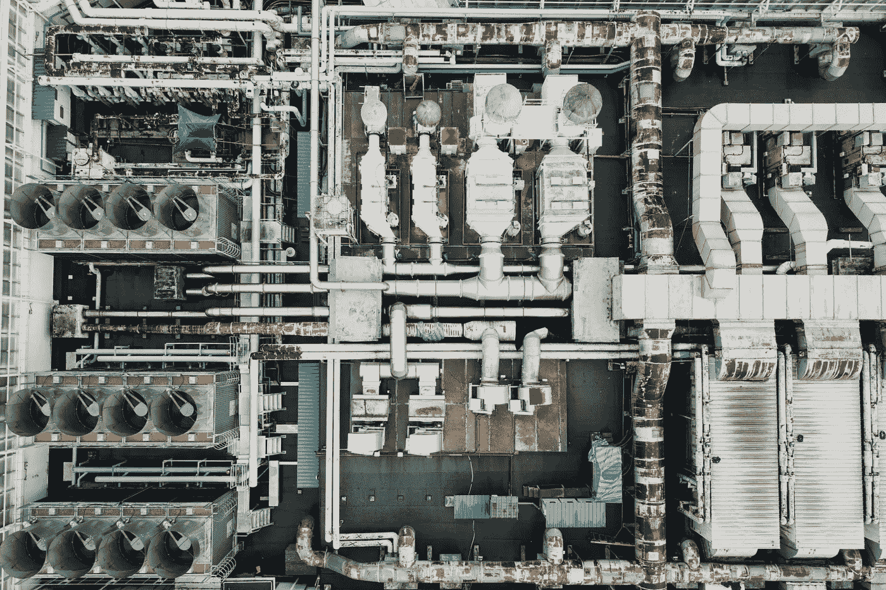

# 拟合机器学习模型前的 4 个必要步骤

> 原文：<https://towardsdatascience.com/the-4-steps-necessary-before-fitting-a-machine-learning-model-574bf8f1cd48?source=collection_archive---------26----------------------->

## 一种简单的面向对象的数据处理方法。

照片由 [chuttersnap](https://unsplash.com/@chuttersnap?utm_source=unsplash&utm_medium=referral&utm_content=creditCopyText) 在 [Unsplash](https://unsplash.com/s/photos/pipes?utm_source=unsplash&utm_medium=referral&utm_content=creditCopyText) 上拍摄

> [Learning Rate](https://mailchi.mp/d2d2d4a109b5/learning-rate-newsletter) 是为那些对 AI 和 MLOps 的世界感到好奇的人准备的时事通讯。你会在每周五收到我关于最新人工智能新闻和文章的更新和想法。订阅[这里](https://mailchi.mp/d2d2d4a109b5/learning-rate-newsletter)！

在一个通用的机器学习管道中有许多步骤，并且在设计它的时候有很多想法。有问题定义、数据采集、错误检测和数据清理等。在这个故事中，我们首先假设我们有一个干净的现成数据集。

考虑到这一点，我们概述了在拟合任何机器学习模型之前的四个必要步骤。然后，我们在 Pytorch 中实现这些步骤，使用公共语法调用多个方法调用；方法链接。**我们的目标是定义一个简单而通用的 API，将任何原始数据集转换成机器学习模型可以使用的格式。**

为此，我们将使用 ***构建模式*** *、*，它使用逐步方法构建一个复杂的对象。

> **builder 模式**是一种[设计模式](https://en.wikipedia.org/wiki/Software_design_pattern)，为[面向对象编程](https://en.wikipedia.org/wiki/Object-oriented_programming)中的对象创建问题提供了一种灵活的解决方案。它的目的是把一个复杂物体的构造和它的表现分离开来。

那么，这四样东西是什么？在最简单的情况下，建模前的数据处理包括四个不同的动作:

1.  加载数据
2.  分成训练/有效/测试集
3.  标记数据元组
4.  获取批量数据

在接下来的小节中，我将逐一分析这四个步骤，并用代码实现它们。我们的目标是最终创建一个 PyTorch `DataLoader`，PyTorch 使用这个抽象来表示数据集上的 iterable。拥有一个`DataLoader`是设置训练循环的第一步。所以，事不宜迟，让我们把手弄脏吧。

# 加载数据

对于这个例子，我们使用一个模拟数据集，它以 pandas `DataFrame`格式保存。我们的目标是为训练集和验证集分别创建一个 PyTorch `Dataloader`类。因此，让我们构建一个名为`DataLoaderBuilder`的类，它负责构建这些类。

我们看到`DataLoaderBuilder`的唯一操作是存储一个`data`变量，它的类型是`torch.tensor`。所以现在，我们需要一个从熊猫`DataFrame`初始化它的方法。为此，我们使用 python `classmethod`。

`classmethod`是一个普通的 python 类方法，但是它没有接收`self`作为第一个参数，而是接收了一个`class`。因此，给定一个熊猫`DataFrame`，我们将`DataFrame`转换成 PyTorch 张量并实例化`DataLoaderBuilder`类，该类作为`cls`参数传递给方法。可选地，我们可以只保留我们关心的`DataFrame`的列。在定义它之后，我们将它修补到主`DataLoaderBuilder`类。

# 分为培训和验证

对于这个例子，我们将数据集分成两组；培训和验证。很容易扩展代码，把它分成三组；培训、验证和测试。

我们希望随机分割数据集，保留一定比例的数据用于训练，并留出一些数据用于验证。为此，我们使用 Pytorch 的`SubsetRandomSampler`。你可以在 PyTorch 的官方文档中读到更多关于这个采样器和更多采样方法的信息。

默认情况下，我们保留 90%的数据用于训练，并且我们跨行拆分(`axis=0`)。**代码中的另一个细节是我们返回** `**self**` **。因此，在创建了** `**train_data**` **和**`**valid_data**`**split 之后，我们返回了整个类。这将允许 as 最终使用方法链接。**

# 标注数据集

接下来，我们应该标记数据集。很多时候，我们用一些特征变量来预测一个因变量(即目标)。那当然就是所谓的监督学习。`label_by_func`方法根据给定的函数注释数据集。在这个调用之后，数据集通常被转换成`(features, target)`元组。

我们看到`label_by_func`方法接受一个函数作为参数，并将其应用于训练集和有效集。我们的工作是设计一个函数，在我们想要标记某种形式的数据集的任何时候为我们的目的服务。在后面的*“把它们放在一起”*例子中，我们展示了创建这样一个函数是多么简单。

# 创建批次

最后只剩下一步；将数据集分成几批。为此，我们可以利用 PyTorch 的`TensorDataset`和`DataLoader`类。

**这是这个链中的最后一个方法，因此，我们将其命名为“*build”*。它创建训练和有效数据集，有了它们，就很容易用已知的批量实例化相应的 Pytorch** `**DataLoader**` **。**请记住，我们现在已经标记了数据，因此，`self.train_data`是一个由`features`和`target`变量组成的元组。因此，`self.train_data[0]`保持`features`并且`self.train_data[1]`保持目标。

了解了这一点之后，让我们用一个简单的例子来说明这一点。

在本例中，我们创建了一个包含三列的虚拟数据集，其中最后一列存储了*目标*或*依赖*变量。然后我们定义了一个`get_label`函数，它提取最后一列并创建一个 features-target 元组。最后，使用方法链接，我们可以很容易地从给定的 pandas `DataFrame`中创建我们需要的数据加载器。

# 结论

在这个故事中，我们看到了在拟合任何模型之前，数据处理的四个必要步骤是什么，假设数据集是干净的。虽然这是一个玩具示例，但它可以用于并扩展到各种各样的机器学习问题。

此外，还有一些步骤没有在本文中介绍(例如，计算机视觉的数据规范化或扩充)，但本文的目的是提供一个关于如何构建代码来解决相关问题的总体思路。

> **我叫 Dimitris Poulopoulos，是希腊比雷埃夫斯大学***[**BigDataStack**](https://bigdatastack.eu/)***的机器学习研究员和博士(c)。我曾为欧洲委员会、欧盟统计局、国际货币基金组织、欧洲中央银行、经合组织和宜家等主要客户设计和实施人工智能和软件解决方案。如果你有兴趣阅读更多关于机器学习、深度学习和数据科学的帖子，请在 twitter 上关注我的*** *[**中**](https://medium.com/@dpoulopoulos) **、**[**LinkedIn**](https://www.linkedin.com/in/dpoulopoulos/)**或**[**@ james2pl**](https://twitter.com/james2pl)**。****