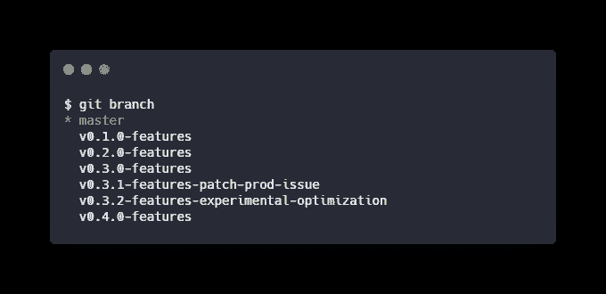
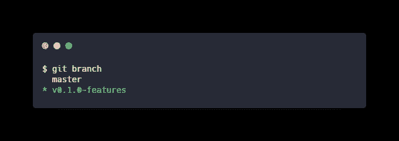

# 数据科学家应该知道的 Git 分支的 4 个步骤

> 原文：<https://towardsdatascience.com/the-4-steps-to-branching-in-git-that-data-scientists-should-know-3473c70aaa7a?source=collection_archive---------31----------------------->

## 机器学习项目的分支、合并和标记介绍

我相信使用版本控制，不管项目有多小。当你在进行任何类型的快速、敏捷或迭代开发时，这一点尤其重要。训练模型和超参数调整是您想要多个实验和里程碑快照的主要例子。

> 我最近写了关于数据科学家应该知道的 6 个 Git 命令[的文章](/the-only-6-git-commands-you-need-to-know-995065db1ae0)，作为版本控制新手的入门读物。在本文中，我们将探索一些新的命令来帮助您管理项目的多个独立版本，并将它们合并在一起。

如果您是 Git 新手，您可能想知道什么是**分支**？可视化分支如何工作的最简单的方法是时间旅行电影的情节。有主时间轴，在 Git 中称为**主**。当你想做一些新的事情时，你可以从主时间线分支到另一个时间线。主时间线和备用时间线仍然平行前进，但是在任何时候，你都可以跳回到主时间线。当你在 Git 中这样做时，你可以选择是否**合并**你的修改。

它看起来像这样:

布朗博士解释了错误合并马蒂·小飞侠 1985 年分行的后果。

玩笑归玩笑，理解如何以及何时分支对于使用 Git 至关重要。我将带你经历我在项目中使用的四个步骤。

## 1.树枝

正如我前面提到的，当您创建一个新的 repo 时，您会自动在主分支中工作。通过在命令行中键入以下内容，您可以看到这一点:

`git branch`

这应该会返回项目中的所有分支。你现在工作的那个是绿色的。

在这一点上，我们应该花一点时间来讨论什么时候应该创建一个新的分支。比方说，你正准备开发一个新的特性或者重构一些东西。当你解决问题的时候，你不想担心签入错误的代码，所以做一个沙箱来试验是个好主意。把一个分支想象成你的主项目的一个拷贝，在那里进行修改是安全的，不会影响主代码库。

我对我的分支使用特定的命名约定。要创建一个新的分支，您将使用前面的命令，但是将分支的名称添加到其中，如下所示:

`git branch v0.1.0-feature`

如您所见，我使用软件版本约定来命名我的分支。我从`v0.1.0`开始，一路向上。因此，下一个分支将是`v0.2.0`，直到我达到一个新的完整版本，如`v1.0.0`。有时，您需要对现有版本进行增量更改。在这种情况下，我将创建一个名为`v0.2.1`的分支。

如果您在一个组中工作，您可能希望指定一个人作为回购所有者，并将他们指定为可以创建新功能分支的人。团队中的每个人都可以直接在那个分支中工作，或者创建他们自己的子分支。在这个场景中，我会创建一个名为`v0.1.0-features-jf`的个人分支，或者像`v0.1.0-features-create-new-model`一样添加一个特定的特性名称。

随着时间的推移，您将拥有项目所有主要特性版本的完整历史。它可能看起来像这样:

## 2.检验

创建分支只是等式的一部分。如果你想在新的分公司工作，你需要先做一个**检查**。签出分支是通过以下命令完成的:

`git checkout v0.1.0-features`

结帐完成后，您将在控制台中看到一条确认消息:

现在，如果您在控制台中键入`git branch`，它将突出显示您正在工作的新分支:

在签出分支时，有几件事你应该记住。

1.  您应该只在提交任何阶段性更改后签出新的分支。Git 有时会将这些带到您要切换到的分支。如果未选中此选项，它会破坏您正在工作的分支。
2.  如果您有新的未跟踪的文件，它们将不会被触及。即使切换分支，这些新文件仍将存在。因此，还必须注意 stay 文件，这些文件也可能破坏要切换到的分支。

在切换分支之前，最好使用`git status`，并确保在使用`checkout`之前一切正常。

最后，如果您正在处理一个从在线回购中下载的项目，您可能没有对所有分支的本地访问权。您可以使用`git fetch --all`下拉引用到**远程源**的分支，然后检查您想要的分支。

## 3.合并

所以当你在一个新的部门工作了足够长的时间后，是时候保存你所做的一切了。虽然提交变更已经为您逐步完成了这一点，但是在某些时候，您会想要将**变更合并**回主分支。当您在工作分支中完成更改，并且代码稳定后，就可以用下面的命令检查主分支了:

`git checkout master`

进入主分支后，可以使用以下命令合并特征分支更改:

`git merge v0.1.0-features`

在使用命令之前，您总是希望**位于将接收合并**的分支中。假设所有的东西都被正确地合并了，那么您现在应该在主分支中拥有来自您的特性分支的所有代码。

如果您遇到冲突，控制台会告诉您问题出在哪里。你可以使用[各种策略](https://git-scm.com/book/en/v2/Git-Tools-Advanced-Merging)来解决这些问题，这些策略现在有点超出范围。

## 4.标签

这个过程的最后一部分是**标记**您所做的更改。标记类似于分支。标签代表项目在给定时间的快照。既然您已经将一个特性分支合并到了主分支中，那么现在是创建该版本标签的好时机。因此，当您仍然在主分支中时，在命令行中键入以下内容:

`git tag v0.1.0`

注意，我没有在标签名中添加`feature`。这有助于表示项目中已完成且稳定的点。因此，当有人签出项目时，他们可以立即从主分支以最新的稳定状态构建项目。同样，如果您希望他们只使用代码库的特定状态，比如在特定日期发布的内容，他们可以切换到相应的标签。

你可以在任何时候看到一个项目中的所有标签，只需在控制台中输入`git tag`。

就像`git branch`一样，您将看到当前 repo 中本地所有标签的列表。

# 冲洗并重复

总而言之，在 Git 中进行分支时，有四个基本命令:

1.  `branch`创建新的工作分支
2.  切换到一个新的分支
3.  `merge`将代码变更从一个分支复制到另一个分支
4.  `tag`保存代码的快照

现在，您可以执行**步骤 1–4**来继续创建新的工作分支。请记住，在分行工作时，您可以像平时一样提交。使用这些提交和它们的注释来跟踪您在稳定发布中所取得的进展。

最后要指出的是，永远不要将代码提交给标签。修补一个标签的正确方法是检查它所来自的分支，并从那里创建一个新的分支。例如，标签`v0.1.0`对应于分支`v0.1.0-features`。这意味着您将把补丁代码添加到一个新的`v0.1.1-features`分支，然后将这些更改合并回`master`，并将其标记为`v0.1.1`。

如果`master`分支在你正在修补的特征分支之前；您需要决定是从当前分支标记还是合并到主分支，并在下一个版本的标记中包含这些更改。

> 做这件事没有一成不变的方法，这完全取决于规模有多大，有多少人在回购中工作，以及谁负责管理回购的合并。

虽然您可能想要`merge`对`master`分支的更改，但是它也可能需要合并到额外的特征分支中。所以为了简单起见，我只在迫切需要更新产品而不能等到下一个版本时才修补标签。

我唯一的硬性规定是**没有标签**项目的任何代码或输出都不能投入生产。重要的是要知道什么版本是活动的，并有一个快照以防出错。这开始进入事情的 **DevOps** 方面。如果你想了解 DevOps 在过去几十年中是如何发展的，一定要看看我的文章“[devo PS 文化的演变](https://codeburst.io/the-evolution-of-the-devops-culture-5734c2c0d037)”

如果您是 Git 新手，或者在使用分支时需要一些帮助，我希望这有所帮助？如果你在下面留下评论，我很乐意回答你提出的任何问题。