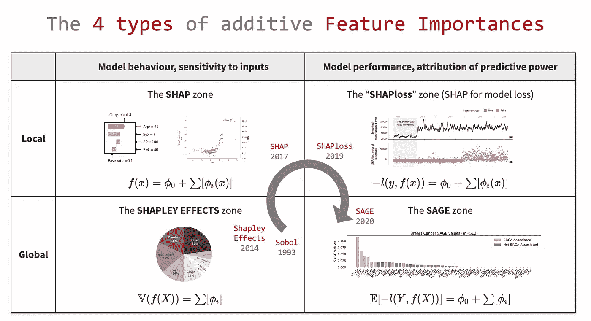
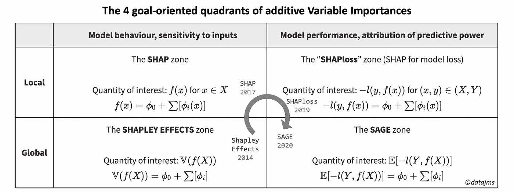
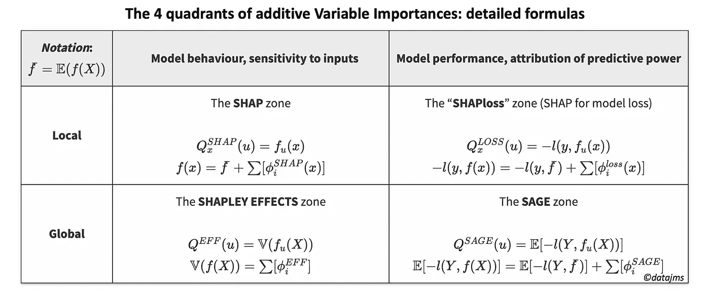

# 4 种类型的附加特征重要性

> 原文：<https://towardsdatascience.com/the-4-types-of-additive-feature-importances-5a89f8111996?source=collection_archive---------30----------------------->

**内容:**

1.  **哪个目的对于可变的重要性？** 1.1 设定你的目标…
    1.2…通过选择象限
2.  **4 个面向目标的象限** 2.1 沙普利效应区
    2.2 SHAP 区
    2.3 沙普洛斯区
    2.4 塞奇区
3.  **每个象限的 Shapley 解** 3.1 Shapley 值
    3.2 应用于特征属性
4.  **未来展望和要点信息**
5.  **参考文献**

由作者提供的来自[datajms.com](https://datajms.com/post/variable_importance_feature_attribution/)的附加特性重要性的 4 个目标导向象限的概述。

你可能听说过特征重要性方法:有很多这样的方法，它们对于变量选择和模型解释非常有用。但是还有更多:增加可变重要性的景观最近已经变得结构化并系统化。

这篇文章不仅仅是 SHAP 的另一篇文章，它提出了相似的观点，分享了一个重要的组成部分: **Shapley 值**。提出了一个结构化的 2 乘 2 矩阵，以便根据目标和范围更好地考虑可变的重要性。侧重于附加特征归因方法，4 个确定的象限与他们的“最佳”方法一起提出:SHAP，夏普利效应，夏普勒斯和最近的 SAGE。然后，我们将研究 Shapley 值及其性质，这使得 4 种方法在理论上是最优的。最后，我将分享我对可变重要性方法的看法。

**1。哪个目的的重要性可变？**

那么，什么是可变重要性，它们应该具有哪些性质？我们将关注具有以下两个要求的可变重要性:

*   **特征属性**:表示我们的模型 *f* 的**兴趣数量**对每个特征的依赖程度。
*   **相加重要性**:将重要性相加应该产生一个有意义的*量*(通常是模型 *f* 的感兴趣的量)。

虽然*特征归属*属性是可变重要性的本质，但是*附加重要性*要求更具挑战性。更著名的可变重要性方法打破了它:Breiman 随机森林变量重要性、特征切除、排列重要性等。让我们关注这两个属性的可变重要性。

## 1.1.设定你的目标…

让我们来关注一个重要的概念:**兴趣量**。感兴趣的**量**是您想要“分割”为变量总和的度量。如果你觉得这个定义太模糊，你会喜欢下面的 Shapley 值部分。

选择感兴趣的**数量**是下一步，应该符合你的目标。不同视角对应多种选择:

*   局部与全局范围:变量重要性应该对数据集的每一行求和，还是在总体范围内求和？**局部范围**适用于关注一个数据点的相关情况，或应沿着一维分析重要性的情况。而**全局范围**与用于高层决策的汇总指标相关:变量选择、因素优先级等等。
*   **灵敏度与预测能力**度量:变量重要性应该是模型 *f* 如何变化的度量，还是预测性能如何随之提高？从**灵敏度**的角度来看，重要性应该集中在用 *f* 计算如何依赖一个变量。而**预测能力**方法设置重要性，以说明一个变量对提高预测性能(减少损失函数)有多大贡献。

## 1.2.…通过选择象限

这些**局部与全局范围**和**灵敏度与预测能力指标**定义了一个 2×2 目标导向矩阵。每个象限都以重要性度量命名，从理论上讲，重要性度量对于其感兴趣的数量是“最优的”。这些方程是每个感兴趣的量的加法分解的简化版本。

更具体地说，让我们介绍一些符号。假设从你的变量 *X=(X₁，X₂，…，Xᵣ)* ，你尝试用你的模型 *f(X)∈* ℝ最小化损失函数 *l(y，f(x))* 预测 *Y* 。 *x* 和 *y* 是指一个数据点，而 *X* 和 *Y* 是总体水平(随机变量)。𝔼和𝕍分别表示一个变量的期望值(“平均值”)和方差。

附加变量重要性的 4 个面向目标的象限，带有感兴趣的数量和附加细分。每个象限都用象限的最优方法命名。图来自[datajms.com](https://datajms.com/post/variable_importance_feature_attribution/)，由作者提供。

# 2.4 个以目标为导向的象限

让我们来看看 4 个象限和它们解决的不同问题。我们将按时间顺序进行这次旅行，因为它讲述了两个不同的研究团体如何最终相遇的好故事！

## 2.1.沙普利效应区

改进 Sobol 指数(1993) [1]，Owen 在 2014 年引入了一个重要性度量[2]，该度量已由 Song 等人在 2016 年开发并命名为“Shapley 效应[3]”(另见 Iooss 等人在 2017 年的进一步工作和数值实验[4])。它来自于*敏感性分析*和*不确定性量化*领域，旨在量化模型 *f* (例如一组复杂方程的计算机模拟)的输出在多大程度上取决于 *X* 输入参数。Shapley 效应也完全与机器学习相关，它关注于学习模型 *f* 的变化在多大程度上依赖于变量 *X* 。

感兴趣的量是𝕍( *f(X)* 。方差是量化变异的自然选择。请注意，在敏感性分析社区中，指数通常由总方差归一化，因此所有变量的重要性总和为 1(或 Sobol 指数“接近”1)。

通过查看 4 个象限，一个问题出现了:为什么不选择𝔼( *f(X)* 作为感兴趣的量？这绝对是全球性的。然而，它与解释变化无关:正的和负的变化将消失在 0 全局贡献中。

让我们继续到 2017 年，开始机器学习社区的 Lundberg 传奇。

## 2.2.SHAP 区

由 Lundberg 于 2017 年设计并实现[5]，shap a 具有局部敏感性焦点。请注意，尽管 shap 是在机器学习会议上发表的，但它并不涉及 *Y* 目标或模型 *f* 的任何学习。这就是为什么我能够把它应用到一个非学习的、基于专家的[算法中，用于新冠肺炎患者定位](https://datajms.com/post/covid_variable_importances_shapley/)。然而，它非常适合机器学习社区，因为它的快速模型特定的实现。

兴趣量坚持最自然的选择: *f(x)* for *x∈ X* 。与全局范围不同，在这里同时有正面和负面的贡献是有意义的。了解变化的方向是完全相关的，并允许对 shap 值进行良好的可视化探索(在 [shap 包](https://github.com/slundberg/shap)中实现)。

## 2.3.沙普罗斯区

2020 年发表在 Nature[6](但[预印](https://arxiv.org/pdf/1905.04610.pdf)在 2019 年)，Lundberg 等人提出了一项创新！虽然本文主要关注基于树的模型，但提出了一个新的想法:使用 shap 将模型误差分解为特征贡献(参见本文的 2.7.4 和图 5)，这对于生产中模型的监督性能监控非常有用。我虚构了 SHAPloss 这个名字，以强调所实现的不同目标，尽管实现是在 [shap](https://github.com/slundberg/shap/blob/master/notebooks/tree_explainer/Explaining%20the%20Loss%20of%20a%20Model.ipynb) 包内完成的，只需改变 *TreeExplainer* 中的 *model_output* 参数。

感兴趣的量是对于 *(x，y)∈ (X，Y)的局部损失*-l(Y，f(x))* 。*注意 *l* 自然可以是分类问题的对数损失，同时是回归的 MSE。添加了负号，因此较大的正贡献ϕᵢ意味着可以大大提高性能的特性。

## 2.4.圣贤区

在 2020 年 4 月提交的预印本[7]中，Covert 和 Lundberg 等人介绍了 SAGE(Shapley Additive Global importancE)，一种 SHAPloss 全局公式的解决方案以及计算它的有效方法。请注意，本文远远超出了 SHAPloss 简单的局部到全局的概括，但它也包括对现有重要性方法的回顾，并介绍了理论上的通用预测能力。此外，SAGE 论文明确提到了我们所谓的 Shapley 效应区，解释了 SAGE 在目标上的不同之处。在某些方面，它关闭了我们已经探索过的四象限回路。

感兴趣的量是𝔼[*-l(y，f(X))* ]，局部 SHAPloss 公式的自然集合。与 SHAP 到沙普利效应的转换不同，这里采用原始预期。这是因为几乎没有正负湮灭，因为增加一个变量通常不会增加损失。

# 3.每个象限的 Shapley 解

既然已经设定了目的及其感兴趣的数量，Shapley 值[8]理论为每个象限提供了给定期望属性的最佳解决方案。让我们先介绍一下 **Shapley 值**，看看它如何应用于各种**感兴趣的量**。

## 3.1.沙普利值

沙普利值 *ϕᵢᵐ* 是一种“公平”分享联盟*pᵣ={1*m(pᵣ*获得的利益数量的归属方法，2，..，r}* 每个实体之间 *i∈ Pᵣ* 。 *m(u)* 是返回联盟的利息数量 *u* 的函数。联盟是一组实体:有 2ʳ可能的联盟，包括∅和 Pᵣ。最后，让我们用 *Sᵢʳ* 来表示不包含实体 *i* 的所有可能联盟**的集合。**

沙普利值 *ϕᵢᵐ* 是唯一满足 5 个期望属性(查看 SAGE 论文[7]的 3.1 了解其含义)的数量权重，这 5 个属性分别是对称性、线性度、单调性、虚拟性以及效率，我们在这里写道: *m(Pᵣ)=m(∅)+ ∑ ϕᵢᵐ*

关于这个 Shapley 值的公式，有很多要讲的。但这有点跑题了，我更愿意把重点放在如何将 Shapley 的想法应用到 4 个象限上。

## 3.2.应用于特征属性

在我们的上下文中使用 Shapley 值意味着 *i* 实体就是 *Xᵢ* 变量。剩下的两个任务是选择感兴趣的量，并为变量 *u* 的每个联合定义 *f* **。为我们的 4 象限选择的解决方案是沿着缺失变量取期望值:*f*ᵤ(*x*)=𝔼(*f*(*x|xᵤ=xᵤ*)。有关更多信息，请参见 SAGE 文件中的详细信息。**

4 个感兴趣的量转化为 4 个 *m(u)* 函数，这导致了象限的 4 个名称:具有期望属性的可变重要性方法！

让我们用更精确的感兴趣的量 *m(u)* 重写 2 乘 2 矩阵，这些量是 *f* 和所有特征联盟 *u* ( *u∈* { *∅、* { *X* ₁}、{ *X* ₂}、..、{ *X* ₁ *，X* ₂}、..}).

可加变量重要性的 4 个面向目标的象限，详细的公式。图来自[datajms.com](https://datajms.com/post/variable_importance_feature_attribution/)，作者提供。

四个沙普利值[ϕ*ᵢ*shap(*x*)](https://github.com/slundberg/shap)、 [ϕ *ᵢ* 损失( *x* )](https://github.com/slundberg/shap/blob/master/notebooks/tree_explainer/Explaining%20the%20Loss%20of%20a%20Model.ipynb) 、 [ϕ *ᵢ* EFF](https://gitlab.com/CEMRACS17/shapley-effects) 和 [ϕ *ᵢ* 圣人](https://github.com/icc2115/sage)是每个象限的“最优”解。请注意，这些值之间有两个链接:

*   ϕ *ᵢ* 圣人= 𝔼[ϕ *ᵢ* 损失( *x* )]
*   潜在地，如果损失函数 *l* 是 MSE，我们有ϕ*ᵢ*eff=ϕ*ᵢ*sage 与*y*=*f*(*x*)。

# 4.未来展望

我们刚刚看到，对于每个象限,“最佳”解决方案已经被定义，并且实现是可用的。那么，完整的故事被讲述了吗？

一方面，我认为附加重要性测量领域已经达到了一个成熟的里程碑，最佳地填充了 4 个象限，从而结束了循环。在 SAGE 的文章之前，我不知道敏感性分析和预测能力重要性之间有任何明确的联系。

另一方面，在可变重要性和特征属性方面仍有改进的空间，包括更好地利用这些技术和探索此范围之外的价值:

更好地使用象限中的方法:

*   **SHAPloss 在数据科学社区中的传播**:尽管 SHAP 在数据科学社区中的采用率非常快，但 shap loss 目前仍不为人所知(除了 Hall 的一本[励志笔记本](https://github.com/jphall663/interpretable_machine_learning_with_python/blob/master/debugging_resid_analysis_redux.ipynb))。我看到了对生产中的模型进行受监督的(当基本事实标签已知时)性能监控的价值。
*   **计算效率的提高**:除了基于树的模型之外，这些方法都是计算密集型的，并且会很快变得难以处理。实现和统计估计的改进可以提高可用性(参见最近的工作[9])。

除了 2 乘 2 矩阵:

*   **基于公平的利益数量**:为什么不设想其他列？理解模型行为和模型性能是首要的重要步骤。但是，负责任的数据科学也包括相关的偏见和公平性监测。理论上，似乎可以选择一个基于公平的相关兴趣量 *m(u)* 并构建其 Shapley 值，以查看“不公平”将如何在特征之间划分。伦德伯格[用人口均等指标开辟了道路](https://github.com/slundberg/shap/blob/master/notebooks/general/Explaining%20Quantitative%20Measures%20of%20Fairness.ipynb)，巧妙地保持在 SHAP 区域内。
*   **探索非附加的**特征归属方法。如果使用乘法分解或完全不同的重新加权方法[10]来完成，量化感兴趣的量在多大程度上依赖于输入特征仍然是广泛的研究和实践领域。

一些外卖信息。我希望这篇文章:

*   启发你**理解**变量重要性**的不同目标和范围**。
*   让你相信，自从 Sobol 在 20 世纪 90 年代开创了这个领域以来，**相加重要性度量**领域无疑比以往任何时候都更加成熟。
*   根据你的目的，让你思考选择最有效的象限。

对 SHAP 和沙普利效应区的结果和代码感兴趣吗？你可以查看我的文章[新冠肺炎患者定位算法](https://datajms.com/post/covid_variable_importances_shapley/)的可变重要性。此外，您可以查看 SAGE 论文[7]以获得更多非最优但计算量更小的方法的示例，以及它们如何适合 2×2 矩阵。

# 5.参考

[1]: *索博尔，I. M. (1993)。非线性数学模型的灵敏度估计。数学建模和计算实验，1(4)，407–414*。顺便说一句，我找到的唯一在线版本是一份由 I. M. Sobol 本人手写注释的复印件，寄给了著名的敏感性分析研究员 Andrea Saltelli。

[2]: [欧文，A. B. (2014)。索博指数和沙普利值。SIAM/ASA 不确定性量化期刊，2(1)，245–251。](http://citeseerx.ist.psu.edu/viewdoc/download?doi=10.1.1.377.6450&rep=rep1&type=pdf)

[3]: [Song，e .，Nelson，B. L .，& Staum，J. (2016)。全局灵敏度分析的 Shapley 效应:理论和计算。SIAM/ASA 不确定性量化期刊，4(1)，1060–1083。](https://pdfs.semanticscholar.org/6a25/48b159bc3bf6c74e13b74a037917951d75ca.pdf)

[4]:[伊奥斯，b .，T15 普里尔，C. (2019)。相关输入敏感性分析的 Shapley 效应:与 Sobol 指数的比较，数值估计和应用。国际不确定性量化杂志，9(5)。](https://hal.inria.fr/hal-01556303v3/document)

[5]:[伦德伯格，S. M .，T16 李，S. I. (2017)。解释模型预测的统一方法。神经信息处理系统进展(第 4765-4774 页)。](http://papers.nips.cc/paper/7062-a-unified-approach-to-interpreting-model-predictions.pdf)

[6]: Lundberg，S. M .，Erion，g .，Chen，h .，DeGrave，a .，Prutkin，J. M .，Nair，b .，Katz，r .，Himmelfarb，j .，Bansal，n .，& Lee，s . I .(2020)。用可解释的人工智能对树木从局部解释到全局理解。自然机器智能，2(1)，2522–5839。

[7]:[隐蔽，我，伦德伯格，s .，T17 李，S. I. (2020)。通过附加重要性测量了解全局特征贡献。arXiv 预印本:2004.00668。](https://arxiv.org/pdf/2004.00668.pdf)

沙普利，L. S. (1953)。n 人游戏的一个值。对博弈论的贡献，2(28)，307–317。

[9]:普利斯克等人最近的预印本将沙普利效应的计算提高了几个数量级:[普利斯克，e .拉比蒂，g .&博格诺沃，E. (2020)。灵敏度分析中沙普利效应的计算。arXiv 预印本:2002.12024。](https://arxiv.org/pdf/2002.12024.pdf)

[10]: [巴乔克，f .，甘博亚，f .，卢贝斯，J. M .，&里塞尔，L. (2018)。熵变量促进机器学习中的可解释性&。](https://hal.archives-ouvertes.fr/hal-01897642/document)