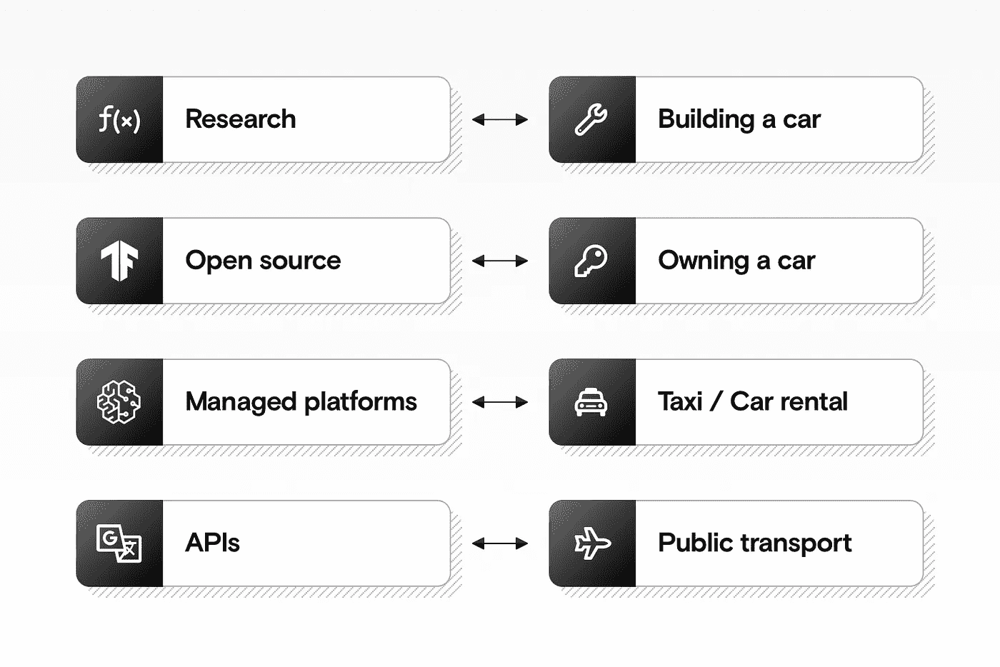
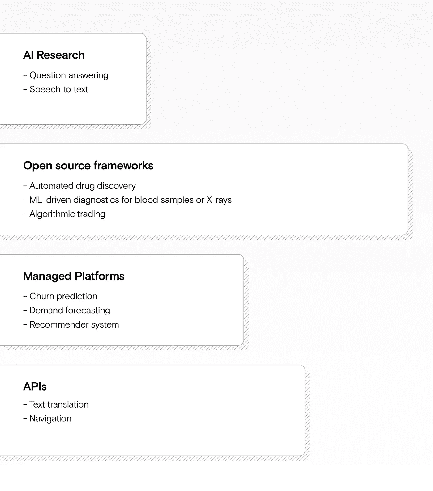

# 进行机器学习的 4 种方式

> 原文：<https://towardsdatascience.com/the-4-ways-of-doing-machine-learning-31afe4de997f?source=collection_archive---------47----------------------->

## 你的团队处理机器学习的正确方式是什么:研究、开源、托管平台还是 API？

来源:作者

机器学习可能会令人困惑。每个人都用这个词来表示稍微不同的东西，有太多的东西需要跟上。

在你选择供应商或平台来满足你的人工智能需求之前，了解机器学习的哪个“层”最适合你很重要。你可以从头开始构建自己的人工智能，使用现成的产品，或者介于两者之间的东西。

在本帖中，我们将带你浏览四个选项，并通过将它们与交通工具进行比较，帮助你确定哪一个最适合你。

# 机器学习的不同“层次”

就像不同的交通工具一样，你可以用不同的方式使用机器学习。来源:作者

*   开发新的语音转文本算法等新颖的研究就像**制造汽车一样。**
*   **tensor flow 等开源框架**类似于**拥有一辆汽车。**
*   **AWS SageMaker 等托管平台**就像**打车**。
*   **Google Translate 等 API**类似于**乘坐航班。**

你可以在不同的层面建立一个机器学习解决方案。当你进入更专业的层时，更多的特性可以直接工作，但是你得到的灵活性更少。

每一层都建立在前一层的基础上:API 通常建立在托管平台上，托管平台建立在开源框架上，开源框架建立在研究的基础上。

# 不同的问题最好由不同的层来解决

哪一层最适合你，主要取决于你要解决的问题。

然而，并非所有的层都是相同的大小:例如，一个问题被一个托管平台干净地解决，这实际上是非常罕见的。

不同的问题更适合不同的层次。“托管平台”层比许多人想象的要小。来源:作者

因为托管机器学习平台背后的公司使用激进的营销策略，所以人们经常高估这些平台的价值。事实上，托管平台通常会让您面临使用现成 API 的最坏情况，同时无法完全解决您在使用开源框架构建定制解决方案时必须接受的棘手问题。

让我们深入了解一下每一层。

# 做人工智能研究就像制造你自己的汽车

如果你想使用人工智能，你可能会想雇佣一个博士团队。但这就像雇佣一个机械工程师团队，让他们为你制造一辆汽车，然后 24/7 全天候为你服务。

如果你是一名参加国际比赛的赛车手，这可能是合理的——但在其他方面可能就不合理了。类似地，像谷歌这样的公司有研究团队，他们通过开发新的算法和架构来推动人工智能的基础。

这项工作成本很高，往往需要几年甚至几十年才能创造出真正的价值。如今，大多数公司甚至不需要考虑采用这种方法。除非你在你的领域取得领先的 1%的成绩，否则拥有一个专门的研究团队是不太可能有意义的。

**你可能想做你自己的人工智能研究，如果:**

*   你正在创造一个 Siri 的竞争对手，你希望它在语音到文本的翻译方面比 Siri 更好。
*   你正与其他投资银行展开正面竞争，并希望让你的交易算法获得优势。

**样本团队结构:**

*   一个研究工程师团队:博士、博士后和教授。
*   能够将研究成果转化为机器学习解决方案的数据、机器学习和 devops 工程师团队。

# 使用开源框架就像拥有自己的汽车一样

随着学术研究的成熟，它演变成像 Tensorflow、PyTorch 和 Keras 这样的开源框架。世界各地成千上万的开发者免费为改进这些框架做出贡献。

任何人都可以免费下载并使用这些开源框架。这些与亚马逊、谷歌和微软等昂贵的托管平台使用的强大“引擎”完全相同。但是您可以灵活地按照自己的方式构建系统。

但就像拥有自己的汽车一样，这也有一些不利之处。如果你有一辆车，你需要学习如何驾驶或者雇一个司机。要使用 Tensorflow 这样的工具，你需要学习编码或者雇佣一个开发者。

如果你有一辆车，你还需要担心加油、更换轮胎和找到一个安全的车库等事情。如果你建立自己的定制机器学习解决方案，你还需要建立一个合适的基础设施并维护它。

**你可能想用开源框架开发你的机器学习解决方案，如果:**

*   您希望改进一个非常适合您的业务的工作流程。
*   您拥有关于内部问题的数据和领域知识。
*   你不怕承担复杂的软件项目。

**样本团队结构:**

*   **内部:**devo PS 工程师、机器学习工程师、数据科学家、项目经理和主题专家的团队。

**或**

*   **外部:**像[美国](https://datarevenue.com)这样的机构，他们使用开源框架构建你的定制 ML 解决方案。

# 使用托管平台就像打车一样

有时候你很快就需要某样东西，你愿意为此付出更多。如果你需要做一次快速的一次性旅行，你可以乘出租车。但是如果你每天都坐长途出租车，那么买辆车可能更划算。

同样，[像 **AWS Sagemaker、Dataiku、Knime、Alteryx**](https://datarevenue.com/en-blog/ml-platforms-dataiku-vs-alteryx-vs-sagemaker) 这样的托管平台，可以让你更快上手，并提供一些预建的组件帮助你更快上手。

但是，尽管这些平台可以节省你的时间，但它们往往比他们的营销团队愿意承认的要有限得多。此外，如果你被“锁定”在其中一个上，费用可能会很高。就像出租车一样，如果你一直需要它，那么它可能是错误的解决方案，你可能会比你预期的更快达到它的极限。

**您可能希望使用托管平台，如果:**

*   机器学习不会成为你业务的重要组成部分，也不会成为竞争优势的来源。
*   您希望将机器学习应用于已经很好理解并且已经在其他地方解决的标准问题(例如，推荐系统、流失分析、需求预测)。

**样本团队结构:**

*   至少一个机器学习工程师，一个开发人员，一个 DevOps 专家。

# 使用 API 就像坐飞机一样

如果你只是需要定期从伦敦到纽约，那么公共交通可能会很好地满足你的需求。这是最不灵活的运输方式，但它做一件事，而且做得很好。

类似地，像 Google Translate 这样的 API 和 web 应用程序最容易插入到您现有的基础架构中。它们还可以根据您的需要进行扩展，并提供无可匹敌的质量水平。

但它们也是最不灵活的。如果您有任何定制需求，那么 API 可能对您来说不够灵活。此外，您还需要支付额外费用:例如，使用翻译 API，您可能需要为翻译的每个字符付费。

**您可能想要使用 API，如果:**

*   你有一个电子商务平台，你想让用户看到其他语言评论的自动翻译。
*   你经营着一家物流公司，你想要自动优化送货路线。

**样本团队结构:**

*   一个开发人员将 API 集成到您的系统中。

# 后续步骤

一旦你选择了对你来说最有意义的“层”，那么你就可以开始进入使用什么样的[编排平台](https://www.datarevenue.com/en-blog/airflow-vs-luigi-vs-argo-vs-mlflow-vs-kubeflow)、[工具](https://www.datarevenue.com/machine-learning-software-tools)或[管理平台](https://www.datarevenue.com/en-blog/ml-platforms-dataiku-vs-alteryx-vs-sagemaker)的细节。

如果您仍然不确定，请与我们预约[免费电话](https://www.datarevenue.com/en-contact)来讨论什么可能适合您！

*本文原载于*[*【datarevenue.com*](https://datarevenue.com/en-blog/the-4-ways-of-doing-machine-learning)*。*