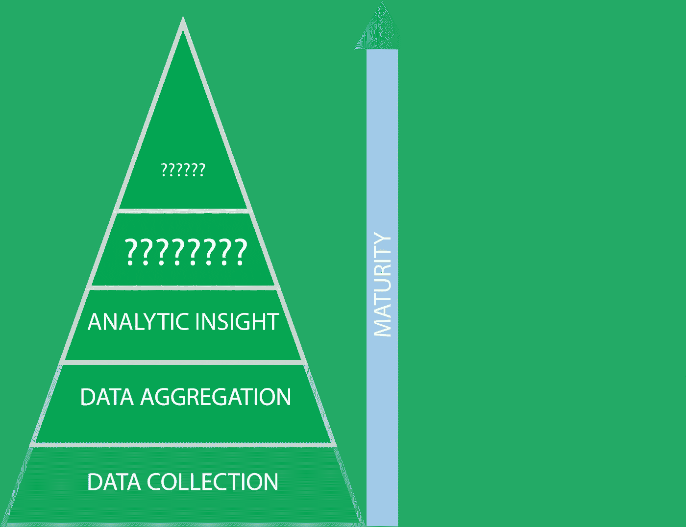
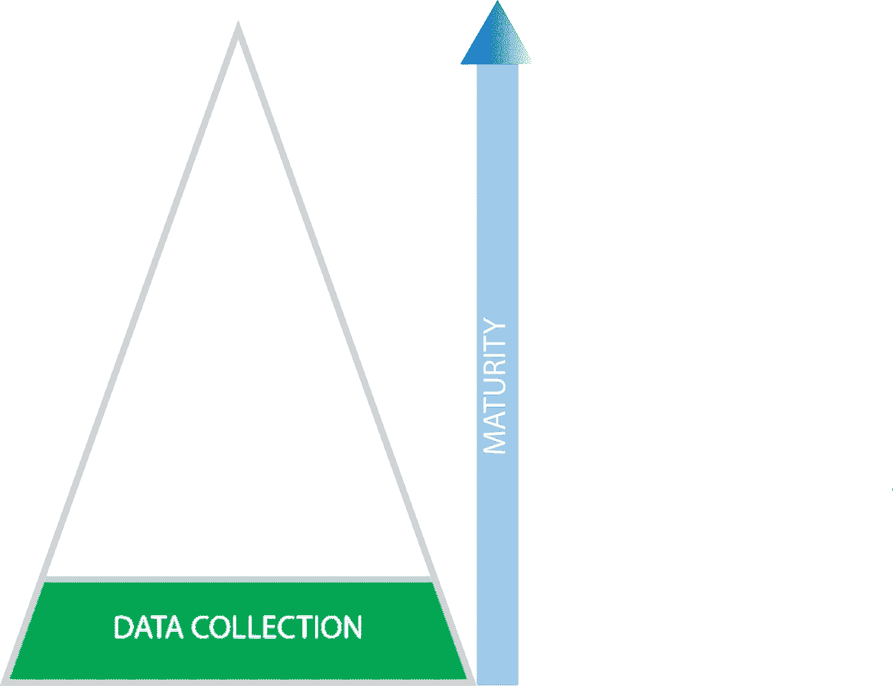
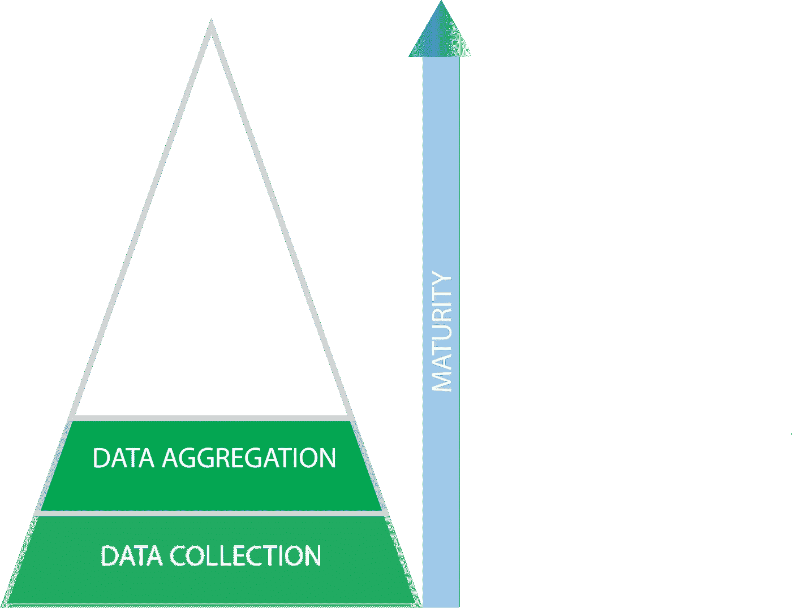
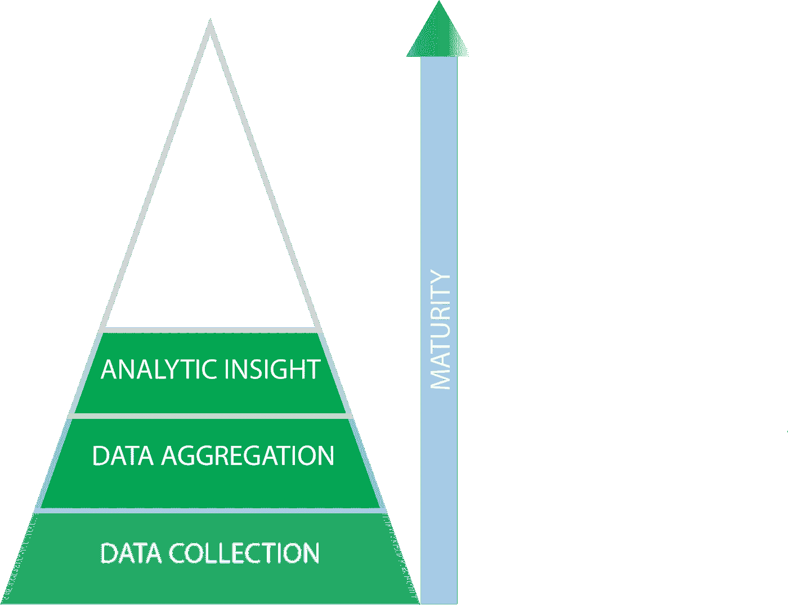
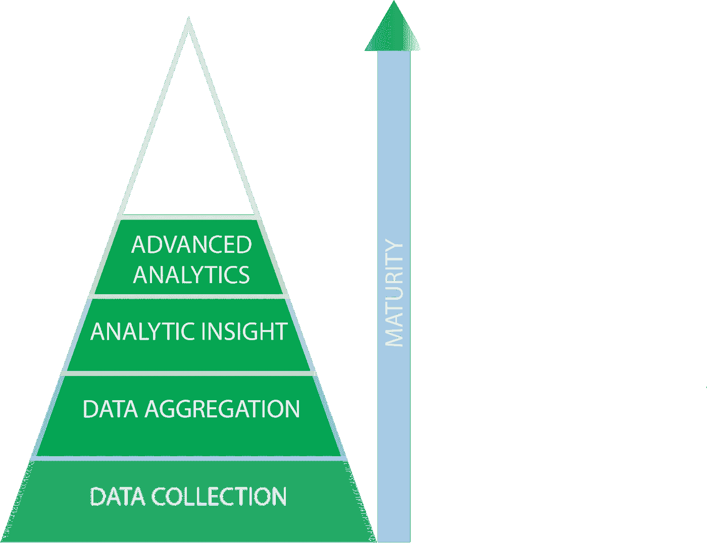
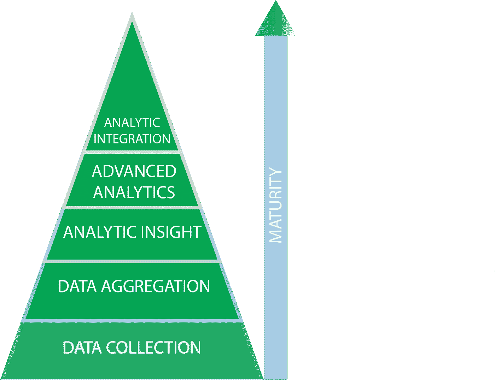

# 采用数据科学的 5 个阶段

> 原文：<https://towardsdatascience.com/the-5-stages-of-data-science-adoption-2bcd22c702c4?source=collection_archive---------13----------------------->

## 你的公司数据流畅吗？

有些公司是为数据科学而建立的。其他人需要做出一些重大的基础设施改变，以便数据科学为他们有效地工作。在本文中，我概述了公司在利用数据科学的过程中经历的数据流畅性的 5 个阶段。

如果你是一名数据科学家，你的公司所处的数据流畅性阶段将极大地影响你所做的工作类型。如果您是数据科学经理或负责公司数据战略的人，这篇文章可以作为将您的组织带到下一个级别的路线图。

第一阶段

## 第一阶段:数据收集

这是数据科学采用生命周期的基础。如果您的公司没有高质量的数据，您就无法执行高质量的数据科学。处于这一阶段的组织认识到数据在未来可能很重要，因此他们开始收集数据。

大多数公司已经过了这个阶段，但是重新评估你的数据收集协议和最佳实践并没有坏处。

第二阶段

## 第 2 阶段:数据汇总

收集数据是不够的。组织意识到，除非对收集的数据进行清理和组织，否则这些数据毫无用处。数据科学家和分析师可以处理杂乱的数据，但通常情况下，至少需要做一点工作。

处于这个阶段的公司通常会雇佣一名数据架构师，并开始将他们的数据转移到一些数据库基础设施中。

这个阶段的开销可能比人们预期的要多。许多不同的系统可以通过多种方式收集数据。数据工程师需要获取所有这些数据，并对其进行格式化，使其具有凝聚力。

第 3 阶段

## 阶段 3:分析洞察力

公司认识到数据可以帮助他们改进决策。在这个阶段，洞察通常是描述性的，并且基于在数据透视表中发现的趋势。人类的决策正在被分析洞察力所补充。这项工作通常可以由一组分析师来完成。

这种洞察力的例子通常出现在金融或营销领域。公司基于这种类型的分析对客户进行细分，并在不同的市场销售不同的产品。

第四阶段

## 第 4 阶段:高级分析

你开始使用更先进的机器学习模型来改善决策。这个阶段的特点是模型在人的监督下做出决策。组织需要认同和信任他们的数据科学团队，才能达到流畅的这一阶段。在这个级别，数据科学家是必须的。

高级分析将数据科学视为一种产品。数据科学家制作供自己或他人“使用”的研究和模型。例如，如果一家卡车运输公司建立了一个模型，可以预测车辆何时需要新轮胎。这个模型，结合人类的评估，将决定何时更换轮胎。

第五阶段

## 阶段 5:分析集成

数据流畅性层级的最后一个阶段是将数据科学完全整合到业务的某些领域中。在这里，机器学习模型被投入生产，并在没有人类直接监督的情况下做出决策。在这个阶段，你的数据科学家(或机器学习工程师)正在与你的工程团队合作，让数据科学成为一种服务。

分析集成将数据科学视为一项服务。这方面的一个例子是一个在线网站的推荐系统，它根据顾客的喜好和过去的购买情况向顾客展示不同的产品。

[https://www.youtube.com/watch?v=BXmEmIK5aqI](https://www.youtube.com/watch?v=BXmEmIK5aqI)

想想你的公司在数据流畅的阶段。你有合适的资源，知道如何将你的能力提升到一个新的水平吗？