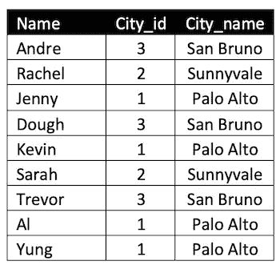

# SQL Select 语句过程的 6 个步骤

> 原文：<https://towardsdatascience.com/the-6-steps-of-a-sql-select-statement-process-b3696a49a642?source=collection_archive---------5----------------------->

## 使用简单示例详细解释查询执行顺序

****

**由 [Pixabay](https://pixabay.com/service/terms/#license) 授权**

# **介绍**

**在本文中，我将一步一步地描述对关系数据库执行查询的逻辑过程。为此，我将使用两个简单的非标准化表格:*公民*和*城市。*它们描述如下:**

****

**表格描述**

***市民*表包含杰出市民的数据和他们居住的城市的识别号，*城市*是包含城市名称和他们各自的识别号的表。**

****

**数据**

**假设我们只想知道两个城市的名称，除了圣布鲁诺，那里有两个或更多的居民。我们也希望结果按字母顺序排序。**

**这是获取所需信息的查询。**

```
SELECT city.city_name AS "City"
FROM citizen
JOIN city 
ON citizen.city_id = city.city_id 
WHERE city.city_name != 'San Bruno'
GROUP BY city.city_name
HAVING COUNT(*) >= 2
ORDER BY city.city_name ASC
LIMIT 2
```

# **查询流程步骤**

**1.获取数据(*从，加入* )
2。行过滤器( *Where* )
3。分组(*分组由* )
4。组过滤器(*有* )
5。返回表达式(*选择* )
6。指令&分页(*指令由&限制/偏移*)**

## ****第一步:获取数据( *From，Join* )****

```
FROM citizen
JOIN city 
```

**该过程的第一步是执行来自子句的*中的语句，随后是 *Join* 子句。这些操作的结果是得到两个表的笛卡尔乘积。***

****

**笛卡尔乘积**

**一旦来自的*和*连接*被执行，处理器将根据条件*得到符合条件的行。****

```
ON citizen.city_id = city.city_id
```

****

**合格的行**

## ****第二步:行过滤器(Where)****

**在获得合格的行之后，它被传递给 *Where* 子句。这使用条件表达式评估每一行。当行的计算结果不为 true 时，它们将从集合中移除。**

```
WHERE city.city_name != 'San Bruno'
```

****

## ****第三步:分组(分组依据)****

**下一步是执行 *Group by* 子句*，*它会将具有相同值的行分组到汇总行中。此后，所有的*选择*表达式将按组计算，而不是按行计算。**

```
GROUP BY city.city_name
```

****

## ****第四步:分组过滤(Having)****

**Having 子句的*由一个逻辑谓词组成，它由*在*组之后处理，并且它不再引用单个行，只能引用行组。***

```
HAVING COUNT(*) >= 2
```

**执行该操作的结果将保持如上图所示的设置。这是因为每个组中都有两个或更多的元素。**

## **第 5 步:返回表达式(选择)**

**在这个步骤中，处理器评估查询结果将被打印的内容，以及是否有一些函数要在数据上运行，如 *Distinct* 、 *Max* 、 *Sqrt* 、 *Date、Lower、*等。在这种情况下，select 子句只打印城市名称，并用标识符“city”作为 city_name 列的别名。**

```
SELECT city.city_name AS "City"
```

****

## **步骤 6:排序(Order by)和分页(Limit / Offset)**

**查询的最后处理步骤处理显示顺序和限制结果集大小的能力。在我们的例子中，要求最多显示两个按字母顺序排序的记录。**

```
ORDER BY city.city_name ASC
LIMIT 2
```

****

**结果集**

## **结论**

**更好地理解事物是如何工作的，就能获得更好的结果。对如何执行一个 *Select* 语句有了基本的理解，就更容易得到预期的结果集。**

**希望这篇文章对你也有帮助。**