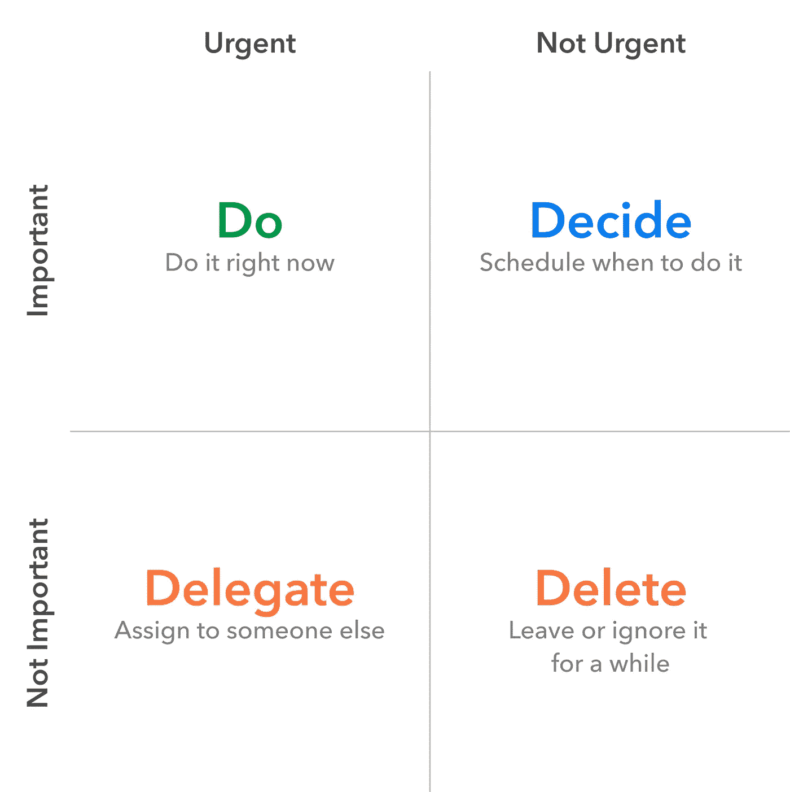

# 数据科学的 7 个习惯

> 原文：<https://towardsdatascience.com/the-7-habits-of-data-science-29b150cbf374?source=collection_archive---------42----------------------->

## 生产力

## 用这些习惯开始你的每一天

米切尔·霍兰德在 [Unsplash](https://unsplash.com?utm_source=medium&utm_medium=referral) 上的照片

每天，我都过着我的日常生活。重复一遍。

在数据科学的世界里，我做的大部分工作是探索未知的领域(*读作:数据*)。工作流或多或少类似于每个项目迭代。数据收集—探索—流程—建模—测试—部署—监控—展示—重复。我想知道，我怎样才能确保我不是一遍又一遍地重复同样的循环？我怎样才能做得更好？

我找到的答案是:**适应我的习惯**。您如何:

*   查看和重构数据科学问题，
*   创建相互协作，以及
*   保持有效沟通

是经常被忽视的习惯。请记住，数据科学不是构建最佳模型，而是通过数据产生积极影响。你的习惯会影响你对每个问题的反应。

受斯蒂芬·R·科维的启发， [**高效能人士的 7 个习惯**](https://www.franklincovey.com/the-7-habits.html) 改变了我。对我来说，这仍然是一本很有影响力的书。不管是不是数据科学，在我的工作流程中应用这些习惯可以提高我的工作效率。我想和你分享这些让我保持积极心态的习惯。

以下是我从数据科学的角度对这 7 个习惯的看法。当我们经历它的时候，问问你自己，你需要改变这些习惯吗？

# 1 —积极主动

由[斯蒂芬·莱昂纳迪](https://unsplash.com/@stephenleo1982?utm_source=medium&utm_medium=referral)在 [Unsplash](https://unsplash.com?utm_source=medium&utm_medium=referral) 上拍摄的照片

嗯，不是那种主动。相反，为了更大的利益采取主动。

数据科学不是做利益相关者想要的事情。它是增长黑客和解决商业问题的工具。没有人比你更了解这些数据。一个高效的数据人员应该就如何利用数据提出建议！人们可能没有意识到数据的力量。

专注于数据能带来什么价值！

> “被动型的人受感情、环境、条件和周围环境的驱使。积极主动的人是由价值观驱动的——经过仔细思考、选择和内化的价值观。”—斯蒂芬·柯维

# 2——以最终目标为出发点

照片由 [Unsplash](https://unsplash.com?utm_source=medium&utm_medium=referral) 上的[阿莱恩·德戴娜](https://unsplash.com/@alinedenadai?utm_source=medium&utm_medium=referral)拍摄

数据科学不是完成你的工作，而是找到实现目标的最佳途径。

回答商业问题时，要想好结果会是什么。没有它，任何项目都不能很好地计划和执行。当我们不知道范围的时候，我们怎么能工作呢？一个有效的数据人员应该对项目如何完成有一个好的想法。每个项目的最佳实践可能有所不同。

无论是仪表板、模型、数据产品还是电子表格文件；最好的输出是什么，怎么做？

> “从心中的目标开始，意味着从清楚地了解你的目的地开始。这意味着知道你要去哪里，这样你才能更好地了解你现在在哪里，这样你迈出的步伐才会始终朝着正确的方向。”—斯蒂芬·柯维

# 3-把重要的事情放在第一位

艾森豪威尔决策矩阵。图片作者。

数据科学不在于你做了多少分析。

必须优先解决最重要和最紧迫的问题。如果数据科学团队被大量的请求所淹没，这 4 个象限必须明确。一个有效的数据人员知道应该先做什么。我们为什么要在无关紧要的事情上费心呢？

衡量什么是重要的，什么是紧急的，并始终坚持最高优先级从长远来看会有回报。

> "关键不在于优先处理你日程表上的事情，而在于安排好你的优先事项."—斯蒂芬·柯维

# 4——考虑双赢

由[在](https://unsplash.com/@heftiba?utm_source=medium&utm_medium=referral) [Unsplash](https://unsplash.com?utm_source=medium&utm_medium=referral) 上拍摄的

数据科学与你的工作表现无关。

你有没有遇到过阻碍，想要用你的方式解决？伟大的组织在内部(甚至外部)协作。思考双方如何双赢是获得信任和确保长期成功的关键。一个有效的数据家伙知道每个人都可以赢！如果一个人赢不了，再想想。

关注那些不是片面的甚至只是权宜之计的解决方案。

> “这不是你的方式或我的方式；是更好的方式，更高的方式。”—斯蒂芬·柯维

# 5 —首先寻求理解，然后寻求被理解

照片由 [Devin Avery](https://unsplash.com/@devintavery?utm_source=medium&utm_medium=referral) 在 [Unsplash](https://unsplash.com?utm_source=medium&utm_medium=referral) 上拍摄

数据科学不在于你的项目有多复杂。

大多数数据人认为数字和逻辑驱动，而其他大多数人不这么认为。然而，并不是所有的问题都可以用数字来解释。获得对人的充分理解的关键是同理心和开放的心态。一个有效的数据人员在做出假设之前应该首先理解。错误的方法不太有效。

寻求另一种观点，或许会开启另一种更好的可能性。让我们多听听！

> “大多数人没有带着理解的意图去听；他们听着，意图回答。”—斯蒂芬·柯维

# 6 —协同增效

佩里·格罗内在 [Unsplash](https://unsplash.com?utm_source=medium&utm_medium=referral) 上的照片

数据科学不是你一个人的工作。

要完美地执行一个精心设计的计划，团队合作是必不可少的。想象一下:没有实现的数据建模；没有用户定义的指标的仪表板；没有数据工程的分析。没用。一个高效的数据人员必须能够与其他人同步工作。组织之所以存在，是因为每个人都在其中。

求协作！每个人可能会提供不同的和更好的选择。

> “协同优于我的方式或你的方式。这是我们的方式。”—斯蒂芬·柯维

# 7 —磨快锯子

照片由[思想目录](https://unsplash.com/@thoughtcatalog?utm_source=medium&utm_medium=referral)上的 [Unsplash](https://unsplash.com?utm_source=medium&utm_medium=referral)

我意识到，数据科学是巨大的。

只有通过持续不断的学习，才能对数据科学有更深入的了解。争取更多的知识，适应新的问题。没有放之四海而皆准的方法。一个高效的数据人员随时准备解决任何问题。发展自己，接受挑战！

记住你是你最大的财富！

> "除非你不断提高自己的技能，否则你很快就会变得无关紧要。"—斯蒂芬·柯维

# 现在，你最需要改进的习惯是什么？

我知道这些习惯已经有 5 年了，但是我还在继续努力。控制习惯很难，因为它们迫使你走出舒适区。但是，不要担心你不能控制的事情，记住你只能控制你自己。

> “从小事做起，许下承诺并信守承诺。然后，许下更大的承诺，并信守承诺。”—斯蒂芬·柯维

更进一步，实际上还有第八个习惯。**找到自己的声音，并激励他人找到自己的声音**。话题从效率转移到伟大。将愿景、纪律、激情和良知转化为灵感。如果你是数据科学的领导者，请考虑阅读它！

一步一个脚印！祝大家平安健康。

## 参考

[1]斯蒂芬·R·科维，[《高效能人士的 7 个习惯](https://www.franklincovey.com/the-7-habits.html) (1989)

[2]斯蒂芬·R·科维，[第八个习惯:从有效到伟大](https://resources.franklincovey.com/the-8th-habit) (2004)