# 每个数据科学家都应该知道的 9 个概率概念和公式

> 原文：<https://towardsdatascience.com/the-9-concepts-and-formulas-in-probability-that-every-data-scientist-should-know-a0eb8d3ea8c4?source=collection_archive---------9----------------------->

## 学习如何计算概率，两个事件的交集和并集之间的差异，条件概率，精度测量和主要计数技术


乔希·阿佩尔的照片

# 概率是什么？

概率是一个反映特定事件发生的**几率的数字。换句话说，它量化了(从 0 到 1，或从 0%到 100%) **一个事件发生的可能性**。**

概率是数学的一个分支，它提供了描述随机过程的模型。这些数学工具允许建立随机现象的理论模型，并使用它们进行预测。像每个模型一样，概率模型是对世界的简化。然而，一旦模型捕捉到基本特征，它就是有用的。

在本文中，我们提出了 9 个概率的基本公式和概念，每个数据科学家都应该理解和掌握，以便恰当地处理任何概率项目。

# 1.概率总是在 0 和 1 之间

事件发生的概率总是在 0 到 1 之间(或者 0%到 100%)，

0≤P(A)≤1

*   如果事件不可能发生: *P(A) = 0*
*   如果一个事件是确定的: *P(A) = 1*

例如，用标准的六面骰子(正面从 1 到 6)掷出 7 是不可能的，所以它的概率等于 0。用硬币掷头或尾是确定的，所以它的概率等于 1。

# 2.计算概率

如果样本空间的元素(随机实验的所有可能结果的集合)是等概率的(=所有元素具有相同的概率)，则事件发生的概率等于有利情况的数量(它可能发生的方式的数量)除以可能情况的数量(结果的总数):

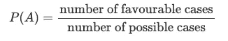

例如，六面骰子的所有数字都是等概率的，因为它们都有相同的出现概率。用骰子掷出 3 的概率是

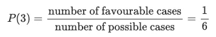

因为只有一个有利的情况(只有一张脸上面有 3)，有 6 个可能的情况(因为一共 6 张脸)。

# 3.事件的补充

事件的互补(或相反)概率为:


例如，没有掷出 3 的概率是:

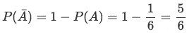

# 4.两个事件的联合

两个事件结合的概率是其中任何一个事件发生的概率:

P(A 或 B)= P(A∪B)= P(A)+P(B)-P(A∪B)

假设某一年两栋房子发生火灾的概率是:

*   在房子 A 中:60%，所以 P(A)=0.6
*   在房屋 B 中:45%，因此 P(B)=0.45
*   在两院中至少有一个:80%，所以 P(A∪B)=0.8

图形上我们有

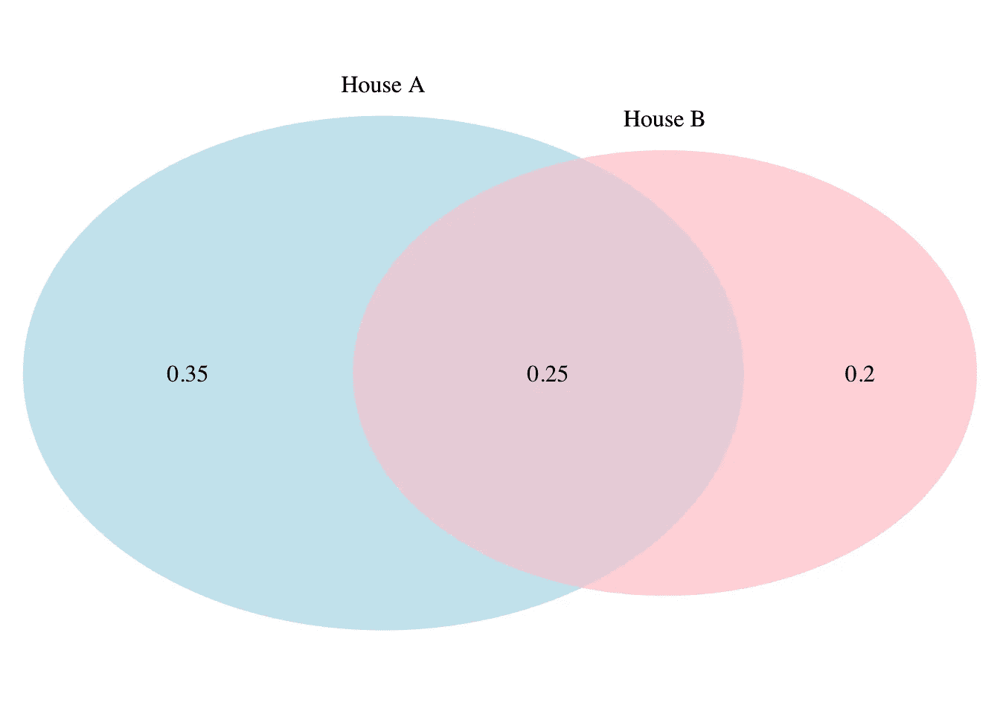

房屋 A **或房屋 B**发生火灾的概率为

P(A∪B)= P(A)+P(B)-P(A∪B)= 0.6+0.45 0.25 = 0.8

通过对 P(A)和 P(B)求和，计算 A 和 B 的交集，即 P(A∩B)两次。这就是我们减去它，只计算一次的原因。

如果两个事件互斥(即两个事件不能同时发生)，则两个事件发生的概率等于 0，因此上述公式变为

P(A∪B)=P(A)+P(B)

例如，事件“在六面骰子上掷出 3”和事件“掷出 6”是两个互斥的事件，因为它们不能同时发生。因为它们的联合概率等于 0，所以在六面骰子上掷出 3 或 6 的概率是

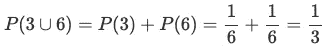

# 5.两个事件的交集

如果两个事件是独立的，那么这两个事件相交的概率(即联合概率)就是这两个事件发生的概率:

(美国和 B)=P(A∩B)=P(A)⋅P(B)

例如，如果掷两枚硬币，两枚硬币都是反面的概率是

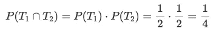

注意 P(A∩B)=P(B∩A)。

如果两个事件互斥，则它们的联合概率等于 0:

P(A∩B)=0

# 6.两个事件的独立性

由于上述公式，可以验证两个事件的独立性。如果等式成立，则称这两个事件是独立的，否则称这两个事件是相关的。形式上，事件 A 和 B 是独立的当且仅当

P(A∩B)=P(A)⋅P(B)

*   在两个硬币的例子中:

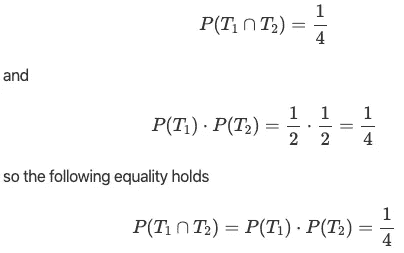

这两个事件因此是独立的，表示为

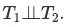

*   在两栋房子发生火灾的例子中(见[第 4 节](https://www.statsandr.com/blog/the-9-concepts-and-formulas-in-probability-that-every-data-scientist-should-know/#union-of-two-events)):

P(A∩B)=0.25

和

P(A)⋅P(B)=0.6⋅0.45=0.27

所以下面的等式不成立

P(A∩B)≠P(A)⋅P(B)

这两个事件因此是相关的(或不独立的)，表示为

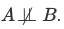

# 7.条件概率

假设两个事件 A 和 B，P(B)>0。给定(已知)B 的条件概率是在事件 B 已经发生的情况下事件 A 发生的可能性:

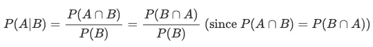

注意，一般情况下，给定 B 的概率不等于 B 给定 A 的概率，即 P(A|B)≠P(B|A)。

从条件概率的公式中，我们可以推导出乘法定律:

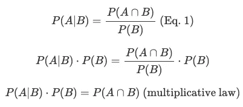

如果两个事件是独立的，P(A∩B)=P(A)⋅P(B)，并且:

*   P(B)>0，条件概率变成

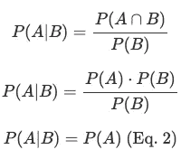

*   P(A)>0，条件概率变成

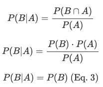

等式 2 和 3 意味着知道一个事件发生不会影响另一个事件结果的概率。这实际上是独立性的定义:如果知道一个事件的发生无助于预测(不影响)另一个事件的结果，那么这两个事件本质上是独立的。

# 贝叶斯定理

从条件概率和乘法定律的公式中，我们可以推导出贝叶斯定理:

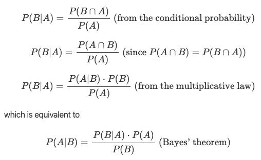

# 例子

为了说明条件概率和贝叶斯定理，假设下面的问题:

为了确定一个人是否患有某种疾病，需要进行血液测试。当一个人患有这种疾病时，该测试可以在 80%的情况下揭示疾病。当疾病不存在时，在 90%的情况下测试是阴性的。经验表明，这种疾病出现的概率为 10%。研究人员想知道在测试结果为阳性的情况下，个人患有该疾病的概率。

为了回答这个问题，定义了以下事件:

*   病人:检查结果是阳性的
*   医生:这个人有这种疾病

此外，我们用一个树形图来说明这一说法:

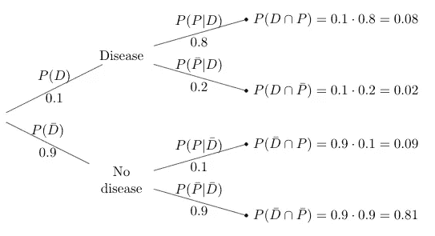

(所有 4 种情况的总和必须等于 1，因为这 4 种情况包括所有可能的情况。)

假设测试结果为阳性，我们在寻找个人患病的概率，P(D|P)。遵循条件概率的公式(等式)。1)我们有:

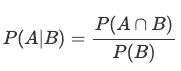

就我们的问题而言:

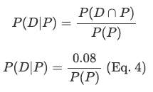

从树形图中，我们可以看到，在两种情况下，阳性测试结果是可能的:(I)当一个人患有疾病时，或者(ii)当这个人实际上没有患有疾病时(因为测试并不总是正确的)。为了找到阳性测试结果的概率 P(P ),我们需要总结这两种情况:

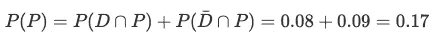

情商。4 然后变成

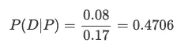

如果检测结果呈阳性，患这种疾病的概率只有 47.06%。这意味着，在这种特定情况下(相同的百分比)，一个人在知道自己的测试呈阳性的情况下，患病的几率不到 1/2！

这一相对较小的百分比是由于这种疾病相当罕见(只有 10%的人口受到影响)以及测试并不总是正确的(有时它检测到疾病，尽管它不存在，有时它没有检测到它，尽管它存在)。因此，与有阳性结果和实际患病的人的百分比(8%)相比，有更高百分比的健康人有阳性结果(9%)。这就解释了为什么在宣布检测结果之前往往要进行几项诊断性检测，尤其是对罕见疾病。

# 8.准确度测量

基于上述疾病和诊断测试的示例，我们解释了最常见的准确性测量:

*   假阴性(数量和比率)
*   假阳性(数量和比率)
*   灵敏度
*   特征
*   阳性预测值
*   阴性预测值

在深入研究这些准确性度量的细节之前，这里有一个度量和树形图的概述，其中为 4 个场景中的每一个添加了标签:

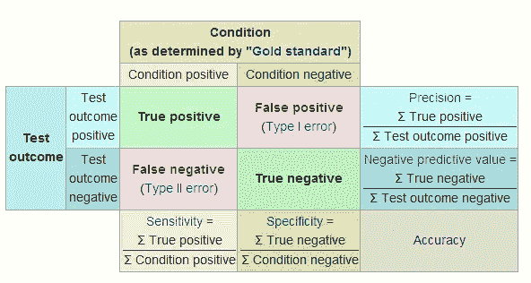

改编自维基百科

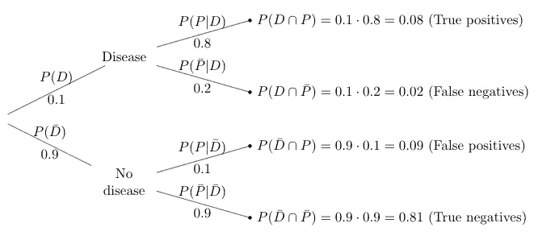

# 假阴性

假阴性(FN)是指被错误标记为**而不是**患有疾病或状况的人数，而实际上它是存在的。这就像告诉一个怀孕 7 个月的女人她没有怀孕。

从树形图中，我们可以看到:

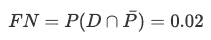

而且，假阴性**率** ( *FNR* )定义为

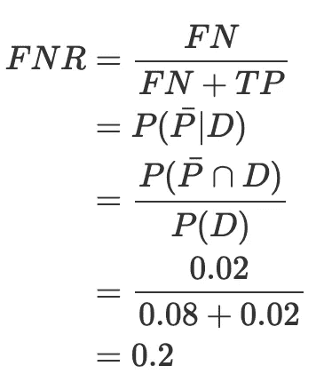

# 假阳性

假阳性(FP)是指被错误标记为患有疾病或状况的人数，而实际上是**而不是**存在。这就像告诉一个男人他怀孕了。

从树形图中，我们可以看到:

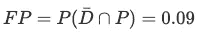

而且，假阳性**率** ( *FPR* )定义为

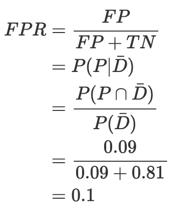

# 灵敏度

测试的敏感性，也称为回忆，衡量测试在条件存在时检测条件的能力(被正确识别为患有疾病的患者的百分比):

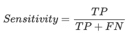

其中 *TP* 为真阳性。

从树形图中，我们可以看到:

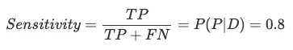

# 特征

检测的特异性衡量检测在不存在疾病时正确排除疾病的能力(被正确识别为未患病的健康人的百分比):

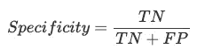

其中 *TN* 是真正的负数。

从树形图中，我们可以看到:

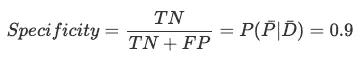

# 阳性预测值

阳性预测值，也称为精度，是与条件的存在相对应的阳性结果的比例，因此阳性结果是真正阳性结果的比例:

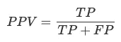

从树形图中，我们可以看到:

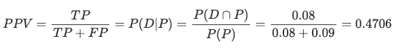

# 阴性预测值

阴性预测值是对应于不存在该条件的阴性的比例，因此阴性结果是真阴性结果的比例:

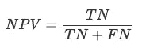

从树形图中，我们可以看到:

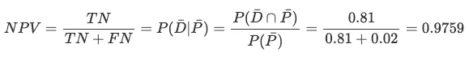

# 9.计数技术

为了使用第 2 节中的公式，必须知道如何计算可能元素的数量。

概率中有 3 种主要的计算技术:

1.  增加
2.  排列
3.  结合

在等概率结果的情况下，如何计算可能元素的数量，见下文。

# 增加

乘法法则如下:

#(A×B)=(#A)×(#B)

其中##是元素的数量。

# 例子

在餐馆里，顾客必须选择一道开胃菜、一道主菜和一道甜点。餐厅提供两道开胃菜、三道主菜和两道甜点。有多少不同的选择是可能的？

有 12 种不同的可能选择(即 2⋅3⋅2).

# 排列

排列的数量如下:

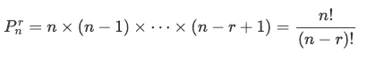

其中 r 为长度，n 为元素个数，r≤n，注意 0！=1 和 k！=k×(k−1)×(k−2)×⋯×2×1 如果 k=1，2，…

排列的顺序很重要！

# 例子

计算集合 A={a，b，c，d}中长度为 2 的排列，没有一个字母重复。你找到了多少种排列？

## 用手

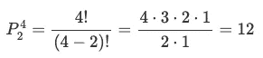

## 在 R 中

```
library(gtools)x <- c("a", "b", "c", "d")# See all different permutations
perms <- permutations(
  n = 4, r = 2, v = x,
  repeats.allowed = FALSE
)
perms##       [,1] [,2]
##  [1,] "a"  "b" 
##  [2,] "a"  "c" 
##  [3,] "a"  "d" 
##  [4,] "b"  "a" 
##  [5,] "b"  "c" 
##  [6,] "b"  "d" 
##  [7,] "c"  "a" 
##  [8,] "c"  "b" 
##  [9,] "c"  "d" 
## [10,] "d"  "a" 
## [11,] "d"  "b" 
## [12,] "d"  "c"# Count the number of permutations
nrow(perms)## [1] 12
```

# 结合

组合的数量如下:

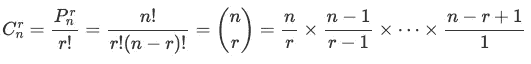

其中 r 是长度，n 是元素的数量，r≤n。

组合中的顺序**不**重要！

# 例子

一个 5 个孩子的家庭，3 个女孩 2 个男孩的概率是多少？假设生女孩和生男孩的概率相等。

## 用手

*   3 名女孩和 2 名男孩(有利案例):

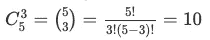

*   可能病例数:2^5=32

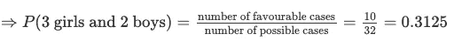

## 在 R 中

*   3 个女孩和 2 个男孩:

```
choose(n = 5, k = 3)## [1] 10
```

*   可能情况的计数:

```
2^5## [1] 32
```

3 个女孩和 2 个男孩的概率:

```
choose(n = 5, k = 3) / 2^5## [1] 0.3125
```

感谢阅读。我希望这篇文章能帮助你理解概率论中最重要的公式和概念。

和往常一样，如果您有与本文主题相关的问题或建议，请将其添加为评论，以便其他读者可以从讨论中受益。

**相关文章:**

*   [学生的 R 和手工 t 检验:如何在不同场景下比较两组](https://www.statsandr.com/blog/student-s-t-test-in-r-and-by-hand-how-to-compare-two-groups-under-different-scenarios/)
*   [R 中的相关图:如何突出显示数据集中最相关的变量](https://www.statsandr.com/blog/correlogram-in-r-how-to-highlight-the-most-correlated-variables-in-a-dataset/)
*   [聚类分析完全指南:k-means 和手动和 in R 系统聚类](https://www.statsandr.com/blog/clustering-analysis-k-means-and-hierarchical-clustering-by-hand-and-in-r/)
*   我的数据符合正态分布吗？关于最广泛使用的分布以及如何检验 R 中的正态性的注释
*   [手工卡方独立性检验](https://www.statsandr.com/blog/chi-square-test-of-independence-by-hand/)

*原载于 2020 年 3 月 3 日 https://statsandr.com*[](https://statsandr.com/blog/the-9-concepts-and-formulas-in-probability-that-every-data-scientist-should-know/)**。**