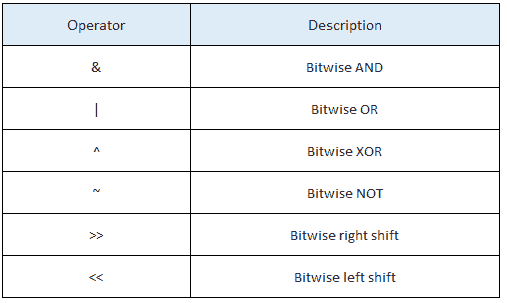

# 9 必须知道处理任何熊猫数据帧的函数

> 原文：<https://towardsdatascience.com/the-9-must-know-functions-to-handle-any-pandas-dataframe-d1d5727e7269?source=collection_archive---------19----------------------->

## 一个包含熊猫最常用的所有函数和调用的备忘单


伊莲娜·洛希娜在 [Unsplash](https://unsplash.com/s/photos/panda?utm_source=unsplash&utm_medium=referral&utm_content=creditCopyText) 上的照片

## **在这篇文章中你会发现:**

*   五个功能**了解你的数据集**
*   **按值过滤**您的数据框架
*   有了**日期时间**类型
*   **合并**多个数据集
*   手柄**列**
*   **分组** **乘**值
*   **应用**功能
*   使用**λ**方法

如果您还不是会员，请在此获得您的中级会员资格！

# 1.了解您的数据集

加载数据集后要做的第一件事是仔细查看数据框中的信息。为此，以下函数正好满足您的需求。

***Head()*** 打印数据集的前 5 行，包括列标题和每一行的内容。

```
df.head()
```

***Info()*** 打印列标题和存储在每列中的数据类型。当您试图了解哪些值需要更改类型以便对它们应用函数时，此函数非常有用。存储为字符串的整数在转换为整数之前不会相加。

```
df.info()
```

***Shape()*** 以格式('行' x '列')给出数据帧的大小。

```
df.shape
```

***Describe()*** 给出数据集中所有数值的平均值、中值、标准差和百分位数。我建议在确保所有数值都存储为整数或浮点数之后，使用 describe。

```
df.describe()
```

***【唯一()*** 允许你查看每一列中的唯一值。当您有分类数据并且想要了解类别时，这尤其有用。

```
df['columnName'].unique()
```

为给定的列查找数据集中重复次数最多的值。

```
df.column.value_counts().head(**20**)
```

# 2.按值过滤

过滤是处理任何熊猫数据帧时需要的一项基本技能。为了将列中的值与筛选器进行比较，使用了运算符。

可以对数值进行过滤，也可以对定性或分类值进行过滤。

```
df = df[df.value > 0 ]
df = df[df.column != 'value']
```



通过使用按位运算符，可以应用各种过滤器。在下面的示例中，OR 和 and 运算符用于创建两个新的数据帧，它们是原始数据帧的过滤版本。

```
df1 = df[(df.Party == ‘Conservative’) | (df.Party == ‘Labour’)]
df2 = df[(df.Party == ‘Conservative’) & (df.City == ‘London’)]
```

# 3.日期时间

datetime 数据类型允许您重新格式化 pandas 数据帧中的列，以便能够处理日期、按最早/最近的日期排序或者甚至按周/月分组。这可以通过 pandas 中的 ***到 _datetime()*** 函数轻松完成。

```
df[‘date’]=pd.to_datetime(df[‘date’], infer_datetime_format=True)
```

如果我们想得到一个更详细的视图，就把日期分成几个部分。

```
df['month'] = df['date'].dt.month
```

# 4.合并数据集

两个数据帧的连接或合并可以在列或索引上完成。如果在列上连接列，数据帧索引*将被忽略*，并将为合并后的数据集创建一个新的索引。否则，如果在索引上连接两个数据帧，该索引将作为合并发生的公共列。

```
merged = pd.merge(df**,** df2**,** on='episode'**,** how='inner')
merged = pd.merge(df**,** df2**,** on='episode'**,** how='outer')
```

一个**内部**合并，将只保留共享公共索引或列值的每个数据集中的值。**外部**合并将连接整个数据集，并为合并时在其他数据集中找不到的列和行返回空值。


# 5.处理您的列

可以使用*列*参数打印列名，也可以使用。前面提到的 info()函数。

```
print(df.columns)
df.info()
```

重命名列可以通过一种快速简单的方式来完成。这在使用“合并”功能后特别有用，新列通常被标记为 *column_x* 和 *column_y* 。

```
df.rename(columns={"oldName1": "newName1", "oldName2": "NewName2"})
```

删除列也是一个必须知道的功能。参数 *inplace = True* 经常被遗忘，没有它你将看不到你的数据帧的任何变化。

```
df.drop(columns=[‘column1’, ‘column2’], inplace = True)
```

# 6.按值分组

这个 pandas 函数将根据传递的列名创建行之间的层次结构。第一个示例将根据国籍对行进行分组，并对每个国籍进行计数。结果将是一个包含两列的 data frame:Nationality 和 count。

```
df1 = df.groupby(["nationality"]).count().reset_index()
```

当不想丢失存储在其他列中的信息时，第二个例子特别有用。这里，产生的数据帧将有三列:姓名、国籍和每个国籍的姓名计数。

```
df1 = df.groupby(["name", "nationality"]).count().reset_index()
```

当可视化数据帧中的不同分组时，这可能特别有用。下面的[文章](/step-by-step-bar-charts-using-plotly-express-bb13a1264a8b)将带你了解如何使用该功能绘制条形图。

# 7.对所有行应用函数

到目前为止，这是每天使用熊猫数据帧的最强大的应用之一。apply()函数，顾名思义，允许我们对数据帧的每一行应用一个函数。apply()方法将 df 数据帧中的一行一行地传递给 string_to_float()函数。

```
def string_to_float(row)
    row['value'] = float(row[value'])
    return row(['value'])df['price'] = df.apply(string_to_float, axis = 1)
```

行['value']只是传递给函数的 df 数据帧的行。我可以通过指定它们的名称来访问这一行中的任何列。

# 8.λ函数

lambda 函数是一个不绑定到标识符的匿名函数。一般结构如下:

> λ*自变量* : *表达式*

对参数执行表达式，并返回结果。

一个非常基本的 lambda 函数应用在非熊猫环境中的例子。

```
x = lambda a : a + 10
print(x(5))
```

如果您想将 lambda 函数应用于整个数据集，语法如下。

```
df['value'] = df['value'].apply(lambda x: float(x) if != "Not Available" else none)
```

当值为“可用”时，此示例更改列的数据类型。

# 什么时候使用适当的函数，什么时候使用 lambda 函数？

这是我留给你的事情…取决于你想执行多少任务，一个合适的函数可能更容易构建。而使用 lambda 函数可以实现快速而简单的更改。

# 非常感谢你的阅读！

更多类似的文章，请点击这里在 Medium [上找到我！](https://towardsdatascience.com/medium.com/@alejandra.vlerick)

如果您有任何关于如何改进的**问题**、**建议**或**想法**，请在下面留下评论或通过 LinkedIn [这里](https://www.linkedin.com/in/alejandra-g-283595b8)取得联系。