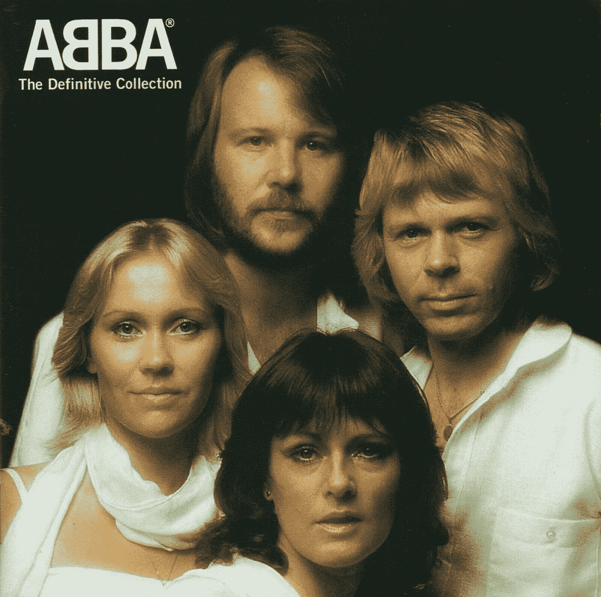
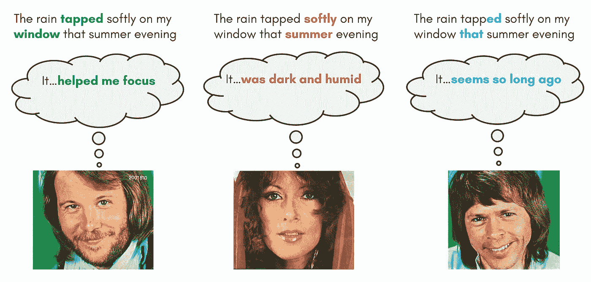
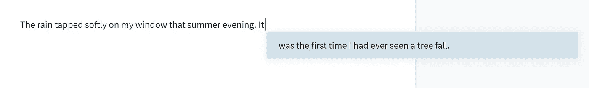
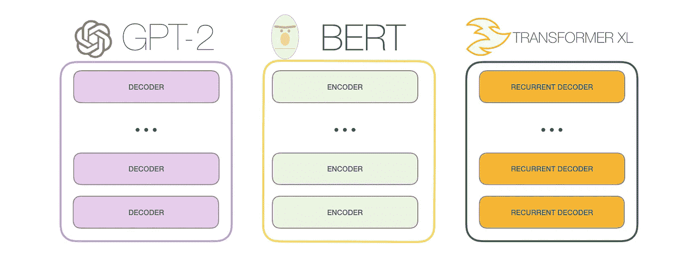
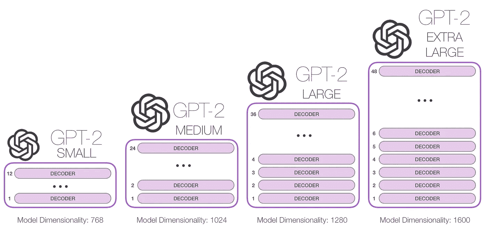
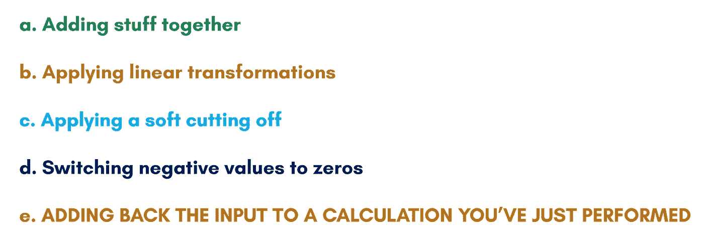
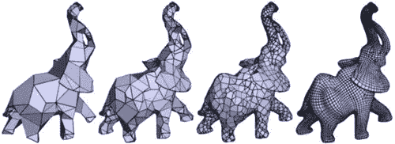
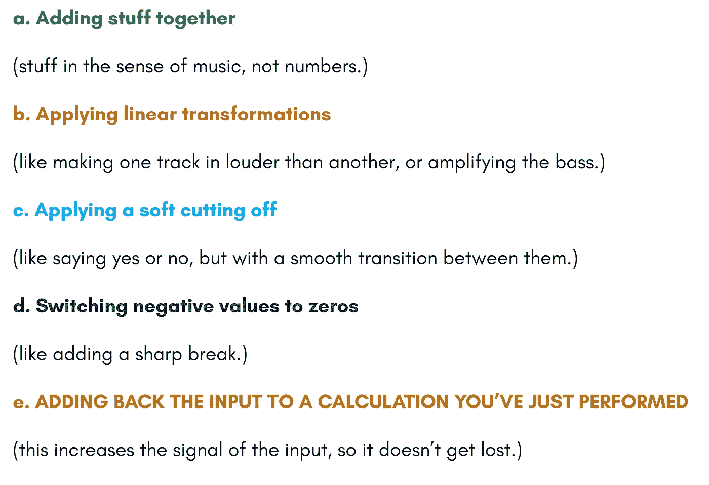
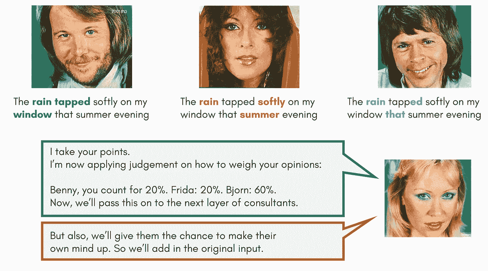
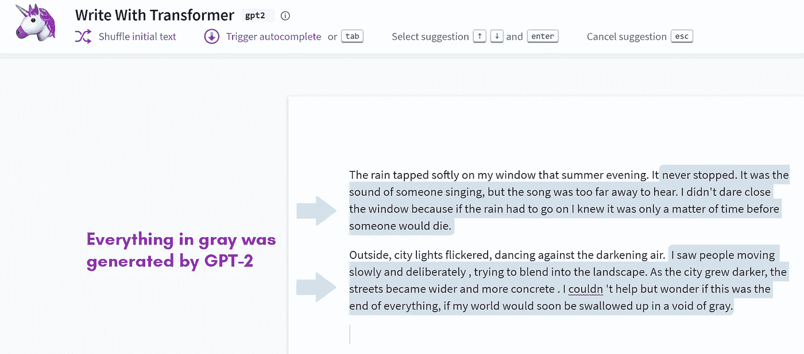

# ABBA 给伯特和 GPT 的解释者-2

> 原文：<https://towardsdatascience.com/the-abba-explainer-to-bert-and-gpt-2-ada8ff4d1eca?source=collection_archive---------35----------------------->

## 看啊！没有数学

来源:维基百科，“阿爸，权威收藏”

对我来说，我无法理解伯特或 GPT-2 是如何工作的。

我看文章；遵循图表；眯着眼睛看方程式；观看录制的课程；阅读代码文档；还在努力理解这一切。

让它变难的不是数学。

更像是，你期望在真相之前的大部分不知何故被遗漏了。

本文弥合了这一差距，用简单的术语解释了这些模型是如何构建的。这是我希望我能先读的文章；许多细节都已经就位了。

在 ABBA 的慷慨帮助下，我们将介绍三种不同的想法。我保证其中不会有一个数学方程:

1。思考词语和意义— **注意** 2。煎饼叠小组件— **深度学习** 3。思考词语和信号— **嵌入**

在第四部分也是最后一部分，我们将看到这些想法如何整齐地绑成一个蝴蝶结。

# **1。思考单词和意思**——**注意**

我们来看下面这个句子:

假设我们请三个朋友来读这句话。虽然他们可能会同意这个句子的主题是雨，但他们可能会在哪些词对“雨”最重要以传达这个句子的真正含义上有分歧。

本尼可能会说“轻拍”和“窗户”是最重要的，因为这个句子是关于雨发出的声音。

弗里达可能会说“温柔地”和“夏天”是最重要的，因为这是一个关于夏雨是什么样的句子。

比约恩可能会采取完全不同的方法，把重点放在“ed”和“that”上，暗示这个句子是关于过去的雨的记忆。

当三个读者都在理解同一个句子时，每个人都在关注不同的部分。每个人都对一些与“雨”有关的词赋予不同的权重，而忽略了其他词的重要性。

他们对这句话的不同理解方式也设定了他们对接下来的预期。当被要求继续以“It …”开头的句子时，他们可能会说:

ABBA 注意头。图片来源:维基百科，“夏夜之城”

这三种选择都有道理。

注意力的概念，以及文本中的单词如何以许多不同的方式相互关联，是一个中心思想。我们想利用这个想法，让**关注** **单词**之间的语义关系，并教机器去做这件事。

像伯特和 GPT-2 这样的任务模型接受的训练是正确猜测一段文本中的下一个单词。因此，一旦经过训练，这种模型就可以用来一个字一个字地生成新文本。

这两种模型的主要区别在于，在训练过程中，在 BERT 模型中，你还可以查看出现在后的文本，而 GPT-2 只允许你向后看。

逐字生成文字听起来玄乎；生成几个*在一起*有意义的单词不是很有意义吗？

事实上，为了有一个更长的视野，超越一个单一的下一个单词，你可以想象一个通向未来的“光束”:而不是直接去寻找你的下一个单词候选人，你保留前 5 个候选人，并为每个候选人生成他们的前 5 个下一个单词，等等。

经过几轮这样的练习后，你会发现这个句子有很多潜在的扩展，你可以从中选择最好的。如果我们要求 GPT-2 完成一个句子，它可能会提供如下明智的建议:

来源:用变形金刚写作，GPT-2。拥抱脸

# 2.煎饼堆叠组件— **深度学习**

本文的前提和承诺是解释像 GPT-2 这样的大型语言模型是如何工作的。

那么，至少我需要告诉你它们是什么。答案是:它们是一堆煎饼。

GPT-2 是一堆相同的组件，称为*解码器*，伯特是一堆略有不同的相同组件，称为*编码器*。

来源:图文并茂的 GPT-2。阿拉姆马尔 j。

这些书库有多大？嗯，各不相同。

来源:图文并茂的 GPT-2。阿拉姆马尔 j。

层次越多，你的输入就越混乱、混合和破碎。这就是‘深度学习’中的‘深’的来源。研究人员发现的一件事(这是建造 GPT-3 时的一个具体研究问题)是，你堆叠得越多，一些自然语言处理任务的结果就越好。

你会注意到，随着模型变大，不仅仅是堆栈变高了。底部的数字，模型维度，也在变大。我们将在下一节讨论这个数字；现在，请忽略它。

要理解大型语言模型是如何工作的，您只需要知道当输入通过其中一个组件时会发生什么。从那时起，它只是冲洗和重复。

一切都可以归结为一个小盒子里的传递步骤，这是深度学习的核心思想。保持对更大画面的坚定把握，我不会在这里涵盖一个确切的步骤。

相反，让我们首先弄清楚输入。

这些模型“吃掉”大量文本。(对于超大号的 GPT-2 来说，它有 1024 个令牌，这就构成了大约 600 到 700 个连续单词。对伯特来说是这个数目的一半。)这个文本块被称为*上下文*。

每个单词都被单独处理，该模型计算每个单词与之前单词的关系。

此外，即使没有具体细节，您也可以确定直通步骤将由五种类型的操作组合而成:

为什么是这些？出于两个非常具体的原因:

1.  **理论上，**如果你一遍又一遍地反复组合这些类型的函数，你就可以逼近任何你想要的函数。

几乎所有的深度学习都建立在上述理论前提之上。

然而，当谈到自然语言处理时，我觉得语言任务也是功能这一奇怪的想法没有得到足够的重视:

当我们从英语翻译成法语时，我们在执行一个功能，接收一些英语单词，输出一串特定的法语单词。

对于文本生成，我们近似一个函数，它接收一堆书面文本，并为下一个单词提供一个合理的选择。

毫无疑问，这些是错综复杂的功能:英语有成千上万的单词，以及它们之间无数的关系。

但是，为了更好地感受复杂的事物是如何用一大堆简单的函数来近似的，请想象一个越来越复杂的 3D 网格:

来源:Manifod 多边形网格的渐进压缩。2012.

2.**在实践中**，类似文本生成或翻译这样的事情意味着重复这样的动作很多很多次。
为了让注意力的理论概念在计算上可行，所进行的计算需要有特定的数学性质。

查看列表，在五个可能的操作中，有一个是多余的。出于某种原因，它也出现在大而响亮的字母中。这个原因将在下一部分解释:

# 3.思考文字和信号— **嵌入**

让我们考虑把东西加在一起。一方面，我们可以将数字相加:如果我们取 3 加 4，我们得到 7。但是，只看 7，没有留下 3 或 4 的痕迹。才 7 点。

另一方面，你可以把音乐加在一起:如果你把一首歌和另一首歌叠加，你会得到一个新的音轨，但是你仍然可以分辨出两首歌中的每一首。你创造了一些新的东西，但仍然保留了相当多的关于每个原始轨道的信息。从现在开始，我希望你开始思考你所读的单词，就好像每一个单词都是一段不同的 3 分钟音乐。

这种音乐迂回的原因是因为当涉及到高维空间时，人类有着完全垃圾的直觉。我们根据 2D 和 3D 的经验进行推断。但是在许多重要的方面，比如把东西加在一起，事物在更高维度中的表现非常不同。

一个单词的轨迹叫做它的*嵌入*。我不会告诉你这是怎么做到的，我会说意思相似的单词最终会有相似的嵌入。

在单词进入像伯特和 GPT-2 这样的模型之前，它们首先被转换成长信号——只是不是音乐信号。但是请记住核心思想:sum 保留了关于每个原始部分的大量信息。

回到每个煎饼的功能列表:

大呼小叫的原因开始变得清晰。回想一下我们的 ABBA 关注委员会:

我们向本尼、弗里达和比约恩展示了与雨有关的句子，并要求他们判断下面句子中的单词“It”与之前出现的单词有什么联系。

然后是 Agnetha，她扮演委员会主席的角色:

图片来源:维基百科，“夏夜之城”

我抛出的数字(20%或 60%)并不固定。随着模型的学习，改变的不仅是本尼、比约恩和弗里达如何决定哪些过去的单词是重要的，还有阿格尼斯塔赋予他们观点的权重。

这一切都发生在一个煎饼里。现在我们把它们堆叠起来:每个连续的盒子实质上接收来自前一个盒子的加权判断和前一个盒子的输入之和作为输入。这确保了下层的意见不会在过程中完全丢失。

还记得我让你忽略的那些大数字吗？随着模型的增长，不仅仅是堆叠的煎饼数量，而是“音乐信号”有多长。

想象一下从 ABBA 的*滑铁卢*到 Queen 的*波西米亚狂想曲*(将近 6 分钟长)

直觉上，你可以感觉到，当把更长的音乐曲目加在一起时，关于添加的组件的信息会被更好地保留下来。

# **4。将三个想法巧妙结合**

我们如何理解意思与我们如何注意不同的单词密切相关。我们在当前正在阅读的任何内容的上下文中权衡远近词语的影响。

作为人类读者，它允许我们完成任务，比如完成句子中的空白，或者以有意义的方式继续写作。

所以，从哲学上讲，一个词在当前语境中的真正含义是**它之前的所有词的集体影响力**。因此，我们可以想象一个理论语言模型，它可以通过跟踪单词之间的关系来“理解”文本——无论这种关系多么微妙。

它会通过反复尝试猜测文本中的下一个单词来学习。每次，它都会检查自己做得有多好，如果猜错了，它会重新平衡它赋予单词之间关系的不同权重。

当制作现实生活中的语言模型时，我们使用嵌入而不是书面文字，这些在伯特和 GPT-2 中得到处理。

为了更好地了解这些表示在这个过程中发生了什么，我建议我们最好把它想象成音乐，因为把两个东西加在一起看起来更像是叠加音乐，而不是添加常规数字。

然后我们看了语言机器的肚子。它看起来并不华丽，只是一堆一模一样的盒子，每一个盒子都从下面的盒子里取食物。

而且，虽然我们没有确切地说这些盒子里发生了什么，但我们从概念上理解它们是一种关注词与词之间关系的方式，无论远近。

# **总结**

我是否忽略了一些细节？太好了。

目的是永远不要忽略大局。

虽然 ABBA 委员会并不完全了解每个解码器中发生的事情，但它足够接近真相，使细节易于理解。如果我现在告诉你每一层没有三个注意力头，而是十二个*注意力头，那也没什么区别，对吧？*

一般来说，每当本文提到一个特定的数字(比如 12 或 1024)，假设研究人员已经把它变大了。

简而言之，这就是 GPT 3 号的故事:

而不是 12 层——96 层。
代替上下文中的 1024 个令牌— 2048 个。
不是每层 12 个注意力头，而是 96 个。
不是 1600—12288(！！！)

(鉴于我们所看到的一切，最后一行给了停顿的空间:我们真的需要从 ABBA 的歌曲到 27 分钟的音乐数字来表达每一个词吗？大概不会。)

但基本前提保持不变。曾经处于分层实验领域的语言模型现在正迅速成为日常生活的一部分。他们已经改变了谷歌搜索。他们已经在改变翻译服务。它们已经被用来生成文本。

来源:用变形金刚写作，GPT-2。拥抱脸

当技术从一个学术玩具转变为具有切实影响力的东西时，我不认为研究人员有权坚持使用令人困惑的数学语言。

解释这些概念以便任何人都能理解是一种道德责任。至少，这是我告诉 ABBA 的，所以他们会同意来帮忙。

# 来源:

1.Seth，Y.2019\. **BERT 解释-常见问题列表。**[https://yashuseth . blog/2019/06/12/Bert-explained-FAQs-understand-Bert-working/](https://yashuseth.blog/2019/06/12/bert-explained-faqs-understand-bert-working/)

2 .图文并茂的 GPT-2。
[https://jalammar.github.io/illustrated-gpt2/](https://jalammar.github.io/illustrated-gpt2/)

3.阿罗拉，2020 年。**注释过的 GPT-2。**[https://amaarora.github.io/2020/02/18/annotatedGPT2.html](https://amaarora.github.io/2020/02/18/annotatedGPT2.html)

4.Smith，N.A.2019\. **语境词表征:语境介绍。**【https://arxiv.org/abs/1902.06006】

5。李，约 2020。OpenAI 的 GPT 3 语言模型:技术概述。[https://lambdalabs.com/blog/demystifying-gpt-3/](https://lambdalabs.com/blog/demystifying-gpt-3/)

6。卡尔沃 M.R. 2018。**解剖伯特。**
[https://medium.com/dissecting-bert](https://medium.com/dissecting-bert)

7.拥抱脸。**用变形金刚写字。**[https://transformer.huggingface.co/doc/gpt2-large](https://transformer.huggingface.co/doc/gpt2-large)