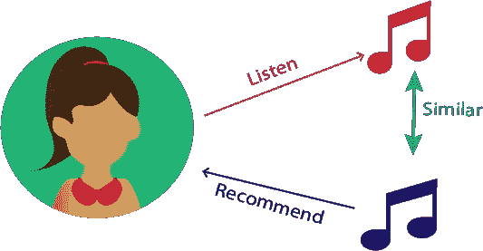
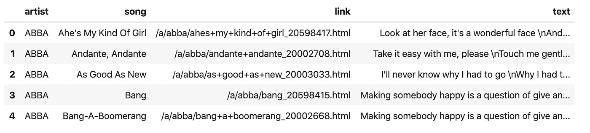
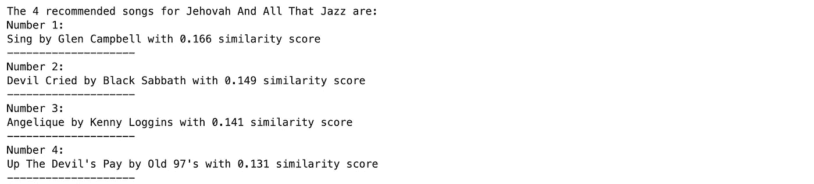
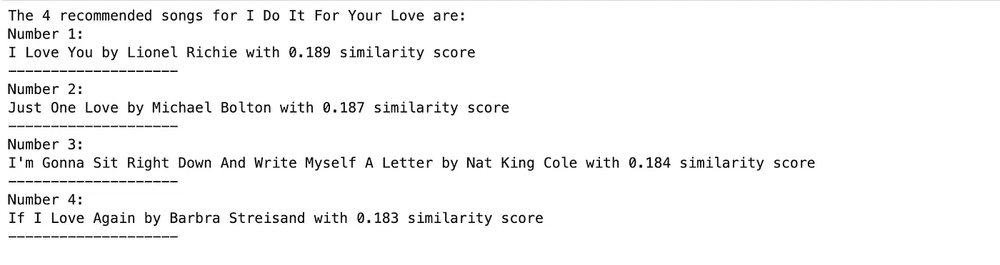

# 构建基于内容的音乐推荐系统的基础知识

> 原文：<https://towardsdatascience.com/the-abc-of-building-a-music-recommender-system-part-i-230e99da9cad?source=collection_archive---------9----------------------->

在 [Unsplash](https://unsplash.com/?utm_source=unsplash&utm_medium=referral&utm_content=creditCopyText) 上由 [Mohammad Metri](https://unsplash.com/@mohammad_leo?utm_source=unsplash&utm_medium=referral&utm_content=creditCopyText) 拍摄的照片

## 接下来该放哪首歌？

“ …

*我想在一个愉快的世界醒来*

*[…。]*

*所有人都能进步，*

*所有的路都可以帮忙，*

*如果你在那里，*

*如果你愿意，*

这是我的梦想，也是更多人的梦想

…”—这是我第一次摇滚音乐会上记得最清楚的歌词。

我当时 8 岁。是的，你没看错。我父亲带我去看了阿根廷最著名的乐队之一。这是它的最后一场演出。

摇滚乐在我家是很重要的东西。我的房子里堆满了 CD。我仍然记得我们的 5 碟 CD 播放器。

你可以放入五张 CD，并对其进行编程，使其在歌曲和 CD 之间随机播放。当时是牛逼的。

在 90 年代，我很难想象我会一键访问成千上万首歌曲。

更不用说该应用程序可以使用机器学习根据我的偏好和播放列表向我推荐不同的歌曲。

等等… *什么？*

是的。最常用的机器学习算法之一是推荐系统。

从广义上讲，**推荐器**(或推荐)**系统**(或引擎)是一个过滤系统，其目的是预测用户对一个项目(在我们的例子中是一首歌)的*评级*或*偏好*。

推荐系统有几种类型，其中使用较多的是*基于内容的过滤器*和*协同过滤器。*

如今，推荐系统被广泛用于许多类型的项目。但是我们将根据歌曲推荐来解释和实现它们。

> 基于内容的方法基于两首歌曲内容或属性的相似性给出推荐，而协作方法使用不同歌曲的评级矩阵来预测可能的偏好。

我们有兴趣分析 ***基于内容的过滤器*** 是如何工作的。名称中的单词*内容*指向用户喜欢的歌曲的内容或属性集。

使用基于内容的推荐器完成的推荐可以被视为特定于用户的分类问题。这个分类器从歌曲的特征中学习用户的喜欢和不喜欢。

大多数人都有音乐流媒体服务的个人资料。当他们创建帐户时，他们填写了详细信息。

他们登录自己的帐户来听他们喜欢的歌曲，或者将歌曲保存在播放列表中，以便以后或重复收听。

在这种情况下，有几种方法可以构建基于内容的算法来向用户推荐歌曲。

最直接的方法是**关键词匹配**。

简言之，背后的想法是提取用户喜欢的歌曲描述中存在的有意义的关键词，搜索其他歌曲描述中的关键词以估计它们之间的相似性，并基于此向用户推荐那些歌曲。

**基于内容的系统:**它会推荐任何与用户以前喜欢/听过的内容相似的内容。

因此，基于内容的推荐算法必须执行以下两个步骤。

首先，从歌曲描述的内容中提取特征来创建对象表示。

第二，在这些对象表示中定义一个相似性函数，它模仿人类理解的项目-项目相似性。

*这是怎么执行的，那么*？—你可能想知道—

在我们的例子中，因为我们处理的是文本和单词， ***术语频率-逆文档频率(TF-IDF)*** 可以用于这个匹配过程。

**TF-IDF** 是一种用于信息检索的技术。它对一个*术语的频率(TF)* 和它的*逆文档频率(IDF)* 进行加权；这两个概念我们稍后会解释。

该算法为文档中的每个术语找到 TF 和 IDF 的分数。

之后得到每个词的 TF 和 IDF 的乘积。这被称为该术语的 *TF-IDF 重量*。

*我们能把这些说得更简单些吗？是的，当然。*

当我们使用这种技术时，我们只是计算文档中每个关键字的出现次数，并通过计算该文档的 TF-IDF 得分来确定其重要性。

TF*IDF 得分越高，该单词在上下文中就越奇怪，因此该术语就越重要。

现在，让我们解释一下频率这个术语的含义。

一个词在当前文档中的**词频**仅仅是它出现在文档总字数中的次数。

例如，对于文档`I love music because it makes me feel like I can fly`中的单词`music`

`TF(music) = Number of times music appears/Total number of words = 1/12`

简单吧？但是逆文档频率呢？

**一个术语的逆文档频率**是该术语在整个语料库中的重要程度的度量。

它被定义为语料库中的文档总数与包含符合以下公式的术语的文档的出现频率之比:

`IDF = log(Total number of documents/Number of documents containing the term)`

如果一个单词非常罕见，这意味着它出现的次数更少，因此 IDF 增加。

因为 TF-IDF 分数用于评估一个单词对语料库中的文档有多重要，所以当出现次数增加时，该单词的重要性增加，但是它被该单词在语料库中的频率所抵消。

如果我们计算每个单词的 TF-IDF 得分，我们有一个向量，通常称为 ***TF-IDF 向量*** *。*

太好了！但是我们如何将它翻译成 Python 代码呢？

所以想象一下，我们有数据集后面的[。](https://www.kaggle.com/mousehead/songlyrics/data#)

该数据集包含 57650 首英文歌曲的名称、艺术家和歌词。数据是通过抓取从 LyricsFreak 获得的。

我们希望使用 TF-IDF 技术建立一个基于内容的推荐系统。

我们之前已经用过 TF-IDF 评分了。还记得我们执行 [Twitter 情绪分析](/keras-challenges-the-avengers-541346acb804#c739)的时候吗？

同样，我们将使用`Scikit-learn`包中的`TfidfVectorizer`。

和往常一样，熊猫将帮助我们将数据集读入`DataFrame`。

由于数据集如此之大，我们将只对 5000 首随机歌曲进行重新采样。

我们还可以注意到文本中出现了`\n`,所以我们要删除它。

之后，我们使用`TF-IDF vectorizer`来逐字计算每首歌词的 TF-IDF 分数。

这里，我们特别注意我们可以指定的参数:

*   *分析器*:特征应该由单词还是字符 n 元构成。
*   *stop_word* :记住，stop words 只是对我们的系统没有显著价值的词，所以应该被系统忽略。我们传递`English`以便它被识别为歌词的语言。

我们创建了一个`lyric_matrix`变量，其中存储了包含每个单词及其 TF-IDF 分数的矩阵。

但是现在，下面的问题出现了:

*—我们如何使用这个矩阵进行推荐？—*

答案就是一个字:`similarity`。我们现在需要计算一首歌词与另一首歌词的相似度。

我们如何做到这一点？

为此，我们可以使用不同的度量标准，比如[余弦相似度，或者欧几里德距离](/how-to-measure-distances-in-machine-learning-13a396aa34ce)，等等。

对于我们的歌曲推荐系统，我们将使用 [**余弦相似度**](/how-to-measure-distances-in-machine-learning-13a396aa34ce#06cb) ，尤其是它的[实现](https://scikit-learn.org/stable/modules/generated/sklearn.metrics.pairwise.cosine_similarity.html)来自 Scikit-learn。

我们希望计算数据集中每个项目与其他每个项目的余弦相似性。所以我们只传递`lyrics_matrix`作为参数。

一旦我们得到了相似性，我们将在一个名为`similarities`的字典中存储我们数据集中每首歌曲最相似的 50 首歌曲的名称。

在那之后，所有的奇迹都发生了。我们可以使用相似性分数来访问最相似的项目并给出推荐。

首先，我们将定义基于内容的推荐类。

现在，我们准备从数据集中挑选一首歌曲并进行推荐。

我们可以随机选择另一首歌并再次推荐:

很酷吧？

这是一个非常简单的基于内容的推荐系统，有很大的改进和试验空间。

如果你想更好的查看代码，可以查看我的 [GitHub Repo](https://github.com/ugis22/music_recommender) 。

正如你所观察到的，基于内容的方法计算速度快，易于理解。此外，它们可以扩展并有效地适应新的项目或用户。

此外，生成的推荐在某种程度上不会偏向知名或受欢迎的项目。

然而，基于内容的推荐系统的最大限制之一是，该模型只学习推荐用户已经在使用或正在收听的相同类型的项目。

尽管这可能是有帮助的，但这一建议的价值明显较小，因为它缺乏发现全新事物的惊喜成分。

最后，这种类型的推荐系统不能捕捉任何上下文或文化信息。只有可以从一首歌曲的内容中导出的信息才能被获得并用于生成推荐。

“ …

你可能会说我是个梦想家

但是我不是唯一的一个

….”——另一首歌开始在我脑海里播放。

由我自己的基于心理内容的推荐系统挑选。

*   参考资料(*如果你想阅读或了解更多关于基于内容的推荐系统*)。

人工智能-全合一。[讲座](https://www.youtube.com/watch?v=9siFuMMHNIA&list=PLLssT5z_DsK-h9vYZkQkYNWcItqhlRJLN&index=97) 16.2

[基于内容的算法](/introduction-to-two-approaches-of-content-based-recommendation-system-fc797460c18c)

[实践中的推荐系统](/recommender-systems-in-practice-cef9033bb23a)。

基于内容的推荐系统。