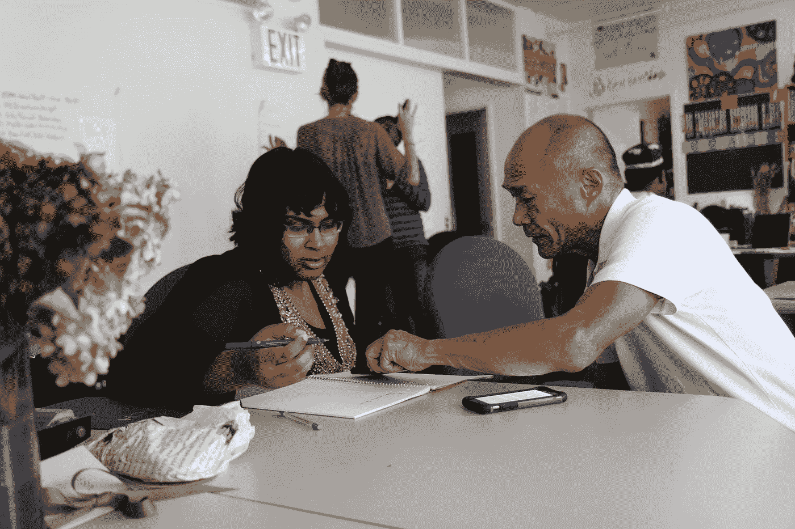
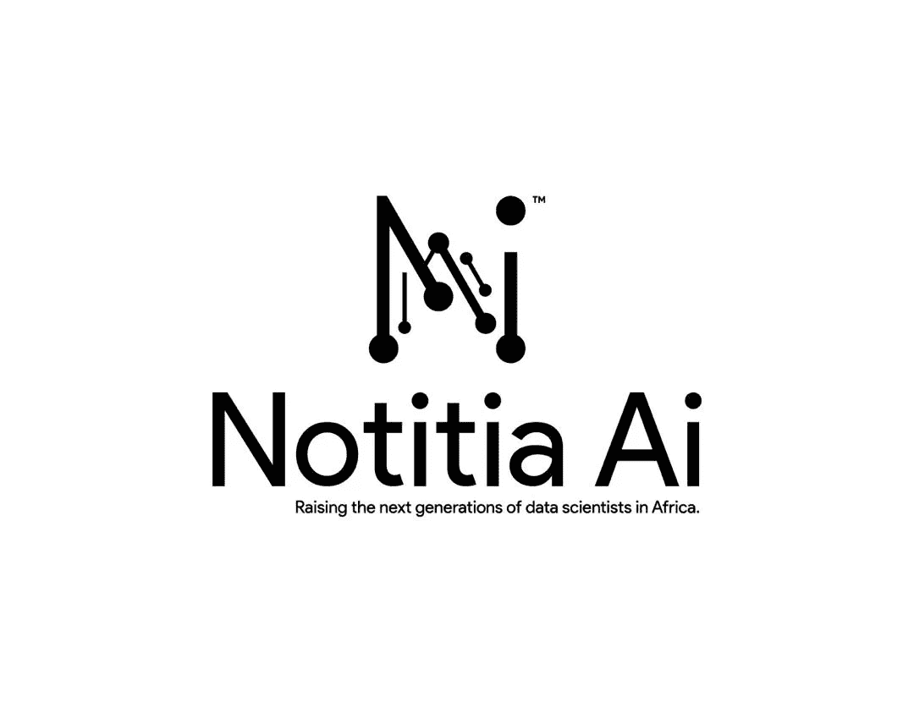

# 从零开始学习数据科学和 ML 的绝对初学者指南。

> 原文：<https://towardsdatascience.com/the-absolute-beginners-guide-to-learning-data-science-and-ml-from-scratch-122e52c6a3?source=collection_archive---------9----------------------->

## 你学习成为数据科学家或 ML 工程师的旅程总是要从你几乎一无所知的地方开始。以下是你如何选择一条学习道路，并充分利用你所学的知识。

马文·迈耶在 [Unsplash](https://unsplash.com?utm_source=medium&utm_medium=referral) 上的照片

> 学习，就像你永远无法掌握它一样；拿着它，就像你害怕失去它一样。——孔子

学习一些通常会让人焦虑的东西，关于决定学习数据科学，你的脑海中可能会有一百个问题。你所有的恐惧和担忧都是有根据的，对学习新技术有疑问是非常安全的，尤其是当你从另一个领域过渡过来的时候。在这个故事中，我将解决我知道可能会困扰你的所有主要问题，并为你勾勒出一条有效学习的学习路径，并充分利用你所学的知识，这样你就可以成为一名高质量的数据科学家、人工智能或 ML 工程师。

# 校本学习

注册学校是迄今为止学习数据科学和机器学习的最首选形式。它在精心编写的课程和学习路径上指导你，并帮助你实现成为数据科学家或 ML 工程师的目标。除了获取知识，从学校学习还能让你向业内专家和专业人士学习，还能结识志同道合的同事。这可以极大地改善你的专业人士网络或生态系统，让你的求职变得更加容易。

从学校学习既可以通过虚拟的方式也可以通过面对面的方式。最适合你和你的时间表的应该是你应该选择的。然而，值得指出的是，亲自学习最有可能加强你的严肃性，减少拖延，并帮助你对这个话题产生更多的兴趣。

一些你可以虚拟报名并开始在旅途中学习数据科学和人工智能的专门学校是 [Blossom Academy](https://www.blossomacademy.co/) 、 [FireBlaze AI School](https://fireblazeaischool.in/) 和 [Akademy。艾](https://www.akademy.ai/)

# 自学

> 其实所有的教育都是自我教育。老师只是一个引路人，给你指路，没有一个学校，再优秀，能给你教育。你所接收到的就像孩子涂色书上的轮廓。你必须自己填充颜色。
> 
> —路易斯·拉摩

自学是当今世界最常见的学习形式，几乎是任何形式的技术。如今，互联网上有大量免费且可访问的资源，自学已成为学习任何东西最简单、最廉价的形式，尤其是编程、数据科学和机器学习。

尽管自学是最简单、最便宜的方法之一，但它也可能是学习数据科学的最低效的方法。原因是，当你自学如何编码或学习成为数据科学家或 ML 工程师时，你会陷入如此多的资源中，并迷失在无休止的学习循环中，通常被称为“教程地狱”。

当一个人遵循一条清晰、明确和有指导的学习路径，并坚持他/她的学习时间表时，自学可以产生惊人的效果。在我不久前写的一篇文章中，[成为数据科学家、人工智能或人工智能工程师的自学之路](/the-self-learning-path-to-becoming-a-data-scientist-ai-or-ml-engineer-9ab3a97ca635)，我概述了一个清晰的学习路径，并推荐了一些精心策划的免费和可访问的资源，可以帮助任何寻求自学数据科学、人工智能和人工智能工程师的人，绝对没有任何成本。这篇文章在发表不到 3 个月的时间里，已经获得了 26，000 次浏览，阅读时间超过了 30 个小时，我个人也收到了许多成功的故事，这些故事来自那些遵循我在那篇文章中分享的学习路径和免费资源的人。我相信它对那些想开始自学数据科学、人工智能和人工智能的人来说仍然很重要。

 [## 成为数据科学家、人工智能或人工智能工程师的自学之路

### 不是每个人都有时间在教室里学习数据科学、人工智能或人工智能，也不是每个人都负担得起…

towardsdatascience.com](/the-self-learning-path-to-becoming-a-data-scientist-ai-or-ml-engineer-9ab3a97ca635)  [## 对于数据科学、人工智能或机器来说，如何有效地学习和掌握 Python

### 学习如何重新编码或学习一门新的编程语言可能会非常困难。大多数时候，我们发现它是如此…

towardsdatascience.com](/how-to-effectively-learn-and-master-python-for-data-science-artificial-intelligence-or-machine-8d88a4fb03a3) 

为了避免重写我在那篇文章中写的所有内容，我将在这个故事中给出一个学习路径的大纲，但我强烈建议你花几分钟浏览这篇文章，以更详细地讨论如何将自学作为学习成为数据科学家、人工智能或人工智能工程师的方法。

*   **学点数学**
*   **学习编码**
*   让你自己适应编程语言
*   **学习如何获取数据**
*   **学习如何处理数据**
*   **了解如何可视化数据**
*   **了解人工智能和人工智能，以及如何构建智能模型**
*   **了解如何在互联网上访问和使用您的模型(部署)**
*   **获得导师**

# 基于导师的学习

> 告诉我，我会忘记；教我，我会记住；让我参与，我会学习。
> 
> —本杰明·富兰克林

照片由[莫尼卡·梅尔顿](https://unsplash.com/@monicomelty?utm_source=medium&utm_medium=referral)在 [Unsplash](https://unsplash.com?utm_source=medium&utm_medium=referral) 拍摄

导师是数据科学和 ML 行业中的任何专业人士或专家，他/她有助于您在未来职业生涯和个性发展方面取得成功，这是作为数据科学家或 ML 工程师取得成功所必需的。

基于导师的学习实际上与自学几乎相同，唯一的区别是，当你向导师学习时，你的导师会引导你走上成功的正确道路，小心地确保你不会犯他/她在该领域的成功之旅中犯过的错误。你的导师也会教你一些他希望早点学到的东西，这样你就能比他/她更快更容易地取得更多的成就。

Notitia AI logo 由[神科菲·阿洛沃尔](https://medium.com/u/466d4f895d49?source=post_page-----122e52c6a3--------------------------------)

[Notitia AI](https://notitia.site/) 是一个很好的平台，可以在数据科学、数据分析、人工智能和机器学习方面从初学者培训到专家水平，在这里你将被分配到一个私人导师，他将在个人和专业方面为你在所选领域的成长做出贡献。这也是你能找到的最实惠的虚拟培训和指导项目。

Notitia AI 旨在培养下一代数据科学家和爱好者，形成一个由专业人士组成的生态系统，他们构建人工智能解决方案，并做出数据驱动的决策。通过我们的许多平台和工作区来促进虚拟培训和指导、志愿服务、解决现实世界的问题、编码和敏捷任务。在 [Twitter](https://twitter.com/AiNotitia) 上关注 Notitia AI，在 [LinkedIn](https://www.linkedin.com/company/notitia-ai/) 上连接。您也可以通过填写此处的表格[加入下一个队列的等候名单。](https://notitia-ai.typeform.com/to/nbEwVMQo)

亲爱的数据科学爱好者，值得注意的是，无论你选择何种方法学习数据科学或 ML，你都应该尽最大努力为自己找到一位导师。选择一种最适合你的学习方法，并坚持精心制定的学习计划。专心致志并保持一致，充满激情地求知总是会带来好的结果。

如果你想谈论与这个话题或数据科学、人工智能或人工智能相关的话题，请随时与我联系。我很乐意和你聊天。为构建系统和算法干杯，为所有种族和性别的人创造一个更美好的世界。黑客快乐！🚀