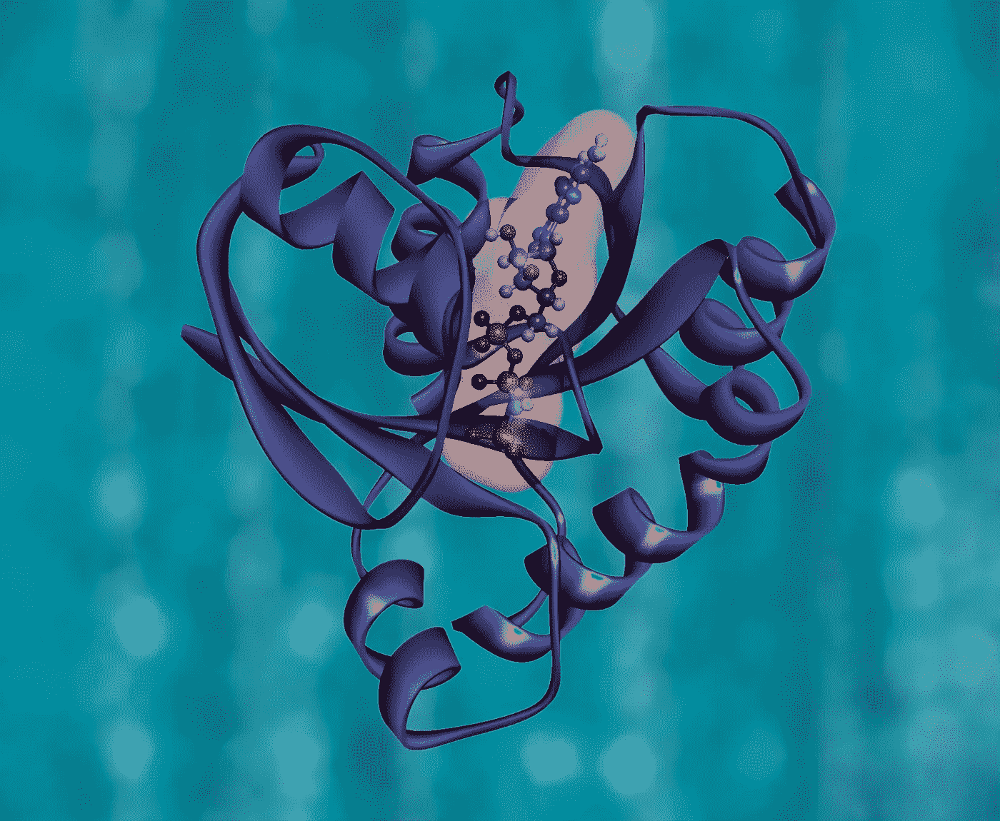

# 开启我数据科学职业生涯的建议

> 原文：<https://towardsdatascience.com/the-advice-that-started-my-career-in-data-science-1b27ed94feb5?source=collection_archive---------26----------------------->

照片由来自 [Unsplash](https://unsplash.com/photos/i5Kx0P8A0d4) 的 Javier Allegue Barros 拍摄

## 我是如何从生物化学起步，然后进入机器学习的

# 研究的梦想

三年前，在一周的时间里，我联合创立了墨尔本大学生物学会，并通过 CSIRO 的 UROP 项目在一个蛋白质工程实验室找到了一份研究助理的工作。我记得当时感觉一切都在一起，我终于走上了成为一名研究人员的道路。

作为一名二年级的理科生，我仍然在实施一个我在高中后期制定的计划。计划是:

*   完成生物化学本科学位。
*   在导师的支持下在实验室完成一年的荣誉课程。
*   开始攻读博士学位，努力寻找有朝一日可能拯救生命的见解。

当时，我认识很多有这个计划的人。许多在此之前给我提供建议的人都认为有一天我会成为一名科学家。我一直热爱生物学，如果我努力的话，我可能足够聪明去把它变成一个职业。

# 生命科学的研究很棒…

学期中兼职，假期全职，我喜欢成为实验室的一员。一周我们会阅读论文并制定计划来测试一个假设，另一周我们会解决生化工作流程中的问题。

我不确定我贡献了多少，但我学到了很多，我感谢今天的博士、优等生、博士后和我的导师，感谢他们为我投入的时间。

然而，很快我就发现我的技能还不够。似乎如果我想有一个稳定的职业，我需要学习生命科学研究的计算方面。这个想法是基于这样的讨论，即如果没有计算生物学或生物信息学的支持，实验研究是无法竞争的。

在导师的鼓励下，我决定从生物化学专业转到全新的计算生物学专业。我从来没有讨厌过数学，我可以看到计算生物学极大地依赖于它。

没过多久，我哥哥就让我相信，增加一个统计学专业是我能做的最好的事情，以增加我在计算生物学领域取得成功的机会，所以我也选择了这个专业。

第二年，情况开始变得明朗起来，我的实验室可能不会存在足够长的时间让我完成荣誉。我想成为一名研究人员的梦想，一直感觉像一颗北极星，开始感觉像一场危险的赌博。

照片由[国立癌症研究所](https://unsplash.com/@nci)拍摄，来自 [Unsplash](https://unsplash.com/photos/eeEiys6TU3c)

# 但是资金的缺乏令人沮丧

你听说过实验室失去资金，但剩下的实验室的现实情况却很少被讨论。

“出版或灭亡”是我一直听到的口头禅。这意味着我可以预计我未来的职业生涯将涉及更多的时间写赠款，并试图通过选择热门话题进入一个好的期刊，而不是花更少的时间思考核心科学。

把所有这些放在一起，似乎有足够的证据表明我应该重新考虑我的计划。生物科学对我来说不再清晰。我需要重新思考我的计划，并找到一种新的方法来解决有趣的问题，同时让世界变得更美好。

# 数据科学的新梦想

当迷雾最终散去，我发现了一颗新的北极星，随之而来的是一个新的计划。我的统计学学位还剩一个学期，在成为研究助理两年半后，我制定了一个成为数据科学家的计划。

我终于意识到，数据科学是我回报人类的途径。我可以利用我在统计学方面的坚实基础和在 R 和 python 方面的编码经验，加入一个在生物科学和其他领域都具有突破性的跨学科领域。

回过头来看，机器学习已经出现在我从事的许多项目中和我阅读的论文中。

我的计划大概是这样的:

1.  发展数据科学方法和深度学习方面的技能
2.  以有意义的方式展示这些技能
3.  找一份为更好的人类工作的工作。

我期望重复那个计划。了解更多关于数据科学的知识，展示这些知识，找份工作，学习更多知识，适当地重新掌握技能。我从一些数据科学和神经网络的数据可视化在线课程开始。

然而，我的学位就要结束了，这一年我改变主意的时候已经太晚了，以至于找不到实习机会。我需要做一个决定。

凯文·Ku 摄于 [Unsplash](https://unsplash.com/photos/w7ZyuGYNpRQ)

# 迈向数据科学的第一步

我设法把自己的想法归结为两个选择，工作或继续学习，正式的或非正式的。我记得我与朋友和家人进行了长时间的讨论，试图决定我是应该申请硕士学位还是自己创业。

如果我去读硕士，我会含蓄地假设我无法从网上或通过第一份工作学到我需要的东西。如果我没有，那就意味着我要花 3-6 个月的时间自学我需要知道的东西，然后再去找一份工作。

最终，我决定在墨尔本商学院的商业分析硕士(“MBusA”)和墨尔本大学的数据科学硕士之间做出选择。前者吸引了我，因为它将熟悉的统计学与商业头脑和数据科学/分析结合在一起，在与一些当前的学生交谈后，我对后者感到担忧，他们担心该课程过于技术性，不能很好地反映现实世界的问题。

我当时认为，现在仍然认为，单靠算法并不能创造洞察力，一旦你有了洞察力，你就需要能够将它们卖给决策者。我选择 MBusA 是为了让我思考如何在现实世界中使用数据科学，以及如何推销这些想法。

几个月后，经过申请和面试，我得到了工作。

那天我父亲打电话给我，让我重新考虑。他比我更相信我，并想让我看看在不支付 55k 的情况下我能做些什么。我仍然怀疑他是否是对的，因为 8 个月后，一切都变得明朗了，我退出了大师赛。

# 千载难逢的机会

今年 6 月下旬，在 MBusA 的一个非常繁忙和具有挑战性的模块中，我的兄弟发消息给我，告诉我一家生物技术软件初创公司的数据科学职位。我调查了一下，工作描述立刻引起了我的兴趣。

我一整年都在看一些公司的职位描述，这些公司什么都想要:SQL、python、统计学、机器学习、3 到 5 年的工作经验以及入门级职位的利益相关者管理技能。这让我认为，大多数公司都不知道他们想要什么样的入门级数据科学家，只知道这些公司知道他们不能教他们的新员工，我讨厌这一点。

这份招聘广告和这家公司看起来不一样。

这份工作列出了一系列兴趣，如机器学习、图论和生物科学，以及诸如彻底诚实和以客户为中心的设计等态度。我最近一直在做大量的机器学习，在我的计算生物学专业中应用了图论，并热衷于应用我头脑中积累的所有生物科学。

所以我决定放手一搏。我的意思是放手去做。到最后一轮面试结束时，我想我已经写了大约 20000 字。我写的总结创始人背景的文字，看关于初创企业的文章，研究产品开发，总结旧项目或相关研究，这样我就可以推销自己。

# 成功和挑战

最终，我获得了 Mass Dynamics 数据科学家的职位。

我的硕士课程还有 8 周的课程和类似长度的实习，我不确定我是否考虑过结束。这似乎是我的机会。用林·曼努尔·米兰达转述的亚历山大·汉密尔顿的话说——“我不会放弃我的机会”。

两周以来，成为大众动力公司的一员已经达到并超出了我的预期。我喜欢和充满激情、才华横溢的人一起工作。

我觉得我在几周内学到的东西比学习时几个月学到的还多，但这并不意味着我没有利用我以前的研究。如果有什么不同的话，我觉得我永远不知道来自数据科学、计算生物学甚至生物化学的哪种先前的经验将有助于下一个挑战。

Mass Dynamics 的使命是通过让从科学数据中获得洞察力变得更容易来加速医学突破。我们正在构建一个用于分析科学数据的生态系统，它共同建立在坚实的软件工程原则、科学专业知识和以人为本的设计之上。

最棒的是，尽管我放弃了成为一名生命科学家的梦想，但我仍然可以帮助加速突破，这将有助于人类，无论如何这始终是最重要的！

但是，克服了这个新职位和我的新工作场所很棒的事实，我也内化了这是一个挑战和责任。大众动力公司给了我机会，我打算抓住它。

# 建议和提示

那么教训是什么呢？外卖是什么？

*   永远不要停止学习。永远不要停止提问。从长远来看，重要的是你学得多快，而不是你从哪里开始或者你现在在哪里。
*   要有韧性。失败是一次学习的经历。
*   这不是一个零和游戏。生活不是一场纸牌游戏。向他人学习，分享你所能分享的。
*   寻找有价值的导师。我欠那些倾听我的人太多，也许是一切，尤其是那些让我闭嘴并告诉我事情真相的人。

# 离别的思绪

如果我能重来一次，我会做什么不同的事情吗？

大概不会。我经常做出选择，比如学习更多的数学和计算，这拓展了我的选择，而不是限制了我。我不确定我是否做了任何限制性的选择，我很高兴我那样做了。

我从不怀疑这一点，但今年，似乎特别明显的是，人类需要卓越的生物技术来保护我们自己并创造一个更光明的未来。曾几何时，我认为我能做到这一点的唯一途径是一名研究员。我认为如果你想帮忙，你可以想办法。

看看你周围的人，问问他们是怎么想的，并认真倾听。

来自 [Unsplash](https://unsplash.com/photos/F01g8NPdOdo) 的照片 [Margarida Afonso](https://unsplash.com/@mrafonso1976)