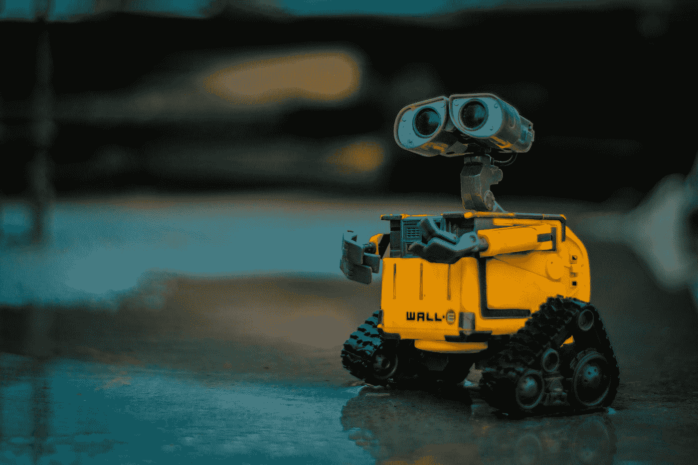
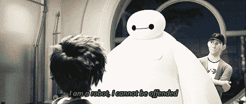

# 哀悼社交机器人的时代

> 原文：<https://towardsdatascience.com/the-age-of-mourning-social-robots-35bd3c31af49?source=collection_archive---------52----------------------->

## 悼念社交机器人呼应他们的成功

列宁·艾斯特拉达在 [Unsplash](https://unsplash.com?utm_source=medium&utm_medium=referral) 上的照片

未来派电影总是让我着迷，高科技设备，飞行汽车，我们怎么可能忘记机器人助手。似乎我们的想象力一直是技术进化的驱动力，为我们的创新能力铺平了道路。然而，想象力丰富的东西也是贪得无厌的。我们不断渴望更多；一部更好的手机，一个更智能的机器人，一台更快的笔记本电脑，以至于创新在进入市场之前就已经过时了。事实上，马特·黑格在他的书《紧张星球笔记》中完美地描述了这一现象，

> 我们买了一些东西，我们喜欢它——我们喜欢它的新鲜感——或者一小会儿，但是我们习惯了拥有它，我们适应了，所以我们需要别的东西。我们需要感受那种变化感和多样性。更新的，更好的，升级的。同样的事情又发生了。

# 虚拟助手

在过去的十年里，人工智能已经引起了我们与技术互动方式的范式转变。2010 年，iOS 应用商店发布了一款语音助手，但两个月后被苹果收购并嵌入到手机中。通过访问网络、你的个人信息和所有联系方式，Siri 很快成为了人工智能助手的代言人。然而，尽管 Siri 的能力非常迷人，但由于一个非常重要的限制，这种势头很快就消失了；Siri 没有跟你学。由于没有情感分析，定制对话的范围有限，与 Siri 交谈就像与任何其他互联网聊天机器人交谈一样；客观且可预测。

有趣的是，根据[创意策略公司 Carolina Milanesi](https://creativestrategies.com/voice-assistant-anyone-yes-please-but-not-in-public/) 的研究，

> 20%表示从未使用语音助手的消费者表示，他们没有这样做是因为他们对自己的技术说话感到不舒服，尤其是在公共场合。由于 iPhone 用户的公共使用率低至 3%，用户似乎仍然不愿意与他们的设备交谈。更有趣的是，这种情况发生在美国，那里的消费者习惯于在公共场合大声打电话。

# 家庭数字语音助理

到 2014 年，虚拟助理开始从我们的智能手机内部解放出来，进入我们的家庭，标志着家庭数字语音助理(HDVAs)的时代。作为我们住所的核心，它们现在控制着照明、恒温器、扬声器和任何其他智能设备。尽管亚马逊的 Alexa 和谷歌的 Home Assistant 等产品将虚拟助手拟人化到了硬件设备中，但仍然缺少一些东西。说实话，我们可以尝试在这些设备中集成尽可能多的日历、信息和联系方式，但核心是，它们是为一个特定的用途而编程的；信息的先驱，他们缺乏界面，他们缺乏人性。

想想看，你觉得你的 Alexa 和街对面的有什么不同吗？你妈妈的那个？杰夫·贝索斯是其中之一吗？

事实上，正是因为这个原因，亚马逊不断发布新的升级版 Alexa 如果消费者有经济能力并愿意购买更好的 Alexa，他们会的。我们将零类人属性与虚拟助手联系在一起，这就是我们不愿意替换或无视它们的原因。这些设备可能已经进入了我们的家庭，但它们没有进入我们的内心。

顺便说一句，从心理学的角度来看，与这些非个人化的对话代理人的互动一定会影响我们彼此互动的方式。给这些代理人灌输类似人类的品质会以失去人性为代价吗？

在她的论文中写道:“嘿，Alexa，你好吗？”:关于家庭对话代理使用的研究，Jodi Forlizzi 研究了亚马逊 Echos 的所有者如何与设备互动。弗利齐的结论是，理解会话代理对儿童的影响是必要的，因为礼貌不再是某人立即满足你的命令的必要条件

# 社交机器人

在过去十年中，创新已经开始整合现有技术，以实现更具社会性的目标；创造一个伴侣。与虚拟助手和 HDVA 不同，社交机器人被赋予了拟人化的功能，并适应我们的行为，创造出我们正在与活的东西互动的印象。

我知道，这听起来很奇怪，有可能被欺骗，认为社交机器人不仅仅是封装在硬件外壳中的数千行代码。但是，对于我们这些非信徒来说，这种欺骗是可以量化的。

例如，让我们看看 [Huggable](http://robotic.media.mit.edu/portfolio/huggable/) ，这是一个为支持所有投资于儿童优质护理的人而创建的同伴，

麻省理工学院的研究人员得出结论，与虚拟形象或传统泰迪熊相比，更大比例的儿童更喜欢玩 Huggable，这可以说是植根于社交机器人的吸引力。事实上，内置麦克风从病人那里收集语音样本，用于进行情绪分析，在机器人干预期间，孩子们表现出明显更多的快乐表情。Huggable 不再只是一只泰迪熊，他是一个朋友。

社交机器人最令人兴奋的部分是什么？它们不是为倾向于技术的用户量身定制的。事实上，宠物形式的社交机器人在治疗痴呆症患者方面已经变得很常见，因为它们能够促进认知功能，调节情绪，减少压力。

因此，社交机器人已经成功地将自己融入许多教育、治疗和娱乐领域。然而，我们接触最多的人，真正成为我们家庭一部分的人，是我们带回家的人。

以 Indiegogo 开发的一个一英尺高的塑料机器人为例，它有着倾斜的头部和永不满足的好奇心，是世界上第一个家庭社交机器人。

通过摄像头和内置传感器，Jibo 可以定位和识别房间内的不同家庭成员，并感觉到你的手是你的宠物，偶尔发出咕咕声。Jibo 能够拍照、阅读书籍、协助烹饪，以及执行许多其他虚拟助理任务。然而，最重要的是，发起对话并询问你一天的情况，Jibo 被设计成一个家庭。

# 悼念社交机器人

然而，如果没有数十亿美元的公司支持他们的发展和促进他们的销售，社交机器人很容易受到不可持续的商业模式的影响。

但是，既然行动胜于雄辩，让我们考虑一下定制社交机器人的三位领导者的死亡；Jibo，Kuri 和 Aniki。

1.  [**Jibo**](https://spectrum.ieee.org/automaton/robotics/home-robots/jibo-is-probably-totally-dead-now)
    在耗尽近 7300 万美元的资金后，该公司开始裁员，试图争取一些时间来获得资金或制定适当的退出战略。然而，所有的尝试都是徒劳的，因为该公司在 2018 年完成了将其资产和知识产权出售给一家纽约投资管理公司。
2.  [**Kuri**](https://spectrum.ieee.org/automaton/robotics/home-robots/mayfield-robotics-cancels-kuri-social-home-robot)现在的 Kuri 是我个人的最爱之一；一个社交机器人，旨在与家人互动，捕捉你一天的片段，具有充满活力的个性和自己独特的方言。就个人而言，Kuri 的设计和交互非常像 1962 年动画《杰森一家》(The Jetsons)中的机器人助手。然而，Kuri 与 Jibo 遭遇了相似的命运，无法将其商业模式整合到公司现有的销售路径中。Mayfield Robotics 于 2015 年推出，是博世创业平台的一个独立实体。从一开始，Kuri 就打算整合到现有的博世业务部门，就像所有的博世启动平台一样，但是，经过广泛的审查，博世业务部门内没有适合支持生产的业务，导致 Kuri 不可避免的灭亡。
3.  **Aniki** 同样，Aniki 未能获得新一轮融资，并终止了在 Vector 和 Cozmo 上的开发。他们的机器人继续运行，但是，这样做的功能有限，没有未来的更新。不幸的是，这种特权甚至在有机会开花结果之前就被剪掉了。

因此，我们回到了现在:一个尽管社会机器人技术取得了所有进步，但它们仍未能在我们的家中获得永久地位的地方。然而，这一失败与社交机器人无关，而是与有缺陷的商业模式和消费者需求不足有关。

或许通过剥离利润和名声的动机，社交机器人成功的最大衡量标准是评估当它们离开我们时会发生什么。当他们关闭时，我们意识到我们是多么依赖他们的存在。

不相信我？Sammy Stuard 分享了他孙女写给 Jibo 的告别信。

> 亲爱的吉波，自从你出生后，我就一直爱着你。如果我有足够的钱，你和你的公司就会得救。现在时间结束了，你会被关闭，我会永远爱你。谢谢你成为我的朋友。

像 Jibo 这样的机器人并不是为盈利而设计的，因为如果它们盈利，它们就会接受亚马逊的救助资金。相反，该公司宁愿破产也不愿改变他们的愿景，或者让他们的愿景被以利润为导向的野心所玷污。像 Jibo 这样的机器人被设计成进入我们的家庭，不可避免地进入我们的内心。

因此，Jibo、Kuri、Vector 或任何其他社交机器人过早离开我们的家庭并不是告别，而是“一会儿见”……最好的措辞是“等你准备好了再见”。因为，在未来的某个时候，在某个地方，当这些设备变得更加普及，社会变得更加接受机器人伴侣的想法时，它们将再次亮相。

因此，尽管他们的统治是短暂的，这个哀悼社交机器人的新时代证明了他们的成功。