# 啊哈！4 种流行的机器学习算法中的矩

> 原文：<https://towardsdatascience.com/the-aha-moments-in-4-popular-machine-learning-algorithms-f7e75ef5b317?source=collection_archive---------47----------------------->

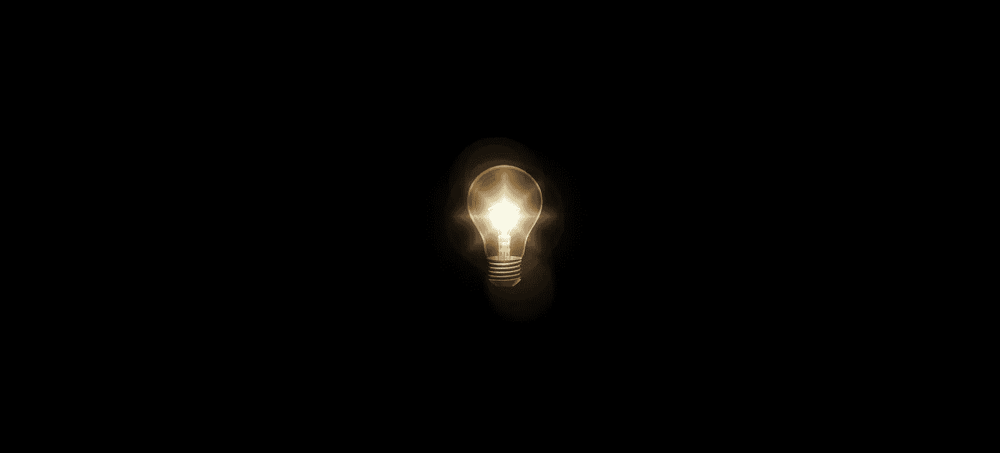

来源: [Pixabay](https://pixabay.com/illustrations/light-bulb-think-idea-solution-2010022/)

## 凭直觉知道为什么，而不仅仅是如何

大多数人要么在两个阵营:

*   我不懂这些机器学习算法。
*   我明白算法是如何工作的，但不明白*为什么*它们会工作。

这篇文章不仅试图解释*的*算法是如何工作的，而且让人们直观地理解*为什么*会工作，让人们恍然大悟！瞬间。

## 决策树

决策树使用水平线和垂直线划分特征空间。例如，考虑下面一个非常简单的决策树，它有一个条件节点和两个类节点，指示一个条件以及满足该条件的训练点将属于哪个类别。

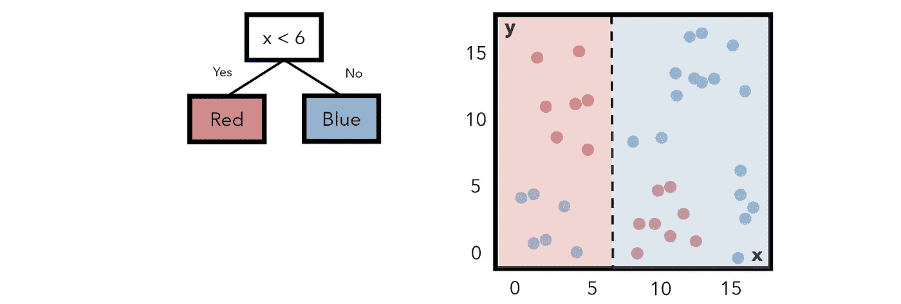

请注意，标记为每种颜色的字段和该区域内实际上是该颜色的数据点之间有很多重叠，或者说(粗略地说)*熵*。构造决策树以最小化熵。在这种情况下，我们可以增加一层复杂性。如果我们再增加一个条件。如果 *x* 小于 6 *而*y*大于 6，我们可以将该区域的点指定为红色。这一举动降低了熵。*

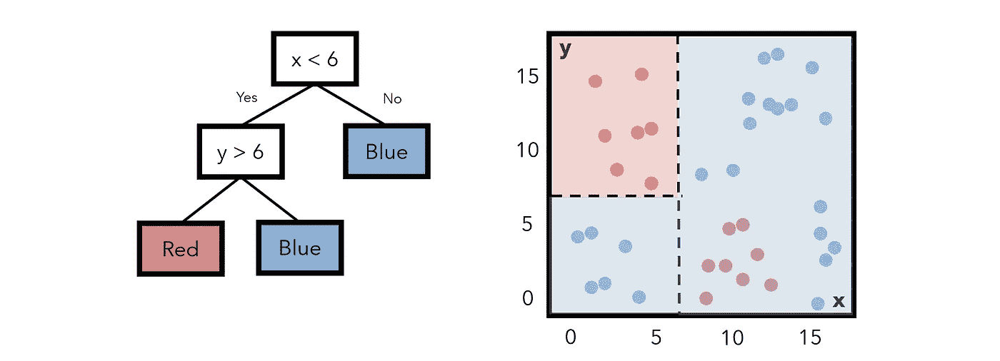

每一步，决策树算法试图找到一种方法来建立树，使熵最小化。更正式地认为熵是某个分割器(条件)的“无序”或“混乱”的数量，它的反义词是“信息增益”——一个分割器*给模型增加了多少*信息和洞察力。具有最高信息增益(以及最低熵)的特征分割被放置在顶部。

这些条件可能会像这样分割它们的一维特征:

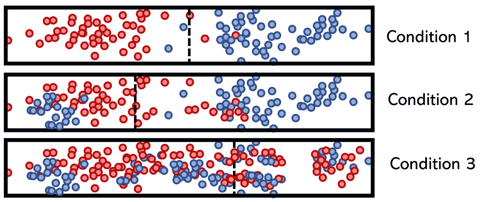

注意，条件 1 具有清晰的分离，因此具有低熵和高信息增益。条件 3 就不一样了，这就是为什么它被放在决策树的底部。这种采油树的结构确保了它尽可能的轻便。

你可以阅读更多关于熵及其在决策树和神经网络中的应用(交叉熵作为损失函数)[这里](/understanding-entropy-the-golden-measurement-of-machine-learning-4ea97c663dc3)。

## 随机森林

随机森林是决策树的袋装(引导聚合)版本。主要的想法是，几个决策树分别在一个数据子集上进行训练。然后，一个输入通过每个模型，它们的输出通过一个函数(如 mean)聚合，产生一个最终输出。打包是集成学习的一种形式。

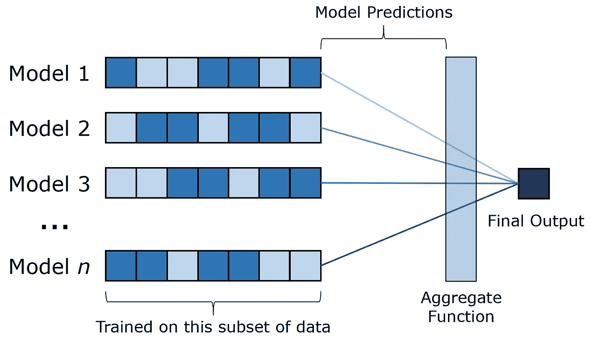

为什么随机森林运行良好，有许多相似之处。下面是一个常见的版本:

> 你需要决定下一步去哪家餐馆。要向某人寻求建议，你必须回答各种是/否的问题，这将引导他们决定你应该去哪家餐馆。
> 
> 你是宁愿只问一个朋友还是问几个朋友，然后找到模式还是普遍共识？

除非你只有一个朋友，否则大多数人会选择第二个。这个类比提供的见解是，每棵树都有某种“思想的多样性”，因为它们是在不同的数据上训练的，因此有不同的“经验”。

这个类比虽然简单明了，但我从未真正注意过。在现实世界中，单一朋友选项的经验少于所有朋友的总和，但在机器学习中，决策树和随机森林模型是在相同的数据上训练的，因此，有相同的经验。集合模型实际上没有接收任何新的信息。如果我可以请一位无所不知的朋友给我推荐，我不反对。

一个在相同数据上训练的模型，随机抽取数据的子集来模拟人为的“多样性”,怎么能比一个在整个数据上训练的模型表现得更好呢？

取一个带有严重正态分布噪声的正弦波。这是你的单一决策树分类器，它自然是一个非常高方差的模型。

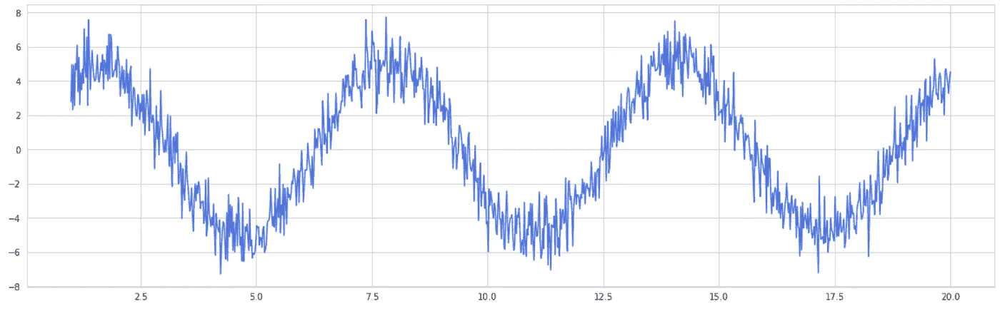

将选择 100 个“近似值”。这些近似器沿着正弦波随机选择点，并生成正弦曲线拟合，就像决策树在数据子集上进行训练一样。这些拟合然后被平均以形成袋装曲线。结果呢？—更平滑的曲线。

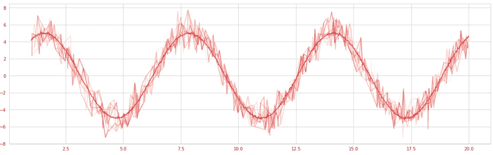

bagging 之所以有效，是因为它减少了模型的方差，并通过人为地使模型更加“自信”来帮助提高概括能力。这也是为什么 bagging 在像逻辑回归这样的低方差模型上效果不佳。

你可以在这里阅读更多关于直觉和更严格的证据来证明[装袋](/how-injecting-randomness-can-improve-model-accuracy-11cdc04b3eeb)的成功。

## 支持向量机

支持向量机试图找到一个可以最好地划分数据的超平面，依靠“支持向量”的概念来最大化两个类之间的划分。

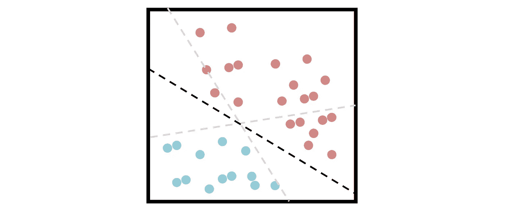

不幸的是，大多数数据集不那么容易分离，如果是这样，SVM 可能不是处理它的最佳算法。考虑这个一维分离任务；没有好的分割线，因为任何一个分割线都会导致两个独立的类被归入同一个类。

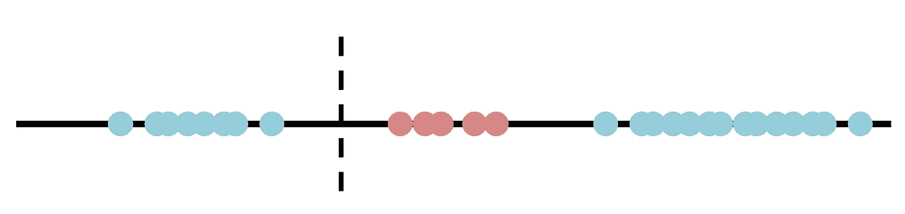

一个分裂的提议。

SVM 通过使用一种所谓的“内核技巧”在解决这类问题方面非常强大，这种技巧将数据投影到新的维度，使分离任务变得更容易。例如，让我们创建一个新的维度，它被简单地定义为 *x* ( *x* 是原始维度):

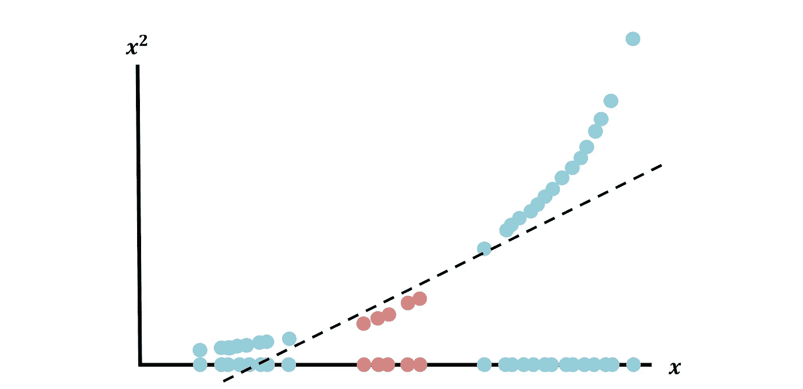

现在，在数据被投影到一个新的维度上之后，数据是完全可分离的(每个数据点在两个维度中表示为`(*x*, *x*²)`)。

使用各种内核，最常见的是多项式、sigmoid 和 RBF 内核，内核技巧完成了创建变换空间的繁重工作，从而使分离任务变得简单。

## 神经网络

神经网络是机器学习的巅峰。他们的发现，以及可以对其进行的无限变化和改进，保证了它成为自己领域的主题，即深度学习。诚然，神经网络的成功仍然是不完整的(“神经网络是没有人理解的矩阵乘法”)，但解释它们最简单的方法是通过通用逼近定理(UAT)。

在它们的核心，每一个被监督的算法都试图模拟数据的一些潜在功能；通常这是回归平面或特征边界。考虑这个函数 *y* = *x* ，它可以用几个水平步长建模到任意精度。

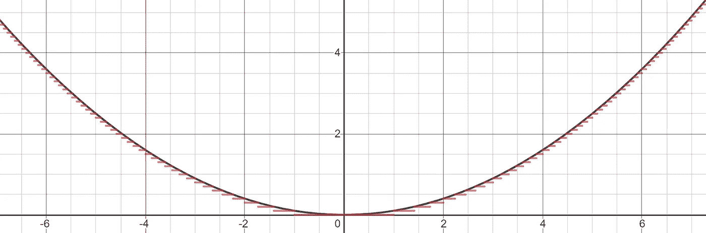

这本质上是一个神经网络所能做的。也许它可以更复杂一点，并超越水平步骤(如下面的二次和线性线)来模拟关系，但在其核心，神经网络是一个分段函数逼近器。

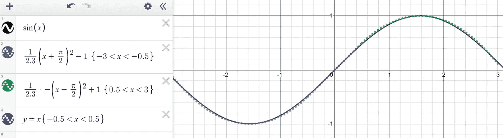

每个节点被委托给分段函数的一部分，网络的目的是激活负责部分特征空间的某些神经元。例如，如果要对有胡子或没有胡子的人的图像进行分类，应该将几个节点专门分配给胡子经常出现的像素位置。在多维空间的某个地方，这些节点代表一个数值范围。

再次注意，“神经网络为什么工作”这个问题仍然没有答案。UAT 没有回答这个问题，但指出，在某些人类解释下，神经网络可以模拟任何功能。可解释/可解释的人工智能领域正在兴起，通过像[激活最大化和灵敏度分析](https://medium.com/analytics-vidhya/every-ml-engineer-needs-to-know-neural-network-interpretability-afea2ac0824e)这样的方法来回答这些问题。

你可以阅读更深入的解释，并查看通用近似定理的可视化[在这里](https://medium.com/analytics-vidhya/you-dont-understand-neural-networks-until-you-understand-the-universal-approximation-theorem-85b3e7677126)。

在所有这四种算法以及许多其他算法中，这些算法在低维度上看起来非常简单。机器学习的一个关键认识是，我们声称在人工智能中看到的许多“魔法”和“智能”实际上是隐藏在高维度伪装下的简单算法。

决策树把区域分割成正方形很简单，但是决策树把高维空间分割成超立方体就没那么简单了。SVM 执行一个内核技巧来提高一维到二维的可分性是可以理解的，但 SVM 在数百维的数据集上做同样的事情几乎是神奇的。

我们对机器学习的钦佩和困惑是基于我们对高维空间的缺乏理解。学习如何避开高维空间和理解自然空间中的算法有助于直观理解。

 [## 神经网络优化的迷人的无梯度方法

### 忘记亚当，阿达格勒，SGD

towardsdatascience.com](/the-fascinating-no-gradient-approach-to-neural-net-optimization-abb287f88c97) 

所有图片均由作者创作。