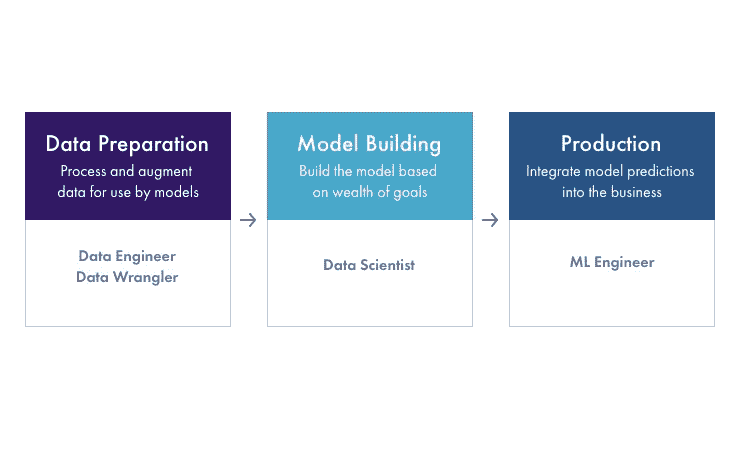
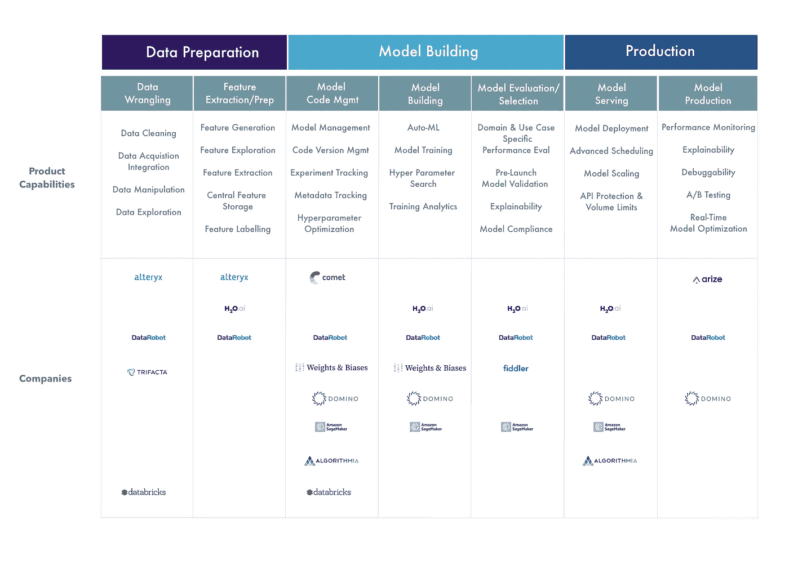

# 人工智能生态系统一团糟

> 原文：<https://towardsdatascience.com/the-ai-ecosystem-is-a-mess-c46bdfbf43e4?source=collection_archive---------29----------------------->

## 艾瑞泽·艾

## **为什么无法理解 AI 公司*到底*在做什么？**

交通混乱由 [sladkozaponi](https://www.shutterstock.com/g/monotoomono) 经 [Shutterstock](https://www.shutterstock.com/image-photo/mumbai-india-july-2016-traffic-indias-454681642)

# 人工智能在商业中的地位

在过去的几年里，人们急于找到如何将人工智能融入商业的方法，这样做可以提供巨大的比较优势，这已经不是什么秘密。但是，尽管大肆宣传，商业领域的人工智能仍然处于早期阶段。

我们的团队来自优步、谷歌、脸书和 Adobe，在那里我们看到了跨业务线部署人工智能的优势和挑战。大多数公司没有同样的资源来建立内部工具，深入衡量结果和资助广泛的研究。我们这个博客的目标是利用我们对人工智能领域的深入了解来理解生态系统，消除炒作，并提供可以帮助您在整个过程中做出人工智能投资决策的见解。

# 内部数据科学与外部合作伙伴

许多公司正在利用人工智能来颠覆商业领域，方法是将模型应用于各种商业垂直领域的常见商业问题。我们认为这些公司是垂直业务解决方案——他们销售由人工智能“驱动”的软件。他们针对客户服务、营销、财务和运营等各种团队，采用 SAAS 解决方案来解决他们的问题。另一类公司是销售软件解决方案的公司，这些软件解决方案可以增强您的数据科学、数据工程和 ML 工程团队的能力。

这篇博客的其余部分关注的是后一个领域的公司， **AI/ML 基础设施公司**，它们正在构建软件来帮助你的团队自己构建和部署模型。

# 人工智能领域的复杂性

我们从企业团队那里听到的第一个问题是，很难找出用人工智能解决的正确问题。即使他们找到了正确的问题，我们也经常听说他们开发的大多数模型都没有投入生产。这是一个很常见的问题，我们知道有一家公司在制造一个模型*来预测*其他模型是否真的能投入生产。你不得不怀疑这个模型本身是否能投入生产。

在不同的数据科学团队规模和扩展点上，您会发现数据科学组织出现了新的独特复杂性。有些复杂性实际上是以新形式出现的软件工程问题，而另一些则是这个领域特有的。所有这些都因旨在“帮助”数据科学的令人困惑的软件工具和解决方案套件而变得更加复杂。进入舞台左侧，这里有 100 多家公司正在推销令人困惑的软件解决方案，以“增强您的数据科学团队的能力”。

# 如何评价 ML/AI 软件公司

AI/ML 基础设施工具是一个极其拥挤的空间。我可以指出 100 多家公司提供超参数调优、部署、MLOps、治理、控制、审计、监管、可解释性、性能调优等服务。即使作为一个技术人员，我也曾被一些 ML 工具公司推销过，在一个小时的推销之后，*我仍然不知道他们在做什么*。

模糊的引用比比皆是，包括“实现人工智能规模”、“优化人工智能”、“赋予人工智能权力”、“控制你的人工智能”——*但是这些软件解决方案实际上做了什么*？

**有一个简单的心智模型，我们用它来划分空间，放置解决方案，并打破炒作。**

按作者列出的 ML 工作流阶段图

# 生产还是前期生产？

当你看 ML/AI 基础设施领域时，要做的第一个产品细分是预生产或生产。

**预生产**

*   该软件是否帮助您构建更好的模型、自动选择正确的模型、使模型构建过程可重复、审计模型构建、为模型构建产生更好的数据，或者跟踪训练运行？

**生产**

*   该软件是否有助于您将模型集成到业务中，将模型扩展到产品中，解决生产中的问题，为团队的其他成员解释结果，或者提供 A/B 有效的模型分析？

这种划分很重要的原因是，随着数据科学团队的成长，组织中不同的人最终负责生产而不是生产前。为一个功能/组织构建的软件解决方案不能很好地服务于整个组织的所有人。

# 建模工作流阶段

产品的下一个细分是产品在 ML 工作流程中的位置。概括地说，我们看到三个主要阶段—数据准备、模型构建和生产。

数据准备包括准备、标注和清理用于模型的数据。就使用人工智能模型而言，这是最大份额的时间和精力去的地方，并且它主要在数据工程师和数据辩论者的领域之下。

模型构建包括特征选择、训练管道、超参数调整、可解释性分析、生产前审计和评估。它通常由数据科学家承担。

最后是生产，包括部署模型进行推理(生成预测)、性能监控、故障排除和基于生产的可解释性。通常是在机器学习工程师圈子里。

ML 工作流的每一大类(数据准备、模型构建和生产)都有更深层次的特征。以下是对 ML 工作流程阶段的更详细的概述，包括每个阶段所需的产品功能，以及目前在这些垂直领域提供功能的公司。

作者的 ML 基础设施平台图

有一场激烈的争论，每个平台是否应该为深入垂直或水平解决方案量身定制。在接下来的博文中，我们将深入探讨该领域的各种垂直行业和产品。

# 人工智能公司推介说明

*   如果一个小公司推销一个在很多阶段做很多事情的产品，要怀疑他们只是想搞清楚他们的商业模式。
*   如果一个产品需要你颠覆你的模型构建和部署过程中的一切来产生价值，所创造的价值可能不值得被破坏和被锁定的风险。
*   应该将提高模型性能的产品推介与产生该价值的实现工作相比较。

# 下一个

我们将更深入地研究 ML 工作流程的生产环节。Arize AI 专注于使 AI 在生产中取得成功，我们很高兴分享更多关于如何获得模型最大价值的花絮。

# 联系我们

如果这篇博文引起了你的注意，并且你渴望了解更多，请在 [Twitter](https://twitter.com/arizeai) 和 [Medium](https://medium.com/arize-ai) 上关注我们！如果你想了解更多关于我们在艾瑞泽人工智能所做的事情，请通过[contacts@arize.com](mailto:contacts@arize.com)联系我们。如果你有兴趣加入一个有趣的，摇滚之星的工程团队来帮助制作成功的模型，请通过[jobs@arize.com](mailto:jobs@arize.com)联系我们！

# 参考

1.  [布隆伯格资本 AI 工具链](https://www.blumbergcapital.com/news_insights/ai-toolchain-2018/)
2.  [介绍 Redpoint 的 ML 工作流程前景](https://medium.com/memory-leak/introducing-redpoints-ml-workflow-landscape-312ca3c91b2f)
3.  [Oreilly AI 的采用受到改进的工具生态系统的推动](https://www.oreilly.com/radar/ai-adoption-is-being-fueled-by-an-improved-tool-ecosystem)
4.  [麦肯锡技能转移自动化和劳动力的未来](https://www.mckinsey.com/~/media/McKinsey/Featured%20Insights/Future%20of%20Organizations/Skill%20shift%20Automation%20and%20the%20future%20of%20the%20workforce/MGI-Skill-Shift-Automation-and-future-of-the-workforce-May-2018.ashx)

## 联系我们

如果这个博客引起了你的注意，并且你渴望了解更多关于[机器学习可观察性](https://arize.com/platform-overview/)和[模型监控](https://arize.com/model-monitoring/)，请查看我们的其他[博客](https://arize.com/blog/)和 [ML 监控](https://arize.com/ml-monitoring/)上的资源！如果您有兴趣加入一个有趣的 rockstar 工程团队，帮助模型成功生产，请随时[联系](https://arize.com/contact/)我们，并在此[找到我们的空缺职位](https://arize.com/careers/)！