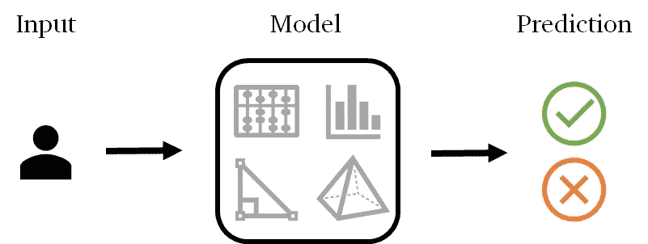
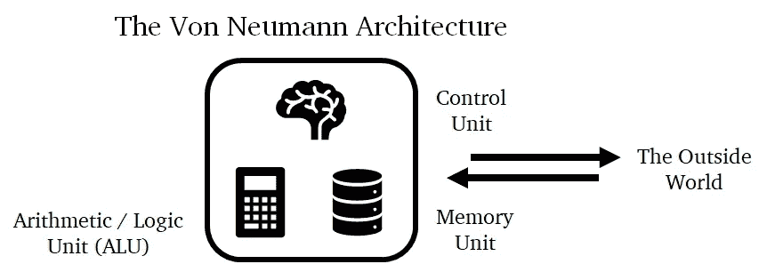

# 为什么 GPU 这么强大？

> 原文：<https://towardsdatascience.com/the-ai-illustrated-guide-why-are-gpus-so-powerful-99f4ae85a5c3?source=collection_archive---------41----------------------->

## [人工智能图解指南](https://towardsdatascience.com/tagged/the-ai-illustrated-guide)

## 了解延迟与吞吐量之间的权衡，以及驱动现代 GPU 的架构变化

在《人工智能图解指南》的这一期中，我概述了为什么 GPU 对人工智能来说如此之快，以及其速度背后的解释。核心思想是优化吞吐量而不是延迟。为了理解这个概念，我用离线和在线教学进行了类比，然后概述了 CPU 和 GPU 是如何设计来支持延迟或吞吐量的。

最后，我将为您提供一个简单的过程来计算常见 CPU 和 GPU 的吞吐量和延迟，并简要概述如何在训练神经网络时利用这一巨大的吞吐量。

事不宜迟，我们来看一些插图:)

# 最快的学习方法是什么？

哪种学习方法最好？

聘请私人教师可以说是最快的学习方法，但也是最昂贵的。进入教室通常更便宜，同时仍然保留许多好处，例如可以直接提问。

然而，最实惠的选择是参加在线课程。这些缺乏教学的物理和个人方面，但所有内容都以视频格式提供给你，这允许你一遍又一遍地观看，直到你明白为止。然而，你被限制在拍摄的范围内。所有其他的，你必须自己搜索或在论坛上询问。

每种选择的利弊

尽管您可能有自己的偏好，但没有一个比其他的更好。*他们都工作，他们都满足特定的需求*。如果你很着急，请尽快聘请一位老师。如果你是为了好玩，网上课程可能就足够了。否则，选择传统的教室环境。

最重要的是，*它们都可以一起使用*来达到最佳效果。假设你不擅长语言，但是你需要学习西班牙语来获得一份工作。你可以注册一门西班牙语课程进行全面学习，聘请一名私人教师来跟上技术术语的速度，并在 Duolingo 周围进行一些额外的练习。

这一切都归结于您的*用例场景*。

## 延迟与吞吐量

*   等待时间:完成一个给定的任务需要多长时间
*   **吞吐量:**一段时间内你能完成多少次任务

一个老师可以教一个人，也可以向整个大陆广播。

私人教师可以在一个月左右让你达到基本的中文水平，而在线课程可能需要五个月。这就是*延迟*。

在五个月内，私人教师只能教五个学生基础汉语，一个月一个。然而，在线课程可以在同一时期为数百万非中文使用者做同样的事情。这就是*吞吐量*。

**这是 CPU 和 GPU 的核心区别:**CPU 针对延迟进行了优化:以最快的速度完成一项任务；GPU 针对吞吐量进行了优化:它们速度较慢，但可以同时处理大量数据。

另一个类比是乘公交车*和*开车。在跑车里，你可以开得更快，更早到达目的地。但是，该车只能乘坐 2 至 5 人左右。这辆公共汽车虽然速度较慢，但最多可以载 80 人。在一天中，小汽车可以往返两次，载大约 10 个人，而公共汽车只能往返一次，但要载 80 个人。

# 为什么这对 AI 很重要？

机器学习是人工智能的一个子领域，其基本原理是提出一种具有若干输入和输出的学习算法，并让该算法找出输入与输出之间的关系。

例如，我们可以获得以前在线课程的每个学生的大量数据，并根据这些数据尝试了解一个人是否会完成课程。以后，这可以用来指导一个为未来班级提供奖学金的系统，支持那些有可能完成学业的学生。

机器学习的基本思想

该算法必须看到每个配置文件(及其结果)才能学习。*算法每秒可以查看的档案越多，它学习的速度就越快。这就是 GPU 发挥作用的地方。CPU 可以非常快地研究一个概要文件，但它每分钟只能做几百个。另一方面，GPU 要慢得多，但一次可以评估几百个，每秒钟可以快速检查一千多个条目。这就是它训练更快的原因。*

使用 GPU，我们可以一次提供几个训练实例

这也解释了*为什么 GPU 经过训练*后被认为是无效的。在现实世界中，这种算法可能每天只运行几次来处理收到的建议。因此，CPU 可以更快地处理这种负载。*GPU 只有在有大量数据要处理时才会表现出色。*

# GPU 是如何工作的？

剩下要解释的一件事是，与 CPU 相比，GPU 如何能够获得如此高的吞吐量。答案在于它的*架构*。

每个现代处理器的底层架构

大多数现代处理器都遵循“[冯·诺依曼架构](https://en.wikipedia.org/wiki/Von_Neumann_architecture)”其基本原理是将处理器分成三个相互连接的部分:

*   **控制单元**，完成大部分工作，如决定下一步做什么操作，从内存中取出下一条指令等。
*   **算术/逻辑单元(ALU)** ，实现加、减、乘等运算。
*   **存储单元**，存储芯片处理的数据，如输入、输出和任何中间数据。

当前的 CPU 将这一概念发展为“多核”架构，在这种架构中，一个处理器有更小的“子处理器”，称为核心，负责实际工作。更大的处理器反过来使它们保持同步，管理共享内存，并处理与外界的通信。

GPU 背后的主要思想是控制单元大而昂贵，而算术单元则更简单、更便宜。因此，如果同一个控制单元可以命令几个 alu，它就可以操作更大的数据块，但所有 alu 必须服从相同的命令。换句话说，他们必须做同样的事情。

这张图展示了 GPU 如何用“控制”换取“运算能力”每个 16 个 alu 的块被限制为在 16 对操作数上处理相同的指令。它们不像 CPU 内核那样功能多样，但可以批量处理大量数据。

此外，GPU 并不是完全没有灵活性。还有中央控制单元，它同步所有的子处理器，每个子处理器可以执行不同的任务。不可能的是同一组 alu 并行做多件事。例如,“if”语句对于 GPU 来说成本很高。

这张图还显示了一个显著的区别:*GPU 是巨大的芯片*。几十年来，CPU 都被限制在相同的外形规格上。最好的英特尔或 AMD 芯片和最差的一样大。GPU 就不是这样了。低端 GPU 明显比高端 GPU 更小、更弱。理论上，我们可以通过加大图形处理器的尺寸来制造更快的图形处理器。

# 计算延迟和吞吐量

让我们做一个简单的比较:最好的消费级锐龙处理器与最好的英伟达游戏 GPU 相比表现如何？

据我所知，最好的锐龙 CPU 是 Threadripper 2990X，它支持 32 个内核，每个内核能够运行两个独立的线程，时钟频率为 3 GHz，最高可达 4.2 GHz。

与此同时，英伟达 RTX 2080 TI GPU 拥有令人印象深刻的 4352 个 alu 和 1.350 GHz 的基础时钟，可以提升到 1.545 GHz。

两位勇敢的芯片设计冠军

为了比较这两款设备，我们使用了它们每秒可以处理的浮点运算的最大理论数量。此指标衡量设备的最大可能性能。

对于 CPU，我们将假设所有 64 个线程的完美使用，每个线程同时处理 8 个浮点值(使用 AVX 指令)，并且每个时钟周期以其最高的时钟速率处理两个指令。GPU 也是如此。它有 4352 个内核，每个内核都能够进行一次浮点计算，以峰值时钟速率在每个时钟周期进行两次运算。

这就引出了下面的数学公式:时钟乘以效率乘以 ALUs:

因此，2080TI GPU 理论上大约是锐龙 CPU 速度的三倍。然而，实际上，它要快得多。使用 CPU 达到峰值利用率是一场噩梦，而在 GPU 上，这相对更简单。

或者，每个器件的延迟主要由它的速度决定，也就是它的时钟频率。CPU 的时钟频率为 4.2 GHz，而 GPU 仅落后约 1.5 GHz，几乎比*慢三倍*。

所以，一个不比另一个好；它们*服务于不同的目的*。

# 在深度学习中使用

末端带有密集分类器的典型卷积神经网络

深度学习都是处理张量:*多维数组*。例如，256×256 分辨率的一组 8 个 RGB 图像可以表示为 8×256×256×3 形状的张量。要应用 64 个大小为 3x3 的过滤器，我们需要计算大约 905，969，664 次浮点运算，而这只是我们网络的第一层。

难怪 GPU 擅长训练深度神经网络。它有大量的数据要处理，而且处理相当有规律。因此，它充分利用了巨大的运算能力，同时几乎不需要控制，这是 GPU 的薄弱环节。

在本系列的下一期文章中，我计划概述 ROC 曲线和正则化的概念。到目前为止，这是该系列的第二篇文章，是第一篇关于[分类指标](/the-illustrated-guide-to-classification-metrics-the-basics-cf3c2e9b89b2?source=your_stories_page---------------------------)的文章，即准确性、敏感性、特异性、精确度和召回率。如果你喜欢这个系列，并希望看到一个特定的主题，请在评论中告诉我。

如果您对本文有任何问题，请随时发表评论或与我联系。如果你刚接触媒体，我强烈推荐[订阅](https://ygorserpa.medium.com/membership)。对于数据和 IT 专业人士来说，中型文章是 [StackOverflow](https://stackoverflow.com/) 的完美搭档，对于新手来说更是如此。注册时请考虑使用[我的会员链接。](https://ygorserpa.medium.com/membership)

感谢阅读:)