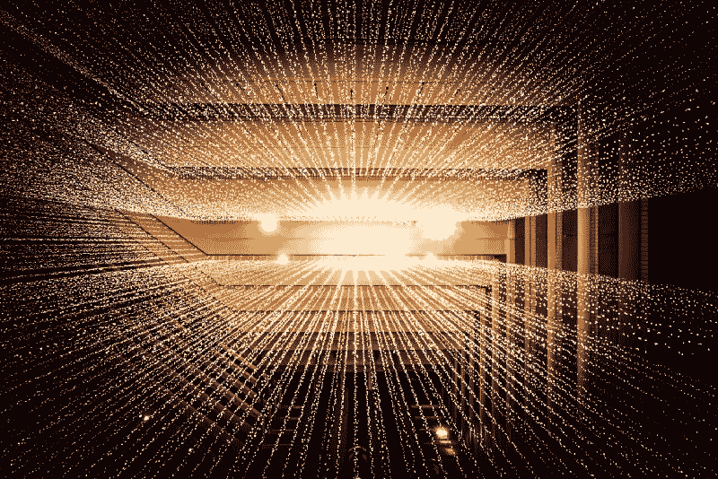
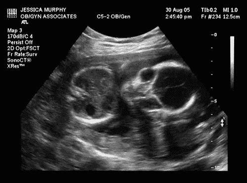
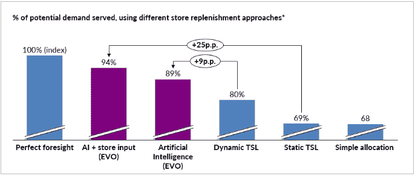

# AI 革命来了。只是和我们预想的不一样。

> 原文：<https://towardsdatascience.com/the-ai-revolution-is-here-its-just-different-than-we-expected-5022c23aaeee?source=collection_archive---------40----------------------->

## [商业科学](https://medium.com/tag/business-science)

## 仅仅因为人工智能还不足以成为科幻小说，并不意味着它已经不是革命性的了

由[约书亚·索蒂诺](https://unsplash.com/@sortino?utm_source=medium&utm_medium=referral)在 [Unsplash](https://unsplash.com/?utm_source=medium&utm_medium=referral) 上拍摄的照片

两年前，伯克利计算机科学教授和人工智能专家迈克尔·I·乔丹写了一篇文章警告不要夸大人工智能的说法。他宣称人工智能革命是我们只能希望在未来实现的东西。我认为革命已经开始了。只是看起来不像科幻小说一直描绘的那样。

# 艾:“智力通配符”

正如乔丹在他的文章中正确指出的那样，“人工智能”或“AI”一词被广泛应用于如此多的技术，以至于它实际上已经变得毫无意义。

> *“当前关于这些问题的公共对话经常使用“人工智能”作为智能通配符，这使得人们很难对新兴技术的范围和后果进行推理。”*
> 
> 迈克尔·乔丹，“人工智能——革命尚未发生”

这是一个“智力通配符”,可以用来讨论任何基于逻辑或推理的任务，这些任务以前由人类完成，现在计算机可以完成。诸如自然语言处理、神经网络，甚至像模式识别这样的低级功能的算法经常被包括在人工智能的讨论中。

你们撒了这么广的网，难怪 AI 辜负了我们的期望。除非创造出与人类推理能力相当的人工智能，否则任何人工智能看起来都不会发挥出它的潜力。不幸的是，忽视不值得科幻小说的人工智能限制了我们利用已经存在的真正革命性的人工智能。

历史上，人工智能的最终目标一直被视为创造一个完全独立的推理机器。这种自主的人工智能是一个伟大的最终目标，但我们不必等待这种可能性来认识到这场革命。人工智能增强了人类的智能，使我们能够根据数据做出更有效的决定，这已经是对传统决策的巨大改进。

尽管人们以前被限制在任何个人都可以有效收集和处理的有限信息量的决策中，但人工智能允许人们聚集所有相关信息并快速理解其含义。虽然人们可能无法完全从这个过程中解脱出来，但决策会变得更加有效。这是革命性的——我认为这是人工智能的最佳用途。

# 革命性人工智能

图片由 [ytang3](https://www.flickr.com/photos/13903863@N00) 提供，经 [CC BY-SA 2.0](https://creativecommons.org/licenses/by-sa/2.0/?ref=ccsearch&atype=rich) 授权

当我们允许人工智能的目标是自动化和优化人类决策，而不是将人类从等式中删除时，自乔丹写下他的文章以来，我们在人工智能方面取得的进展变得更加清晰。以胎儿超声波为例。Jordan 的文章以一个故事开始，说明了人类有效利用数据、统计、技术和医学信息评估产前护理风险的局限性。因为在为孕妇和胎儿选择最佳护理计划的过程中涉及到如此多的因素，所以危险的误判是常见的。

然而，就在这篇文章发表五个月后，研究人员发布了一个人工智能系统，旨在[评估超声波](https://www.riken.jp/en/news_pubs/research_news/pr/2018/20180918_3/)，以检测和诊断心脏异常。该系统将在评估所有使医生难以做出最佳建议的复杂性后，推荐治疗计划。医生和患者对医疗决策拥有最终控制权，但由于人工智能的创新，他们的信息更加灵通。用来说明人工智能缺点的确切问题已经发生了革命性的变化——没有人建议在没有最终决定权的情况下使用人工智能。还可以提供许多其他示例，例如通过手表和电话监控慢性病(如糖尿病)。

过去两年人工智能的进步帮助人们做出更好的决定，并不局限于医疗领域。商业也发生了类似的转变。埃森哲[申请了一项进行即时支出分析的技术](https://www.forbes.com/sites/rogertrapp/2018/06/14/how-ai-can-help-leaders-make-better-decisions/#496639125e2f)专利，允许用户对财务变化做出更敏捷的反应。一家新的时尚公司 [Glitch](https://www.weforum.org/agenda/2019/07/these-clothes-were-designed-by-artificial-intelligence/) 利用人工智能产生独特的设计想法，但让设计师们留在现场，对吸引消费者的东西做出最终决定。

[我所在的 Evo](https://evopricing.com/) 公司是建立在从自动化决策中创造价值的理念之上的。大多数公司过去都是根据历史数据和过去的销售来计算需求预测，但我们的人工智能允许这些评估包括来自更广泛来源的实时数据。这将预测准确率平均提高了 36%。人类基于这些预测做出关键的商业决策，但他们有比他们的勇气更好的选择基础。

由[凯利·西克玛](https://unsplash.com/@kellysikkema?utm_source=medium&utm_medium=referral)在 [Unsplash](https://unsplash.com/?utm_source=medium&utm_medium=referral) 上拍摄的照片

# 作为人机联盟的人工智能

无论如何，保持人工智能的自主性并不一定会改善结果。人工智能推荐的准确性通常会随着额外的主观人类输入而提高。例如，当商店经理可以在有限的范围内调整库存建议时，我们的供应链算法可以提供更准确的需求预测。为什么？随着时间的推移，人们对客户需求有一种难以言喻的地方层次的理解，这种理解很难量化。

通过将人工智能计算的能力与人类直觉相结合，我们将预测准确度比自主生成的人工智能预测提高了 5%。我们当然不能保证人工智能模型中任何特定的人类干预都会产生同样的积极影响；人类的偏见定期在人工智能中复制自己。然而，人类与人工智能合作的总体影响是积极的。正是在这里，我们实现了创新，称得上是一场革命。

当你考虑通过人工智能已经可能的事情和每天变得新可能的事情时，很明显我们已经在人工智能领域达到了一个临界点。每天都有新的学术和商业应用出现。人工智能的发展可能会偏离我们的预期，但这并不影响我们已经取得的巨大进步。

Fabrizio Fantini 在 [Evo](https://evopricing.com/) 拍摄的图片

# 重新定义人工智能革命

乔丹明智地建议说，围绕完全自主的人工智能的大肆宣传正在阻碍我们看到将人工智能作为一种智能增强手段所带来的机会。人类直觉和机器计算能力的结合最有可能解决我们紧迫的社会问题。然而，他认为这意味着我们还没有开始人工智能革命，这是错误的。我们利用人工智能来帮助人们做出更理性、更明智的决定，这本身就是革命性的一步。

AI 革命来了。原来我们和机器是站在同一边的。

想了解更多关于数据科学革命的信息吗？看看这些文章。

 [## EvoFlow:为什么我们更喜欢自己的气流解决方案

### 通用的流量检查流程

towardsdatascience.com](/evoflow-why-we-preferred-our-own-solution-to-airflow-cdd6d187784a)  [## 数据科学已经死了。商业科学万岁！

### 任何人都可以从不起眼的鲑鱼身上学到的 5 课

towardsdatascience.com](/data-science-is-dead-long-live-business-science-a3059fe84e6c)