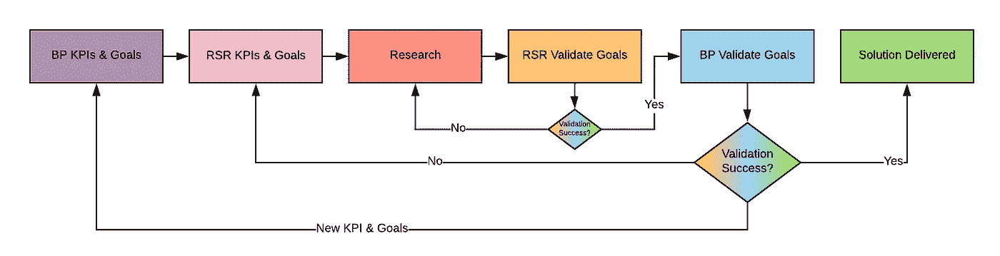

# 算法不是产品

> 原文：<https://towardsdatascience.com/the-algorithm-is-not-the-product-2e0b3740bdfa?source=collection_archive---------20----------------------->

## 为什么我认为数据科学家应该学习更多关于制造好产品的知识

一名男子正在看白板。

我在这个行业学到的第一个教训是，即使我们构建高度复杂的算法来解决特定的问题，这些工具也需要被客户使用。无论是内部的还是外部的，客户端需要的不仅仅是一段精心构建、打包和部署的代码。

换句话说，这个产品不仅仅是一个算法，它是一个完整的系统，让你的用户从中获得巨大的价值。构建一个以算法为核心的产品并不是一件容易的事情，它需要许多团队的合作，例如产品经理、开发人员、研究人员、数据工程师、开发人员、ui\ux 等..

制造一个产品依赖于研究方法，你反复地假设(基于先验或后验知识)，测量，推断见解和调整产品，直到你达到产品适合市场。这是一场与未知的无休止的战斗，除了过程之外，没有任何承诺。过程越好，你得到好产品的机会就越大。

**然而，我们往往会忘记这一点。**

以下是应该强调的几点，即除了数据科学考虑之外，我们还需要重视产品的情况。

## 面试

当面试一名新的数据科学家时，我们通常会询问过去的研究、算法、方法，并引入一个候选人需要解决的看不见的动手研究问题。

作为招聘经理，我们应该真正考虑从 DS 的角度询问与产品相关的问题，我们应该查看家庭作业，并询问相关问题，为什么候选人做出与产品相关的某些数据或算法决策。例如，询问与产品问题相关的特征工程选择。诸如“为什么他们选择包含特性 X 而不是 Y”或“为什么他们选择以某种方式处理特性 Z”的决策。

## 最初的模型

对于许多组织来说，应该投入生产的第一个模型是最简单的算法，通常被描述为“基于规则”的模型或“80–20”模型。在进入研究阶段之前放置这样一个基本模型的动机通常是，允许开发人员、开发人员和其他团队为新模型创建一个支持性的基础设施，然后 DS 将致力于一个“真正的”模型来代替临时的替身。

从 DS 候选人那里听到这个想法或由当前的 DS 执行它是非常重要的。它显示了对一个组织需要提前做好准备的深刻理解。它允许项目经理并行地促进和推动相关任务，允许我们更加敏捷，并且它鼓励非产品人员理解产品。

## 决策模型

有些考虑事项应该由候选人提出或由您的 DSs 实践。用 *balance=true* 来训练一个算法，以便对不平衡的数据集进行正则化，这是一个产品决策，应该由数据科学家来决定。他应该问产品经理，这些课程对于手头的问题是否同样重要，或者我们是否希望在更大的课程中表现得更好？

这类问题是我们在面试过程中也应该问候选人的重要问题，在询问他是否能描述他所知道的关于平衡类的所有方法(过采样、欠采样、损失正则化、合成数据等)之后，我们应该立即问候选人..).
这里我也简单说一下[。](/data-science-recruitment-why-you-may-be-doing-it-wrong-b8e9c7b6dae5)

## 与项目经理的合作

在我们的数据科学(DS)领域，我们与产品经理(PM)紧密合作，以实现这一令人垂涎的目标。我们与不同的团队有许多摩擦点，但最重要的是与 PM 的摩擦点，如图 1 所示。

图 1:与业务和产品一起工作时的建议流程

考虑一个需要达到或优化的业务-产品(BP) KPI，以及一个需要找到合适的 DS-KPI 的数据科学家，它最大限度地服务于 BP-KPI。这是我们最大的挑战之一，并且经常被所有利益相关者忽略。下图(图 1)显示了一个工作流，该工作流允许进行迭代研究，以优化这两种类型的 KPI，允许与业务、产品和数据科学进行协作。
你可以在这里阅读更多关于[我管理这个摩擦点的方法。](/why-business-product-should-always-define-kpis-goals-for-data-science-450404392990)

## 不要爱上你的算法

我们努力完善我们的算法，确保它们得到适当的优化，但是，很多时候，系统中的某些人会改变主意，或者没有正确地研究市场，而您为某个功能构建的算法是不需要的，或者没有按预期执行。一个常见的错误是推动、尝试修正或重新调整算法。然而，更明智的做法可能是放手，根据新产品需求，从零开始使用新的算法。这将你从以前的约束中解放出来，对你在组织中的团队来说是战略上的好事。

我希望这些想法将允许专业决策支持系统在开始一个新项目或向产品添加新功能时探索更多关于产品管理的知识，更加敏捷，并有希望帮助处理业务经理、产品经理、数据科学家和研究人员之间的复杂关系。

我要感谢我的同事，纳塔内尔·达维多维茨和 T2·塞菲·凯勒审阅了这篇文章。

Ori Cohen 博士拥有计算机科学博士学位，主要研究机器学习。他是新遗迹 TLV 的首席数据科学研究员，在 AIOps 领域从事机器和深度学习研究。