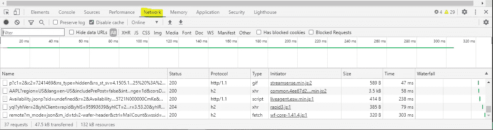
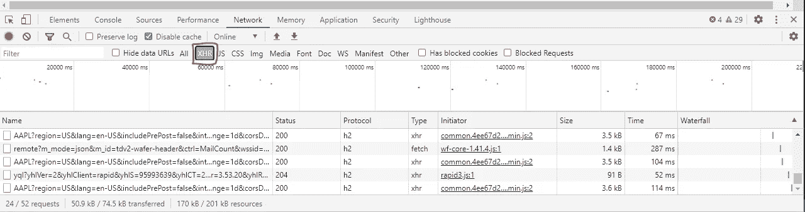
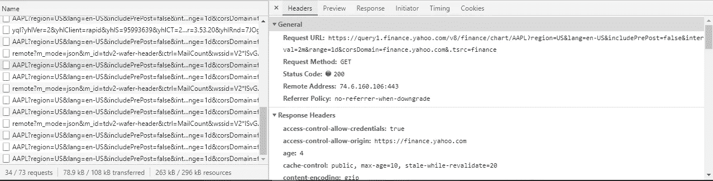
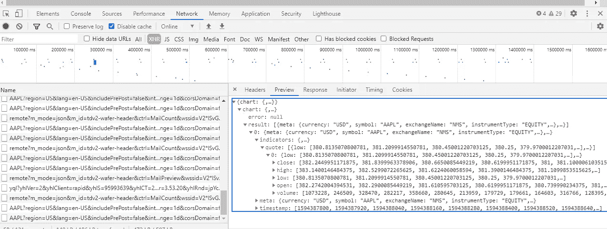
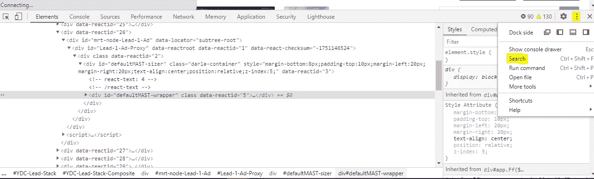
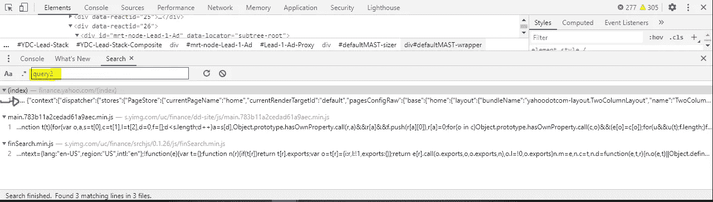
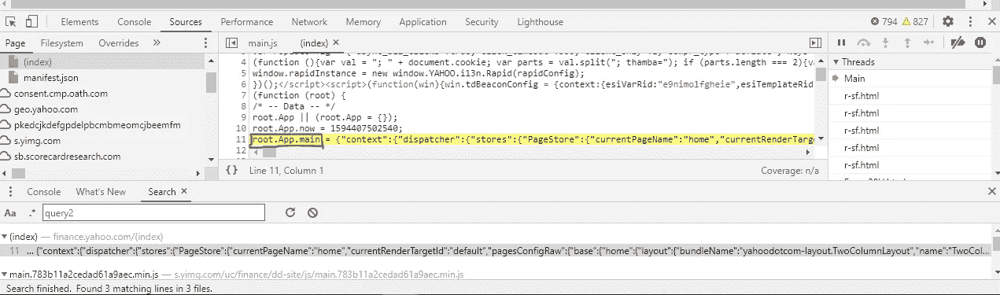

# 网络抓取的替代方案

> 原文：<https://towardsdatascience.com/the-alternative-to-web-scraping-8d530ae705ca?source=collection_archive---------2----------------------->

## 更快、更有效地检索 web 数据的“懒惰”程序员指南


弗洛里安·奥利佛在 [Unsplash](https://unsplash.com?utm_source=medium&utm_medium=referral) 上拍摄的照片

# 懒惰的程序员

Perl 编程语言的作者拉里·沃尔认为，程序员有三大美德；懒惰、急躁和傲慢:

> **懒惰**:让你下大力气降低整体能量消耗的品质。它让你编写省力的程序，其他人会觉得有用，并记录你写的东西，这样你就不必回答这么多关于它的问题。

比尔·盖茨呢:

> 我选择一个懒惰的人去做艰苦的工作。因为一个懒惰的人会找到一个简单的方法去做。

诚然，web 抓取可能是一个相当简单的编程问题:在文档的源代码中搜索惟一的标识符并提取相关数据。然而，我认为，通常有一个更简单、更快、能产生更多数据的“更懒惰”的解决方案。

# 网页抓取示例

一个比较好的金融数据网站是雅虎财经。这使得它成为金融爱好者搜索网页的主要目标。在 stack overflow[上几乎每天都有问题涉及到来自雅虎财经的某种数据检索(通常是通过网络搜集)。](https://stackoverflow.com/search?tab=newest&q=yahoo-finance)

## 网络抓取问题#1

[](https://stackoverflow.com/questions/62629614/trying-to-test-a-code-that-scrap-from-yahoo-finance) [## 试图测试一个从雅虎财经废弃的代码

### 我是 python 初学者，但我喜欢通过测试和尝试来学习这门语言。所以有一个雅虎网络刮刀…

stackoverflow.com](https://stackoverflow.com/questions/62629614/trying-to-test-a-code-that-scrap-from-yahoo-finance) 

OP 试图找到特定股票脸书的当前价格。他们的代码如下:

该代码产生了以下输出:

```
the current price: 216.08
```

这是一个非常简单的问题，也是一个简单的网络抓取解决方案。但是，还不够懒。我们来看下一个。

## 网络抓取问题#2

[](https://stackoverflow.com/questions/62618756/web-scraping-yahoo-finance-statistics-code-errors-out-on-empty-fields) [## 雅虎财经统计数据的网络抓取——空字段中的代码错误

### 我发现了这个有用的代码片段:使用 BS4 对雅虎财务统计数据进行网络搜集，我已经按照…

stackoverflow.com](https://stackoverflow.com/questions/62618756/web-scraping-yahoo-finance-statistics-code-errors-out-on-empty-fields) 

OP 试图从[统计数据](https://finance.yahoo.com/quote/AGL.AX/key-statistics?p=AGL.AX)选项卡中提取数据，即股票的企业价值和股票做空的数量。他的问题实际上围绕着检索可能存在也可能不存在的嵌套字典值，但是他似乎已经找到了一个更好的检索数据的解决方案。

看一下第 3 行:OP 能够在 javascript 的一个变量中找到他正在寻找的数据:

```
root.App.main = { .... };
```

从那里，通过访问字典中适当的嵌套键`data`，可以非常简单地检索数据。但是，你可能已经猜到了，有一个更简单、更懒惰的解决方案。

## 懒惰解决方案#1

看看第三行的 URL

输出:

```
{
    'quoteSummary': {
        'error': None,
        'result': [{
            'price': {
                'averageDailyVolume10Day': {},
                'averageDailyVolume3Month': {},
                'circulatingSupply': {},
                'currency': 'USD',
                'currencySymbol': '$',
                'exchange': 'NMS',
                'exchangeDataDelayedBy': 0,
                'exchangeName': 'NasdaqGS',
                'fromCurrency': None,
                'lastMarket': None,
                'longName': 'Facebook, Inc.',
                'marketCap': {
                    'fmt': '698.42B',
                    'longFmt': '698,423,836,672.00',
                    'raw': 698423836672
                },
                'marketState': 'REGULAR',
                'maxAge': 1,
                'openInterest': {},
                'postMarketChange': {},
                'postMarketPrice': {},
                'preMarketChange': {
                    'fmt': '-0.90',
                    'raw': -0.899994
                },
                'preMarketChangePercent': {
                    'fmt': '-0.37%',
                    'raw': -0.00368096
                },
                'preMarketPrice': {
                    'fmt': '243.60',
                    'raw': 243.6
                },
                'preMarketSource': 'FREE_REALTIME',
                'preMarketTime': 1594387780,
                'priceHint': {
                    'fmt': '2',
                    'longFmt': '2',
                    'raw': 2
                },
                'quoteSourceName': 'Nasdaq Real Time '
                'Price',
                'quoteType': 'EQUITY',
                'regularMarketChange': {
                    'fmt': '0.30',
                    'raw': 0.30160522
                },
                'regularMarketChangePercent': {
                    'fmt': '0.12%',
                    'raw': 0.0012335592
                },
                'regularMarketDayHigh': {
                    'fmt': '245.49',
                    'raw': 245.49
                },
                'regularMarketDayLow': {
                    'fmt': '239.32',
                    'raw': 239.32
                },
                'regularMarketOpen': {
                    'fmt': '243.68',
                    'raw': 243.685
                },
                'regularMarketPreviousClose': {
                    'fmt': '244.50',
                    'raw': 244.5
                },
                'regularMarketPrice': {
                    'fmt': '244.80',
                    'raw': 244.8016
                },
                'regularMarketSource': 'FREE_REALTIME',
                'regularMarketTime': 1594410026,
                'regularMarketVolume': {
                    'fmt': '19.46M',
                    'longFmt': '19,456,621.00',
                    'raw': 19456621
                },
                'shortName': 'Facebook, Inc.',
                'strikePrice': {},
                'symbol': 'FB',
                'toCurrency': None,
                'underlyingSymbol': None,
                'volume24Hr': {},
                'volumeAllCurrencies': {}
            }
        }]
    }
}the current price: 241.63
```

## 懒惰解决方案#2

再次查看第 3 行的 URL

输出:

```
{
    'quoteSummary': {
        'result': [{
            'defaultKeyStatistics': {
                'maxAge': 1,
                'priceHint': {
                    'raw': 2,
                    'fmt': '2',
                    'longFmt': '2'
                },
                'enterpriseValue': {
                    'raw': 13677747200,
                    'fmt': '13.68B',
                    'longFmt': '13,677,747,200'
                },
                'forwardPE': {},
                'profitMargins': {
                    'raw': 0.07095,
                    'fmt': '7.10%'
                },
                'floatShares': {
                    'raw': 637754149,
                    'fmt': '637.75M',
                    'longFmt': '637,754,149'
                },
                'sharesOutstanding': {
                    'raw': 639003008,
                    'fmt': '639M',
                    'longFmt': '639,003,008'
                },
                'sharesShort': {},
                'sharesShortPriorMonth': {},
                'sharesShortPreviousMonthDate': {},
                'dateShortInterest': {},
                'sharesPercentSharesOut': {},
                'heldPercentInsiders': {
                    'raw': 0.0025499999,
                    'fmt': '0.25%'
                },
                'heldPercentInstitutions': {
                    'raw': 0.31033,
                    'fmt': '31.03%'
                },
                'shortRatio': {},
                'shortPercentOfFloat': {},
                'beta': {
                    'raw': 0.365116,
                    'fmt': '0.37'
                },
                'morningStarOverallRating': {},
                'morningStarRiskRating': {},
                'category': None,
                'bookValue': {
                    'raw': 12.551,
                    'fmt': '12.55'
                },
                'priceToBook': {
                    'raw': 1.3457094,
                    'fmt': '1.35'
                },
                'annualReportExpenseRatio': {},
                'ytdReturn': {},
                'beta3Year': {},
                'totalAssets': {},
                'yield': {},
                'fundFamily': None,
                'fundInceptionDate': {},
                'legalType': None,
                'threeYearAverageReturn': {},
                'fiveYearAverageReturn': {},
                'priceToSalesTrailing12Months': {},
                'lastFiscalYearEnd': {
                    'raw': 1561852800,
                    'fmt': '2019-06-30'
                },
                'nextFiscalYearEnd': {
                    'raw': 1625011200,
                    'fmt': '2021-06-30'
                },
                'mostRecentQuarter': {
                    'raw': 1577750400,
                    'fmt': '2019-12-31'
                },
                'earningsQuarterlyGrowth': {
                    'raw': 0.114,
                    'fmt': '11.40%'
                },
                'revenueQuarterlyGrowth': {},
                'netIncomeToCommon': {
                    'raw': 938000000,
                    'fmt': '938M',
                    'longFmt': '938,000,000'
                },
                'trailingEps': {
                    'raw': 1.434,
                    'fmt': '1.43'
                },
                'forwardEps': {},
                'pegRatio': {},
                'lastSplitFactor': None,
                'lastSplitDate': {},
                'enterpriseToRevenue': {
                    'raw': 1.035,
                    'fmt': '1.03'
                },
                'enterpriseToEbitda': {
                    'raw': 6.701,
                    'fmt': '6.70'
                },
                '52WeekChange': {
                    'raw': -0.17621362,
                    'fmt': '-17.62%'
                },
                'SandP52WeekChange': {
                    'raw': 0.045882702,
                    'fmt': '4.59%'
                },
                'lastDividendValue': {},
                'lastCapGain': {},
                'annualHoldingsTurnover': {}
            }
        }],
        'error': None
    }
}{'AGL.AX': {'Enterprise Value': '13.73B', 'Shares Short': 'N/A'}}
```

懒惰的替代方法只是将请求从利用前端 URL 更改为某种非官方的 API 端点，后者返回 JSON 数据。它的**更简单**并导致**更多数据**！那么速度呢(我很确定我承诺了更简单、更多数据、**和**更快的选择)？让我们检查一下:

```
web scraping #1 min time is 0.5678426799999997
lazy #1 min time is 0.11238783999999953
web scraping #2 min time is 0.3731000199999997
lazy #2 min time is 0.0864451399999993
```

**懒惰的替代品比他们的网页抓取对手快 4 到 5 倍！**

你可能会想，“这很好，但是你在哪里找到这些网址？”。

# 懒惰的过程

考虑我们在上面走过的两个问题:在数据被加载到页面中之后，我们试图检索数据**的操作。更懒惰的解决方案直接进入数据源，根本不关心前端页面。这是一个重要的区别，而且我认为，当你试图从一个网站提取数据时，这是一个很好的方法。**

## 步骤 1:检查 XHR 请求

XHR (XMLHttpRequest)对象是一种可用于 web 浏览器脚本语言(如 JavaScript)的 API。它用于向 web 服务器发送 HTTP 或 HTTPs 请求，并将服务器响应数据加载回脚本。基本上，它允许客户端从 URL 中检索数据，而不必刷新整个页面。

我将在下面的演示中使用 Chrome，但其他浏览器也有类似的功能。

*   如果你想跟随，导航到[https://finance.yahoo.com/quote/AAPL?p=AAPL](https://finance.yahoo.com/quote/AAPL?p=AAPL)
*   打开 Chrome 的开发者控制台。要在 Google Chrome 中打开开发者控制台，请打开浏览器窗口右上角的 Chrome 菜单，然后选择更多工具>开发者工具。也可以使用快捷键选项+ ⌘ + J(在 macOS 上)，或者 Shift + CTRL + J(在 Windows/Linux 上)。
*   选择“网络”选项卡



*   然后按“XHR”过滤结果



*   你的结果将是相似的，但不是相同的。你应该注意到有一些请求包含“AAPL”。让我们从调查这些开始。单击最左侧列中包含字符“AAPL”的链接之一。



*   选择其中一个链接后，您将看到另一个屏幕，提供您选择的请求的详细信息。第一个选项卡 Headers 提供了浏览器发出的请求和服务器响应的详细信息。您应该立即注意到 Headers 选项卡中的请求 URL 与上面的惰性解决方案中提供的非常相似。看来我们走对了路。
*   如果您选择预览选项卡，您将看到从服务器返回的数据。



*   完美！看起来我们找到了获取苹果 OHLC 数据的网址！

## 第二步:搜索

现在我们已经找到了一些通过浏览器发出的 XHR 请求，让我们搜索 javascript 文件，看看是否能找到更多信息。我发现与 XHR 请求相关的 URL 的共同点是“query1”和“query2”。在开发者控制台的右上角，选择三个垂直点，然后在下拉列表中选择“搜索”。



在搜索栏中搜索“query2 ”:



选择第一个选项。将弹出一个额外的选项卡，其中包含找到“query2”的位置。您应该注意到这里也有类似的东西:



这与 web 抓取解决方案#2 用来提取数据的变量相同。控制台应该为您提供一个“漂亮打印”变量的选项。你可以选择那个选项，或者将整行(上面的第 11 行)复制并粘贴到类似于[https://beautifier.io/](https://beautifier.io/)的地方，或者如果你使用 [vscode](https://code.visualstudio.com/) ，下载[美化](https://marketplace.visualstudio.com/items?itemName=HookyQR.beautify)扩展，它会做同样的事情。一旦正确格式化，将整个代码粘贴到文本编辑器或类似的地方，然后再次搜索“query2”。您应该在名为`“ServicePlugin”`的东西中找到一个结果。该部分包含 Yahoo Finance 用来在页面中填充数据的 URL。以下内容摘自该部分:

```
"tachyon.**quoteSummary**": {"path": "\u002Fv10\u002Ffinance\u002FquoteSummary\u002F{symbol}","timeout": 6000,"query": ["lang", "region", "corsDomain", "crumb", "modules",     "formatted"],"responseField": "quoteSummary","get": {"formatted": true}},
```

这与上面提供的惰性解决方案中使用的 URL 相同。

# TL；速度三角形定位法(dead reckoning)

*   由于网站的结构，网络搜集可能是必要的，但值得努力调查，看看是否能找到数据的来源。生成的代码更简单，提取更多数据的速度更快。
*   找到网站数据的来源通常是通过搜索 XHR 请求或利用浏览器的开发人员控制台搜索网站的 javascript 文件来实现的。

# 更多信息

*   如果你找不到任何 XHR 请求怎么办？查看 web 抓取的替代方案，第二部分:检索 Web 数据的枯燥方法

[](/the-alternative-to-web-scraping-part-ii-c2e3c2c06556) [## Web 抓取的替代方案，第二部分

### 检索 web 数据的干燥方法

towardsdatascience.com](/the-alternative-to-web-scraping-part-ii-c2e3c2c06556) 

*   如果您对本文的 Yahoo Finance 方面特别感兴趣，我已经编写了一个 python 包， [yahooquery](https://yahooquery.dpguthrie.com) ，它在一个方便的界面中公开了大多数端点。我还写了一篇介绍性文章，描述了如何使用这个包以及与类似包的比较。

[](/the-unofficial-yahoo-finance-api-32dcf5d53df) [## (非官方的)雅虎财经 API

### 一个 Python 接口，可以处理无限量的数据

towardsdatascience.com](/the-unofficial-yahoo-finance-api-32dcf5d53df) 

*   如果您有任何问题或意见，请随时联系我们