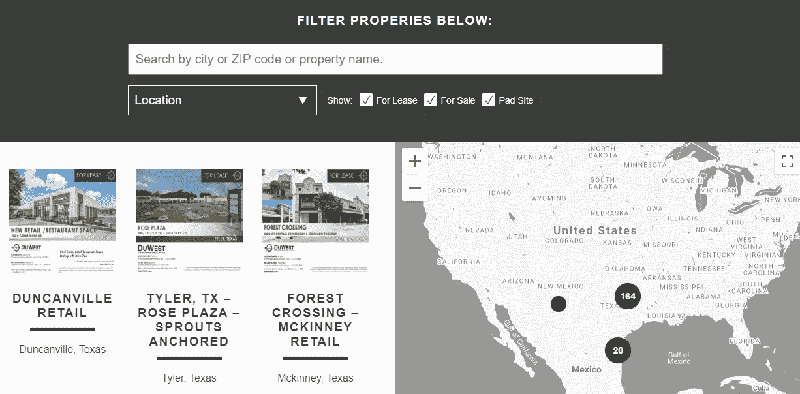
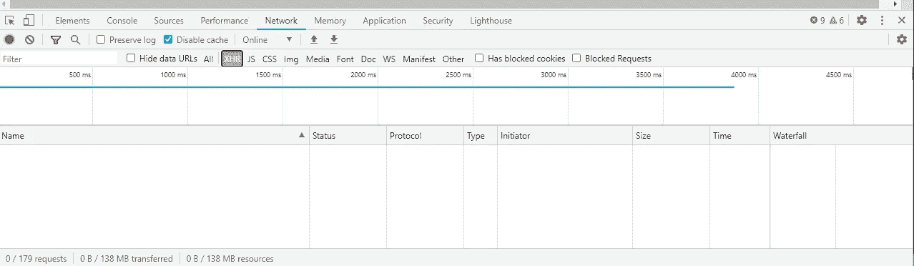
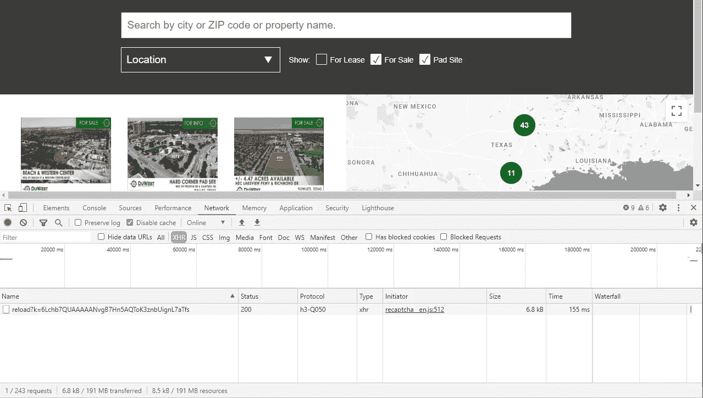
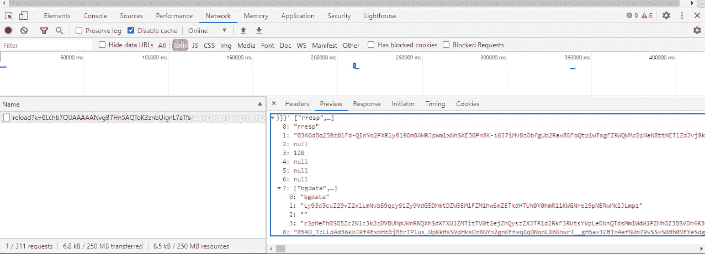
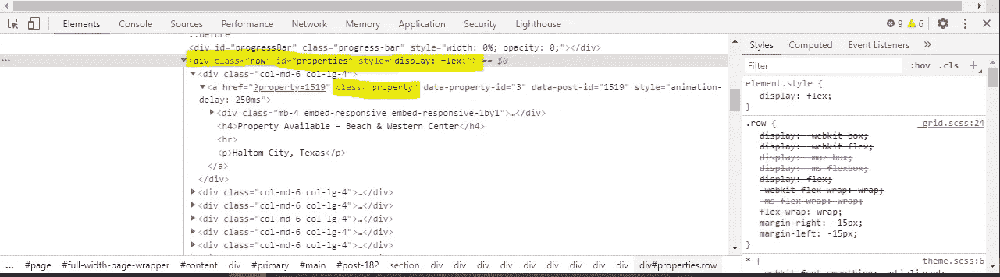
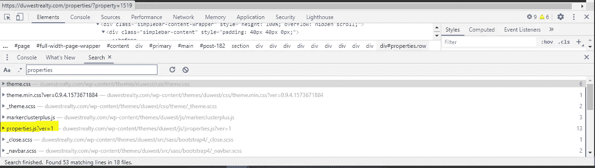
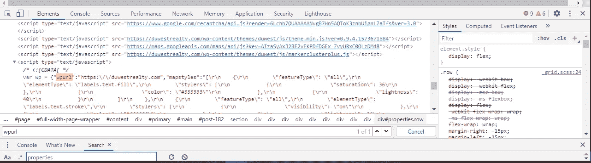

# Web 抓取的替代方案，第二部分

> 原文：<https://towardsdatascience.com/the-alternative-to-web-scraping-part-ii-c2e3c2c06556?source=collection_archive---------19----------------------->

## 检索 web 数据的干燥方法


费尔南多·埃尔南德斯在 [Unsplash](https://unsplash.com/s/photos/person-programming?utm_source=unsplash&utm_medium=referral&utm_content=creditCopyText) 上的照片

在[的上一篇文章](/the-alternative-to-web-scraping-8d530ae705ca)中，我描述了如何在不使用网络抓取的情况下从雅虎财经中检索数据。具体来说，我们发现了一种利用 XHR 请求检索数据的方法。从那里，我们在浏览器的开发者控制台中发现了更多带有搜索功能的非官方终端。如果没有任何 XHR 请求，我们能做什么呢？

首先，记住干燥原则很重要(以下来自维基百科):

> **不要重复** ( **干**，或者有时**不要重复**)是[软件开发](https://en.wikipedia.org/wiki/Software_development_process)的[原则](https://en.wikipedia.org/wiki/Principle#Principle_as_axiom_or_logical_fundament)，旨在减少软件模式的重复，[【1】](https://en.wikipedia.org/wiki/Don%27t_repeat_yourself#cite_note-1)用抽象代替它或者使用[数据规范化](https://en.wikipedia.org/wiki/Data_normalization)来避免冗余。

创建了你试图抓取的网站的开发者很可能就是带着这个原则在运作的。站点中可用的数据使用一种固定的模式呈现——无论是列表、表格还是一系列 div。很可能，这对你来说并不陌生；这是你用来收集数据的。但是，就像第一篇文章一样，我认为花时间寻找替代方案是有好处的。

# 例子

最近，我被要求搜索大约 100 个房地产网站，以便一家公司能够跟踪他们当地市场的商业地产销售情况。

我看的第一个地方是 https://duwestrealty.com/properties/ T21。



*   我总是做的第一件事是检查开发者控制台的网络选项卡中的 XHR 请求



*   而且……什么都没有。好吧，没理由气馁。屏幕顶部附近有复选框，最有可能过滤下面的结果。我的猜测是，如果我改变其中一个复选框，一个 XHR 请求将被解雇。我们试试吧！



*   取消选中“用于租赁”复选框后，XHR 请求确实发生了。但是，进一步考察之后，似乎一点帮助都没有。



*   看起来这个网站正在努力隐藏这个请求。这比我想象的要难。
*   我现在要去检查大教堂。具体来说，我想看看每个属性的图像和细节是如何呈现的。这是我右键单击其中一个图像并选择“Inspect”后看到的内容。



*   首先，看起来每个属性都在 id 为 **properties 的 div 中。**并且，每个属性都在一个带有类**属性**的 a 标签内。
*   这就是干燥原理再次发挥作用的地方。从传统的 web 抓取的角度来看，我们要么以属性 id 为目标，要么以属性类为目标，然后遍历结果。然而，为什么不从站点开发者的角度考虑这些标识符呢？从 CSS 的角度来看，他们很可能使用这些标识符来保持代码的干爽，但也可能是为了利用 javascript 注入数据。
*   所以，接下来我要做的是在开发者控制台中搜索*属性*。结果如下:



*   前几个是 css 文件。我知道那些不会有什么有用的东西，所以我继续浏览着名单。往下第五个是*properties . js；那似乎很有希望。我将把该文件复制到文本编辑器中，并再次搜索“properties”。这是我的发现:*

*   让我们再细分一下，因为这里有很多有用的信息:

1.  他们利用了 ajax，它允许页面发出异步 HTTP 请求。
2.  URL 位于一个名为`ajaxUrl`的变量中。
3.  他们正在发出一个 [POST](https://developer.mozilla.org/en-US/docs/Web/HTTP/Methods/POST) 请求。
4.  最后，他们通过 POST 请求发送数据:

```
data: {
    action: 'fetch_properties'
}// ordata: {
    action: 'fetch_brokers'
}
```

*   让我们继续前进，因为我还没有完全到达那里；我还需要找到`ajaxUrl`。如果我在同一个 *properties.js* 文件中搜索“ajaxUrl ”,我会发现:

```
const ajaxUrl = wp.wpurl + ‘/wp-admin/admin-ajax.php’;
```

*   我们越来越近了！我的猜测是 wp.wpurl 只是主机名:`duwestrealty.com`但是让我们确认一下。我将在 DOM 中搜索该变量:



*   现在，就像用我们在`properties.js`文件中找到的所需有效负载发出 POST 请求一样简单。

```
import requestsr = requests.post(
    "[https://duwestrealty.com/wp-admin/admin-ajax.php](https://duwestrealty.com/wp-admin/admin-ajax.php)",
    data={'action': 'fetch_properties'}
)
data = r.json()
type(data)
len(data)
data[0].keys()
```

```
<class 'list'>
185
dict_keys(['id', 'postid', 'address', 'city', 'state', 'zipcode', 'categories', 'sf', 'gla', 'caprate', 'price', 'description', 'brokers', 'pdf', 'image', 'logo', 'video', 'locationmap', 'title'])
```

所以，回到我手头的任务。我需要检索大约 100 个其他类似网站的数据。从代码的角度来看，再考虑一下 DRY 原则，利用上面的方法比为每个站点开发不同的抓取解决方案要容易得多。我可以很容易地使每个请求适应适当的站点:修改 HTTP 请求方法(GET、POST)、发送到服务器的数据、查询参数和响应处理。如果你已经读到这里，这里是我想到的解决方案:

# 更多信息

*   [第 1 部分:网页抓取的替代方案](/the-alternative-to-web-scraping-8d530ae705ca)
*   如果您有任何问题或意见，请联系我们。