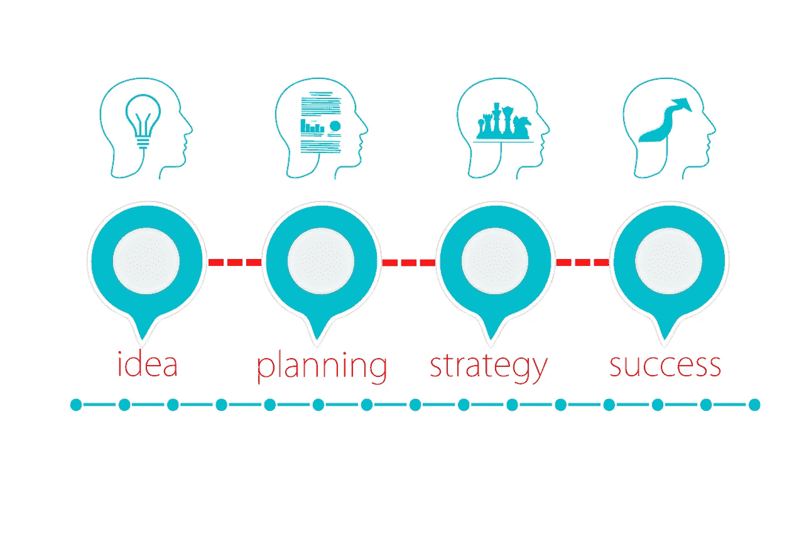
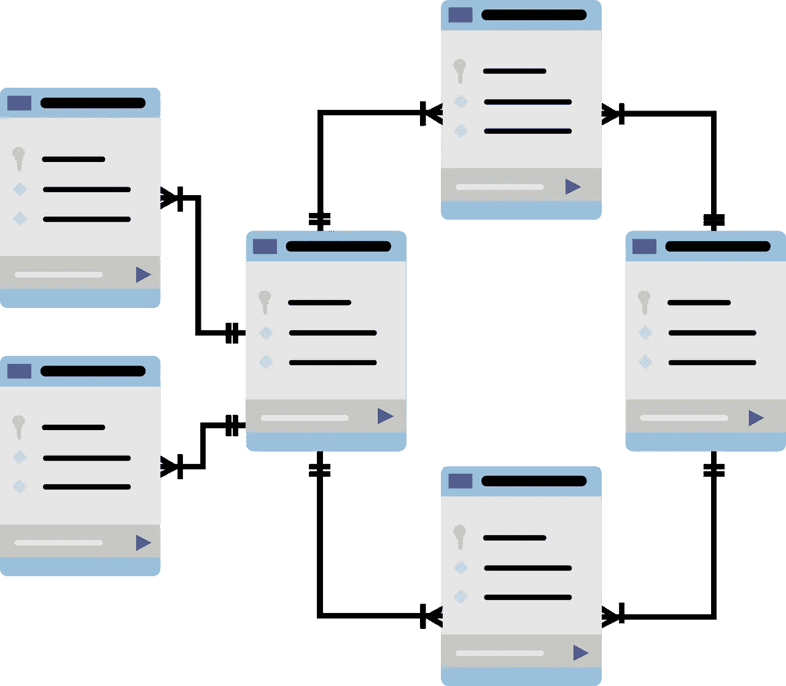

# 亚马逊商业分析师访谈

> 原文：<https://towardsdatascience.com/the-amazon-business-analyst-interview-509a9dda2347?source=collection_archive---------14----------------------->

## 亚马逊业务分析师面试问题

图片来自 [Unsplash](https://unsplash.com/s/photos/amazon?utm_source=unsplash&utm_medium=referral&utm_content=creditCopyText)

亚马逊业务分析师的工作是技术数据解释和商业敏锐度的混合体。一个成功的商业分析师将进入产品管理、分析管理或商业智能的职业道路，所有这些都需要知识的深度和广度。

**职责**

*   负责监控和推动关键业务决策的持续指标、报告、分析和仪表板的设计、开发和维护。
*   通过支持业务查询并将其转化为分析报告，将分析嵌入到日常运营中。
*   构建强大的运营和业务指标，并使它们在整个工作场所高度可视化和可消费。
*   与跨职能团队、系统和供应商数据合作，构建报告系统，并利用指标来寻找强有力的改进机会。

# 商业分析师面试

亚马逊的面试过程在不同的团队中非常一致。一旦你的简历进入候选名单，面试就从招聘人员筛选或招聘经理的电话筛选开始。如果在最初几轮中被选中，你会被邀请在同一天参加大约 4-5 次面试。所有的面试都是基于亚马逊的 14 项领导原则来测试你的能力，可能还包括技术性的面试问题。

总的来说，准备工作的重点应该主要放在领导原则上，稍微放在数据库系统设计上，最后放在实际编码、SQL 查询、产品和业务案例上。

*查看一个* [*亚马逊商业案例问题*](https://www.interviewquery.com/blog-amazon-business-intelligence-case-duplicate-product/) *的模拟面试。*

根据级别(L3/L4/L5)，您将有 4-5 轮面对面的机会。除此之外，还会有几轮技术测试和几轮行为测试。行为调查主要是根据亚马逊臭名昭著的领导原则来评判你。

# 亚马逊领导原则面试问题

对于亚马逊的领导行为能力面试，问题的确切措辞可能不同，但每个领导原则的中心思想是相同的。

对于每一条领导原则，记得围绕你如何体现每一条原则编一个故事。例如:

*   **客户困扰**:获取客户反馈，从他们的痛点中学习，以构建更好的产品或流程。
*   **深入研究:**通过深入问题解决复杂的问题。
*   **行动偏好:**不同项目的优先行动和主动性。
*   **归属:**一个你超出了原来范围的项目。
*   **赢得信任:**解决不同团队成员之间的冲突，并与客户建立了良好的长期关系。
*   发明和简化:一个让系统更高效的项目。

面试官永远不会说他们在问你一个领导原则类型的问题。然而，你要确切地知道如何编造一个故事来引出十四条原则中的一条。基本上就是房间里的大象！

**基于场景的问题**

产品策略由 [Pixabay](https://pixabay.com/illustrations/business-idea-growth-business-idea-3189797/) 提供

对于这些情景类型的问题，如*告诉我一次你……等*，思考 STAR 方法是有帮助的。星型方法是一个简单的框架，用来阐述你的工作经验。

**情景:**设置场景，给出上下文。任务:描述你的职责是什么。
**行动**:准确解释你采取了什么措施来解决这个问题。
**结果:**分享你的行动直接取得了哪些结果。

对于 STAR 方法的每个部分，让大部分讨论发生在**行动和结果**部分。你必须确切地强调你做了什么以及你的行动的结果。鉴于每次面试时间很短，项目讨论不要超过 5 分钟。

还记得考虑至少有两到三个项目和故事，你可以自信地叙述和回应后续问题。这降低了您没有任何基于场景的问题的相关示例的风险。

# 亚马逊业务分析师面试问题

重点关注的一般技术问题是:

*   SQL 查询和 ETL
*   商业案例问题
*   统计分析
*   产品指标

至少 1-2 轮将基于技术技能。对于业务分析师来说，他们测试的主要技能是 SQL，尽管了解一点 Python、R 或 Tableau 之类的数据可视化工具会有所帮助。期待在[面试查询](https://www.interviewquery.com/)上看到一些容易到中等水平的 SQL 问题。还有数据工程的元素，如原始数据提取、转换和加载数据。

> [查看我们的**SQL 面试问题终极指南**](https://www.interviewquery.com/blog-sql-interview-questions/)

通常，业务分析师也会编写一些 ETL 管道，所以这有助于复习关键概念。这将取决于团队，以及他们是否期望业务分析师编写 ETL 管道。

ETL 问题示例如下:

*   merge upserts 是如何工作的？
*   如何加载历史记录？

> 看看这个关于[候选人如何回答亚马逊](https://www.youtube.com/watch?v=IO_POFIQvo0)给出的数据工程和 ETL 问题的模拟面试。

**亚马逊内部已经几乎完全转向 AWS**，所以如果你掌握一些 AWS 知识，尤其是与数据库相关的服务，那会很好。此外，了解红移的工作原理对面试官可能熟悉的 SQL 语法也有好处。

图片来自 [Pixabay](https://pixabay.com/vectors/database-schema-data-tables-schema-1895779/)

**SQL 问题**将围绕您对基本 SQL 逻辑的理解，如使用多个数据集的连接条件，以及如何计算平均值、最大值、最小值、总和以及其他函数。

复习如何使用多个数据集，根据给定的数据创建新表，以及创建汇总输出。

Python 和 R 是更高级的工具，它们不是必需的，但会让你脱颖而出。大多数团队将依靠**数据工程师来满足他们的 Python 需求，并依靠数据科学家来利用 R 进行统计分析**。了解这些技能会让你作为亚马逊业务分析师更有价值。

此外，最常见的其他技术问题是统计分析、咨询式的业务案例问题，以及解释趋势对业务的影响的产品洞察生成。在这些技术回合中，预计会出现一些案例类型的问题，如特定绩效指标的衡量和跟踪，或领导报告仪表板的自动化。这些问题一般都是**问题策略类型的问题。**

**例题:**

*你的任务是标记在亚马逊上发布虚假评论的用户，然后交给建模团队做进一步分析。你最初会如何过滤在亚马逊上发布虚假评论的用户？*

> 在 [**面试查询**](https://www.interviewquery.com/) 上找到上面这个问题的最佳答案。

# 最后的提示和技巧

*   亚马逊业务分析师面试是技术和业务技能的结合，结合了对细节的关注、逻辑推理、沟通技巧，以及文化契合度和对团队中项目经理角色的兴趣。对于文化契合部分，关注上面的领导原则，因为这确实定义了文化。
*   通常还会有一个**标杆人物**在某个时候被带进面试(不是直接在团队中的人)，他能够更加客观地确定长期是否适合亚马逊。
*   可能会有关于产品路线图、优先顺序和利益相关方一致性的问题。这些可以作为一个“你愿意怎么样”的问题出现，而不是典型的“T4 告诉我一个时间”类型的问题。例如，一个问题可能是预测黑色星期五促销的 Echo 设备的运行率、库存策略和折扣%。
*   一个最近的候选人有一个奇怪的经历，当他们被要求*简洁地说出 3 个强有力的理由来拒绝我申请的角色*。这些问题预计占所有面试小组的 10-15%。

# 感谢阅读

*   想要更多带有亚马逊解决方案的面试问题吗？更多内容请登陆[**面试查询**](https://www.interviewquery.com/) **。**
*   查看我的 [**Youtube 频道**获取更多关于数据科学面试技巧和提示的视频](https://www.youtube.com/channel/UCcQx1UnmorvmSEZef4X7-6g)。
*   点击这里阅读亚马逊的商业智能工程师指南

*原载于 2020 年 5 月 26 日 https://www.interviewquery.com**[*。*](https://www.interviewquery.com/blog-amazon-business-analyst-interview/)*