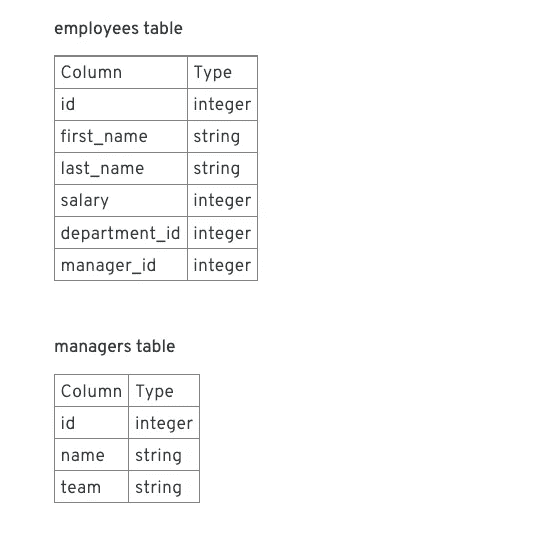
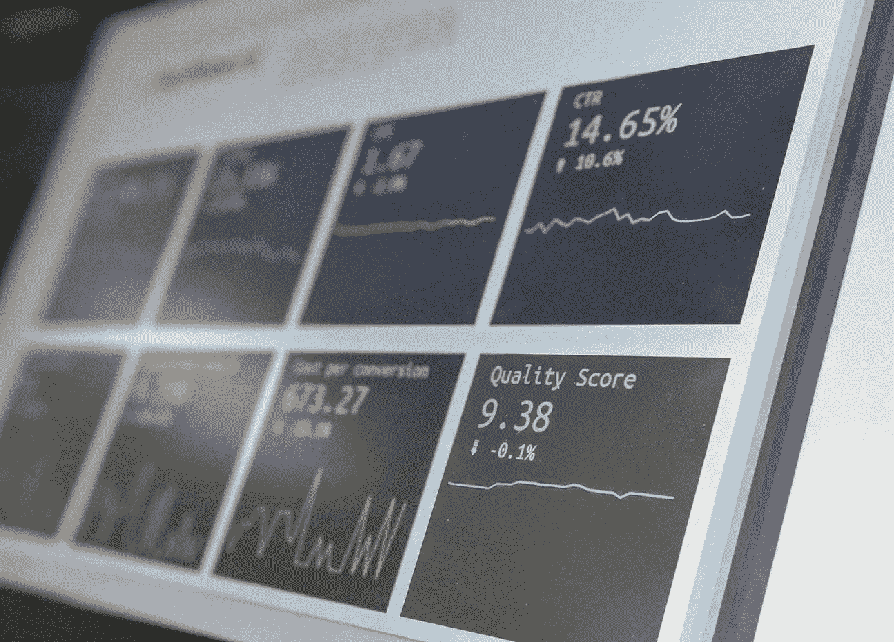

# 亚马逊商业智能工程师面试

> 原文：<https://towardsdatascience.com/the-amazon-business-intelligence-engineer-interview-6da61aedb27e?source=collection_archive---------2----------------------->

## 亚马逊商业智能工程师面试问题

图片来自 [Unsplash](https://images.unsplash.com/photo-1523474253046-8cd2748b5fd2?ixlib=rb-1.2.1&ixid=eyJhcHBfaWQiOjEyMDd9&auto=format&fit=crop&w=3150&q=80)

## 介绍

作为全球领先的科技公司之一，亚马逊利用大数据来改善其广泛的电子商务平台。从发现产品到购买，甚至到最终交付，每一次客户互动的数据都会被收集和分析。为了优化网站性能和改善客户体验，亚马逊将这些数据输入其推荐系统，该系统为每个客户显示最相关的产品。

创建个性化推荐屏幕的过程扩展到了亚马逊的所有产品和服务，包括 Alexa、Prime Video 和 Twitch。商业智能工程师将亚马逊的大型数据仓库转化为有意义的见解和改进。在亚马逊，数据驱动着每一个决策。

# 亚马逊的商业智能工程师角色

图片来自 [Pixabay](https://pixabay.com/illustrations/freelancer-working-space-coworking-4952214/)

在亚马逊，商业智能工程师与客户、分析师和数据库开发人员协同工作，将收集的数据转化为商业决策**。**这些工程师创造的解决方案有助于内部和外部客户数据的分析、自动化和报告。

通常情况下，亚马逊的工程师被嵌入到团队中，并与其他团队进行跨职能合作，旨在**改善整体客户体验。该职位的职责范围从实施解决方案到数据建模，再到为业务领导提供指导。**

## 亚马逊的商务智能工程团队

**亚马逊足够大，拥有 40 多个部门，这些部门内有 100 多个内部团队。因此，高效地处理和分析收到的大量企业数据对亚马逊来说至关重要。商业智能工程师设计软件和企业平台来做到这一点，从而更容易从亚马逊收集的数据中得出有意义的结论。**他们在团队中工作，并与亚马逊的内部客户一起提供支持关键业务流程的准确且可访问的数据。

根据分配到的团队，商业智能工程师可以执行以下功能:

*   **运输风险&合规(TRC)** :根据安全合规协议，一丝不苟地分析数据，寻找保证亚马逊客户和合作伙伴安全的方法。使用预测 ML 模型在数据中搜索安全相关趋势。
*   **支付:**利用海量客户支付数据，改善客户支付体验。使用概率模型和亚马逊的技术基础设施向客户实时展示产品。
*   **亚马逊护理:**开发数据驱动的模型，塑造亚马逊护理的未来。与业务和财务团队合作，改善亚马逊的决策流程。
*   **自动化库存管理:**开发分析和预测工具，准确量化每位亚马逊客户的购物体验。与亚马逊的内部客户(如软件开发团队)密切合作，大规模测试和验证这些工具。
*   **物流商业智能和分析:**使用世界上最大、最复杂的数据仓库之一。挖掘数据，收集客户洞察，提出建议，帮助领导根据数据趋势做出合理的商业决策。与软件工程师团队合作，简化或自动化这一商业智能流程。
*   **Prime Video(目录系统和运营组织):**定义有用的业务指标，开发自助服务报告程序，进行实验，为有关亚马逊 Prime 视频目录结构的决策提供信息。
*   **Alexa:** 使用 Alexa 的数据源来定义和自动化关键业务指标，并利用高级数据分析来了解客户行为**。**设计实验(A/B 实验)来测试客户参与策略。
*   **AmazonFresh / Prime Now 客户洞察&分析:**利用数据帮助亚马逊更好地了解客户行为。开发新的和创新的分析技术，为产品战略和设计提供信息，以最大限度地提高客户参与度。

# 面试过程

图片来自 [Unsplash](https://unsplash.com/photos/NPKk_3ZK2DY)

亚马逊商业智能面试与亚马逊的大多数其他技术面试类似，包括两次最初的电话面试和一次现场面试。

## 初始屏幕

最初的筛选主要是发现面试，以确定你是否适合该公司的文化和公司。面试官会问你一些关于你的背景和经历的问题。你必须准备好和面试官讨论你过去的相关项目。告诉他们你面临的任何挑战、特殊情况或问题，以及你是如何克服的。

**样题:**

*   给我一个你用数据做决定解决问题的例子。
*   告诉我你处理过的最复杂的问题。
*   告诉我你不仅实现了目标，而且大大超出预期的一次经历。
*   告诉我一个你能够在紧迫的期限内交付一个重要项目的经历。
*   在预测产品需求时，你会考虑哪些变量？

## 技术屏幕

该技术将通过一个现场编码平台进行。SQL 和 Python 技能的面试测试。预计大约有五个难度不断增加的 SQL 问题。

**示例 SQL 问题:编写一个查询来标识团队规模最大的经理。**

给定两个具有列类型和值的表

**给你一个提示:**这个问题比较直接。我们得到两张表，要求找出拥有最多员工的经理团队。

实际上，我们有几种方法可以做到这一点。方法一涉及使用 MAX 函数，方法二(这是我们选择的方法)涉及创建一个按经理姓名分组的排序列表。

我们选择方法二是因为它利用了 SQL 的最基本的方面来为手头的问题产生一个优雅的解决方案。

[*此处阅读完整解决方案*](https://www.interviewquery.com/questions/manager-team-sizes)

## 现场面试

这是最后一个面试阶段，包括 5 轮与商业智能工程师、数据科学家和招聘经理的一对一面试。每轮面试持续约 45 分钟，中间有午休时间。

这次采访中的问题跨越了数据科学概念的广度，并且是基于场景的(使用真实的亚马逊问题)。每轮面试都有一种行为问题，你会遇到很多“告诉我一次……”的问题。

总体而言，现场访谈分为:

*   **统计和 SQL** 商业智能工程师的技术面试。这次面试评估你的 SQL 和基本统计知识。它也有一些行为元素。
*   **Behavioral plus SQL** 围绕领导原则的一些基于案例的问题面试。
*   **案例研究面试和**招聘经理的行为面试。
*   **关注领导原则的行为面试**
*   **统计和产品意识**采访一位数据科学家。这一轮面试评估您对数据科学概念和指标定义的基础知识。

# 注意事项和提示

图片来自 [Unsplash](https://unsplash.com/photos/qwtCeJ5cLYs)

亚马逊商务智能面试流程旨在学习候选人利用数据仓库信息和高级分析工具将数据转化为有意义的信息的能力，这些信息可用于做出合理的商业决策。这次面试是各种数据科学理论的结合，它测试您的领域知识在应用于现实生活情况时的深度。

重温你的统计和概率知识，SQL 和 ETL 流程，以及商业智能解决方案平台**，如 Tableau、MicroDesktop、SQL SSIS 和 AWS** 。

此外，请注意，亚马逊会询问基于情境的问题，这将有助于围绕“星形”格式形成您的回答。熟悉亚马逊的 14 项领导原则，并围绕这些领导原则撰写一个故事，也会有所帮助。

**星号代表:**

*   **情况**。你或你以前的雇主面临的情况是怎样的？
*   **任务**。涉及哪些任务？
*   **动作**。你采取了什么行动？
*   **结果**。这些行动的结果是什么？

以下是最近刊登在《卫报》上的一个例子，它讲述了在面试中运用明星方法时的感受:

> *****任务*** *:“我需要解决客户的即时查询，并找出正常流程中出现的问题。”***
> 
> *****活动*** *:“我道了歉，了解了详情，传给我们的销售主管，销售主管在一小时内联系了客户。我调查了为什么这个问题没有得到回答。我发现这是一个错误的手机号码和一个没有被检查的通用电子邮件地址的组合。我让客户知道了这一点，并为她的下一笔订单提供了善意折扣。”***
> 
> *****结果*** *:“客户不仅继续向我们订购，还发布了一条积极的客服推文。”***

# **亚马逊商业智能工程师面试问题**

*   **产品来自地点 A 的概率是 0.8，来自地点 B 的概率是 0.6。客户从地点 A 或地点 B 收到产品的概率是多少？**
*   **如果有一个你以前从未参与过的项目，你怎么知道你在这个项目中使用的数据是正确的，你会得到正确的结果？**
*   **OLTP 和 OLAP 有什么区别？**
*   **你将如何建立一个在线 A/B 测试场景，你将如何根据实验结果决定是否推出一个新的程序？**
*   **查询优化和性能调优有哪些不同的方式？**
*   **向非技术人员描述加入**
*   **你有一个网站，你需要把这个网站的流量洞察报告给产品经理。编写一个 SQL 查询来查找上个月访问过该网站的前 10 个人。**
*   **PCA 中方差是如何计算的？**
*   **随机森林模型中的假设是什么？**
*   **如果我们想知道人们是否喜欢一个产品，当分析基于他们在网站上的行为时，你能看到任何统计问题吗？**

# **感谢阅读**

*   **如果你有兴趣提高你的数据科学技能，请查看 [**面试查询**](https://www.interviewquery.com/) **！****
*   **查看我的 [**Youtube 频道**](https://www.youtube.com/channel/UCcQx1UnmorvmSEZef4X7-6g) 获取更多面试指南，以及解决问题的技巧&。**