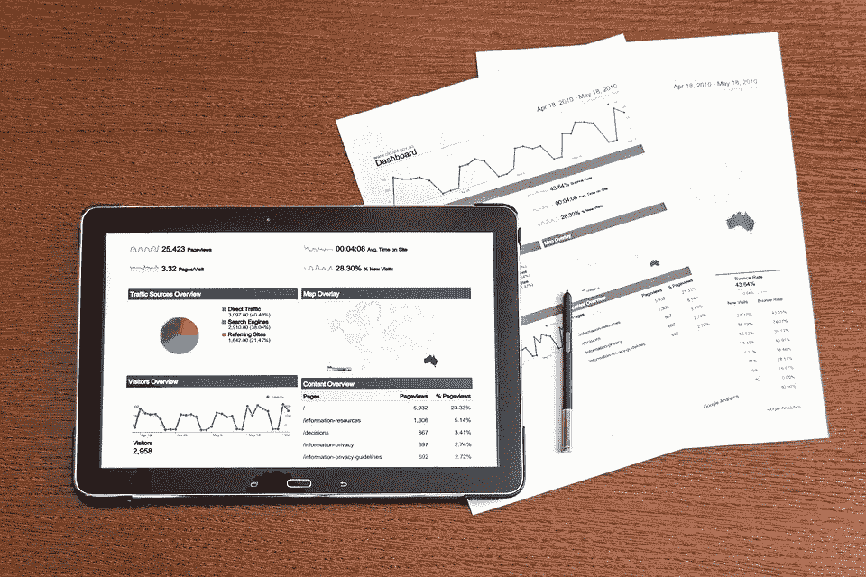

# 亚马逊数据分析师访谈

> 原文：<https://towardsdatascience.com/the-amazon-data-analyst-interview-6fad111e1dec?source=collection_archive---------14----------------------->

## 亚马逊收集每个顾客的数据。数据分析师帮助弥合数据和决策过程之间的差距。


图片来自 [Unsplash](https://unsplash.com/photos/pypeCEaJeZY)

亚马逊是世界上最大的在线市场之一，与传统市场不同，亚马逊是巨大的！里面陈列着成千上万的产品。仅在美国，亚马逊就控制了超过一半的在线市场，自 1994 年成立以来，它一直努力通过学习数据来实现其最终目标，即成为“一站式商店”。

在这个数据时代，亚马逊收集其网站上每一次客户点击和互动的数据；这包括顾客在看什么商品，他们在购物车里放了什么商品，他们想要什么质量，他们的偏好是什么，等等。

亚马逊汇编这些数据，并将其输入其推荐系统，以更好地满足客户需求，并通过推荐最符合他们偏好的产品来改善购物体验。亚马逊还利用数据做出商业决策并推动增长。Amazon 的数据分析师与技术和非技术内部团队合作，构建正确的分析来回答关键的业务问题

> 为了更好地熟悉亚马逊的面试流程，请查看亚马逊[商业智能](https://www.interviewquery.com/blog-the-amazon-business-intelligence-engineer-interview/)、[商业分析师](https://www.interviewquery.com/blog-amazon-business-analyst-interview/)、[机器学习](https://www.interviewquery.com/blog-amazon-machine-learning-interview-questions-solutions/)面试上的这些文章！

# 亚马逊的数据分析师角色



图片来自 [Pixabay](https://pixabay.com/photos/analysis-analytics-business-charts-1841158/)

亚马逊的数据分析师帮助**在数据和决策过程之间架起桥梁**。亚马逊的典型数据分析师角色包括数据分析、仪表板/报告构建以及指标定义和审查。亚马逊的数据分析师也为数据收集、编译、分析和报告设计系统。

数据分析师角色根据他们处理的数据类型而有所不同(例如，抽动数据、销售数据、失读症数据等)。)，他们参与的项目类型，他们正在使用的产品，以及他们被分配到的团队。亚马逊的数据分析师还**与包括工程、数据科学和营销在内的各种团队进行跨职能合作**，为研究和业务领域提供**数据驱动的见解**。根据团队的不同，角色范围可能从基本的商业智能分析(如数据处理、分析和报告)到更具技术性的角色(如数据收集)。

## 所需技能

亚马逊的数据分析师职位需要知识和经验的专业化。因此，亚马逊只雇佣在数据分析、数据建模、高级商业分析和其他相关领域拥有至少 3 年行业经验的高素质候选人。

其他基本资格包括:

*   金融、商业、经济、工程、数学、统计、计算机科学、运筹学或相关领域的学士或硕士学位(博士优先)。
*   具有使用脚本、查询和数据仓库工具的经验，例如 Linux、R、SAS 和/或 SQL
*   在 Python、R 或 Java 等编程语言方面有丰富的经验。 *(* [*查看 Python 数据科学面试指南此处*](https://www.interviewquery.com/blog-python-data-science-interview-questions/) )
*   具有查询关系数据库(SQL)的经验以及处理、优化和分析大型数据集的实践经验。
*   熟练使用微软 Excel，宏和 Access。
*   具有识别指标和 KPI、收集数据、实验和展示资料、仪表板和记分卡的经验。
*   具有商业智能和自动化自助报告工具的经验，如 Tableau、Quicksight、Microsoft Power BI 或 Cognos。
*   拥有 RDS、SQS 或 Lambda 等 AWS 服务的经验。

## 亚马逊的数据分析师团队


图片来自 [Techspot](https://www.techspot.com/news/76900-wikileaks-dumps-amazon-data-center-locations-all-see.html)

亚马逊是一家大型综合技术公司，提供许多产品和服务。因此，亚马逊有超过 100 个团队在各个领域开展工作。数据分析师与这些团队合作，帮助弥合数据和决策过程之间的差距。一般来说，亚马逊的数据分析师通过数据分析帮助**简化决策过程**。

根据亚马逊团队的不同，数据分析师的职责可能包括:

*   **Alliance (Twitch):** 利用高级分析来塑造交易绩效的衡量方式，定义应该问什么问题，以及扩展分析方法和工具来支持 Twitch 不断增长的业务。此外，定义和跟踪 KPI，支持战略计划，评估新的业务机会，并通过数据改进/增强决策。
*   **财务运营:**为决策制定标准和特定的分析和报告。在分析、定义、创建和获取数据、生成指标和提供建议的框架内构建高层业务问题。自动化标准报告并推动数据治理和标准化。
*   **搜索能力:**利用先进的分析和预测算法，创建强大的、以客户为中心的搜索解决方案和技术。与工程和运营团队合作，通过识别和跟踪关于效率和成本的 KPI 来扩展亚马逊搜索服务。
*   **教科书团队:**构建强大的数据分析解决方案，改善客户体验。采用先进的数据挖掘概念、数据建模和分析来定义和衡量评估业务增长的指标。提取、集成和处理关键数据，以构建数据管道、自动化报告和仪表板，并利用自助服务工具为内部利益相关方服务。
*   **欺诈和滥用预防:**利用复杂的机器学习概念来减轻和预防欺诈。为新的和现有的指标、报告、分析和仪表板开发和管理可扩展的解决方案，以支持业务需求。实现来自不同来源的定制 ETL 管道，以获得更高的数据质量和可用性
*   **购买:**使用高级分析概念来确定亚马逊全球所有网站的库存量。开发和维护指标，暴露和衡量亚马逊购买系统的当前表现，识别和量化改进机会，利用亚马逊的海量数据识别和防止意外表现。与其他团队跨职能协作，特别是工程、研究、数据科学和业务团队，以促进未来创新。
*   **工程成功(Twitch):** 与 Twitch 的工程团队合作，提供数据分析，以改进和形成成功衡量指标，定义业务影响问题，并扩展分析方法和工具，以支持亚马逊不断增长的业务。

# 面试过程

亚马逊数据分析师面试流程遵循标准的**亚马逊“STAR”(情景、任务、行动和结果)流程**，略有不同。面试流程从与人力资源部的初步电话筛选开始。之后，将安排一次技术面试。一旦你通过了技术面试，最终的现场面试将会安排 5 到 6 次与招聘经理、团队成员和人力资源的一对一面试。

## 初始屏幕

这是提交申请后与人力资源部门进行的标准介绍性面试。面试为探索性，时长约 45 分钟；它侧重于展示你的背景、技能和与该职位相关的工作经验。你还可以了解亚马逊的工作文化和职位。

> 注:亚马逊强调其领导原则。根据亚马逊的领导原则，按照“星形”格式定制您的回答会非常有帮助。

**样题:**

*   你克服的最大挑战是什么？
*   你以前使用 SQL 的经验是什么？
*   告诉我你与经理意见不一致的时候。你是如何处理这种情况的？结果如何？
*   你将如何着手改善工作场所(绩效、安全、流程)？
*   描述一个长期目标以及你计划如何实现它。

## 技术屏幕


图片来自 [Unsplash](https://unsplash.com/photos/fPkvU7RDmCo)

这是对人力资源部成员或经理的技术性面试。亚马逊使用一个名为“Collabedit”的协作服务平台进行所有的技术面试。

这一轮面试中的问题围绕着一个 **SQL 编码挑战、Excel，以及关于亚马逊领导原则(LP)** 的问题。

> [查看我们的**SQL 面试问题终极指南**](https://www.interviewquery.com/blog-sql-interview-questions/)

这是另一个亚马逊 SQL 面试问题的例子

```
'users' table+-----------------+----------+
| columns         | type     |
+-----------------+----------+
| id              | integer  |
| name            | string   |
| created_at      | datetime |
| neighborhood_id | integer  |
| mail            | string   |
+-----------------+----------+'comments' table+------------+----------+
| columns    | type     |
+------------+----------+
| user_id    | integer  |
| body       | text     |
| created_at | datetime |
+------------+----------+
```

> 请考虑下面的表格:
> 
> 编写一个 SQL 查询来创建 2020 年 1 月每个用户评论数量的直方图。假设容器桶分类间隔为 1。

**给你个提示:**

> 直方图代表什么？在这种情况下，我们感兴趣的是使用直方图来表示每个用户在 2020 年 1 月发表的评论的分布。
> 
> 具有大小为 1 的**容器桶的直方图意味着我们可以避免将频率分组到特定区间的逻辑开销。**
> 
> 例如，如果我们想要一个大小为 5 的直方图，我们必须运行一个 SELECT 语句，如下所示:

[**尝试在我们的 interactive SQL 编辑器**](https://www.interviewquery.com/questions/comments-histogram) 中解决这个问题

## 现场面试

亚马逊数据分析师的现场面试与该公司的其他现场面试非常相似。进入面试流程这一阶段的候选人要经过 5 到 6 次与招聘经理、团队经理、数据分析师、数据工程师和统计员的一对一面试。面试之间有午休时间。亚马逊数据分析师现场面试由**数据科学概念、SQL 编码和著名的亚马逊领导原则**组成。

# 数据分析师访谈笔记和提示

亚马逊数据分析师面试主要包括数据科学概念。它的结构独特，可以评估候选人分析亚马逊数据的能力，以提供新的见解，从而塑造商业决策。在回答问题时利用亚马逊的“星形”格式可以给你带来优势。为了更好地了解亚马逊的 STAR 流程，请在面试查询上查看[亚马逊的 BI 工程师面试流程。](https://www.interviewquery.com/blog-the-amazon-business-intelligence-engineer-interview/)

亚马逊的面试官希望你用之前的工作经验来支持你的答案。尝试用过去工作经验中的例子回答每个问题；这可能包括你所面临的挑战，你所使用的方法或途径，以及你是如何克服这些挑战的。

# 亚马逊数据分析师面试问题:

*   你最喜欢 SQL 中的哪些函数？
*   解释 OLAP 立方体和一个解释商业分析应用的用例。
*   什么是数据规范化和非规范化？
*   当更新了具有主键的关联表时，具有外键的表的数据会发生什么变化？
*   级联参照完整性你懂什么？
*   解释线性回归和逻辑回归的区别，并举例说明。
*   什么是自变量，如果我的模型中有三个自变量，而没有因变量，该怎么办？
*   为多元变量或多元回归模型写一个方程。
*   给定一个有 n 个观察值的样本，你如何检验一个假设？
*   方差分析的假设有哪些。
*   对于小样本，您会使用什么测试？
*   什么是零假设？
*   什么是 1 型和 2 型错误？
*   使用下表编写一个查询，以检索在过去十天内注册并且消费超过 100 美元的客户的数据。编写另一个查询来检索在过去七天中花费超过 100 美元的客户的数据。第一个表是客户购买表，有五列:客户 id、购买日期、产品 id、单价和购买的单位。第二个表是一个客户细节表，有两列:客户 id 和注册日期。
*   从 100 个数字中按升序产生十个连续数字的概率是多少？
*   如何在 SQL 中合并两个表？
*   用任何一种语言(VBA，Python，Java)写一个函数来计算斐波那契码。

# 感谢阅读

*   如果您想了解更多独家面试解说，请查看 [**面试查询**](https://www.interviewquery.com/) **！**
*   查看我的 [**Youtube 频道**](https://www.youtube.com/channel/UCcQx1UnmorvmSEZef4X7-6g) 获取更多面试指南，以及解决问题的技巧&。
*   在面试查询博客上找到更多亚马逊面试指南，如 [**亚马逊商务智能工程师面试**](https://www.interviewquery.com/blog-the-amazon-business-intelligence-engineer-interview/) 和[**亚马逊商业分析师面试**](https://www.interviewquery.com/blog-amazon-business-analyst-interview/) 。

*原载于 2020 年 7 月 7 日*[*https://www.interviewquery.com*](https://www.interviewquery.com/blog-the-amazon-data-analyst-interview/)*。*