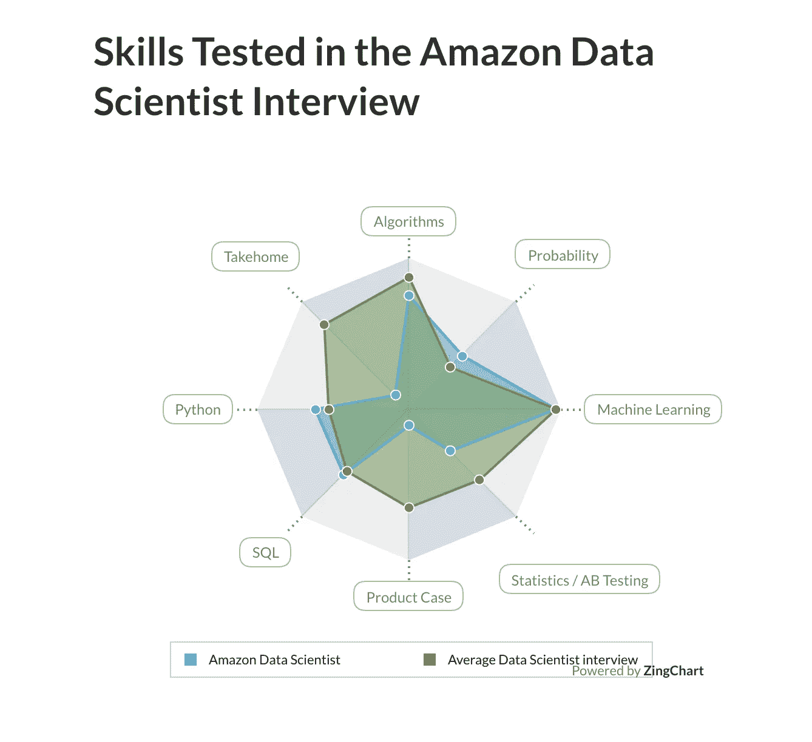

# 亚马逊数据科学家访谈

> 原文：<https://towardsdatascience.com/the-amazon-data-scientist-interview-93ba7195e4c9?source=collection_archive---------1----------------------->

## 亚马逊数据科学面试问题


亚马逊 pcworld.com

亚马逊是世界上最大的互联网公司和最大的在线零售商之一。凭借如此多的产品和服务，亚马逊一直在市场上寻找积极创新的数据科学家，以满足其不断增长的数据需求。

作为一家公司，亚马逊以通过技术创新对成熟行业进行颠覆性创新而闻名。它的愿景是成为地球上最以客户为中心的公司。

> 需要公司或特定技能面试指南？
> 
> 查看我们关于攻关 [**机器学习**](https://www.interviewquery.com/blog-machine-learning-interview-questions/)**[**SQL**](https://www.interviewquery.com/blog-sql-interview-questions/)**[**python**](https://www.interviewquery.com/blog-python-data-science-interview-questions/)**，或者** [**产品数据科学面试题**](https://www.interviewquery.com/blog-product-data-science-interview/) **。******

# ******数据科学的作用是什么？******

****亚马逊的数据科学家的角色取决于具体的团队。亚马逊是一家大型企业集团，有许多团队从事不同的产品和服务。****

****这些团队包括 AWS(亚马逊网络服务)、Alexa、供应链优化技术(SCOT)中的预测团队、NASCO 团队(北美供应链组织)、中英里规划研究和优化科学(mmPROS)团队等等。****

****一般要求是:****

*   ****为机器学习(ML)和自然语言(NL)应用程序设计、开发、评估、部署和更新数据驱动模型和分析解决方案。****
*   ****开发先进的数据管道，构建准确的预测模型，并部署自动化软件解决方案来提供预测见解。****
*   ****考虑到业务影响，研究、设计和改进模型。****

******所需技能******

*   ****统计学、数量金融学、经济学、计算机科学、数学、物理学、计算生物学、运筹学等任何数量领域的硕士学位)或同等的实践经验。****
*   ****2 年以上的分析工作经验(高级数据科学家 4 年以上),涉及机器学习技术、数据提取、分析和沟通。****
*   ****精通统计软件包和函数式编程语言(如 R、Stata、Matlab、Python、SQL、C++或 Java )(资深数据科学家有 4 年以上的工作经验)。****
*   ****具有设计和实现机器学习算法的经验，这些算法根据特定的业务需求量身定制，并在大型数据集上进行了测试。****
*   ****在具有大规模复杂数据集的商业环境中进行数据挖掘和使用数据库的经验。****
*   ****优秀的口头和书面沟通技巧，能够有效地向研究科学家、工程团队和商业受众倡导技术解决方案。****

# ******数据科学家有哪些类型？******

****亚马逊有三种与数据科学相关的主要工作角色。以下是亚马逊数据科学技能图表对面试和他们日常角色的描述:****

********

****来源于[面试查询](https://www.interviewquery.com/interview-experiences/amazon/data-scientist)****

****亚马逊上的数据科学团队类型如下:****

## ****[**数据分析/商业智能**](https://www.interviewquery.com/blog-the-amazon-business-intelligence-engineer-interview/)****

****该角色主要负责创建预测、识别战略机会，并提供知情的业务相关见解。数据可视化工具，如 Tableau 和数据仓库技能，往往是必需的。****

## ****[**机器学习研究科学家**](https://www.interviewquery.com/blog-amazon-machine-learning-interview-questions-solutions/)****

****该职位主要关注 NLP、深度学习、视频推荐、流数据分析、社交网络等领域的前沿研究。一般来说，这个职位从博士到国际知名的研究人员都有。****

*****阅读更多关于* [***亚马逊机器学习面试***](https://www.interviewquery.com/blog-amazon-machine-learning-interview-questions-solutions/) *。*****

## ****[数据/应用科学家](https://www.interviewquery.com/interview-experiences/amazon/applied-scientist)****

****作为最受欢迎和最普遍的角色，数据科学家深入大数据集，以构建大规模的模拟和实验系统，构建优化算法，并利用亚马逊的前沿技术****

## ****[**数据工程师**](https://www.interviewquery.com/interview-experiences/amazon/data-engineer)****

****这是一个团队，他们开发了在公司内外使用的工具或产品。想想 AWS 或者 Alexa。该角色与 ML 工程师职位有很大重叠。经常需要像 C++/Java 这样的面向对象语言技能。****

# ******亚马逊采访******

********

****blog.aboutamazon.com****

****亚马逊的面试流程与其他科技公司类似。首先要注意的是，亚马逊**不做** **带回家的挑战**。相反，面试流程包括招聘人员或招聘经理的初步电话筛选，然后是技术电话筛选，最后是现场面试，通常分为五个阶段，午餐时进行非正式面试。****

## ******初始屏幕******

****最初的电话面试通常由亚马逊的招聘人员或招聘经理进行。这是一个基于简历的电话面试，通常会检查你的简历以及在团队中的位置。鉴于亚马逊是世界上最大的组织之一，招聘经理将解释他们的团队是做什么的，以及他们在组织中的位置。****

# ******技术屏幕******

****技术筛选在最初的电话筛选之后进行。这个面试会涉及到编码，统计，机器学习。您至少会遇到两个编码问题，**一个涉及 SQL** 另一个是**算法编码类型**问题。编码部分是通过共享代码编辑器完成的。记得花时间和面试官回顾一下你的思考过程。还有一个关于“方法”的部分，详细描述了你是如何得到解决方案的，以及你为什么使用你所使用的步骤。****

****此外，面试官会问一个机器学习概念问题。这通常是相当会话式的，但是记得温习一般的 ML 概念。****

## ******示例技术屏幕问题******

****我们得到了两张桌子。表 A 有一百万条带有 ID 和 AGE 字段的记录。表 B 有 100 条记录，也有两个字段，ID 和 SALARY。****

*****假设在表 B 中，平均工资为 50K，中位数工资为 100K。*****

```
****SELECT** A.ID,A.AGE,B.SALARY
**FROM** A
LEFT **JOIN** B
**ON** A.ID = B.ID
**WHERE** B.SALARY > 50000**
```

****假设上面的查询运行，大约会返回多少条记录？****

> ****[查看我们的**SQL 面试问题终极指南**](https://www.interviewquery.com/blog-sql-interview-questions/)****

# ******现场面试******

****通过技术电话筛选后，招聘人员将安排现场面试。大部分题目会涉及 A/B 测试，更多的机器学习概念性问题，探索性数据分析，以及一些编码问题。****

****这一阶段包括 5 或 6 次连续的面谈，每次都是一对一或两人面谈；一名经理和一名初级数据科学家。总的来说，现场面试将持续大约六个小时。****

****这个过程是这样的:****

*   ****评估文化契合度的行为访谈****
*   ****涉及数据分析和 ab 测试的技术面试****
*   ****基于 SQL 的数据科学家访谈****
*   ****[算法和优化](https://www.interviewquery.com/blog-python-data-science-interview-questions)****
*   ****[机器学习和建模案例研究面试](https://www.interviewquery.com/blog-data-science-case-study-interview/)****

****每个阶段都可能会测试你对亚马逊领导原则的了解，以及你的批判性思维和解决问题的能力。****

## ****提示和技巧****

*   ******亚马逊** **很在意** **技术能力**说到数据科学的角色！记得温习**求解算法，优化查询，并记住多少机器学习算法在引擎盖下工作**。****
*   ****亚马逊根据他们的 **14 领导原则**评估每一个申请者。试着记住所有 14 条领导原则，因为你会被期望在行为面试中展示这些原则。这里的建议是想一想你过去的项目或经历，以及你是如何展示这些原则的。****
*   ****练习建模、机器学习和商业案例问题。亚马逊可能会问许多类型的模糊案例问题，在这些问题中，他们希望你将机器学习应用到商业场景中。查看我们如何处理关于亚马逊产品的[案例问题](https://www.interviewquery.com/blog-amazon-business-intelligence-case-duplicate-product/)。****

# ****亚马逊数据科学面试问题****

*   ****给定一个大字符串和一个小字符串，写一个程序找出小字符串是否可以由大字符串的字母生成。****
*   ****一件商品位于位置 A 的概率为 0.6，位于位置 b 的概率为 0.8。在亚马逊网站上找到该商品的概率是多少？****
*   ****实现两个数组的并集和交集(以有效的方式)。请注意，两个给定数组的元素可以重复，但不能在并集和交集数组中重复。****
*   ****你在 HDFS 有两份文件。一个是包含两列的日期范围:开始日期和结束日期。另一个文件有两列，分别是日期和访问者数量字段。编写 Spark 代码，给出访问者数量最多的日期范围。****
*   ****使用数组实现循环队列。****
*   ****套索和岭回归有什么区别？****
*   ****当用户浏览亚马逊网站时，他们会执行许多操作，点击按钮，进行搜索等等。如果他们的下一步行动是购买，最好的建模方式是什么？****
*   ****K-means 是如何工作的？你会选择哪种距离度量？如果不同的特性有不同的动态范围呢？****
*   ****什么是生成式和判别式算法？他们的优缺点是什么？通常使用哪种算法，为什么？****
*   ****如何修改超过 10 亿行的表？(*查看* [***模拟面试***](https://www.youtube.com/watch?v=IO_POFIQvo0)**)。******

# *****感谢阅读*****

*   *****想要更多带有亚马逊解决方案的面试问题吗？在[**上查找更多面试查询**](https://www.interviewquery.com/) **。*******
*   *****查看我的 [**Youtube 频道**获取更多关于数据科学面试技巧和窍门的视频](https://www.youtube.com/channel/UCcQx1UnmorvmSEZef4X7-6g)。*****
*   *****更多阅读请上 [**面试查询博客**](https://www.interviewquery.com/blog) 上 [**Python**](https://www.interviewquery.com/blog-python-data-science-interview-questions/) 和 [**SQL 数据科学指南**](https://www.interviewquery.com/blog-three-sql-questions-you-must-know-to-pass/) **。*******