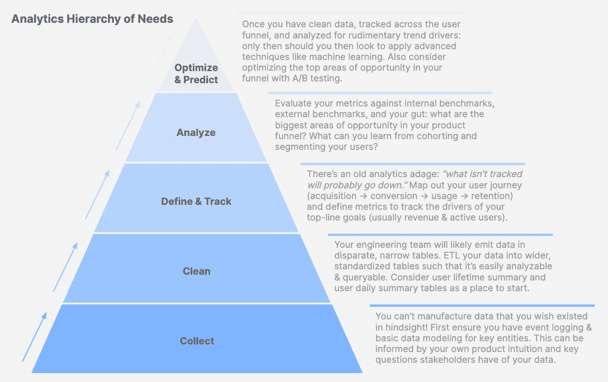
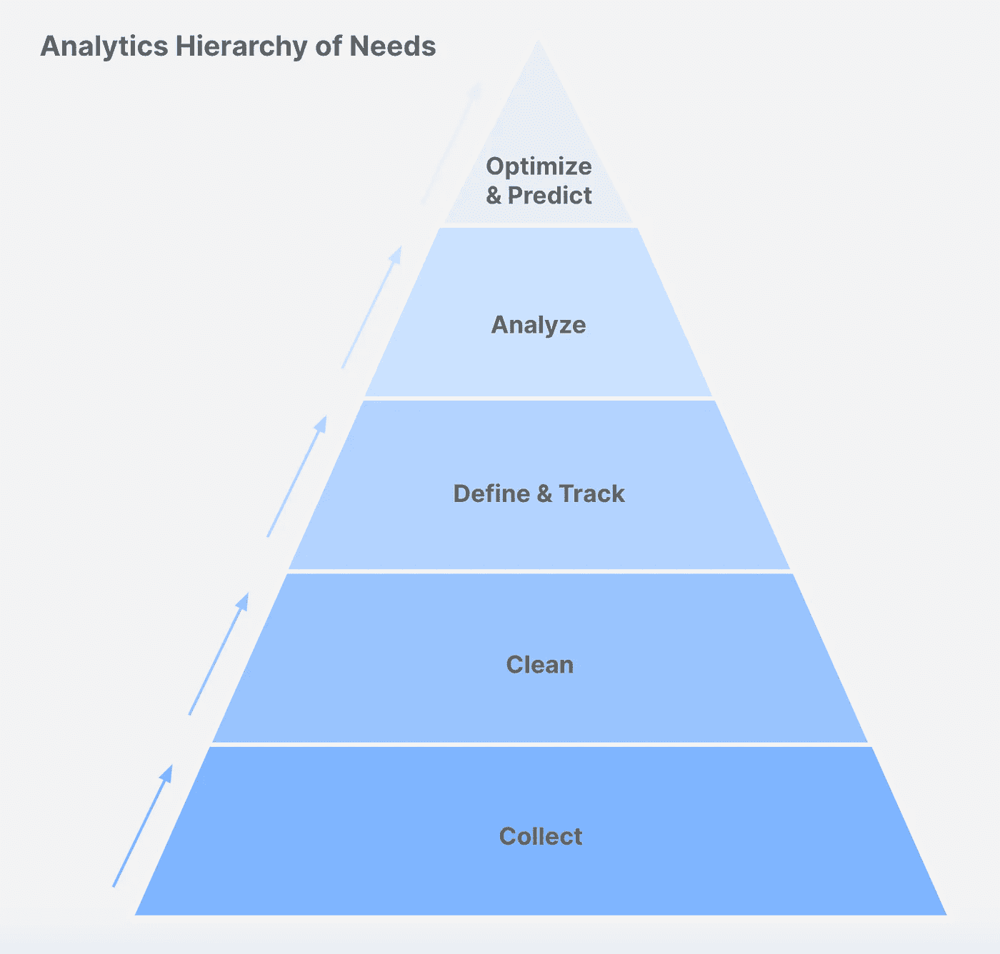

# 需求的分析层次

> 原文：<https://towardsdatascience.com/the-analytics-hierarchy-of-needs-6d57d0e205e2?source=collection_archive---------30----------------------->

## 数据团队的优先化框架:如何最大化影响和最小化遗憾

**免责声明:我的等级制度没这么好吃。**图片由[马太·亨利](https://burst.shopify.com/@matthew_henry)从[爆出](https://burst.shopify.com/photos/pastel-macaron-pyramid-on-pink)

当我加入 Square 时，我被一个已经上市一年但没有专门的分析支持的产品所吸引。

正如您所料，该团队有大量积压的好奇心:

*   *我们应该跟踪哪些指标？*
*   *为什么这个指标低于我的预期？*
*   我们有 XYZ 的数据吗？
*   *我有这个 A/B 测试的想法！可以帮我实现吗？*
*   *使用 XYZ 功能的用户比例是多少？*
*   *我们能用机器学习吗？我听说集群是了解我们用户群的好方法！*

坦率地说，我不知所措。我应该从哪里开始？现在最重要的事情是什么？三个月后，一年后我该做什么？

渴望一个框架来指导我，我发现了人工智能的需求层次，模仿马斯洛的需求层次 T21。虽然细节没有直接映射到产品分析，但我意识到层次结构的总体概念有。

# 需求的分析层次

需求分析层次结构的一般思想是，在您完成上一步的基础工作之前，您不应该向上移动层次结构(即，在定义和跟踪指标之前没有深入分析，在开始收集和清理数据之前没有构建仪表板，等等)。

**需求层次分析。**作者图片

## 1.收集

> 等等，我们怎么没有跟踪我们的旗舰功能的使用情况？！

这可不好玩。你不能制造事后才希望存在的数据！

在做任何事情之前，分析师的首要任务应该是确保基本的事件记录和关键实体的数据建模。这可以通过你自己的产品直觉和利益相关者对你的数据的关键问题来了解。

决定记录什么和如何记录可能是令人生畏的。考虑为您的关键实体绘制一个[实体关系图(ERD)](https://www.bridging-the-gap.com/erd-entity-relationship-diagram/) ，并给予工程**LATAM**(**L**og**A**ll**T**APS**A**nd【相关】 **M** etadata)的基本事件记录指导。

## 2.干净的

> 嘿 Ryan，你能快点帮我拉这个吗？
> 
> 当然，让我从某个不存在的原始表中选择；

您的工程团队可能会在不同的窄表中发出数据。在开始分析之前，你应该[将你的数据转换成更宽的、标准化的表格。这将使你的分析和仪表板更具可扩展性，更容易构建。](https://medium.com/hashmapinc/etl-understanding-it-and-effectively-using-it-f827a5b3e54d)

可以从每个用户每天的汇总表开始。你的利益相关者可以通知专栏:问他们他们希望知道但无法回答的常见问题。

## 3.定义和跟踪

> 为什么这个月的收入低于我的预期？

现在你的数据已经组织好了，是时候分解你的漏斗了。

通常人们最关心的是活跃用户和$$。为了理解是什么推动了这些，你需要将你的产品漏斗映射到流程图上。以这个基本的 SaaS 产品为例:

*>收入=(活跃用户数)*(每用户平均订阅费用)*

*> >【活跃用户=(新转化)+(留存用户)*

*> > >新转化率=(免费试用)*(平均转化率%)*

诸如此类。一旦你绘制了这个流程图，并建立了跟踪每个指标的仪表板，你就可以分析你的漏斗了。

## 4.分析

> 有趣的流失分析，瑞安，但我们的保留率是最好的。皈依是我现在最关心的事。

一旦我的团队定义并跟踪了我们的每个漏斗指标，我们就给每个指标分配一个[红色/琥珀色/绿色状态](https://pmtips.net/article/what-does-rag-status-mean)。我们通过将每个指标与内部基准、外部基准和我们的直觉进行比较来做到这一点；这帮助我们确定了最大的机会领域。

例如:如果保持率超过基准，为什么还要深究？

一旦你有了你最有机会的领域，你可以对每个领域做一些基本的启发式分析。当通过群组、获取渠道和基本用户统计数据可视化一个指标时，通常有一个值得注意的趋势。

## 5.优化和预测

> 那么，你终于要做我听说的那个聚类分析了？

你在收集数据，你已经清理了数据。您已经定义了您的指标，并且正在跟踪它们。您已经分析了您的指标，并概述了需要改进的关键领域。

恭喜你:你现在可以做“性感”的事情了。😎

[**A/B 测试**](https://hbr.org/2017/06/a-refresher-on-ab-testing) 可以让你相信一个用户体验比另一个更好。如果你一直在遵循需求层次分析，这是非常及时的:用户越多，你的实验产生的统计可信度就越高。

[**有监督的机器学习**](/a-brief-introduction-to-supervised-learning-54a3e3932590) 可以帮助你理解什么是用户行为的预测因素——例如，什么行为或人口统计数据导致转化或持续使用。

[**无监督的机器学习**](https://www.datarobot.com/wiki/unsupervised-machine-learning/) 可以帮助你理解你的用户中你没有意识到的模式(*你好，聚类！*)。

然而，提醒一句:仅仅因为你已经到达层级的顶端，并不意味着机器学习是你所有问题的最佳解决方案。简单的试探法通常会产生更好的结果，因为它们实现起来更快，通常也更容易理解。

# 概括起来

当你的新旗舰功能没有被跟踪时，不要做解释 XGBoost 模型的 SHAP 价值的分析师。

作者图片