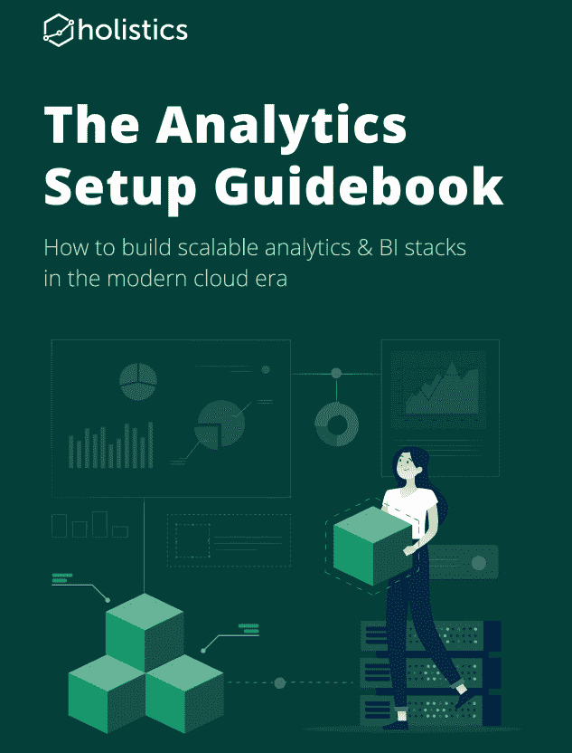

# 分析设置指南回顾

> 原文：<https://towardsdatascience.com/the-analytics-setup-guidebook-review-9acd9784da2e?source=collection_archive---------28----------------------->

## 2020 年构建可扩展分析平台所需的一切

我很震惊地告诉你下一句话:我读了一家公司的免费电子书，真的很喜欢。我通常对免费电子书评价很低，认为它们要么太长，要么太模糊，没有用。例如，雪花的关于[数据仓库](https://resources.snowflake.com/ebooks/cloud-data-warehousing-for-dummies)的*傻瓜书*有 60 页长，但它如此专注于抽象，以至于从未提及红移、大查询甚至雪花。

[来自 Holistics 的分析设置指南](https://www.holistics.io/books/setup-analytics/start-here-introduction/)是一个完全不同的故事。它概述了分析堆栈的不同部分:数据仓库、导入数据、转换和报告数据。(注意:它没有涵盖像机器学习这样的更深入的应用)。至关重要的是，它不只是抽象地描述这些部分，它还讨论和比较了当今可用的工具和服务(它于 2020 年 7 月出版)。

书籍封面，经 [Holistics](https://www.holistics.io/) 许可使用

如果你已经熟悉现代分析和数据工具，这里不会有太多新的东西。这本书的目的不是开辟新的领域，而是概述分析堆栈的不同部分以及它们如何组合在一起，以及可用的不同工具和它们如何进行比较。在相关的地方，它给出了历史信息，以便您可以了解过去的方法来自哪里，为什么使用它们，以及为什么它们可能不再合适。对我个人来说，它真的成功了，极大地帮助了我在头脑中组织事情。

在此之前，我从未听说过 [Holistics](https://www.holistics.io/) ，与他们没有任何关系。他们是一家总部位于新加坡的分析公司，生产的数据转换和报告产品似乎与 Looker 非常相似。他们确实在书中提到了自己的产品，但只是在适当的地方。他们的[博客](https://www.holistics.io/blog/)也确实不错。

# 内容

## 第一章-简介

*   分析堆栈和数据仓库用途的高级概述。
*   如果您刚刚开始构建分析基础架构，需要一些基础设置。

## 第 2 章-数据仓库

*   比较最流行的云仓库(红移、雪花和 BigQuery)以及何时开始使用一个。
*   有像 Stitch 和 Hevo 这样的 ETL 工具可以用来从大多数服务导入数据。
*   他们强烈建议将所有原始数据加载到您的仓库中，并在其中进行任何转换(ELT 与传统的 ETL 相反)。讨论了为什么 ETL 曾经是标准方法、数据湖，以及为什么 ELT 现在是更好的选择。

## 第 3 章-建模数据

(建模是指转换或聚合数据，而不是制作预测模型)。

*   数据建模层的概念。这是我听人多次提到过的事情，但以前并不清楚。涵盖了空间中可用的工具(dbt、Looker、Dataform、Holistics)。
*   Kimball 建模，它为什么流行，以及他的书《数据仓库工具包》的哪些部分仍然相关。例如，Kimball 有几种方法来处理缓慢变化的维度表(SCD)，但现代的方法是 Maxime Beauchemin 的[just-daily-snapshot-everything](https://www.youtube.com/watch?v=4Spo2QRTz1k&t=989s)方法。
*   这是一个真实世界的例子，说明了 Holistics 如何从他们的网站上模拟事件数据，以及他们何时以及为什么对其进行了两次总结。

## 第 4 章-分析/报告您的数据

*   讲述了一个虚构的数据分析师自 90 年代中期以来的三次 BI 浪潮。它涵盖了他们必须使用的 BI 工具、仓库基础设施和公司流程。这对我来说是这本书最好的部分之一，比 Looker 的[原帖](https://looker.com/blog/catching-the-third-wave-of-business-intelligence)更有用。它帮助我理解了旧工具放在哪里，以及为什么有些人仍然非常依恋它们。这尤其有用，因为许多企业仍处于第二次浪潮。
*   比较了当前的商业智能工具，并解释了如何对它们进行分类和思考。讨论了 Tableau、Power BI、Looker、Holistics、Chartio、Mode、Sisense 等等。
*   采用弧用于描述分析在组织中如何随时间演变:即席查询，然后是静态报告和仪表板，然后是面向业务用户的自助服务分析。

## 第五章

仅仅是结论，并没有引入任何新的东西。

# 还有什么比这更好的呢

关于建模数据，有两件事我希望能更好地解决。我就这些问题询问了 Holistics，他们很友好地提供了答案，如下所列。

1)在本书中，数据建模仅在使用专用工具(如 dbt、Looker)的上下文中提及。与仅仅在仓库中保存 SQL 视图的简单方法相比，使用工具有什么好处？

**整体主义者回应:**在[这篇 twitter 帖子](https://twitter.com/markmacardle/status/1311783660950114309)中，合著者 Huy Nguyen 描述了 4 个好处:

*   依赖跟踪(沿袭):建模工具会给你可视化的依赖图。
*   自助服务:像 Looker 和 Holistics 这样的工具允许你定义可以被你公司的其他人使用的定制测量。
*   数据目录:您创建的表/模型可以在当时或以后用元数据来丰富。然后可以将这些元数据放入发现工具中。
*   版本控制:您可以对它们使用 git，这样就可以看到变更的历史。

2)如何避免为需要由最终用户计算的指标(如平均订单价值)复制业务逻辑？用户可能希望通过任意数量的拆分来查看它，因此您不能对它进行预聚合。使用一个既建模又报告的工具(Looker，Holistics)是唯一的方法吗？使用 dbt 这样的仅转换工具的公司做什么？

**Holistics response** (取自直接消息):这与自助式 BI 相关，位于报告层，因此像 Looker、Holistics 和 Metabase 这样的工具将很好地解决这个用例。如果您只使用 dbt，简单的解决方案是选择一个如上所述的自助式 BI 工具。请注意，“数据建模”位于转换层(dbt，dataform)和报告层(Looker，Holistics)。

# 评级:🐙🐙🐙🐙

4.5 章鱼。这本书有许多分支，它将把你的许多不同的知识片段摘下来，并整齐地重新组织成一本布局合理、有注释的剪贴簿，以备将来使用。