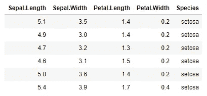
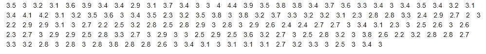
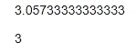
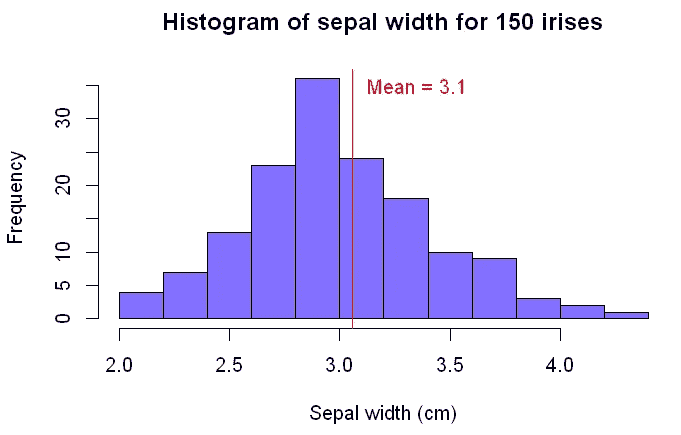
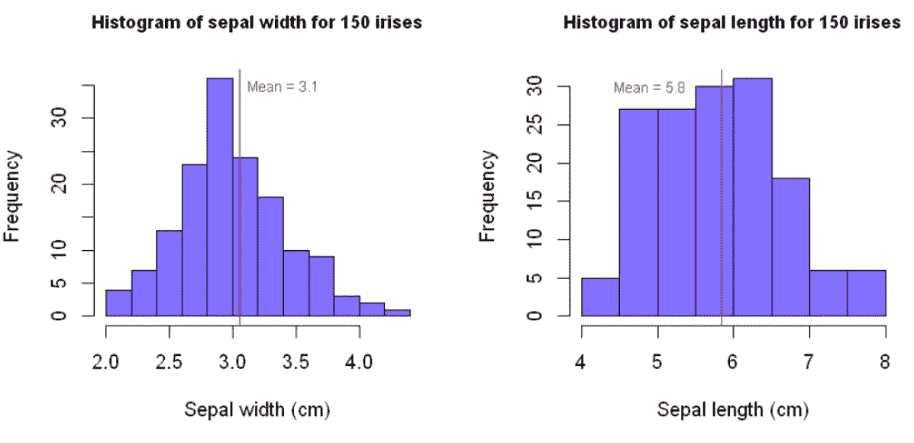
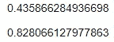
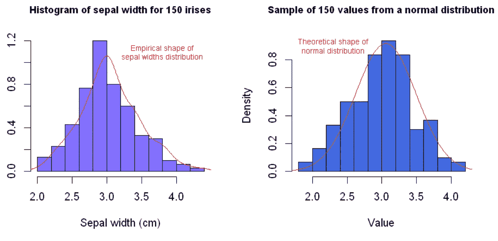
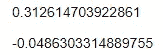

# 描述性数据分析的古代艺术。

> 原文：<https://towardsdatascience.com/the-ancient-art-of-descriptive-data-analysis-769a5fcc7ebc?source=collection_archive---------58----------------------->

## 这是生死攸关的事。

你可能在某个时候听说过，人类非常擅长探测环境中的模式。这是真的——几千年来，我们的大脑一直在根据观察到的数据进行推断和预测。

举例来说:杰拉尔德，一个旧石器时代的穴居人，遇到了一个野生老虎样本，它们都试图把他当晚餐。杰拉尔德对野生老虎的数量作了一个推断，并得出结论说，他将来可能应该避开它们。


Boris drob ni 在 [Unsplash](https://unsplash.com/@drobo?utm_source=unsplash&utm_medium=referral&utm_content=creditCopyText) 上拍摄的照片

去找别的零食吧，伙计！

对于我们的史前同行来说，数据分析是生死攸关的事情，即使在今天，它也能决定一家公司的成败。如果一家公司不能生产出 1)与消费者口味相关、2)随着时间推移而发展的商品或服务，那么它被竞争对手超越、发现自己的收入流不断萎缩只是时间问题。

最大最赚钱的公司并不是那些拥有最佳营销策略的公司。他们不一定拥有最尖端、最高端的产品。他们是最擅长收集和利用数据来制定战略决策的公司，通过提供领先的产品来智胜竞争对手。很难不认识到数据在现代工业中的作用和重要性。但是，这些公司到底是如何处理这些数据的？提取这些至关重要的、超越市场的洞察力的流程是什么？

# 真相

作为分析一部分的细节和方法取决于其目的。也许我们有一个全新的数据集，我们想了解它的特性；探索潜在的模式和趋势，并找到一种可视化数据的方式来最好地揭示它们。也许我们想试着从我们收集的样本中推断出一些关于人口的信息。或者，我们可能希望获得一组过去的观察结果，并从中提取一些信息，以便更好地预测未来。

让我们通过依次访问每一种类型来了解更多关于这些类型的数据分析。在这篇文章中，我们将重点关注*描述性*数据分析，然后再跟进*推理性*和*预测性*数据分析的主题。

# 举例说明

语言只能解释这么多。让我们挑选一个非常简单的数据集，实际上*对其进行*描述性数据分析，以更好地说明我们将要谈论的一些观点。我们将使用一个经典的数据集，包含属于三个不同物种的 150 朵鸢尾花的测量数据。[这个数据](https://en.wikipedia.org/wiki/Iris_flower_data_set)是美国植物学家 Edgar Anderson 在 1935 年收集的。如果你想继续下去并尝试一些你自己的分析，你可以[下载 R](https://www.r-project.org/) 并加载*数据集*包来轻松访问这个数据集。


照片由 [Olga Mandel](https://unsplash.com/@olgamandel?utm_source=unsplash&utm_medium=referral&utm_content=creditCopyText) 在 [Unsplash](https://unsplash.com/s/photos/iris?utm_source=unsplash&utm_medium=referral&utm_content=creditCopyText) 拍摄

在 R 控制台中，让我们加载数据并开始分析。

```
# Load datasets package
library(datasets)# Display first few rows of iris dataset
head(iris)
```



呼叫头的结果(虹膜)

描述性数据分析旨在以一种*揭示其潜在趋势和模式*的方式呈现数据。这通常是更复杂的分析的第一步，也难怪——如果你不能总结和理解你的数据，你有什么业务去尝试应用更复杂的工具呢？

这种分析通常包括对以下内容的讨论:

1.**集中趋势的度量。**这包括平均值、中值和众数等统计数据。这可以帮助我们了解什么是典型的或“平均的”数据值。

2.**衡量价差。**也许不如第一个明显；数据的传播也同样重要。有了这些统计数据，我们可以更好地了解数据的分布情况——它是集中在一个小范围内还是分散在各处？它是不是两端都聚在一起了？

## 集中趋势测量

让我们考虑数据中的*萼片宽度*。萼片是保护和支撑花瓣的花瓣状结构，通常是绿色的。萼片宽度通常取什么样的值？

```
iris$Sepal.Width
```



哇哦！

这有点难以接受——与我们将来会遇到的情况相比，这是一个很小的数据集！看起来宽度范围从 2 厘米到 4 厘米，但是不容易区分什么值是最常见的，什么值是典型值。让我们画一个图来可视化*萼片宽度*的分布，并绘制*平均值*的图。

```
# Calculate mean value of sepal widths
mean(iris$Sepal.Width)# Calculate median value of sepal widths
median(iris$Sepal.Width)
```



萼片宽度的平均值和中值分别为厘米

```
# Set plot window size
options(repr.plot.width=6, repr.plot.height=4)# Plot histogram of sepal widths
hist(iris$Sepal.Width, main=”Histogram of sepal width for 150 irises”, 
 col=”slateblue1", xlab=”Sepal width (cm)”)# Plot a vertical line at the mean value
abline(v=mean(iris$Sepal.Width), col=”red”)# Label the mean value line
text(3.35,35,”Mean = 3.06",col=”red”)
```



他们说一张图片胜过千言万语，对于数据来说更是如此。

*   平均值为 3.1 厘米；
*   中值(中值)为 3.0cm；和
*   我们可以看到，值的模态范围(最常见的观察值)在 2.8 cm 和 3.0 cm 之间。

直方图还帮助我们将这些集中趋势的度量放入其余值的上下文中。

但是这些数字能告诉我们的关于其余分布形状的信息是有限的。我们可以从上面的直方图中看到，萼片宽度取一系列不同的值。我们如何量化数据的分布，或者它围绕平均值变化了多少？

## 传播的量度

我们通常通过使用*标准差*(或*方差*，简单来说就是标准差的平方)来量化数据围绕其平均值的分布程度。当数据分布在很宽的数值范围内时，标准差很大，而当数据集中在很窄的范围内时，标准差很小。什么是大的什么是小的？这是一个好问题——只有在与另一个分布比较时，才真正有可能解释标准差。

```
# Set plot window size
options(repr.plot.width=8, repr.plot.height=4)# Set up plot area for two side-by-side histograms
par(mfrow=c(1,2))### HISTOGRAM 1# Plot histogram of sepal widths, as before
hist(iris$Sepal.Width, main=”Histogram of sepal width for 150 irises”, 
 col=”slateblue1", xlab=”Sepal width (cm)”, cex.main=0.9)abline(v=mean(iris$Sepal.Width), col=”red”)text(3.4,35,”Mean = 3.9",col=”red”, cex=0.75)### HISTOGRAM 2# Plot histogram of sepal lengths
hist(iris$Sepal.Length, main=”Histogram of sepal length for 150 irises”, 
 col=”slateblue1", xlab=”Sepal length (cm)”, cex.main=0.9)abline(v=mean(iris$Sepal.Length), col=”red”)text(4.9,30,”Mean = 5.8",col=”red”, cex=0.75)
```



```
sd(iris$Sepal.Width)
sd(iris$Sepal.Length)
```



萼片宽度和长度的标准偏差分别为厘米

我们可以通过肉眼判断我们的萼片长度的分布比萼片宽度的分布更分散——看 x 轴，萼片长度在大约 4 厘米的范围内变化，而萼片宽度在大约 2 厘米的范围内变化。计算标准差使我们能够更精确地量化这种差异——我们萼片长度的标准差大约是萼片宽度的两倍。

另一个衡量分布的重要指标是分布的*偏斜*。不对称是衡量不对称数据分布情况的指标。大多数人都熟悉正态分布——对称的钟形曲线，它存在于许多自然分布中，如身高、体重、鞋码、智商等。正态分布在这个讨论中很重要，因为它没有*偏斜*——它是对称的，它的均值、中值和众数都相等。直观地将新的数据分布与正态分布进行比较并计算其偏差通常很有用。这有助于我们确定在平均值的两侧观察到极高或极低数值的可能性是否增加。

```
# Set plot window size
options(repr.plot.width=8, repr.plot.height=4)# Set up plot area for two side-by-side histograms
par(mfrow=c(1,2))### HISTOGRAM 1# Plot histogram of sepal widths, as before
hist(iris$Sepal.Width, main=”Histogram of sepal width for 150 irises”, 
 col=”slateblue1", xlab=”Sepal width (cm)”, cex.main=0.9, prob=TRUE)# Plot empirical distribution of sepal widths
lines(density(iris$Sepal.Width), col=”red”)# Label empirical distribution
text(3.8,01.1,”Empirical shape of\nsepal widths distribution”,col=”red”, cex=0.70)### HISTOGRAM 2# Initialise random seed for reproducibility
set.seed(2021)# Take 150 sample values from a normal distribution with the same mean and standard deviation as the
# distribution of sepal widths
normal_sample <- rnorm(150, mean(iris$Sepal.Width), sd(iris$Sepal.Width))# Plot histogram of simulated values
hist(normal_sample, main=”Sample of 150 values from a normal distribution”,
 cex.main=0.75, col=”royalblue”, prob=TRUE, cex.main=0.9)# Add a line showing theoretical density of normal distribution
xs <- seq(1.5,4.5,0.01)
lines(xs,dnorm(xs,mean(iris$Sepal.Width), sd(iris$Sepal.Width)), col=”red”)# Label theoretical normal distribution density line
text(2.3,0.9,”Theoretical shape of\nnormal distribution”,col=”red”, cex=0.70)
```



```
# Calculate skew of each distribution
coeff_skew_sepal_widths <- (sum((iris$Sepal.Width — mean(iris$Sepal.Width))³) / length(iris$Sepal.Width)) / sd(iris$Sepal.Width)³
coeff_skew_normal_samples <- (sum((normal_sample — mean(normal_sample))³) / length(normal_sample)) / sd(normal_sample)³# Use skews to calculate coefficients of skewness
coeff_skew_sepal_widths
coeff_skew_normal_samples
```



花瓣宽度和正态分布样本的偏态系数

r 没有计算分布偏斜度的内置函数，所以我们不得不依赖数学定义——如果这不是你喜欢的，不要太担心这些公式。需要注意的是萼片宽度的偏斜系数大于零，这表示正偏斜。这意味着与对称正态分布相比，我们更有可能观察到极高的值。为了比较，我们还计算了正态分布中 150 个值的样本的偏态系数。如我们所料，该值接近于零。

# 从细节上退一步

最后，让我们花点时间来考虑一下描述性数据分析的*现实背景*。虽然*我们*可以理解所有数字的含义这很好，但值得注意的是，数据分析师不太可能是在现实世界的商业场景中做出战略决策的人。更有可能的是，分析师将向利益相关者报告，例如经理和部门主管。这些涉众可能对理解分析的来龙去脉的技术知识有限，或者对细节的兴趣有限。如果有必要，我们应该做好解释的准备，但对他们来说，更重要的通常是大局、“所以怎样”、洞察力和他们可以采取的潜在行动。寻找传达数据集特征和重要性的最佳方式可能是数据分析过程中最具挑战性的部分之一，但无疑是最重要的部分之一，也是最有收获的部分之一。

这导致了描述性数据分析的最重要的部分之一:*以这样一种方式可视化*数据，以便以直观和可理解的方式揭示其真实性质并揭示模式和趋势——即使对于非技术观众也是如此。数据可视化本身就是一个领域。一个专业制作的图形可以比单纯的文字更好地传达思想、模式和趋势。对于一些高质量的可视化示例，请查看由 [**FlowingData**](https://flowingdata.com/) 和[**fivethirtyeeight**](https://fivethirtyeight.com/)等作者所做的一些工作。

# 那又怎样？

没有数据支持的决策不是决策，而是猜测。投机者可能偶尔会有好的表现，但是用正确的技术梳理和分析了他们可用的数据的玩家将能够用证据支持他们的选择，并更持续地赢。长期价值是由拥有可靠的数据收集和分析流程的企业创造的。如果公司的各个部门能够通过沟通和协作来利用他们从数据中获得的所有洞察力，那么公司将会表现得更好，并最终为利益相关者和更广泛的社会创造更好的结果。描述性数据分析是这一过程的开始。

请继续关注更多关于数据分析的内容。下次见！

## 更多信息和积分

**Andrew Hetherington** 是英国伦敦的一名见习精算师和数据爱好者。

*   在 [LinkedIn](https://www.linkedin.com/in/andrewmhetherington/) 上与我联系。
*   看看我在 [GitHub](https://github.com/andrewhetherington/python-projects) 上摆弄什么。
*   用于制作本文作品的笔记本可以在[这里](https://github.com/andrewhetherington/python-projects/blob/master/Blog%E2%80%94Descriptive%20Data%20Analysis/Descriptive%20Data%20Analysis.ipynb)找到。

图片:Boris drob ni 拍摄的老虎照片。奥尔加·曼德尔的虹膜照片。都在 [Unsplash](https://unsplash.com/) 上。

所有的情节和代码输出都是作者使用 [R](https://www.r-project.org/about.html) 和 [RStudio](https://rstudio.com/) 创建的。

Iris 数据集来源:Anderson，1936 年；费希尔，1936 年