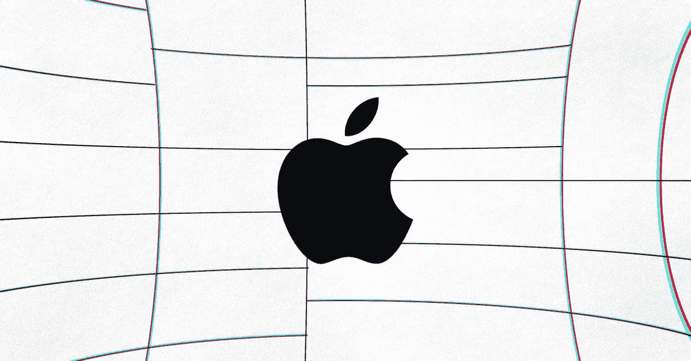
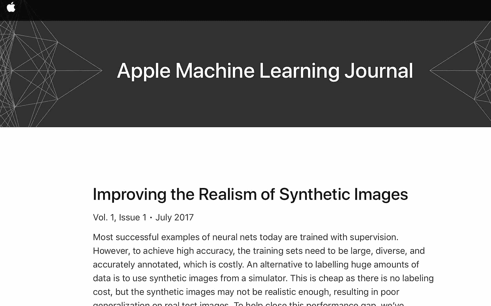
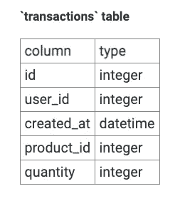

# 苹果数据科学家访谈

> 原文：<https://towardsdatascience.com/the-apple-data-scientist-interview-2db967cabbce?source=collection_archive---------3----------------------->

## 苹果数据科学面试问题

The Verge:苹果标志

苹果公司是世界上最大的科技公司之一，设计、开发和销售消费电子产品、计算机软件和在线服务。苹果一直需要有创造力、热情和敬业的数据科学家，他们可以加入任何数量的团队。从 Siri 基于研究的人工智能开发团队到 iCloud 基于云的架构开发团队，苹果一直在缓慢但稳步地建立数据科学团队，以处理每天积累的海量数据。

> 对特定技能面试指南感兴趣？查看我们对 [**SQL** ，](https://www.interviewquery.com/blog-sql-interview-questions/) [**机器学习**](https://www.interviewquery.com/blog-machine-learning-interview-questions/) **，**[**python**](https://www.interviewquery.com/blog-python-data-science-interview-questions/)**，** [**产品数据科学面试题**](https://www.interviewquery.com/blog-product-data-science-interview/) **的深度分析。**

# **苹果公司的数据科学职位是什么？**

与其他大型科技公司一样，苹果公司数据科学家的角色变化很大，取决于你被分配到的团队。苹果公司*数据科学家*的实际头衔是**最接近于*全栈数据科学家*** 。这意味着这项工作将需要从**分析到机器学习软件设计到简单工程**的一切。

鉴于苹果是一个庞大的多企业集团，使用的数据科学技能组合将因团队而异，因为有许多跨各个部门的分析团队，如营销、财务、销售等，以及更多基于机器学习和深度学习的产品和服务团队，如 Siri、云服务，甚至硬件。

## **所需技能**

在大多数情况下，苹果更喜欢雇佣至少有几年数据科学家经验的申请人。要求如下:

*   3 年以上将数据科学应用于实际业务问题的经验(高级职位 5 年以上)
*   对机器学习技术的实际理解，如回归、时间序列分析、聚类、决策树技术，以及分类算法的经验。
*   关系数据库的工作知识，包括 SQL，以及 Spark 和 Hadoop 等大型分布式框架。
*   精通数字和脚本编程语言，如 SQL、Python、Java、C++、PHP 或 Perl
*   出色的演示技巧，将复杂的分析和概念提炼为简明的业务要点

## **苹果公司的数据科学家有哪些类型？**

从技术上讲，苹果雇佣的数据科学家没有特定类型。苹果根据**不同团队的需求和所需技能**进行招聘。有数据科学家从事大量的分析工作，跨许多部门以及机器学习的重要角色。根据团队的不同，苹果公司数据科学家的职能可能包括:

*   与业务团队协作，发现见解和机会，理解需求，并将这些需求转化为技术解决方案。
*   与数据工程师和平台架构师合作，实施强大的生产实时和批量决策解决方案。
*   使用机器学习来自动化流程(如评分)。
*   使用机器学习、用户模式识别和数据建模领域的最新技术，设计、开发和管理大数据驱动的预测模型，以提高用户参与度。
*   处理大规模数据；使用 Sparks SQL 操作和提取数据。

# **苹果面试流程**

苹果公司的面试过程相当标准化。面试流程从人力资源部的初步电话筛选开始，然后是招聘经理面试，以评估进一步的兴趣和角色匹配，以及简短的技术电话筛选。最后，在现场面试之前，根据资历和职位类型，可能会有一个带回家的任务。

[苹果的机器学习期刊](https://machinelearning.apple.com/)

## **技术筛选和带回家挑战**

下一步是招聘经理的电话技术筛选，可能还有一个带回家的挑战。技术招聘经理屏幕是在共享编码环境中完成的。

技术屏中的题目分别是 [**通用 Python 习题**](https://www.interviewquery.com/blog-python-data-science-interview-questions/) **、SQL 题、**和**数据科学推理题**。重要的是，要在技术屏幕上讲述你的思维过程，并清楚地传达你的假设。这里测试你利用基本数据结构和算法概念的能力。这里需要的关键技能是能够提供全面的解决方案并快速分析解决方案的运行时复杂性。

苹果数据科学带回家挑战赛规定了三天的完成时间。通常，挑战将是建立模型并根据数据集进行预测的机器学习问题。

**苹果数据科学家技术筛选问题示例:**

*   *给定一个整数列表，找出数组左半部分之和等于右半部分的索引。*
*   *你如何从数以千计的产品中找到数以百万计的用户，每个人都有数百次交易，并把他们分成有意义的群体？*
*   给定一个字符串列表，用 Python 写一个函数，返回所有变位词的字符串。

## [试试苹果在采访查询上问的 SQL 问题](https://www.interviewquery.com/questions/upsell-transactions)

> 我们得到了一张产品采购表。表中的每一行代表一个用户购买的产品。
> 
> 编写一个查询来获取通过购买额外产品而追加销售的客户数量。
> 
> *请注意，如果客户在同一天购买了两件商品，这不算追加销售，因为它们是在相似的时间段内购买的。*

[尝试在我们的交互式 SQL 编辑器上解决这个问题](https://www.interviewquery.com/questions/upsell-transactions)

# **现场面试**

最后一步是现场面试。面试小组通常由 5 到 6 个面试者组成，他们都是被面试职位的团队成员。每次面试由一至两名面试官组成，并与招聘经理安排在苹果园区共进午餐。请注意，虽然午餐面试可能是非正式的，但它是面试中非常符合文化的一部分。

## **现场说明**

*   现场访谈在从一个访谈到另一个访谈的反馈中是分开的。如果你在一次面试中表现不好，反馈不会伴随你进入下一次面试。
*   请记住，苹果公司的数据科学家这个头衔跨越了与数据科学相关的许多团队。考虑到全栈数据科学职位的广泛要求，询问招聘人员现场面试的内容会很有帮助。如果数据科学职位更侧重于分析，将有助于**练习大量基于 SQL 和产品案例的问题**。如果该职位需要建模和机器学习，复习 [**机器学习系统设计和实现**的概念。](https://www.interviewquery.com/blog-machine-learning-interview-questions/)
*   一般来说，当面对白板编码面试时，苹果面试官似乎更喜欢关于**链表、数组/字符串和系统设计**的问题。
*   苹果公司的数据科学家可以获得很高的报酬，这取决于你的级别。第 4 级个人贡献者的示例工资可能是 15 万到 18 万美元的基本工资，外加 10%的奖金和四年内 20 万到 30 万美元的股票。股票的刷新者每年也可能非常高。

# **苹果数据科学面试问题**

*   *描述 L1 正则化和 L2 正则化之间的差异，特别是关于它们对模型训练过程的影响的差异。*
*   *ACF 和 PACF 的含义和计算方法是什么？*
*   *如果客户端必须每分钟发送位置数据，您会如何设计客户端-服务器模型？*
*   *写一个函数来检测一棵二叉树是否是左右子树的镜像。*
*   *假设您有一个过去五年按月分组的时间序列数据集。你如何发现这个月和前一个月之间的差异是否显著？*
*   *XGBoost 如何处理偏差-方差权衡？*
*   *假设您有 100，000 个文件分布在多台服务器上，您想处理所有这些文件？在 Hadoop 中你会怎么做呢？*

# 感谢阅读

*   想要更多带有苹果解决方案的面试问题吗？查找更多关于[**面试查询**](https://www.interviewquery.com/) **。**
*   查看 [**Youtube 频道**](https://www.youtube.com/channel/UCcQx1UnmorvmSEZef4X7-6g/) 获取数据科学[模拟面试](https://www.youtube.com/watch?v=e2LJ-6NagpE)、指南以及技巧和诀窍。