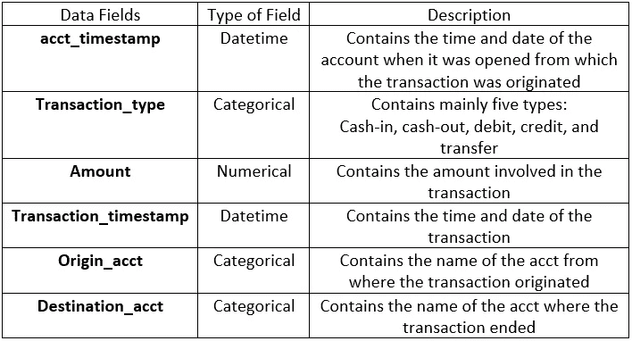
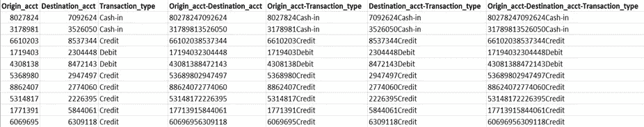
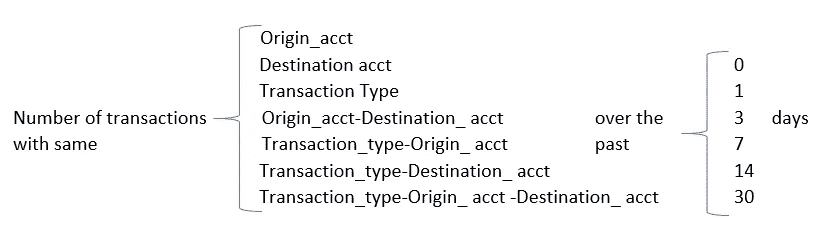
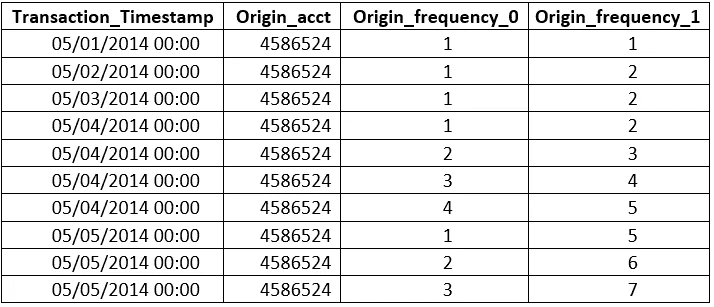
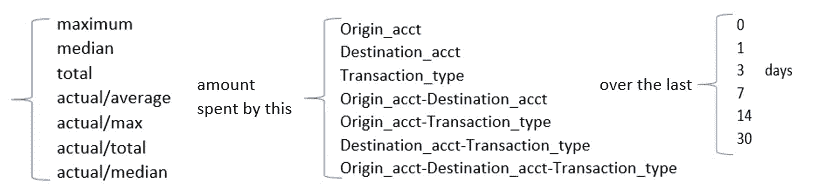
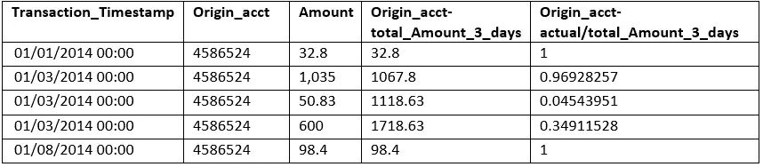
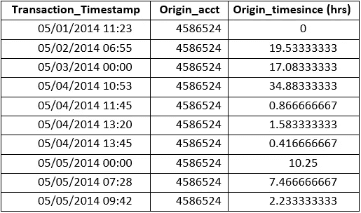
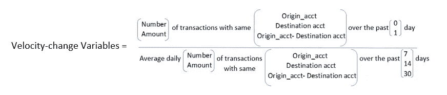
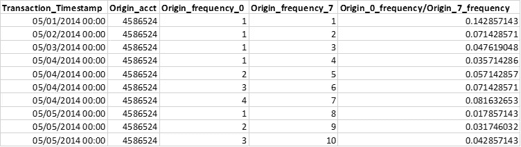

# 强机器学习模型的工程艺术特征

> 原文：<https://towardsdatascience.com/the-art-of-engineering-features-for-a-strong-machine-learning-model-a47a876e654c?source=collection_archive---------38----------------------->

## 对于任何数据科学问题，最关键的流程是你应该学习的。

在 [Unsplash](https://unsplash.com?utm_source=medium&utm_medium=referral) 上由 [Franck V.](https://unsplash.com/@franckinjapan?utm_source=medium&utm_medium=referral) 拍摄的照片

# **你会学到什么？**

*   发展特征工程所需的批判性思维技能
*   反洗钱算法的特征工程

# 介绍

## **特色工程？[1]**

要素是原始数据的数字表示。在结构化数据中，它们是其中一个变量所依赖的独立变量。数据集中已经存在的要素通常称为数据字段，通过领域知识创建的要素称为候选变量或专家变量。将信息编码成新变量形式的过程称为特征工程。

## **为什么我们需要更多功能？**

机器学习模型的性能与独立特征捕捉关于手头问题的正确信息的准确程度直接相关。因此，为了处理任何问题，我们应该创建尽可能多的变量，以便以后我们可以为我们的模型选择最重要的特征，从而提高模型的性能。然而，这个创建新特征的过程是一项单调乏味的工作，并且需要用一些领域知识很好地理解这个问题。在本文中，我将描述一个示例来演示如何为一个**反洗钱机器学习模型**创建各种候选变量。

我们将首先从理解问题开始，然后应用这些知识来执行特征工程。以下是下文描述的一系列步骤。

# **第一步**

## **理解问题**

亚历山大·席默克在 [Unsplash](https://unsplash.com?utm_source=medium&utm_medium=referral) 上拍摄的照片

洗钱是一种非法过程，通过一系列模糊的银行转账或商业交易，将“脏”钱(从贩毒等非法交易中获得的钱)转变为“干净”钱(合法钱)。

洗钱的三个主要阶段是:

**放置—** 这是将“脏”钱放入合法金融系统的阶段。最常见的实现方式是通过 smurfing，即向低于反洗钱报告阈值的银行账户发送小额资金，然后存入同一个发送方。

**分层**——这是第二个阶段，也是最复杂的阶段之一，它涉及到让资金尽可能难以被发现，并进一步将其转移到远离源头的地方。这笔钱被故意转移得如此之快，以至于银行无法察觉。

**整合**——最后一个阶段是将“干净”的钱重新投入经济。最常见的方式之一是以一家空壳公司的名义购买房产，这表明交易是合法的。

由于篇幅的限制，我只提到了这个问题的更广泛的定义，只是为了演示。然而，一个人应该通过阅读各种研究论文、专利等等来对这个问题进行适当的研究。

# **第二步**

## **将问题分解成更小的片段，以便有效地创建变量【2】**

在研究完问题后，你应该突出你所有的见解。例如，我在下面写了一些，你可以很容易地从第一步中得到:

*   任何个人或企业的现金存款无明显原因地大幅增加
*   存款随后在短时间内从账户转移到通常与客户无关的目的地
*   以现金交易为主而不是使用支票或信用证的账户
*   A 大量个人向同一个账户付款，且无充分解释
*   从一个全新的账户中提取大量现金，或者从一个刚从国外收到意外大额贷款的账户中提取大量现金

类似地，你对问题的理解越多，你将获得越多的洞察力，因此，更好的特性将会增强你的模型的性能。因此，在创建候选变量以向模型中注入更多信息时，应该考虑来自问题的所有上述见解。

# **第三步**

## **了解数据集**

为了更进一步，我们假设我们有一个假设的数据集，其中包含以下数据字段及其描述，用于开发反洗钱模型。在真实场景中，为银行工作的数据科学家可以通过以下数据字段轻松获得此类数据。你也可以看看[可用的公共数据集](https://www.kaggle.com/x09072993/aml-detection)。

作者图片

# **第四步**

## **构建候选变量**

这是任何数据科学问题(也称为特征工程)中最有趣、最关键和最困难的部分:

**4.1。连接两个或多个不同的数据字段，形成一个新的分类变量**

对于我们的第一组变量，您可以考虑将两个或多个数据字段连接在一起，形成一个新变量。为了理解这一点，让我们将“来源账户”、“目的账户”和“交易类型”配对，如下表所示:

作者图片

在上表中，您可以看到一个名为“Origin_acct-Destination_acct”的新列，其中包含各自数据字段的串联值。同样，其他列也可以用同样的方法看到。

## 为什么？

“Origin_acct”与“Destination_acct”的串联将有助于监管“Smurfing”过程，在“smurf ing”过程中，多个中间账户多次向单个发送者转移小额资金。此外，在前面讨论的一个问题中，观察到这些罪犯更喜欢现金交易，而不是支票、汇票等借贷形式。因此，与“Transaction_type”连接也将有助于为我们的算法提供另一个学习维度，以更多地了解交易的性质，并跟踪该特定账户的现金交易数量是否增加(在 4.2 中讨论)。这样的活动严格来说是不正常的，你会看到与这些连接字段相关联的其他数字候选变量(稍后讨论)将如何帮助我们朝着正确的方向前进。

**4.2。频率候选变量[1]**

频率变量将对每个特征(如图所示)完成的交易数量进行编码，这将有助于捕捉信息，例如特定账户对的交易数量增加，这可能是可疑活动的信号。下图显示了频率变量的不同组合。例如，您可以计算在同一天(0)、最近 1 天、最近 3 天等等使用 origin_acct 的次数。

作者图片

在一段时间内计算出的较高值意味着该帐户的行为有异常。在下表中，您可以看到其中一个原始帐户的频率变量是怎样的:

作者图片

列 Origin_frequency_0 从 1 开始(假设它是第一次用于交易),第二天的数字保持为 1，因为它是在 2014 年 5 月 2 日第一次出现。同样，你可以推断出其他数字是如何计算出来的。

**4.3。数量变量**

金额变量将有助于计算每个账户在过去 0、1、3、7、14 和 30 天(0 表示同一天)的交易的平均值、最大值、中值和总金额，这将有助于跟踪第三阶段，即在没有任何充分理由可能购买资产的情况下从银行账户提取大笔资金的整合。因此，将有助于模型识别交易量中的任何异常。例如，将有一列包含目的地帐户在过去 3 天的交易总额。类似地，可以形成如下所示的其他组合:

作者图片

下表显示了一对金额变量:

作者图片

在上表中,“Origin _ acct-total _ Amount _ 3 _ days”列包含过去 3 天内#4586524 原始账户的交易总额。这就是为什么最后一行中的总数仍然是 98.4，因为该帐户在过去 3 天中没有被使用。另一列计算当天的实际交易额除以过去 3 天的总额。

4.4。时间-自变量[1]

要封装帐户交易速度的信息，这些变量非常方便。它计算帐户最后一次用于交易和当前交易之间的时间。单个实体的后续交易越快，欺诈的可能性就越大。因此，这将有助于跟踪第二阶段，即分层。下表显示了时间变量的一个示例:

作者图片

**4.5。速度变化候选变量[1]**

最后一组变量可以通过计算过去一天(0 & 1 天)的交易数量或转账金额在另一组期间(7、14 和 30 天)的变化来跟踪账户正常行为的突然变化。相同的公式如下:

作者图片

因此，如果该帐户的交易数量或平均金额发生意外变化，我们的模型将能够了解这种变化。下表显示了速度变化变量的示例:

作者图片

# 摘要

您看到了我们如何能够通过许多候选变量，仅使用给定的数据字段，在没有任何外部数据的情况下，对关于给定问题的越来越多的信息进行编码。总而言之，您学习了以下变量及其编码信息:

**连接变量-** 有助于将原始账户、目的账户和交易类型相互联系起来，这有助于跟踪 smurfing 和较高现金提取的问题

**频率变量-** 有助于了解账户的使用频率

**金额变量-** 有助于了解交易金额的大小。

**时间-自变量-** 帮助学习交易的速度

**速度变化变量-** 帮助识别账户行为的突然变化

我知道上面讨论的问题似乎只针对欺诈检测模型，但相信我，它肯定会帮助您发展为任何数据科学问题创建专家变量所需的批判性思维技能。希望你觉得有帮助，值得一读。干杯！

# **参考文献**

[1] Gao，J.X .，Zhou，Z.R .，Ai，J.S .，Xia，B.X .和 Coggeshall，S. (2019)使用机器学习算法预测信用卡交易欺诈。智能学习系统与应用杂志，11，33–63。[https://doi.org/10.4236/jilsa.2019.113003](https://doi.org/10.4236/jilsa.2019.113003)

[2]《打击洗钱和资助恐怖主义行为准则》。[https://www.imolin.org/doc/amlid/Trinidad&多巴哥 _ Guidlines %20on %打击% 20 金钱% 20 发动% 20&% 20 恐怖分子%20Financing.pdf](https://www.imolin.org/doc/amlid/Trinidad&Tobago_Guidlines%20on%20Combatting%20Money%20Laundering%20&%20Terrorist%20Financing.pdf)