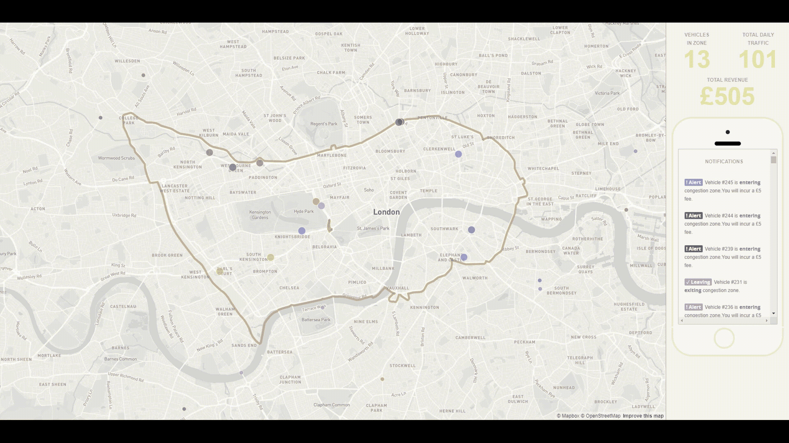
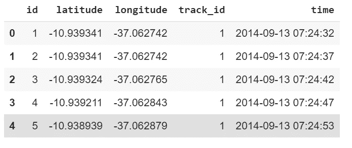
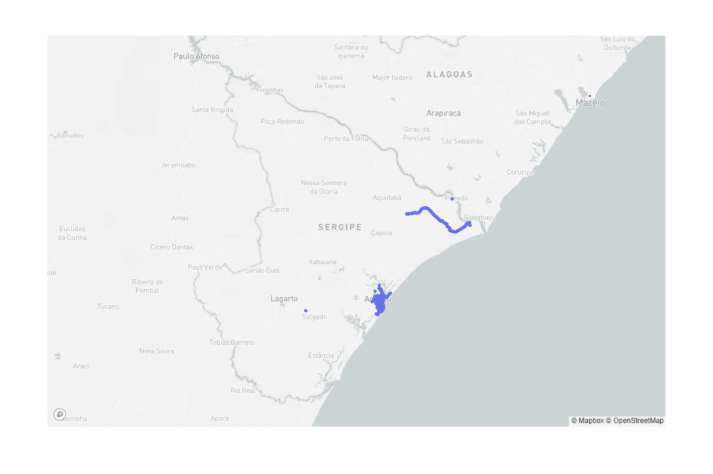
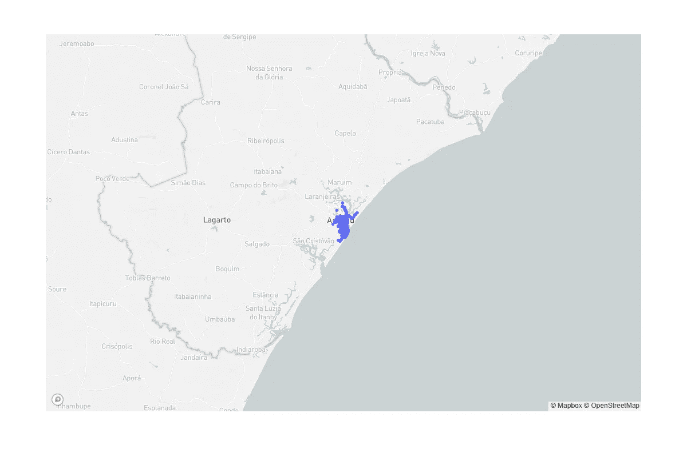
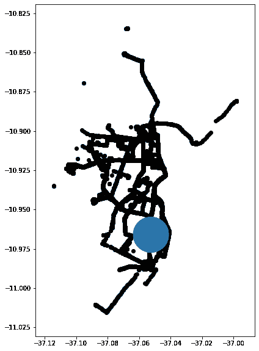
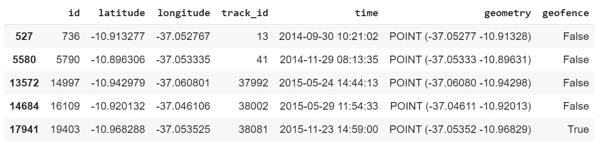
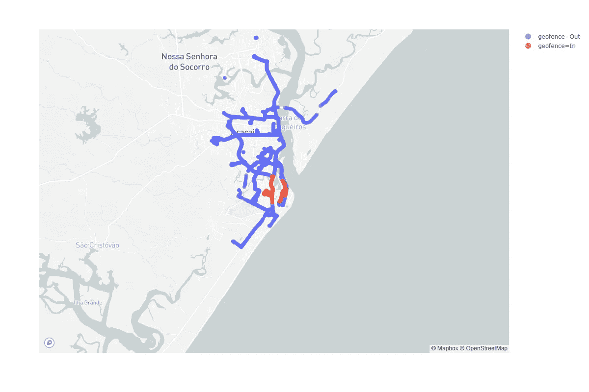
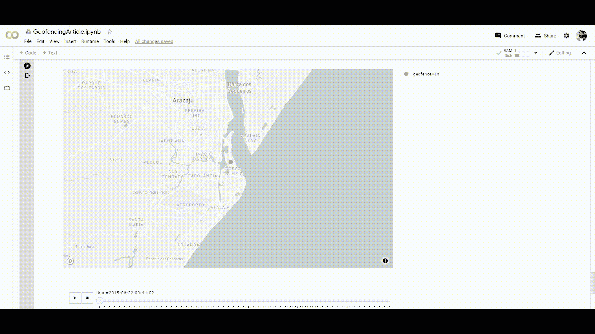

# Python 中的地理围栏艺术

> 原文：<https://towardsdatascience.com/the-art-of-geofencing-in-python-e6cc237e172d?source=collection_archive---------17----------------------->

## 教程-触发通知并向用户推送 GPS 位置。



地图框中的地理围栏示例:伦敦拥堵— [来源](https://labs.mapbox.com/bites/00223/)

地理围栏是地理数据科学中常用的工具，尤其是在营销、安全和分区应用中。上面 GIF 中的例子显示了一个应用程序，它根据车辆的位置和伦敦的拥堵费区(CCZ)向车辆发出警报。该应用程序计算拥堵费，并跟踪给定时间拥堵区域内的车辆数量。

地理围栏的概念很简单，但它是一种增强定位应用的强大技术。简单地说，**地理围栏是地理对象或区域周围的定义虚拟边界，以便用户每次进入或离开边界周界时，都可以触发操作或通知。**随着智能手机、GPS 和定位服务使用的增加，地理围栏成为位置数据分析和情报中不可或缺的工具。

在本教程中，我们使用 GPS 轨迹数据集。它包含带有时间戳的 GPS
点(纬度和经度)。它还为每个轨迹提供唯一的 track_id。让我们用熊猫图书馆读数据。

```
import pandas as pd
import geopandas as gpd
import plotly_express as px
import matplotlib.pyplot as plt!wget [https://www.dropbox.com/s/ejev7z29lzirbo5/GPSTrajectory.zip](https://www.dropbox.com/s/ejev7z29lzirbo5/GPSTrajectory.zip)
!unzip GPSTrajectory.zipdf = pd.read_csv(‘GPSTrajectory/go_track_trackspoints.csv’)
df.head()
```

数据集的前五行如下所示。我们有纬度和经度以及 track_id 和时间。



轨迹数据帧

我们将数据框架转换为地理数据框架，从而可以执行地理围栏。使用 Geopandas 将数据框转换为地理数据框非常简单。

```
gdf = gpd.GeoDataFrame( df, geometry=gpd.points_from_xy(df.longitude, df.latitude))gdf.head()
```

让我们绘制数据集的地图。我们在这里使用 Plotly Express，因为它为 Plotly 绘图提供了一个简单的接口和高级 API。我们需要在这里设置 Mapbox 标记。

```
px.set_mapbox_access_token(“pk.eyJ1Ijoic2hha2Fzb20iLCJhIjoiY2plMWg1NGFpMXZ5NjJxbjhlM2ttN3AwbiJ9.RtGYHmreKiyBfHuElgYq_w”)px.scatter_mapbox(gdf, lat=”latitude”, lon=”longitude” ,size_max=6, zoom=8, width=1200, height=800)
```

下图显示了数据集中的所有点。如你所见，这些轨迹落在三个不同的城市。



Plotly Express 轨迹图

让我们过滤掉其他城市，把注意力集中在中心城市(Aracuja ),因为大部分数据都在这里。

```
gdf = df[(gdf[‘latitude’]<-10.80) & (gdf[‘longitude’]>-37.5)]px.scatter_mapbox(gdf, lat=”latitude”, lon=”longitude” ,size_max=6, zoom=8, width=1200, height=800)
```

现在我们只对巴西的 Aracuja 市感兴趣。



干净的轨迹图

现在我们已经清理了数据，让我们做地理围栏。

## 地理围栏

首先，我们需要一个标记地理围栏的区域。让我们下载一个我在市中心创建的区域。

```
# Get the data
!wget [https://www.dropbox.com/s/e9g5n7e7iwnue4x/CENTERAREA.zip](https://www.dropbox.com/s/e9g5n7e7iwnue4x/CENTERAREA.zip)
!unzip CENTERAREA.zippolygon = gpd.read_file(“CENTERAREA.geojson”)
```

让我们用 Geopandas 绘制多边形，并叠加这些点以查看两个数据。

```
# Plot track_id 1 points over the Buffer Polygonfig, ax = plt.subplots(figsize=(10,10))gdf.plot(ax=ax, color=’black’)polygon.plot(ax=ax)#plt.tight_layout()#plt.axis(‘off’)plt.show()
```

这是覆盖面和点数据的地图，如下所示。



Geopandas 图-带多边形的点

现在，让我们执行我们所谓的多边形中的点(PIP)。我们可以在 Geopandas 中使用“within”操作来检查点是否在多边形内。

```
mask = (polygon.loc[0, ‘geometry’])pip_mask_geofence = gdf.within(mask)
```

上面的代码将根据点是否在多边形内返回一系列的假值和真值。让我们在数据中添加一列来标记假值和真值。我们称之为“地理围栏”。

```
#Create PIP maskgdf.loc[:,’geofence’] = pip_mask_geofencegdf.sample(5)
```

现在，我们的数据有一个“地理围栏”栏。让我们来看一个数据样本。



具有地理围栏列的轨迹地理数据框架

如您所见，数据中有一个附加列:geofence。前四行表示它们不在 geofence 内，而最后一行表示它们在 geofence 内。让我们分别用输入和输出值来代替假值和真值。

```
# Replace True with In and False with Outgdf[‘geofence’] = gdf[‘geofence’].replace({True: ‘In’, False: ‘Out’})
```

我们现在可以看到，如果我们用 Plotly Express 绘制地图，并使用 geofence 作为颜色，哪些点在 geofencing 区域内部或外部。

```
px.scatter_mapbox(gdf, lat=”latitude”, lon=”longitude”, color=”geofence”, size=’track_id’ ,size_max=6, zoom=12, width=1200, height=800)
```



用地理围栏着色的地图

最后，我们可以用轨迹运动动画化这些点。用 Plotly Express 可以很容易地完成这种概括。然而，由于某些限制，它不能一次可视化我们所有的点。现在让我们设想一个轨道 ID。

```
px.scatter_mapbox(gdf[gdf[“track_id”]== 23], lat=”latitude”, lon=”longitude”, color=”geofence”, size=’track_id’, animation_frame=’time’, size_max=10, zoom=12, width=1200, height=800)
```

这是我们简单地理围栏例子的 GIF 动画。一旦轨迹进入地理围栏区域，这些点将变为红色，而在标记区域之外则为蓝色。



地理围栏动画

## 结论

在本教程中，我们看到了如何使用 Pandas、Geopandas 和 Plotly Express 用 Python 做一个简单的地理围栏示例。如果你想试验代码，这里有 Google Colab 笔记本的链接。

[](https://colab.research.google.com/drive/18HvxO82GGDQc3wXHrGkIygdJYFE0y-Fg) [## 谷歌联合实验室

### 编辑描述

colab.research.google.com](https://colab.research.google.com/drive/18HvxO82GGDQc3wXHrGkIygdJYFE0y-Fg)